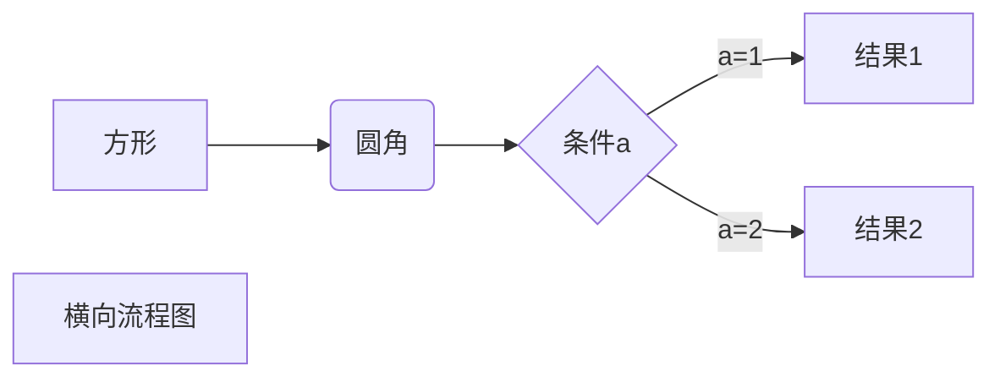
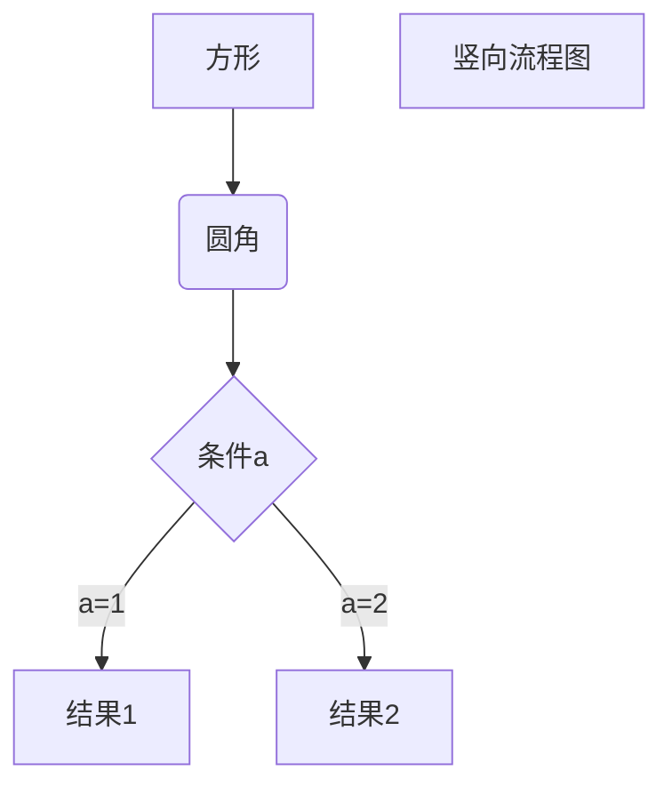
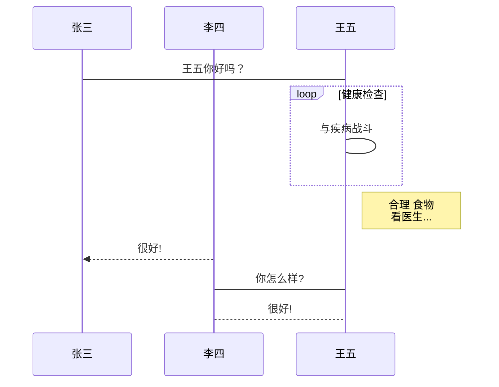
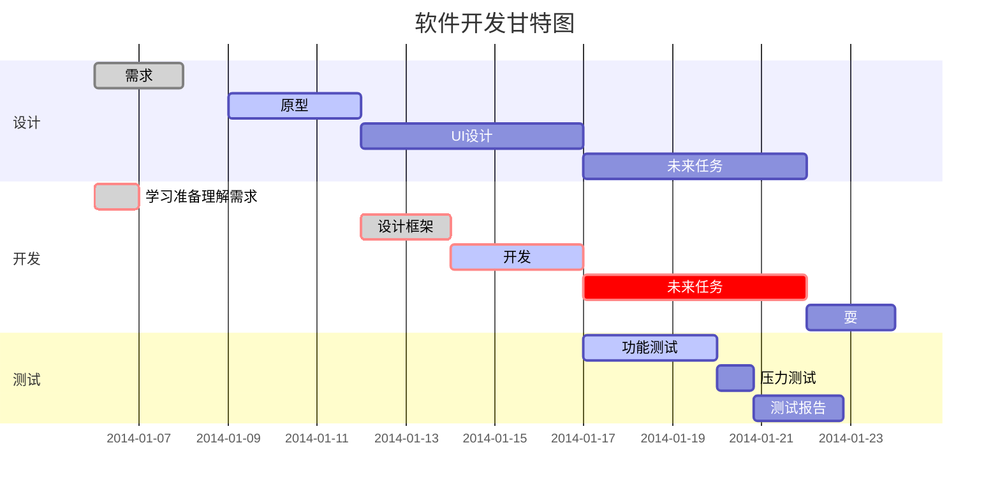

本文档由 [Bilibili@二一的笔记](https://space.bilibili.com/319417) 撰写，欢迎关注我的频道。你也可以观看 [这期视频](https://www.bilibili.com/video/BV1Ve4y1s7Qs)，有关于 Markdown 的更详细介绍。

如果我的内容能够帮到你，欢迎向更多人推荐我的频道，我想让我的内容被更多的人看到，**这将是激励我保持深度创作的最大动力**。

谢谢！

---


# 一级标题

## 二级标题

### 三级标题

#### 四级标题

##### 五级标题

###### 六级标题

```
井号加空格，可以生成标题格式；几个井号就是几级标题

# 一级标题
## 二级标题
### 三级标题
```

### 常见问题

如果你发现你的 Markdown 无法正常使用，有可能是因为以下几个原因

1. 没有在英文输入法下使用符号
2. 尝试按一下空格键，再输入 Markdown 语法
3. 部分笔记软件并不支持所有的 Markdown 语法
4. 部分编辑器需要进入`设置` 中开启特定的 Markdown 语法


### 列表

#### 有序列表

```
英文输入法下，数字后面加一点，然后空格
```
1. AAA  `1. AAA`
2. BBB  `2. BBB`
3. CCC  `3. CCC`

#### 无序列表

```
1. 有三种语法符号，三种都可以
2. 但更推荐使用短横杠，因为不需要使用组合键
```

- AAA `- AAA`

+ BBB `+ BBB`

* CCC `* CCC`

#### 列表的互相嵌套

**基础语法：**

1. 一个回车可以使列表递进，两个回车可以取消自动列表
2. 使用 <kbd>tab</kbd> 可以使列表缩进，使用 <kbd>shift</kbd> +<kbd>tab</kbd> 可以取消列表缩进

**有序和无序列表的互相嵌套：**

1. 按 <kbd>回车</kbd> 生成列表第二项
2. 按 <kbd>tab</kbd> 缩进列表
3. 再按 <kbd>回车</kbd> 取消列表第二项
4. 然后使用有序或者无序列表的基础语法即可

---


### 字体标记

```
所有符号都需要在英文输入法下
```

1. **加粗**  `**加粗**`
2. ~~删除~~  `~~删除~~`
3. *斜体*  `*斜体*`
4. ==高亮== 

**注**：部分笔记软件对 Markdown 的支持不够完全，可能只支持 `加粗`

---


### 段落相关

1. 引用语法

```
> 这是一段引用
```

> 这是一段引用

2. 分割线

```
--- ; 三个或以上的短横杠，然后回车
```

---


### 代码

#### 行内代码

```
`行内代码`  ；这个符号的位置在数字键 1 左边的那个小点上，注意需要在英文输入法下使用
```

可以在一句话中的任意位置使用 `行内代码` 语法

#### 代码块

**基础语法：**

````python
```
1. 在英文输入法下，输入三个小点 `
2. 部分笔记软件可以直接回车
3. 其他笔记软件则需要手动在末尾补上三个小点
```
````

```javascript
$(document).ready(function () {
    alert('eryi');
});
```

```python
from settings import world
if world == 'mine':
   kept =  keep(world)
```

```swift
let myWorld = "Hello World"
print(myWorld)
```


### 超链接

#### 基础链接用法

```
[百度](www.baidu.com)
```

​	**示例：**[百度](www.baidu.com)

#### 高级链接用法

**两种使用场景：**

- ① 在文稿起草阶段，还没确定具体网址，但可以先给出网址标题
- ② 同一篇文章需要重复出现同一个网址时

**使用方法：**

```
1. 格式 ：[网址标题][变量01]
2. 在文档最后解释变量

[变量01]:www.baidu.com
```

**示例：**

- [我的博客][site]

- [site]:http://eryinote.com

---


### 脚注

**语法：**

```
这是一句需要添加脚注的话[^01]

[^01]:这是放在文档最底下，用来解释脚注的内容
```

**示例：**

1. 这是一句需要添加脚注的话[^01]
2. 这是另一句话[^02]

[^01]:这是解释脚注 01的内容
[^02]: 测试

---


### 图片

#### 基础语法

```
1. 基本格式：
2. 示例：
3. 图片链接可以是本地链接，也可以是在线链接
```

#### 图床

##### 什么是图床

所谓的图床就是用来**在线存放图片的地方**，可以理解为专门用来存放图片的网盘。图床上的每一张图片都能够生成一个唯一的访问链接，使用这个链接，任何人都能够在线读取你的图片。

##### 为什么你可能会需要图床

- 因为 Markdown 编辑器的文档无法内嵌图片，所有图片都以 ``的形式写在 Markdown 文档内，如果这里的「图片链接」使用的是本地图片的链接，那么当你分享这一个 Markdown 文档、或者你自己在别的地方打开这个 Markdown 文档时，文档里的图片就无法正常显示了。
- 所以需要将图片上传到图床，生成一个可以在线访问的图片链接后，在任意地方分享、打开这个 Markdown 文件，所有的图片就都能正常显示

##### 如何搭建图床

由于本文的主旨仍是 Markdown 的语法教学，所以就不在此处介绍过多的图床搭建教程，但你可以在我的 [个人博客](https://eryinote.com) 阅读这篇 [图床搭建教程](https://eryinote.com/post/105) ，整个过程非常简单，无需任何代码基础，只是需要一点点小小的耐心。

---


### 表格

**基础语法：**

```
|  表头   | 表头  |
|  ----  | ----  |
| 单元格  | 单元格 |
| 单元格  | 单元格 |
```

**表格对齐：**

1. 左对齐：`:----`
2. 居中对齐： `:----:`
3. 右对齐：`----:`

```
| 左对齐 | 居中对齐 | 右对齐 |
| :----|:----:|----:|
| AAA | BBB | CCC |
```

| 左对齐 | 居中对齐 | 右对齐 |
| :----- | :------: | -----: |
| AAA    |   BBB    |    CCC |

---

|      |      |      |
| ---- | ---- | ---- |
|      |      |      |
|      |      |      |
|      |      |      |


### 图表

**注意：** 

1. **不是所有的 Markdown 编辑器都支持图表语法**
2. 由于要完全学会这些语法，起码要厚厚一本书的教程长度，所以本文仅做展示
3. 并且其实我并不推荐用 Markdown 语法去画图表，你有更好的工具去实现这类需求，没必要舍近求远
4. 如果你实在感兴趣的话，可以访问学习 Github 的这个开源项目 →  [Mermaid 语法](https://github.com/mermaid-js/mermaid)

####  ①

````

````


#### ②

````

````


#### ③

````
```sequence
对象A->对象B: 对象B你好吗?（请求）
Note right of 对象B: 对象B的描述
Note left of 对象A: 对象A的描述(提示)
对象B-->对象A: 我很好(响应)
对象A->对象B: 你真的好吗？
```
````

```sequence
对象A->对象B: 对象B你好吗?（请求）
Note right of 对象B: 对象B的描述
Note left of 对象A: 对象A的描述(提示)
对象B-->对象A: 我很好(响应)
对象A->对象B: 你真的好吗？
```

#### ④

````

````


#### ⑤

````

````


