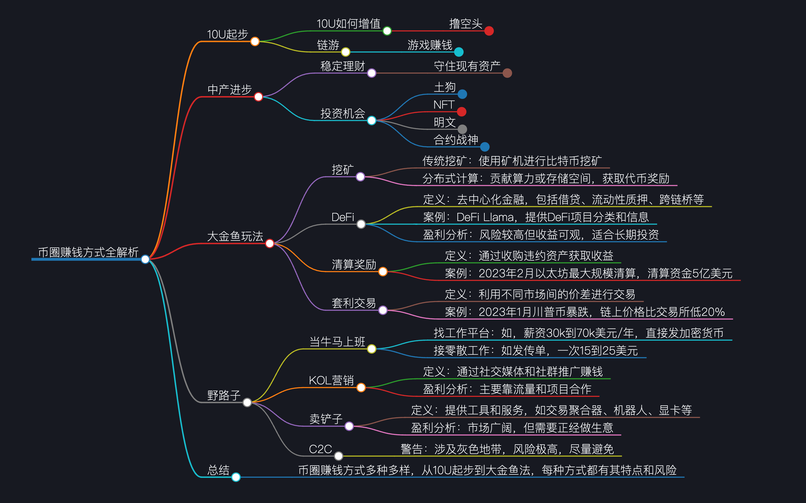

# 币圈赚钱大全：从“10U”到“金鱼”及“野路子”

**核心理念：**
*   **"如果你不知道你的利润来自于哪里，那么你都是利润的来源。"** —— 在币圈，深刻理解利润来源至关重要，否则你很可能成为别人的利润。

---

### **一、 “10U”怎么起步？ (低本金启动：目标 2,000-5,000 U)**

1.  **撸空投 (Airdrops)**
    *   **概念：** 免费参与新项目早期测试、交互，以获取项目方未来发放的代币奖励。类似于商家的“免费试吃”或“推广福利”。
    *   **收益潜力：**
        *   **随便玩玩：** 一顿猪脚饭 (每日小额收入)
        *   **认真做项目：** 几百到几千 U / 项目
        *   **做到极致 (多地址操作)：**
            *   Jupiter空投 (去年1月，2.76万个地址获得550万代币，价值360万美元)
            *   Stark空投 (去年2月，1361个钱包获得143万代币，价值300万美元)
    *   **作用：** 对很多人来说是家庭收入来源，甚至优于送外卖。
    *   **项目方动机：** 通过空投获取流量、实现初步推广。
    *   **总结：**
        *   **赚取方式：** 辛苦钱 (打工)
        *   **盈利难度：** 相对较低 (空投概率99%)
        *   **上手难度：** 中低 (多数交互需英文，可使用翻译软件)
        *   **盈利能力：** 因人而异 (从猪脚饭到第一桶金)
    *   **提高收益需具备：**
        *   **资本：** 部分项目需投入一定本金防“白嫖”。
        *   **技术：** 多地址管理、自动化工具等。
        *   **投研：** 识别有潜力的项目，避免投入时间精力却回报甚微。

2.  **炼油 (GameFi / 玩赚游戏)**
    *   **概念：** 玩区块链游戏，通过游戏内的活动赚取加密货币或NFT。
    *   **例子：**
        *   Maple (冒险岛，与动漫IP联名，发行NFT)
        *   CS类射击游戏
    *   **赚钱方式：**
        *   获取游戏内装备、武器、怪物等NFT，进行买卖交易。
        *   投入游戏时间，获得项目方空投的代币奖励。
    *   **特性：** 适合新手，边玩边学，有意思。
    *   **当前状况：** GameFi板块目前有点“凉凉”，缺乏特别出圈的游戏。传统游戏公司 (如育碧) 正在进入区块链游戏领域。
    *   **潜在机会：** 早期元宇宙游戏如Sandbox的代币SAND，虚拟土地等资产。

---

### **二、 如何“暴富”？ (高风险、高收益)**

1.  **炒土狗 (Memecoin Trading)**
    *   **概念：** 交易高度投机的“空气币”，其价格主要由市场情绪和热点驱动。
    *   **存续性：** 只要“人类永远八卦”，土狗就永远有生存空间 (跟随热点)。
    *   **挑战：** 高度考验“认知”，需判断代币投资价值和识别庄家行为。
    *   **市场影响：** 从去年开始，土狗吸引了大量山寨币领域的资金，导致山寨币牛市迟迟未到。
    *   **总结：**
        *   **盈利难度：** 中高 (考验综合素质)
        *   **盈利能力：** 拉满 (极高)
        *   **风险：** 极高

2.  **NFT (非同质化代币)**
    *   **概念：** 区块链上的数字资产所有权凭证，可证明某个数字资产 (图片、艺术品、社群门票等) 属于你。
    *   **早期应用：** 艺术家用来管理数字作品版权。
    *   **著名案例：** Beeple的“Everydays: The First 5000 Days”在2021年拍卖价达6900多万美元。
    *   **其他应用：** 身份标记、社群门票 (如马云左膀右臂“钱多多”发行的“桃花源”NFT)。
    *   **当前状况：** 市场热度被土狗抢走，不像当年火爆。
    *   **总结：**
        *   **盈利能力：** 比较客观
        *   **难度：** 中高 (市场受艺术审美、趋势影响，难以预测)

3.  **明文 (Inscriptions)**
    *   **概念：** 给加密货币“盖章”，在比特币等加密货币上附加图片、文本等信息，使其具有唯一性，类似于纸币的编码或纪念币。
    *   **当前状况：** 基本上已“凉凉”，新手可暂时忽略，除非出现新热点。
    *   **升级版：符文 (Runes)：** 改进后的明文协议，旨在解决明文铸造过程中产生的“废料”导致比特币链上拥堵问题，提高效率。
    *   **共同点：** 明文、符文、NFT、土狗都赚取“认知的钱”。

4.  **合约交易 (Futures / Perpetual Contract Trading)**
    *   **概念：** 利用杠杆进行加密货币的期货或永续合约交易，以小博大。
    *   **核心：** 赚取“认知的钱”，需了解K线、技术指标、入场/出场时机、盈亏比等。
    *   **总结：**
        *   **盈利能力：** 5颗星 (极高)
        *   **风险：** 极高
    *   **争议：** 很多人建议币圈新手不要碰合约。
    *   **观点：** 赌狗在哪里都是赌，问题不在合约本身，而在交易者的心态。

---

### **三、 “稳住”求增长 (中等本金，稳定理财)**

1.  **囤币 (HODL)**
    *   **概念：** 长期持有加密货币，等待牛市来临。

2.  **量化交易 (Quantitative Trading)**
    *   **概念：** 利用交易机器人和算法自动执行交易策略。
    *   **优势：**
        *   **高便利性：** 交易所 (如币安、Bybit) 提供基础量化交易机器人 (合约网格、资金费率套利、合约信号交易等)。
        *   **适应市场：** 币圈70%时间处于横盘震荡，非常适合网格交易套利。
        *   **低操心：** 机器人24小时自动赚钱，无需人工盯盘。
    *   **总结：** 可获得稳定且可观的增值。

3.  **打新理财 (New Project Launchpad / Staking Programs)**
    *   **概念：** 参与交易所推出的新币认购、质押挖矿等活动。
    *   **本质：** 交易所为拉新促活而发放的福利。
    *   **特点：** 收益通常不大，但相对稳定且保本。资金量大可观。长期操作收益高于传统银行存款。

4.  **DePIN (Decentralized Physical Infrastructure Networks / 去中心化物理基础设施网络)**
    *   **概念：** 贡献个人闲置的物理资源 (如电脑算力、存储空间、手机流量) 给去中心化网络，获取代币奖励。
    *   **例子：**
        *   **贡献GPU：** 用于渲染或AI算力，获得代币奖励 (如淘了子网)。
        *   **贡献内存卡：** 作为云端存储，获得代币奖励。
        *   **贡献手机流量：** 提供去中心化WiFi (如马斯克的星链接入)。
    *   **本质：** 一种新型“挖矿”，收益可观。
    *   **适合人群：** 技术宅、程序员。

5.  **DeFi (Decentralized Finance / 去中心化金融)**
    *   **概念：** 基于区块链的金融协议和应用，旨在革新传统金融服务。
    *   **探索工具：** DeFi Llama (网站，可查看所有DeFi玩法类别)。
    *   **玩法多样：** 借贷、流动性质押、跨链桥、DEX (去中心化交易所)、再质押等。
    *   **简化参与：** Yield Aggregator (收益聚合器)，类似AI私募基金，自动组合和管理资金，投向最优化DeFi项目。
    *   **市场前景：** 2024年DeFi有望迎来大发展 (政策放开、稳定币与RWA融入，传统资金入场)。
    *   **风险提示：** **风险非常大！** 需高度关注链上私钥安全、签名安全、项目本身安全性 (如Bybit被盗事件)。
    *   **总结：**
        *   **盈利能力：** 可观
        *   **操心程度：** 不怎么用上心 (通过聚合器)
        *   **风险：** 极高 (智能合约、私钥安全等)

---

### **四、 “大金鱼”的玩法 (高资本、高信息差)**

1.  **挖矿 (Traditional Mining)**
    *   **概念：** 传统意义上的用专业矿机 (ASIC) 挖矿，获取比特币等加密货币。
    *   **演变：** 从早期家用电脑可挖，发展到如今需要大规模专业化矿场，矿企甚至上市。

2.  **高级DeFi玩法**
    *   **流动性挖矿 (Liquidity Mining)：** 同时质押两种代币 (如土狗代币+USDT) 到流动性池，赚取交易手续费和项目代币。
        *   **风险：** 无常损失 (若其中一种代币价格暴跌，最终手上会剩下较多贬值代币)。需筛选优质池子。
    *   **再质押：** 将流动性挖矿获得的质押凭证再次质押到其他项目，赚取更多项目代币。
    *   **清算奖励：** 在去中心化借贷平台，当借款人的抵押品价值低于清算线时，可低价收购其抵押品。
        *   **例子：** 2024年2月以太坊市场最大规模清算事件 (5亿U)。
        *   **本质：** 类似“放贷”，在对方违约时低价获取优质资产。

3.  **传统金融玩法 (在加密市场)**
    *   **期权期货套利 (Options/Futures Arbitrage)**
    *   **跨市场套利 (Arbitrage / 搬砖)：** 利用不同交易所或链上链下之间的价差进行买卖获利。
        *   **例子：** 今年1月SO暴跌时，链上SO价格比交易所便宜20%。
        *   **核心：** 抓住信息差和快速执行能力。市场容量有限，信息通常不对称。
    *   **资金费率套利 (Funding Rate Arbitrage)：** 利用永续合约资金费率的正负差异，在现货和合约市场进行套利。许多大型加密基金采用此策略，例如ENA。
    *   **总结：** 鲸鱼赚取的是**资源** (资本) 和 **认知与信息差** 的钱。

---

### **五、 “野路子”求生 (非传统路径)**

1.  **当牛马上班 (cryptojobslist)**
    *   **概念：** 在区块链或加密货币领域寻找工作。
    *   **平台：** 寻找区块链工作平台。
    *   **薪资：** 较高 (如30k-70k美元/年)，通常直接以加密货币支付。
    *   **零散工作：** 接一些简单的零碎任务 (如发传单)，收入可观 (如15-25美元/单)。
https://cryptojobslist.com/

2.  **KOL (Key Opinion Leader) 做营销**
    *   **概念：** 成为加密货币领域的意见领袖，通过影响力赚取收益。
    *   **赚钱方式：** 社群费、推广费、项目合作费等。
    *   **本质：** 赚取流量的钱。

3.  **卖铲子 (Selling Shovels)**
    *   **概念：** 不直接参与加密货币的投机或挖矿，而是为参与者提供工具和基础设施服务。
    *   **例子：**
        *   给撸空投的人卖IP (代理服务器)。
        *   给交易者提供聚合交易器，寻找最优交易对。
        *   给炒土狗的人提供交易机器人等“武器”。
        *   给挖矿的人卖显卡 (如英伟达CEO黄仁勋)。
    *   **性质：** 属于正经的商业行为，需要投入成本、时间和精力。

4.  **C2C场外交易 (Peer-to-Peer OTC Trading)**
    *   **概念：** 个人之间直接用法币买卖加密货币。
    *   **风险提示：** **“拿命赚钱，尽量不要碰！”**
    *   **原因：** 尤其针对国内用户，属于灰色地带。极易卷入法律纠纷和诈骗，可能面临资金冻结、牢狱之灾 (例如：出售U给他人，对方爆仓后报警，出售者被逮捕并赔偿)。

---
**总结：** 区块链和加密货币领域赚钱路径丰富多样，但风险也并存。入门前需深入学习，谨慎选择适合自己的方式。

