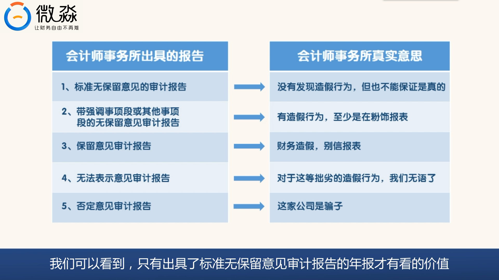

# 财务报表阅读简介视频2

**一、 年报“重要提示”的阅读方法**

*   **重要提示包含九条内容，需仔细甄别。**
*   **第1、4、6、7、8、9条：** 通常是**套话**（空话、废话），提及看一眼即可，不必当真，不重要。
*   **第2条：** 说明董事会出席情况，**价值不大**。
*   **第5条：** **关于分红的情况**，投资者关心，可以看一下。
    *   **案例：** 海天味业2016年净利润28.43亿，分红18.39亿，分红比例高达65%。
    *   **解读：** 好公司通常每年分红慷慨，说明对股东友好。
    *   **实操：** 可以与合并利润表中的净利润进行比对，计算分红占净利润的比例。

**二、 “重要提示”中最为关键的第三条：审计报告意见**

*   **核心理念：** 拿到年报，一定要**先找到并检查审计报告的意见类型**。
*   **重要性：** 审计报告的意见是判断上市公司财务是否有问题的**关键指标**。
*   **会计师事务所的立场：**
    *   上市公司花钱聘请，用词委婉，但不能明目张胆造假。
    *   拥有稀缺的证券牌照（全国仅53家），为保牌照会保持独立性。
    *   审计师一边收钱，一边要撇清责任。

**三、 会计师事务所出具的五种审计报告意见及其真实含义**

1.  **标准无保留意见审计报告**
    *   **真实意思：** 没有发现造假行为，但也不能保证是真的。
    *   **解读：** **只有出具这种报告的年报才值得继续看**。
2.  **带强调事项段或其他事项段的无保留意见审计报告**
    *   **真实意思：** 有造假行为，至少是在粉饰报表。
    *   **案例：** 乐视网2016年年报就属此类型。
    *   **解读：** **直接淘汰，不值得投资**。
3.  **保留意见审计报告**
    *   **真实意思：** 财务造假，别信报表。
    *   **解读：** **直接淘汰，不值得投资**。
4.  **无法表示意见审计报告**
    *   **真实意思：** 对于这等拙劣的造假行为，我们无语了。
    *   **解读：** **直接淘汰，不值得投资**。
5.  **否定意见审计报告**
    *   **真实意思：** 这家公司是骗子。
    *   **解读：** **直接淘汰，不值得投资**。

**四、 投资决策原则：宁可错杀，不可放过**

*   **关键原则：** 只要我们**怀疑**这家公司有问题，就**直接淘汰掉**。
*   **无需证明：** 我们**不需要**去证明一家公司有问题，只需排除风险。
*   **异常说明：**
    *   如果重要提示中提到有异常说明，一定要通过财务报表附注或其他途径弄明白。
    *   判断异常说明是否合理，如果不合理或生疑，直接淘汰。

**五、 总结与快速阅读**

*   熟悉一家公司后，拿到年报只需：
    1.  **看会计师事务所审计报告意见（第三条）**。
    2.  **看分红方案（第五条）**。
    3.  **注意是否有异常说明**。

---