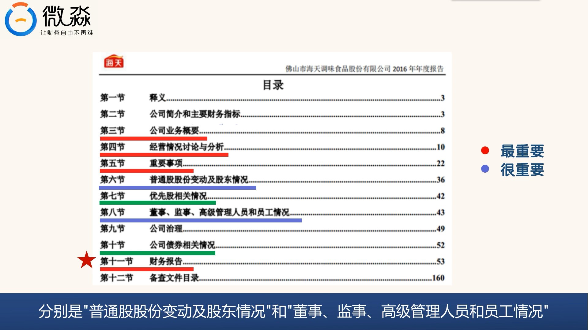

 # 财务报表阅读简介视频3

1.  **年报目录概述**
    *   位于“重要提示”之后。
    *   通常有12节内容（示例）。
    *   不同公司或即便同一公司不同年度的目录会存在细微差别，但这不影响年报阅读，无需在意。
    *   **核心提示：** 无需纠结目录的具体细节差异，重要的是找到关键信息。

2.  **必看核心内容 (红色横线标注)**
    *   **第3节 公司业务概要：** 了解公司主营业务和所处行业。
    *   **第4节 经营情况讨论与分析：** 公司管理层对经营状况、未来展望等的分析。
    *   **第5节 重要事项：** 公司发生过的重大事件、未来可能影响公司的重大事项。
    *   **第11节 财务报告：【年报阅读的绝对核心！重点！难点！】** 包含公司详细的财务数据，所有分析的基础。

3.  **较为重要的内容 (蓝色横线标注)**
    *   **第6节 普通股股份变动及股东情况：** 了解公司股权结构、主要股东及其持股变动。
    *   **第8节 董事、监事、高级管理人员和员工情况：** 了解公司管理团队组成、薪酬、变  动等。

4.  **作为补充或了解的内容 (绿色横线标注)**
    *   **第7节 优先股相关情况：** 涉及公司的融资结构。
    *   **第10节 公司债券相关情况：** 涉及公司的融资结构。
    *   **作用：** 这些内容是对第11节财务报告的补充说明，不需单独深入分析。
    *   **注意：** 对于没有优先股或未发行公司债券的公司（如海天味业），这两节内容是多余的，可直接跳过。

5.  **可以简单看或跳过的内容**
    *   **第1节 释义：** 解释年报中使用的简称，简单浏览即可，内容简单。
    *   **第2节 公司简介和主要财务指标：**
        *   **公司简介：** 一般用途不大。如需咨询可关注董事会秘书或证券事务代表的联系方式。
        *   **主要财务指标：** 数据通常摘自或计算自第11节财务报告。在充分理解并确信第11节财务报告数据无误后，这部分数据可直接使用。掌握第11节后，此部分会变得非常简单。
    *   **第9节 公司治理：**
        *   公司治理本身很重要，但在年报中多为格式化文字。
        *   有兴趣可阅读一遍，想省时可直接跳过，对年报核心阅读影响不大。
        *   （若有）“内部控制”一节对待方式与公司治理相同。
    *   **第12节 备查文件目录：** 无用，无需阅读。

---