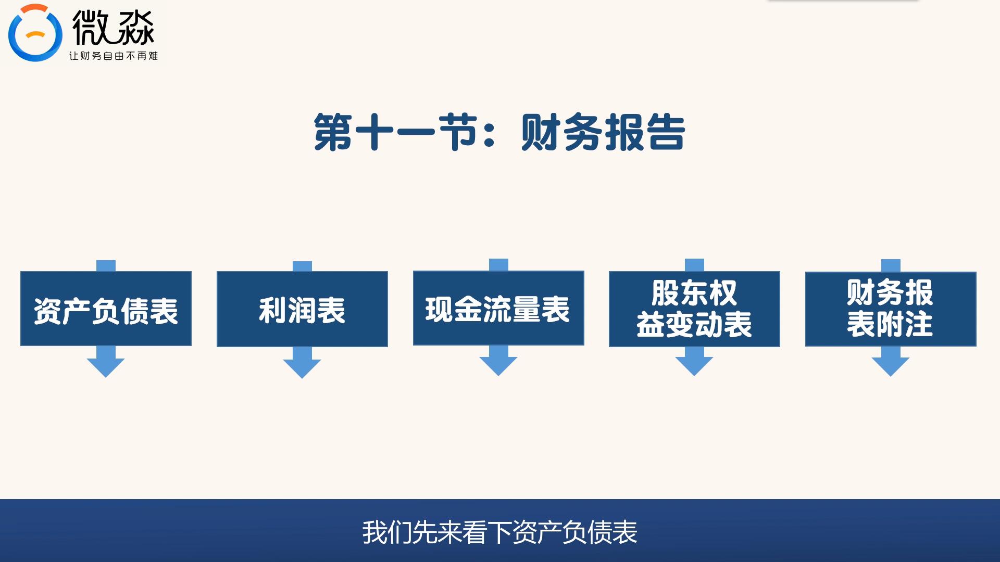
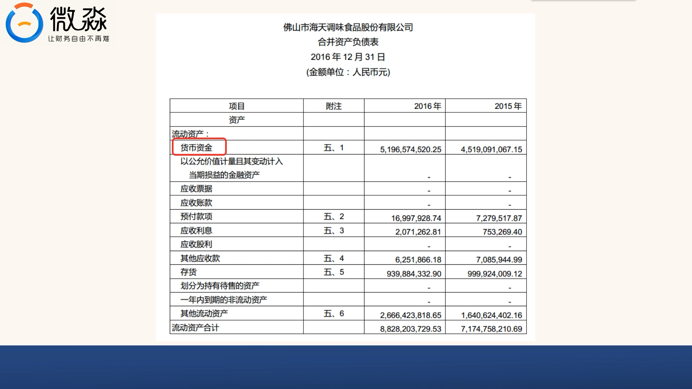
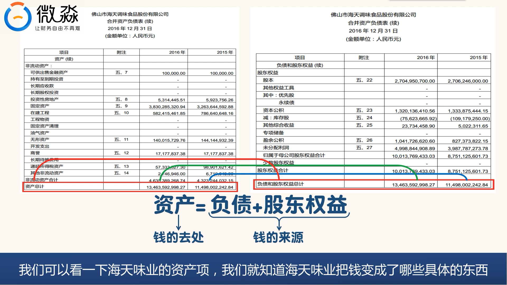
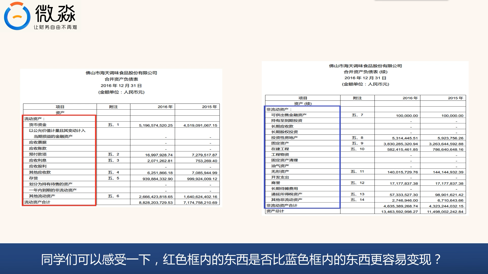

# 读懂资产负债表视频1

**1. 财务报告的构成**
*   财务报告主要由五部分组成：
    1.  **资产负债表**
    2.  利润表
    3.  现金流量表
    4.  股东权益变动表
    5.  财务报表附注

**2. 快速查找财务报告内容的小技巧**
*   打开年报（PDF格式）。
*   点击查找/搜索按钮。
*   在搜索框中输入“资产负债表”等关键词。
*   点击搜索，找到所需章节并查看。

**3. 合并资产负债表与上市公司资产负债表的区别**
*   **合并资产负债表：**
    *   上市公司本身**及其控制的子公司**（控股超过50%）的资产负债表合并而成。
    *   反映**一组公司**（综合情况）的资产负债情况。
    *   **阅读重点和学习重点**，因为子公司是企业经营的重要组成部分。
*   **上市公司资产负债表（母公司报表）：**
    *   仅反映**上市公司本身**的资产负债情况。
*   **关联性：** 两张表结合看，能更清楚地了解上市公司及其子公司的财务情况。
*   **同理：** 利润表、现金流量表和股东权益变动表也有合并和不合并两种，合并报表是阅读重点。

**4. 资产负债表的表头信息**
*   **公司名称：** 例如佛山市海天调味食品股份有限公司。
*   **报表日期：** 反映的是**某个特定时点**（例如2016年12月31日）的信息，像一张照片。
*   **报表类型：** 例如合并资产负债表。
*   **货币单位：** 例如人民币元（需注意可能为千元）。

**5. 资产负债表的本质与局限性**
*   **本质：** 反映公司在某个时点上**可以以货币计量的**资产、负债及所有者权益情况。
*   **局限性：** 仅反映可以用货币计量的资产。无法反映企业的人才、口碑等重要但不可货币计量的资产。

**6. 资产负债表的主要构成（项目列）**
*   **三大块：** 资产、负债、股东权益。
*   **流动性划分：**
    *   **资产：** 流动资产、非流动资产。
    *   **负债：** 流动负债、非流动负债。

**7. 流动性概念**
*   **定义：** 资产变成现金的能力。
*   **区分标准（通常以一年为界）：**
    *   **流动资产：** 一般**一年内**能变成现金的资产。
    *   **非流动资产：** **一年以上**才能变成现金的资产。
    *   **流动负债：** **一年内**需要偿还的负债。
    *   **非流动负债：** **一年以后**才需要偿还的负债。
*   **排序原则：** 流动性最强的排在最上面。
    *   流动资产中：货币资金（现金）排最上。
    *   流动负债中：短期借款排最上。

**8. 资产负债表数据列与附注**
*   **数据列：** 通常展示两个或更多年度的数据（例如2016年和2015年），方便投资者进行比较分析。
*   **附注列：** 指的是财务报表附注中对各科目的具体解释，通常无需逐一查看，需要时可直接搜索。

**9. 会计恒等式**
*   **公式：** **资产 = 负债 + 股东权益**
*   **理解：**
    *   **右边（负债 + 股东权益）：** 钱的**来源**。
        *   **负债：** 债权人的权益（公司借来的钱）。
        *   **股东权益：** 归属股东的钱（股东投入的钱 + 经营盈利等）。
    *   **左边（资产）：** 钱的**去处**（钱变成了什么具体的东西）。

**10. 资产项的构成理解**
*   **流动资产：** 通常是红色框内部分，比非流动资产更容易变现。
*   **非流动资产：** 通常是蓝色框内部分，变现能力较弱。

---