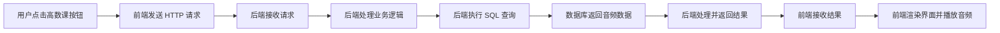

# 文科生转行 AI：岗位选择与学习重点

> 来源：智能纪要 `01e9eaec54169005010370019dc0ca2ed3_109`  
> 时间：2026 年 4 月 25 日

## 一、核心问题

文科生转行 AI 行业时，最容易遇到的问题是：

- 不知道应该补哪些技术；
- 不知道技术要学到什么程度；
- 容易一上来就学 Python、机器学习、深度学习，陷入“好学生思维”；
- 没有先根据目标岗位倒推学习重点。

正确思路是：先确定目标岗位，再判断岗位真正需要什么技术，最后有针对性地补能力。

## 二、文科生转行 AI 的四类岗位

按照技术要求从高到低，可以分为四类：

| 岗位方向 | 主要能力要求 | 适合人群 |
| --- | --- | --- |
| AI 产品经理 | 理解 AI 技术原理、产品设计、项目管理、用户洞察 | 想做产品、业务和技术连接的人 |
| AI 训练师 / 数据标注专家 | 熟悉标注工具，理解模型训练流程 | 适合从数据、内容、标注任务切入 |
| AI 内容 / 用户运营 | AI 工具使用、用户洞察、数据反馈、业务场景理解 | 适合内容、运营、社群、增长背景 |
| AI 解决方案 / 售前支持 | 行业知识、沟通能力、方案表达 | 适合销售、咨询、客户成功背景 |

其中，成长空间更大、市场更青睐的方向是：AI 产品经理。

## 三、AI 产品经理的两种类型

### 1. 偏模型侧产品经理

这类岗位更贴近算法团队，需要更强的技术理解能力。

需要理解：

- 模型链路；
- 数据集定义；
- 评测系统；
- 标注策略；
- 模型训练和优化流程；
- 与算法团队协作的基本语言。

特点：

- 技术要求较高；
- 和算法团队沟通频繁；
- 入门门槛相对更高。

### 2. 偏应用落地产品经理

这类岗位更像传统产品经理的升级版，也是更适合多数文科生切入的方向。

核心问题是：

> 如何把大模型能力接入真实业务场景，并设计成用户能用、业务能跑的产品？

特点：

- 市场需求更大；
- 比模型侧产品经理更容易入门；
- 更看重业务理解、用户洞察、产品设计和落地能力；
- 需要懂技术概念，但不一定要从零深入算法。

## 四、应用侧 AI 产品经理需要补什么

应用侧 AI 产品经理的能力可以分成两大类。

### 1. 文科生已有优势

这些能力往往是文科生更容易发挥的部分：

- 用户理解；
- 表达能力；
- 沟通能力；
- 内容判断；
- 审美能力；
- 产品感；
- 业务场景理解。

这些不是“软能力附加项”，而是应用侧 AI 产品真正落地时非常关键的能力。

### 2. 需要补齐的技术理解

不建议一开始就盲目猛学 Python、机器学习、深度学习。

更应该先理解：

- 软件工程基本流程；
- 前端、后端、数据库分别是什么；
- 产品从需求到上线的基本流程；
- AI 应用中的常见概念：
  - Prompt；
  - Agent；
  - 幻觉；
  - RAG；
  - Token；
  - 多模态；
  - 模型调用；
  - API；
  - 数据流转。

重点不是成为算法工程师，而是能听懂、能沟通、能判断产品方案是否可行。

## 五、最有效的学习方法：自己做一个小 APP

与其看 10 小时网课，不如用 AI 编程工具做一个小产品。

这种方式常被称为 Vibe Coding：

> 把需求描述清楚，让大模型帮你生成代码。你不需要一开始就掌握所有语法，但需要会提问、会拆需求、会判断结果。

自己动手做产品的价值：

- 能真正理解前端、后端、数据库如何协作；
- 能在报错和调试中理解软件开发流程；
- 能把作品写进简历；
- 能形成对 AI 产品落地的直观认知；
- 能从“概念学习”进入“项目实践”。

## 六、案例：催眠 APP

案例产品：一个用于催眠的 APP。

核心创意：

> 利用“反向学习法”帮助用户入睡。用户睡不着时打开 APP，选择一门自己不感兴趣的课程，例如高数、算法、物理，听着听着就睡着。

虽然功能简单，但它包含一个完整应用的基本组成：

- 前端；
- 后端；
- 数据库；
- 用户交互；
- 数据请求；
- 内容播放。

这类小产品适合作为学习项目，也适合沉淀为简历作品。

## 七、一次按钮点击背后的数据流转

以用户点击“高数课”按钮为例，背后发生了这些事情：

具体过程：

1. 用户在前端界面点击“高数课”按钮。
2. 前端发送一个 HTTP 请求给后端，表达“我要播放高数课音频”。
3. 后端收到请求后，进行业务逻辑处理。
4. 后端发现需要获取音频数据，于是执行 SQL 语句查询数据库。
5. 数据库根据请求找到对应音频数据，并返回给后端。
6. 后端拿到数据后进行必要处理，再把结果返回给前端。
7. 前端拿到结果后渲染页面，并开始播放音频。

这就是一个小型应用的基本协作方式。

## 八、前端、后端、数据库分别是什么

### 前端

前端是用户看到和操作的界面。

例如：

- 按钮；
- 页面布局；
- 音频播放控件；
- 课程列表；
- 用户点击后的反馈。

### 后端

后端负责处理业务逻辑。

例如：

- 接收前端请求；
- 判断用户想播放哪门课；
- 查询数据库；
- 处理数据；
- 把结果返回给前端。

### 数据库

数据库负责存储数据。

例如：

- 课程名称；
- 音频地址；
- 课程分类；
- 用户播放记录；
- 用户偏好。

## 九、工具选择思路

纪要中提到的工具是 Chatbox，优势是可以在同一个对话框中切换不同模型。

不同任务可以选择不同模型：

| 任务 | 适合模型 |
| --- | --- |
| 写代码 | Gemini 等代码能力较强的模型 |
| 查资料、梳理逻辑 | ChatGPT |
| 写 PRD、产品文档 | Claude |

关键不是固定使用某一个模型，而是根据任务选择更适合的 AI 工具。

## 十、建议学习路线

### 第一步：先选岗位

不要先盲目学技术，先判断自己更适合哪类岗位：

- 想做产品：优先看 AI 应用产品经理；
- 想做运营：看 AI 内容 / 用户运营；
- 想做客户沟通和行业方案：看 AI 解决方案 / 售前；
- 想接触模型训练数据：看 AI 训练师 / 数据标注。

### 第二步：补应用侧技术概念

优先学习：

- HTTP 请求；
- API；
- 前端、后端、数据库；
- Prompt；
- Agent；
- RAG；
- Token；
- 多模态；
- AI 应用的基本架构。

### 第三步：用 Vibe Coding 做一个小产品

可以选择一个足够小但完整的产品，例如：

- 催眠课程播放器；
- AI 简历优化工具；
- 小红书标题生成器；
- PDF 问答助手；
- 用户反馈分析工具；
- 课程笔记整理工具。

要求是：功能可以简单，但最好包含前端、后端、数据库或数据存储。

### 第四步：把项目整理成作品

项目完成后，要沉淀成作品集材料：

- 产品背景；
- 用户痛点；
- 核心功能；
- 产品流程图；
- 技术架构图；
- 前后端和数据库如何协作；
- 使用了哪些 AI 能力；
- 你在项目中负责了什么；
- 遇到了什么问题，如何解决。

### 第五步：用作品反推简历和面试表达

面试时不要只说“我学过 AI”，而要说：

> 我做过一个小型 AI 应用，里面包含前端页面、后端接口和数据存储。我理解用户点击一个按钮后，请求如何从前端发到后端，再由后端查询数据库，最后把结果返回给前端展示。

这种表达更接近真实岗位语言。

## 十一、核心结论

文科生转行 AI，不应该被焦虑裹挟，盲目去学代码和算法。

更高效的方式是：

1. 先确定目标岗位；
2. 再理解岗位所需的技术边界；
3. 优先补应用开发和 AI 产品概念；
4. 用 Vibe Coding 做出一个小产品；
5. 把项目变成简历作品和面试表达。

技术学习不是越多越好，而是要服务于目标岗位。

