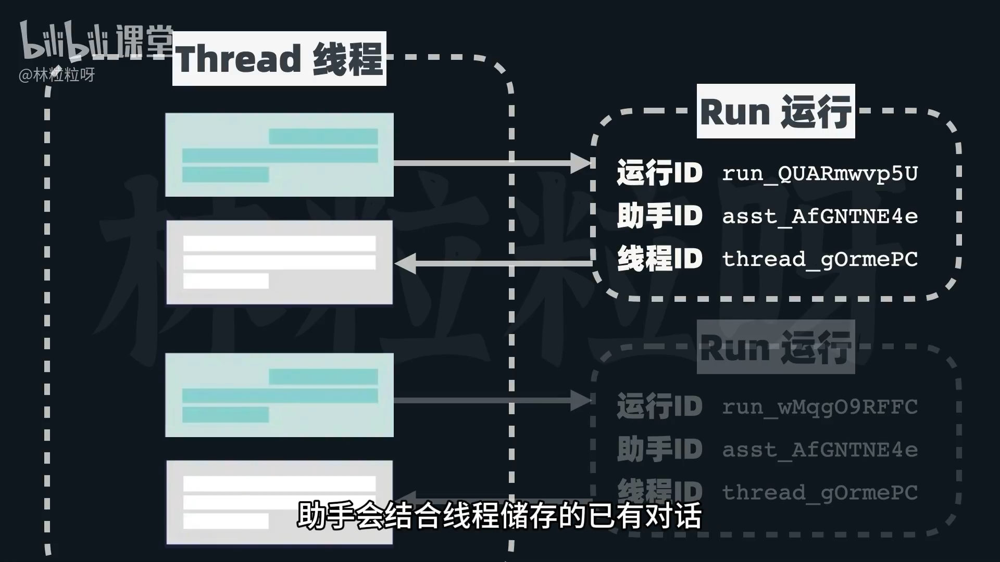
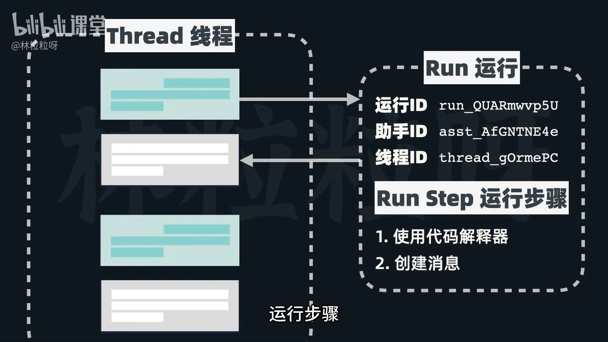
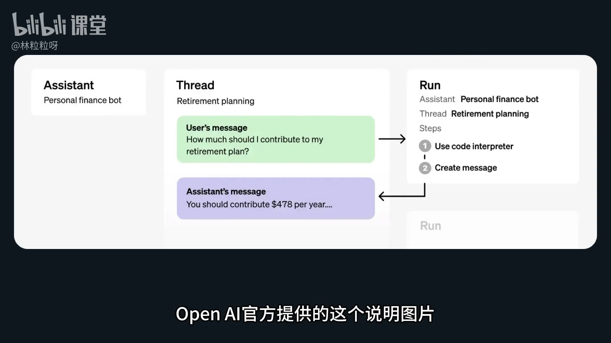
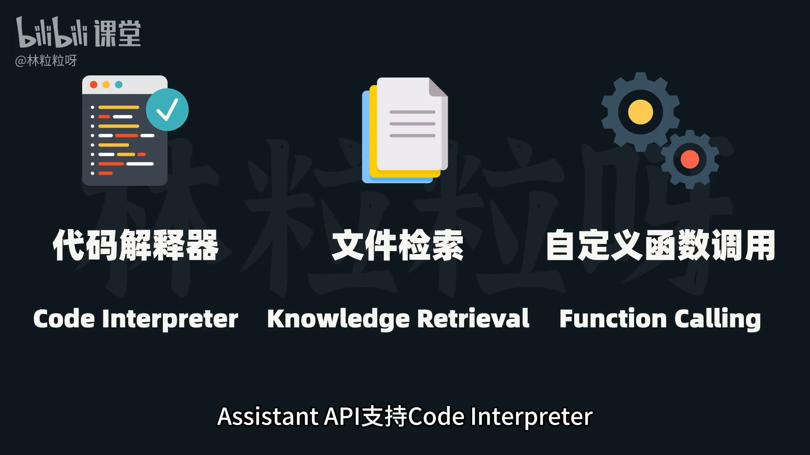

# 104-Assistant API 搞懂API的关键对象

## 1. Assistant API 简介与对比 LangChain

*   **Assistant API**：OpenAI 提供的 API，能高效创建强大的、基于 OpenAI 模型的 AI 助手。
*   **LangChain**：一个通用的 AI **应用框架**，可以集成各种 AI 模型（不限于 OpenAI）。

### 核心区别：

1.  **性质不同**：
    *   **Assistant API**：本质是 **API**。通过发送文本提示给模型，接收模型生成的回应。
    *   **LangChain**：本质是 **应用框架**。利用其提供的多种工具和组件，创建基于模型的应用。
2.  **支持模型范围**：
    *   **Assistant API**：**只支持 OpenAI 模型** (如 GPT-4)。如果你不想使用 OpenAI 模型，此章节可跳过。
    *   **LangChain**：通用开发框架，可集成来自各种来源的 AI 模型。

## 2. Assistant API 关键对象

理解以下五个核心对象是使用 Assistant API 的基础：

### 2.1. **Assistant (助手)**
*   **定义**：能使用 OpenAI 模型并调用相关工具的 AI。
*   **配置**：需要指定其背后的**模型、名称、描述、接收的系统指令**以及**可使用的工具**。

### 2.2. **Thread (线程)**
*   **定义**：助手与用户之间的一系列**对话序列**（会话）。
*   **功能**：储存消息，并在超过模型上下文窗口时，对对话进行**截断**以保持连贯性。

### 2.3. **Message (消息)**
*   **定义**：来自助手或用户的具体对话内容。
*   **格式**：可以是**文本、图片、文件**等。
*   **储存**：以**列表**形式储存在**线程 (Thread)** 上。

### 2.4. **Run (运行)**
*   **定义**：在某个 **线程 (Thread)** 上触发调用助手的**动作**。
*   **过程**：助手会结合线程储存的已有对话、调用模型以及可用工具来执行要求的任务。
*   **结果**：执行任务后，新的对话消息也会被添加到该线程。

### 2.5. **Run Step (运行步骤)**
*   **定义**：助手在 **运行 (Run)** 过程中采取的一系列**具体步骤**。
*   **示例**：比如调用了某个工具、生成了某个消息等。
*   **作用**：查看运行步骤可以帮助我们理解助手是如何得到最终结果的。

## 3. Assistant API 工作流程 (带记忆的连续对话)

OpenAI 官方说明图解：
1.  **用户**与**助手 (Assistant)** 进行交互。
2.  **线程 (Thread)** 储存了来自用户和助手的消息。
3.  在线程上的每次 **运行 (Run)** 过程中，会包含一系列**运行步骤 (Run Step)**。
4.  运行步骤可能包括：调用代码解释器、创建消息等。
5.  助手将新生成的响应消息再次添加到 **线程 (Thread)** 里，从而实现**带记忆的连续对话**。

## 4. Assistant API 支持的工具

Assistant API 内置了以下工具：

*   **Code Interpreter (代码解释器)**
*   **Knowledge Retrieval (文件检索)**
*   **Custom Function Calling (自定义函数调用)**

## 5. 与 LangChain 的关联

*   Assistant API 的概念（如代理、检索等）与 LangChain 的 `Agent` 和 `RAG` 部分有相通之处。
*   如果你已经学习过 LangChain，理解和上手 Assistant API 会更快。

## 6. 下一步

*   我们将学习如何具体调用 Assistant API。

---