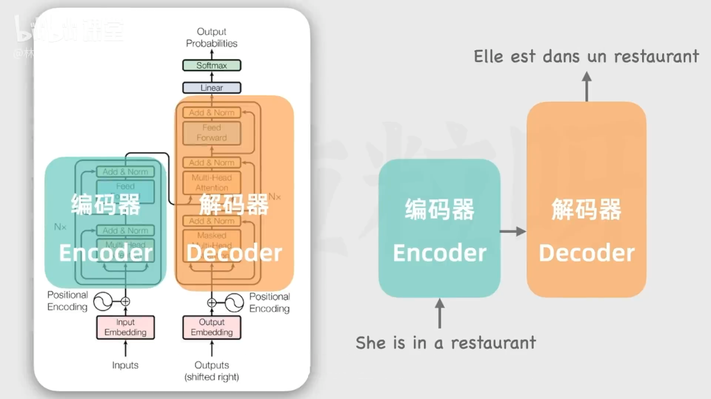
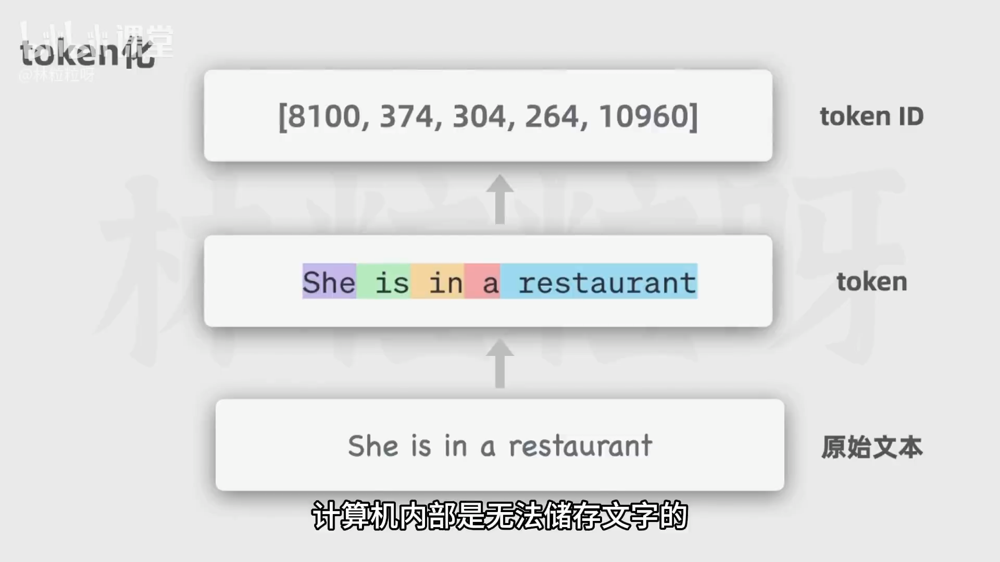
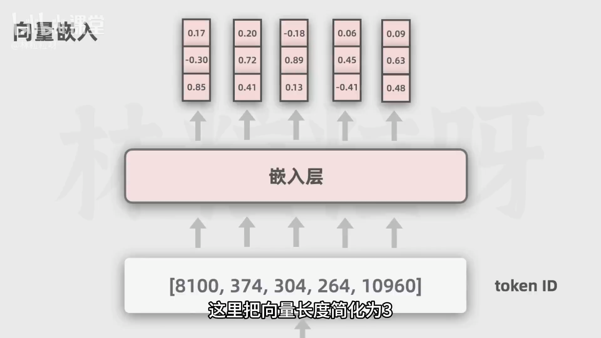

# 4-AI科普   AI聊天助手背后的黑科技Transformer

> 文档源：《4-AI科普 AI聊天助手背后的黑科技Transformer-1080P 高清-AVC》  
> 目标：用清晰的 Markdown 结构梳理 Transformer 的核心原理与流程，保留中间细节，便于阅读与渲染

> 谷歌论文：https://arxiv.org/pdf/1706.03762
---

## 1. 背景与总体认识
- 大语言模型（LLM）常被描述为“预测下一个最可能的词（token）”，类似搜索框的“自动补全”。
- 关键问题：模型如何得到“每个候选词的概率分布”？
- 核心答案：Transformer 架构（论文《Attention Is All You Need》，2017）  
  - 成为文本领域大模型的事实标准：GPT、GLM、ERNIE（文心）等都基于 Transformer。
- 原始 Transformer 由两大部件组成：
  - 编码器（Encoder）：理解和抽象表示输入序列
  - 解码器（Decoder）：基于表示生成输出序列

---

## 2. 基础预处理：从文本到向量
- Token 化（Tokenization）
  - 将输入文本拆分为 token（基本单位）。短词通常 1 个 token，长词可能拆为多个 token。
  - 每个 token 用整数表示（token ID），因为计算机内部只能处理数字。
- 嵌入层（Embedding）
  - 将每个 token 映射为“向量”（一串数字），向量长度可很大（论文典型为 512，GPT-3 常见为 12288）。
  - 为什么不用单个整数？  
    - 多维向量能表达更丰富的语法与语义信息，表示词与词之间的相似与差异（如“男人/女人”“国王/女王”的关系）。
    - 语义相近的词在向量空间中距离更近，无关词距离更远，利于模型计算相似性与关系。
- 位置编码（Positional Encoding）
  - Transformer 不按序列步步传递状态，因此需要显式注入“位置信息”。
  - 做法：将“位置向量”与“词向量”相加，使模型既知词义又知序位，便于捕捉顺序关系。

---

## 3. 编码器（Encoder）：自注意力与多层堆叠
- 目标：把输入序列转换成更抽象的表示（依旧是向量序列），保留词汇、顺序与关键语法语义特征。
- 自注意力（Self-Attention）
  - 处理每个词时，关注输入序列中的所有其他词，学习“相关性权重”。
  - 例子：句中 “it” 语法上可指“animal”或“street”，自注意力会根据上下文为“it↔animal”分配更高权重，从而更准确理解指代。
- 多头自注意力（Multi-Head Self-Attention）
  - 不止一个注意力头，每个头可关注不同特征（如动词、修饰词、情感、命名实体等），并行计算，互不阻塞。
  - 各头的注意力模式是模型在大规模预训练中自动学习到的。
- 前馈神经网络（Feed-Forward Network, FFN）
  - 在注意力之后的逐位置非线性变换，增强表示能力。
- 层级结构与不共享权重
  - 编码器由多层堆叠而成（每层结构相同，但参数不共享），逐层抽象，提升对复杂文本的理解。

 

---

## 4. 解码器（Decoder）：自回归生成的细节
- 目标：基于编码器输出与已生成内容，逐步生成新的 token。
- 输入组成：
  - 编码器的输出（输入序列的抽象表示）
  - 已生成的输出序列（第一步用“序列开始”的特殊 token 作为占位）
- 带掩码的自注意力（Masked Self-Attention）
  - 与编码器不同，解码器的自注意力只能关注“当前词及其之前的词”，对“未来词”进行遮盖（mask），以保证自回归生成的因果顺序。
- 交叉注意力（Cross-Attention）
  - 解码器还会对“编码器输出”施加注意力，将输入信息融入到输出生成中，建立输入-输出的对齐关系。
- 前馈网络与层堆叠
  - 与编码器类似，包含 FFN，并多层堆叠以增强能力。
- 概率分布与选择
  - 线性层 + Softmax 将解码器的表示转换为“词汇表上的概率分布”。
  - 通常选择概率最高的 token 作为下一个输出（也可用采样、温度、Top-k/Top-p 等策略，文档此处强调“最高概率”的直觉）。
- 终止条件与幻觉（Hallucination）
  - 重复上述过程，直到生成“序列结束”的特殊 token。
  - 解码器在“语言建模”意义上预测最可能的词，并不直接验证客观事实，因此可能出现“一本正经地胡说”（幻觉）。

---

## 5. 原始 Transformer 的三种常见变体与典型用途
- 仅编码器（Encoder-only，自编码器类）
  - 代表：BERT
  - 适合“理解类”任务：掩码语言建模（预测被遮住的词）、情感分析、文本分类、命名实体识别等。
- 仅解码器（Decoder-only，自回归类）
  - 代表：GPT 系列
  - 适合“生成类”任务：通过预测下一个词进行文本生成（对话、续写、创作等）。
- 编码器-解码器（Encoder-Decoder，Seq2Seq）
  - 代表：T5、BART
  - 适合“序列到序列”任务：机器翻译、文本摘要、风格改写等。

---

## 6. 端到端流程（以翻译为例）
1) 输入英文句子 → Token 化 → Token ID  
2) 通过嵌入层得到“词向量” → 加上“位置编码”  
3) 进入编码器堆栈：多头自注意力 + FFN（多层） → 产出“抽象表示”  
4) 解码器初始化：用“序列开始”特殊 token 作为已生成序列  
5) 解码器执行：
   - 带掩码自注意力（只看当前及之前的 token）  
   - 交叉注意力（关注编码器的表示，将输入信息对齐进生成）  
   - FFN（增强表示）  
6) 线性层 + Softmax → 得到词汇概率分布 → 选取下一个 token  
7) 将新 token 拼到已生成序列 → 回到第 5 步，循环，直至生成“序列结束”特殊 token  
8) 输出完整法语句子（翻译完成）

---

## 7. 关键术语速查
- Token / Token ID：文本基本单位及其整数表示。
- Embedding（嵌入）：将 token 映射为向量，承载语义/语法信息与词间关系。
- Positional Encoding（位置编码）：注入序列位置信息，使模型知晓顺序。
- Self-Attention（自注意力）：为序列中任意两词学习相关性权重，汇聚上下文。
- Multi-Head Attention（多头注意力）：多个注意力头并行关注不同特征维度。
- Cross-Attention（交叉注意力）：解码器对编码器输出施加注意力，实现输入-输出对齐。
- FFN（前馈网络）：逐位置的非线性变换，增强表达力。
- Softmax：将表示映射为词汇表的概率分布。
- BOS/EOS（开始/结束 token）：指示序列生成的起止位置（文档中以“特殊 token”描述）。

---

## 8. 小结与要点
- Transformer 通过“注意力机制 + 并行计算 + 位置编码”，高效捕捉长距离依赖，成为大模型基石。
- 编码器负责理解，解码器负责生成；多头注意力让模型从多视角捕捉文本特征。
- 解码器的概率生成并不保证事实正确，需配合检索/工具或后处理降低幻觉。
- 模型家族按任务分工清晰：BERT（理解）、GPT（生成）、T5/BART（序列到序列）。

---

## 9. 复习题（自测）
1) 为什么 Transformer 需要“位置编码”？它与 RNN 的顺序处理有何根本差异？  
2) 自注意力如何帮助解决代词指代问题？举“it”指代的例子说明其机制直觉。  
3) 解码器为什么使用“带掩码”的自注意力？如果不掩码会发生什么？  
4) 多头注意力的优势是什么？为什么要“并行关注”不同特征？  
5) 仅编码器、仅解码器、编码器-解码器三类模型各自典型应用是什么？

