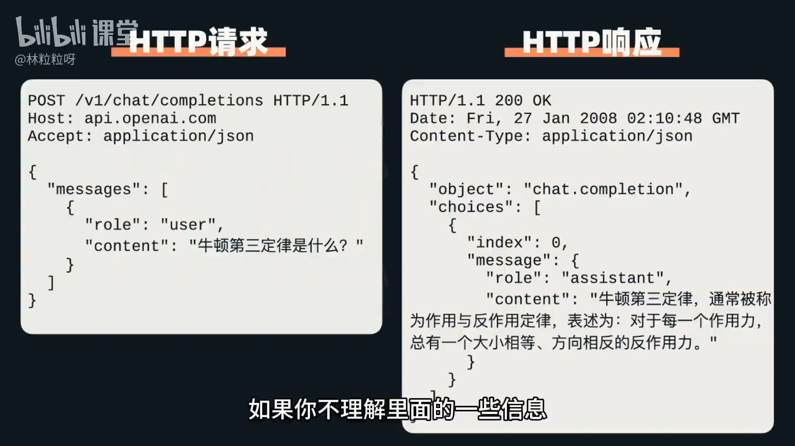
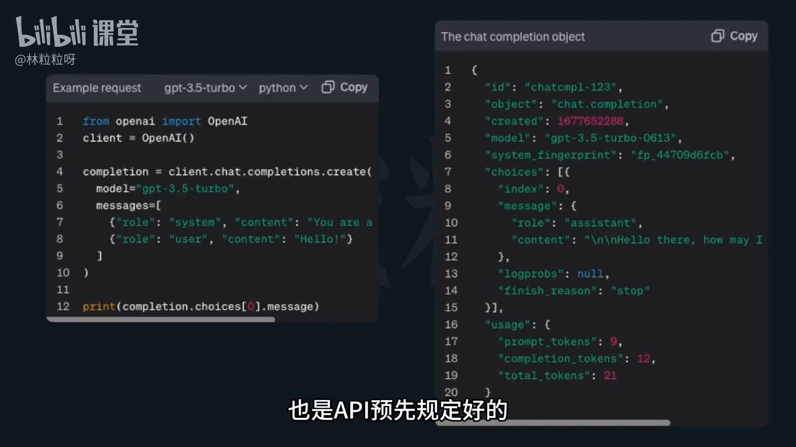

# 44-大模型API   如何用代码与AI对话？

## 一、为什么要通过代码与AI对话？

- 网页端虽然方便，但不灵活，不适合集成与自动化应用。
- 使用代码可以：
  - 精细控制请求参数（如回复长度、创造性、惩罚项等）。
  - 批量处理大数据（如批量总结文档）。
  - 集成到自定义流程（自动化邮件、报告生成等）。
- **关键优势**：灵活、高效、可复用。

---

## 二、通过 API 调用模型

### 1. 什么是 API？

- **API（Application Programming Interface）**：应用程序编程接口。
- 定义两个软件程序之间的“服务合约”。
- 决定双方如何通过“请求（Request）”与“响应（Response）”进行通信。
- 可以把 **API 看作是“与服务对话的说明书”**。

---

### 2. API 通信协议：HTTP

- **HTTP（Hypertext Transfer Protocol）**：超文本传输协议。
- 用于客户端与服务器之间的请求与响应。
- 在 AI 对话场景中：
  - 我们的代码程序 = 客户端。
  - AI 服务提供方（如 OpenAI、百度）= 服务器。
- 请求中需包含：
  - 资源路径（URL）
  - 请求头信息（Headers）
  - 请求内容（Body）
  - 响应类型（如 JSON）

---

### 3. 请求与响应的基本结构

#### 请求（Request）：
- 包含：
  - HTTP 方法（GET / POST）
  - 请求的目标（API 路径）
  - 请求头（Headers，例如 Content-Type、Authorization）
  - 请求体（Body，例如“消息内容”、“模型参数”）

#### 响应（Response）：
- 包含：
  - 状态码（如 200 表示成功）
  - 响应头（Headers）
  - 响应内容（Body，包括 AI 回复和其他信息）
   

---

## 三、API 封装与库支持

- 各大公司（如 OpenAI、百度文心等）都对 API 进行了封装，提供了 **官方 SDK 或库（Library）**。
- 这样我们无需手写 HTTP 请求，只需使用封装好的函数。
  
### 例如：
- `openai.ChatCompletion.create()` 用于发送对话请求。
- 参数包括：
  - `model`: 指定使用的 AI 模型；
  - `messages`: 聊天内容（消息列表）；
  - 以及控制回复的各种参数。

---

## 四、模型差异与调用方式

- 不同平台（如 OpenAI GPT、百度文心）虽然实现不同，但底层逻辑相似：
  - 发送结构化请求；
  - 接收模型的结构化响应；
  - 提取内容使用。

> 掌握一个框架，其他平台可举一反三。

---

## 五、API 使用前的关键步骤——获取 API 密钥

- 所有主流大模型都要求使用 **API Key**。
- **作用**：
  - 身份验证（识别调用者）。
  - 使用追踪（计费、视频频率、限流）。
- 使用前需创建密钥并妥善保管。

---

## 六、总结

| 模块 | 内容 |
|------|------|
| **通信方式** | 通过 HTTP 请求与服务器通信 |
| **封装方式** | 各公司提供官方库（简化 API 调用） |
| **关键项** | 模型选择、请求参数、响应解析 |
| **前提** | 获取并配置 API 密钥 |
| **优势** | 灵活控制、批量处理、系统集成 |

---

**下一步推荐学习：**
- 如何生成并使用 API 密钥；
- 常见 AI API 参数详解；
- 实践：用 Python 调用 GPT 接口实现对话与自动化处理。
