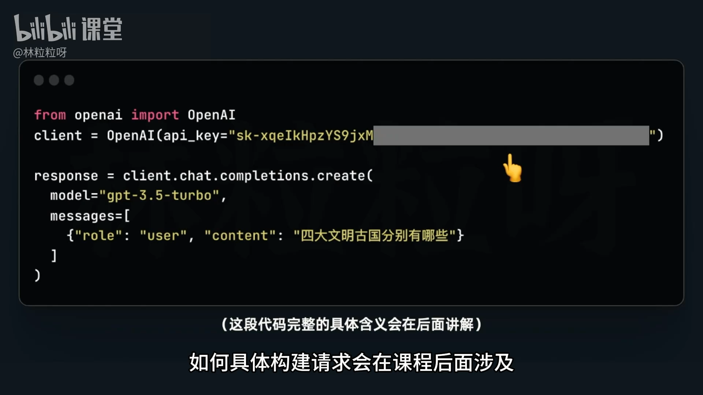
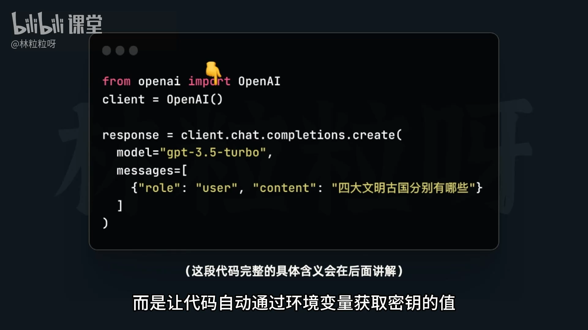
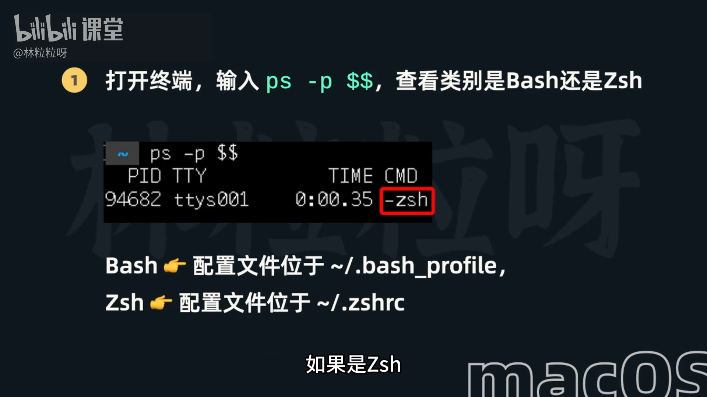
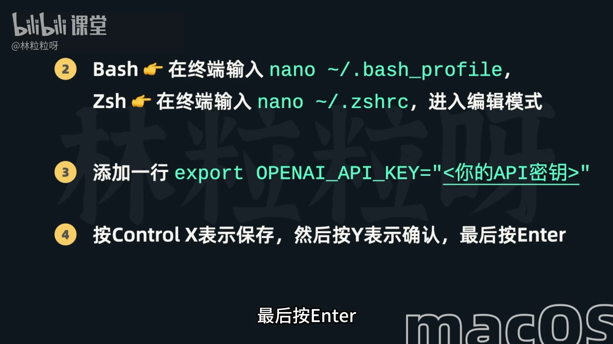
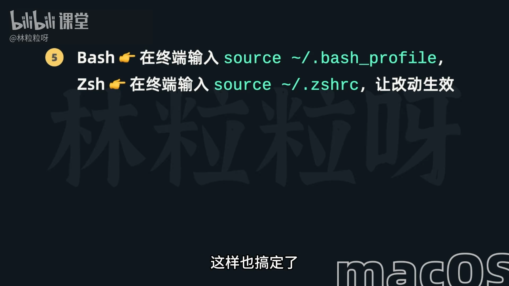

# 45 - 大模型 API：创建 OpenAI API 密钥，然后藏起来

## 一、为什么需要 API 密钥？

> API 密钥（API Key）是你访问大模型服务的“身份凭证”。  
> 它相当于一张“通行证”，系统通过它识别你是谁、是否有权限调用接口。

### 核心作用
1. **身份验证**：防止匿名访问和滥用。  
2. **计费追踪**：帮助平台统计每个用户的额度使用。  
3. **限流管理**：控制调用频率，防止系统过载。  
4. **安全授权**：确保只有授权应用可访问模型。

---

## 二、如何创建 OpenAI API 密钥？

### 步骤 1：登录官网
- 打开 [https://platform.openai.com](https://platform.openai.com)
- 使用邮箱或第三方账号（如 Google、Microsoft）登录。

### 步骤 2：进入密钥管理界面
- 登录后点击右上角个人头像；
- 选择 **“View API Keys”**（查看 API 密钥）；
- 页面路径：**Dashboard → API Keys**

### 步骤 3：创建新密钥
- 点击 **“Create new secret key”**；
- 输入一个标识名称（例如：`my-first-key`）；
- **系统只会显示一次完整密钥**，需立刻复制保存。

### 注意 ⚠️
- 密钥格式一般类似：
  ```
  sk-xxxxxxxxxxxxxxxxxxxxxxxxxxxxxxxx
  ```
- 一旦关闭弹窗，将无法再查看；
- 若遗失，只能 **重新生成新密钥**。

---

## 三、安全存储密钥的做法

### 1. ❌ 不推荐的方式
直接把密钥写在代码里，例如：
```python
openai.api_key = "sk-xxxxxxxxxxxxxxxx"
```
风险：
- 上传到 GitHub 时可能泄漏；
- 协作代码中他人可直接看到密钥。





---

### 2. ✅ 推荐的安全做法

### 使用环境变量（Environment Variable）

##### （1）Windows 系统操作步骤

**① 打开系统属性**
- 在 Windows 桌面上右键点击 **“计算机/此电脑”** → 选择 **“属性”**；
- 左侧点击 **“高级系统设置”**；
- 在弹出的 **“系统属性”** 窗口中点击 **“环境变量（Environment Variables）”** 按钮。

**② 创建新的用户变量**
- 在上方“用户变量”区域点击 **“新建（New）”**；
- 变量名（Variable name）：
  ```
  OPENAI_API_KEY
  ```
- 变量值（Variable value）：
  ```
  sk-xxxxxxxxxxxxxxxxxxxxxxxxxxxxxxxx
  ```
- 点击 **确定（OK）** 保存。

> ✅ **特别强调**：变量值就是官网创建的 API Key。  
> 不要加引号，也不要有多余空格。

**③ 验证设置是否成功**
打开命令行（CMD 或 PowerShell）输入：
```bash
echo %OPENAI_API_KEY%
```
若能显示出类似 `sk-xxxxxx`，说明配置成功。

---

##### （2）macOS 系统操作步骤（图形化方式）

> 文档中提到 Mac 用户可使用“系统偏好设置”或终端方式设置。





