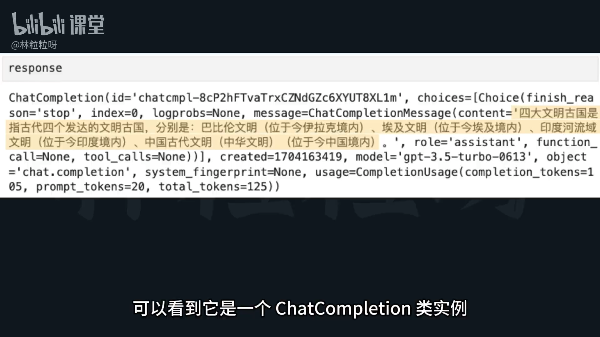

# 46-大模型API 发送你对AI大模型的第一个请求

## 一、安装与准备环境

### 1. 安装 OpenAI 官方库
要调用 **GPT 模型的聊天功能**，可以直接使用 OpenAI 官方提供的 Python 库，无需自己构建 HTTP 请求。

安装命令：

```bash
pip install openai
```

> 💡 macOS 用户可能需要使用：
> ```bash
> pip3 install openai
> ```

如果使用 Jupyter Notebook，也可以在 Notebook 单元中执行：

```python
!pip install openai
```

带有 `!` 前缀的命令，会在系统 shell 中运行，相当于在终端或 CMD 中执行。

---

## 二、导入与初始化

### 1. 导入 `OpenAI` 类
```python
from openai import OpenAI
```
此类用于创建和管理与 AI 的请求会话。

### 2. 创建实例
```python
client = OpenAI()
```

#### 🔐 关于 API 密钥
- 通常我们会在系统 **环境变量** 中保存 `OPENAI_API_KEY`；
- 如果已经配置环境变量，则上述代码会自动读取；
- 若未配置，可在实例化时手动传递密钥：

```python
client = OpenAI(api_key="你的密钥")
```

密钥在每次发送请求时用于身份验证，若未验证成功，API 调用将失败。

---

## 三、开始与 AI 对话

### 1. 调用 Chat API
使用以下方法发起聊天请求：

```python
from openai import OpenAI

client = OpenAI()

response = client.chat.completions.create(
    model="gpt-3.5-turbo",  # 模型类型
    messages=[
        {"role": "user", "content": "四大文明古国分别有哪些"}
    ]
)
```

**链接**：https://platform.openai.com/docs/models


### 2. 常用参数说明
| 参数名 | 说明 |
|:--|:--|
| `model` | 使用的 GPT 模型名称，如 `gpt-3.5-turbo`、`gpt-4`、`gpt-4-turbo` 等。 |
| `messages` | 消息列表，包含多轮对话记录。每条消息是一个字典。消息里面有 2 个键值对。   |

---

## 四、messages 参数结构

`messages` 是一个 **包含若干字典的列表**，每个字典代表一条消息。

格式如下：

```python
response = client.chat.completions.create(
    model="gpt-3.5-turbo",
    messages=[
        {"role": "user", "content": "你是谁？"},
        {"role": "assistant", "content": "我是ChatGPT，由OpenAI开发的一款大型语言模型。"},
        {"role": "user", "content": "四大文明古国分别有哪些"}
    ]
)
``` 

- 每条消息使用字典格式表示：
  - `"role": "user"` 表示用户输入。  
  - `"role": "assistant"` 表示 AI 的回复。  
  - `"content": "..."` 是具体的文本内容。  

---

## 五、解析 AI 返回结果

API 调用的返回值为一个 `ChatCompletion` 类实例：

```python
response
```

若直接查看，包含完整的响应结构。

获取文本内容可直接访问：

```python
result = response.choices[0].message.content
print(result)
```

> 其中：
> - `.choices[0]` 表示第一个返回结果；
> - `.message.content` 是 AI 的回复内容。

---

## 六、模型与价格

- 模型版本数字越大（如 GPT-4 > GPT-3.5），性能越好；
- 越新模型通常价格越高；
- 实际可用模型及版本可在 **OpenAI 官网** 查看最新列表。

---

## 📘 小结

1. **安装 OpenAI 库** → `pip install openai`  
2. **导入并创建实例** → `from openai import OpenAI`  
3. **配置 API 密钥** → 环境变量或构造函数传参  
4. **构建 messages 列表** → 设置角色和内容  
5. **调用 chat.completions.create()** → 发起请求  
6. **解析返回内容** → `response.choices[0].message.content`

---

## 🧩 下一步
下一节内容将讲解：
> API 的计费方式与 token 计算逻辑。


这张图片展示的是一段 **OpenAI Python SDK** 的使用示例，演示了如何在对话中包含多轮消息（包括用户与 AI 的历史对话）。下面是图片中提取并整理的完整代码：  

```python
response = client.chat.completions.create(
    model="gpt-3.5-turbo",
    messages=[
        {"role": "user", "content": "你是谁？"},
        {"role": "assistant", "content": "我是ChatGPT，由OpenAI开发的一款大型语言模型。"},
        {"role": "user", "content": "四大文明古国分别有哪些"}
    ]
)
```

### ✅ 代码解析：

- `model="gpt-3.5-turbo"`  
  指定使用的模型版本（如 `gpt-3.5-turbo`、`gpt-4`、`gpt-4-turbo` 等）。


这种消息历史的设计可以 **让模型记住上下文**，从而实现连贯的多轮对话。  

是否希望我帮你把这段示例改成最新 **OpenAI SDK（2024+新版）写法**？新版使用 `client.chat.completions.create()` ➜ `client.responses.create()`。