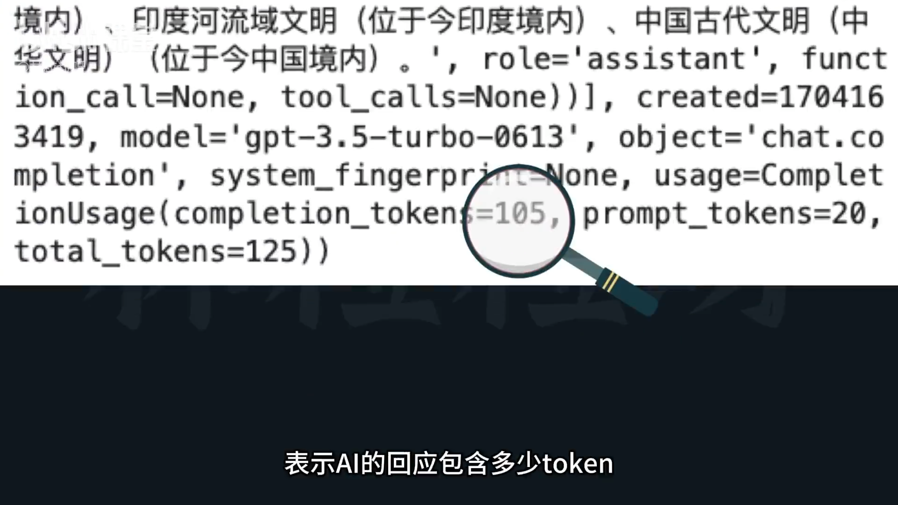

# 47-大模型API AI模型咋收费？必了解的token计数

## 一、AI 模型 API 的计费逻辑

- **核心计费方式**：基于 **token 数量** 计费。  
- 不同模型（如 GPT-3.5、GPT-4 等）价格差异较大；
- 常见的计费单位是每 **1000 个 token**。

---

## 二、什么是 Token？

- **Token 是文本的基本单位**；
- 根据语言和分词算法不同：
  - **英文**中短词通常一个 token；
  - **长单词**可能拆为多个 token；
  - **中文**中，一个字通常就是一个 token，有时 1 个字甚至会被拆分；
- 大致换算：  
  - 1 个 token ≈ 4 个英文字符；
  - 100 个 token ≈ 75 个单词。

**OpenAI分词网站** ：https://platform.openai.com/tokenizer

---

## 三、如何查看 Token 数量

1. **API 返回结构中的 usage 字段**：
   - `prompt_tokens`：输入提示所占的 token 数。
   - `completion_tokens`：AI 回复所占的 token 数。
   - `total_tokens`：两者之和，**计费依据**。


   
2. **示例**：  
   若一次调用中：
   - 提示词 = 200 tokens  
   - 输出 = 500 tokens  
   - 总计费基于 `700 tokens`。

---

## 四、常见模型价格对比（单位：美元）

| 模型 | 输入（每 1000 token） | 输出（每 1000 token） | 约人民币 |
|------|------------------------|------------------------|----------|
| GPT-3.5 Turbo | $0.001 | $0.002 | 输入约 ¥0.007，输出约 ¥0.014 |
| GPT-4 | $0.03 | $0.06 | 每 1000 token 约 ¥0.4 |

> 💡 **注意**：价格会随技术进步而持续下降。

---

## 五、计算 Token 数与估算成本

可以使用 **OpenAI 的官方分词工具 tiktoken**：

### 安装方式：
- 在 Jupyter 或终端输入：
  ```bash
  !pip install tiktoken
  ```
  （macOS 可能需使用 `pip3 install tiktoken`）

### 使用步骤：
1. 导入库：
   ```python
   import tiktoken
   ```
2. 获取指定模型的编码器：
   ```python
   encoder = tiktoken.encoding_for_model("gpt-3.5-turbo")
   ```
3. 将文本编码成 token 列表：
   ```python
   tokens = encoder.encode("你好，世界！")
   ```
4. 计算 token 数：
   ```python
   len(tokens)
   ```
5. **估算成本**：  
   ```
   总价 ≈ token 数 × 单价
   ```

> ⚠️ 实际请求中，模型会包含系统信息和角色元数据，故估算值与真实消耗略有出入。

---

## 六、控制输出长度与 Token 限制

- API 调用中，可以限制 AI 回复的最大 token 数，防止生成过长回复。
- 模型存在 **上下文窗口限制**（context window）：
  - 指模型一次能处理的 **最大 token 总数（输入 + 输出）**；
  - 超出后将导致 **文本被截断** 或 **响应不完整**。

![alt text] (image-15.png)

### 上下文窗口大小对比：

| 模型 | 上下文长度（token） |
|------|--------------------|
| GPT-3.5 Turbo | 4096 |
| GPT-3.5 Turbo 16K | 16,000 |
| GPT-4 | 8,192 |
| GPT-4-32K | 32,000 |
| GPT-4 128K（新） | 128,000 |

> 🚀 新版本支持的上下文更大，但价格会 **翻倍**。

---

## 七、总结要点

- Token 是 **计费与模型理解的最小单位**；
- **总计费依据 total_token（prompt + completion）**；
- 使用 **tiktoken 库**可事先估算成本；
- **上下文窗口限制** 会影响输入长度与回复完整性；
- **模型越新、上下文越大、价格越高**；
- 学会 **控制提示与回复长度** 是低成本调用的关键。

**链接**：https://platform.openai.com/docs/models

---