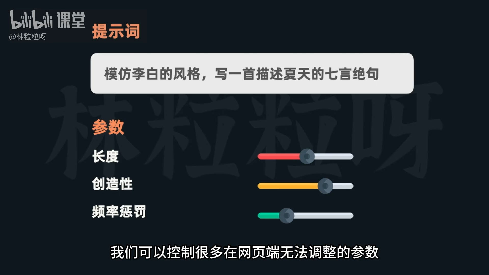
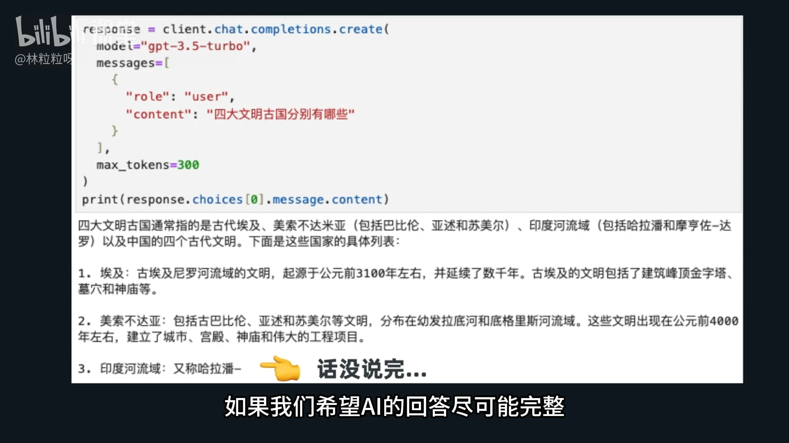
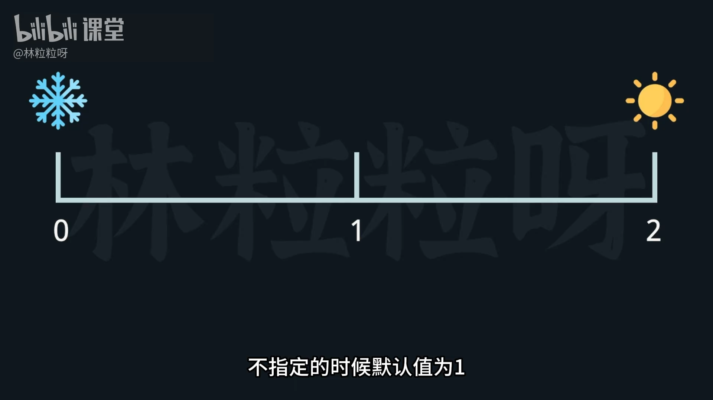
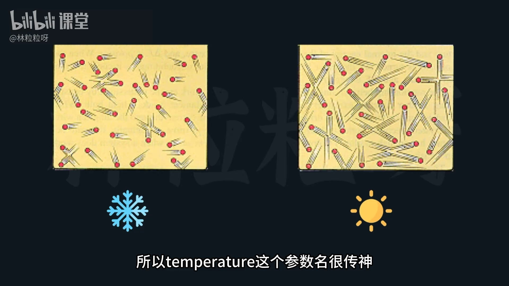
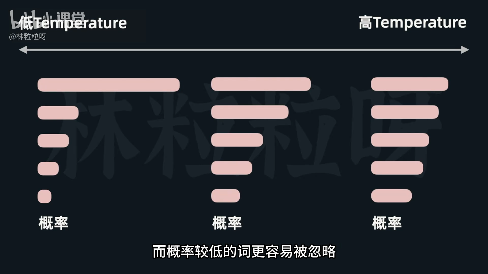
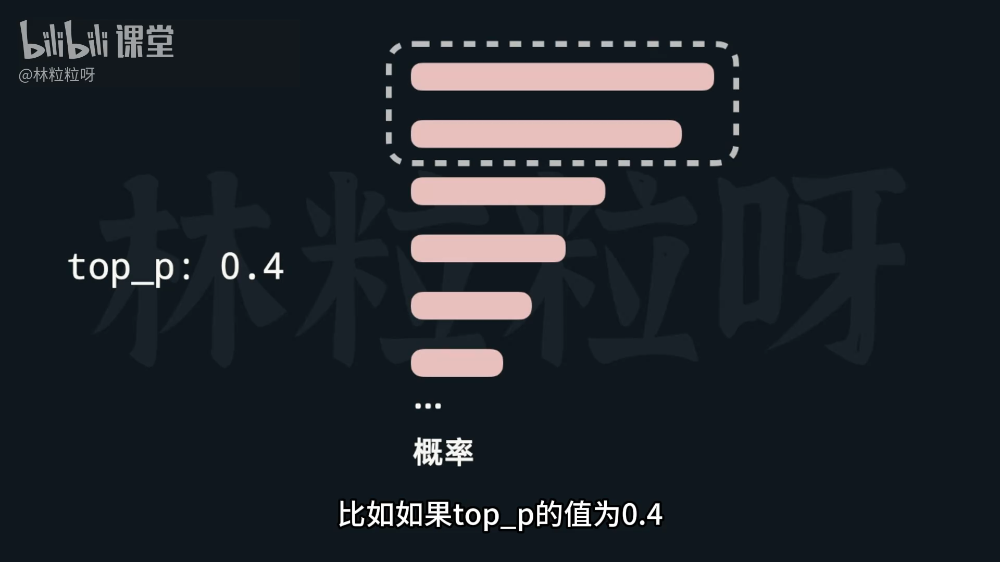
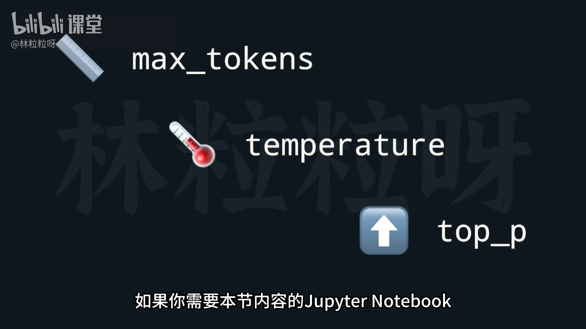

# 48-大模型API 定制AI的回复？常用参数详解

通过 API，可以调整多个网页端无法直接设置的参数，实现更灵活的定制化。这些参数不仅适用于 **GPT 系列模型**，也可用于大多数主流大模型（仅参数名称可能略有差异）。



---

## 🧮 基础参数
在创建聊天请求时，除了基本的 `model` 和 `messages` 参数，还可以设置以下常用参数：

### 1. `max_tokens`
- **作用**：限制生成回答最大 token 数。
- **用途**：
  - 控制单次请求的输出长度。
  - 限制成本上限（API 计费基于提示 + 回答的总 token 数）。
- **注意事项**：
  - 模型不会“自适应地”缩短回答，而是当达到 `max_tokens` 限制时**强制截断**。
  - 设置过小可能导致回答“说到一半就被截断”。
  - 若希望既完整又控制长度，可结合提示语：
    > “请在 500 字以内回答。”

```python
response = client.chat.completions.create(
    model="gpt-3.5-turbo",
    messages=[
        {
            "role": "user",
            "content": "四大文明古国分别有哪些"
        }
    ],
    max_tokens=300 # 控制回答所消耗的最大 token 数 
)
```

💡 **总结**：`max_tokens` = 回复硬性上限，用于**控制成本与篇幅**。

API 计费算的是提示和回答，加起来后的 tokens 数。提示的长度是我们自己能控制的，通过这个参数又可以控制回答的最大长度，所以相当于是让我们能控制每次请求的成本上限。

但需要注意的是，GPT 模型并不会根据这个参数来调整回复的篇幅，而是会直接在到达那个 token 数时进行截断。

如果这个数字小了，GPT 可能说到半截就回复了。比如： 



`max_tokens` 主要是起到强硬控制token数量上限的作用，即使 AI 本来想讲的话还没说完。

---

### 2. `temperature`
- **作用**：控制 AI 回复的随机性与创造性。
- **取值**：`0 ~ 2` （默认：`1`）
- **含义**：
  - 越低 ⇒ 输出越稳定、确定性强，每次回复的几乎一致。
  - 越高 ⇒ 输出越随机、创造性强。
- **极端情况**：
  - `temperature = 0`：模型几乎总选最可能的词，结果稳定但趋于机械。
  - `temperature = 2`：极高创造性，可能输出逻辑混乱甚至“外星文”。




🔬 **原理说明**：
- 改变的是**token 概率分布**：
  - 温度低 ⇒ 分布峰值高 → 高概率词权重更大 → 输出确定。
  - 温度高 ⇒ 分布更平坦 → 低概率词也可能被选中 → 输出更有创造性。
- 借用物理学“温度”概念：温度高，粒子运动快、随机性强。


 
💡 **总结**：  
`temperature` = “语气温度”，调节回答的**多样性与创造性**。

---

### 3. `top_p`（又称 nucleus sampling）
- **作用**：通过概率截断控制回答的创造性，与 `temperature` 类似。
- **取值**：`0 ~ 1`
- **机制**：
  - 不修改词的概率分布，而是**只保留**高概率词的子集。
  - 当这些词的累计概率 ≥ `top_p` 时停止截断。
- **举例**：
  - `top_p = 0.4` → 只考虑累计概率达到 0.4 的前几个高概率词。
  - `top_p = 1` → 使用完整词汇表（无截断）。


 
🧠 **组合建议**：
- 因为 `temperature` 与 `top_p` 都会影响随机性与创造性，**官方建议只调整其中一个**，不要同时修改。


---

## 🧭 参数配置建议
| 目标 | 推荐参数设置 |
|------|---------------|
| 保持稳定、一致性高 | `temperature = 0` 或较低值 |
| 创造性、发散思维 | `temperature = 1~1.5` 或 `top_p = 0.8` |
| 成本精确控制 | 使用合适的 `max_tokens` |
| 兼顾完整性与长度 | 在提示中设置“内容控制指令”，同时配合 `max_tokens` 上限 |

---

## 📘 小结
| 参数 | 控制维度 | 范围 | 默认值 | 主要功能 |
|------|------------|--------|------------|------------|
| `max_tokens` | 回答最大长度 | 整数 | 模型自动 | 控制成本与篇幅，硬限制输出 |
| `temperature` | 随机度 / 创造性 | 0–2 | 1 | 控制是否稳定或发散 |
| `top_p` | 概率截断比例 | 0–1 | 1 | 调整创造性，建议与 temperature 二选一 |

---

> 📦 **学习要点**：理解 `max_tokens`、`temperature`、`top_p` 三大核心参数的平衡，可定制 AI 的“性格”与“成本结构”。  
> 在实践中根据场景灵活组合，是高质量 Prompt 与 API 调用的关键。

