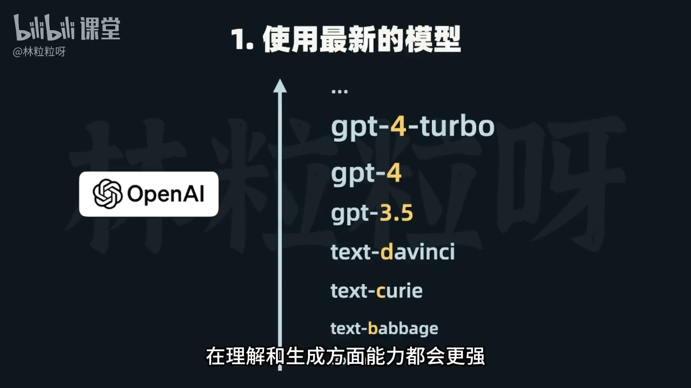
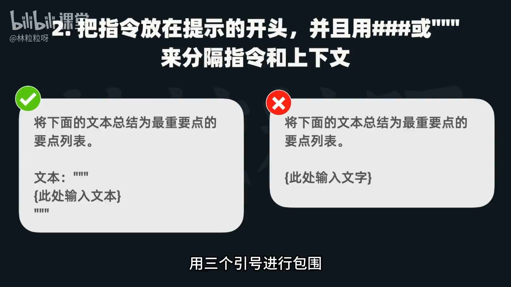
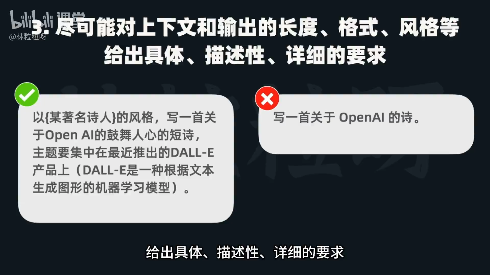
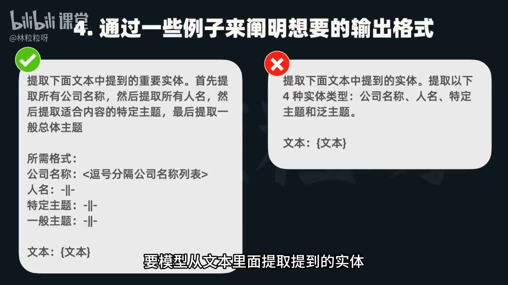
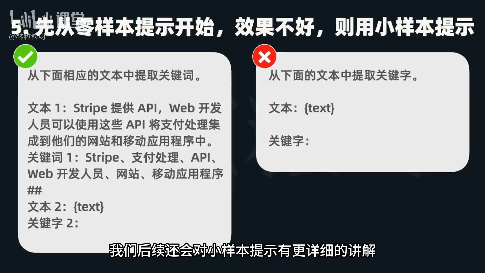
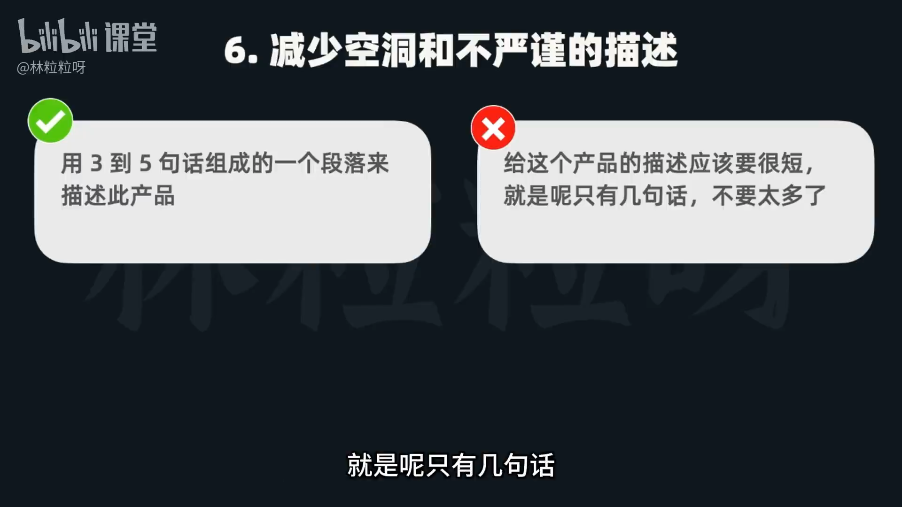
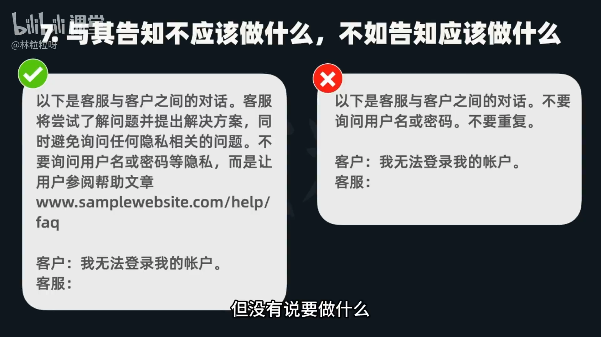
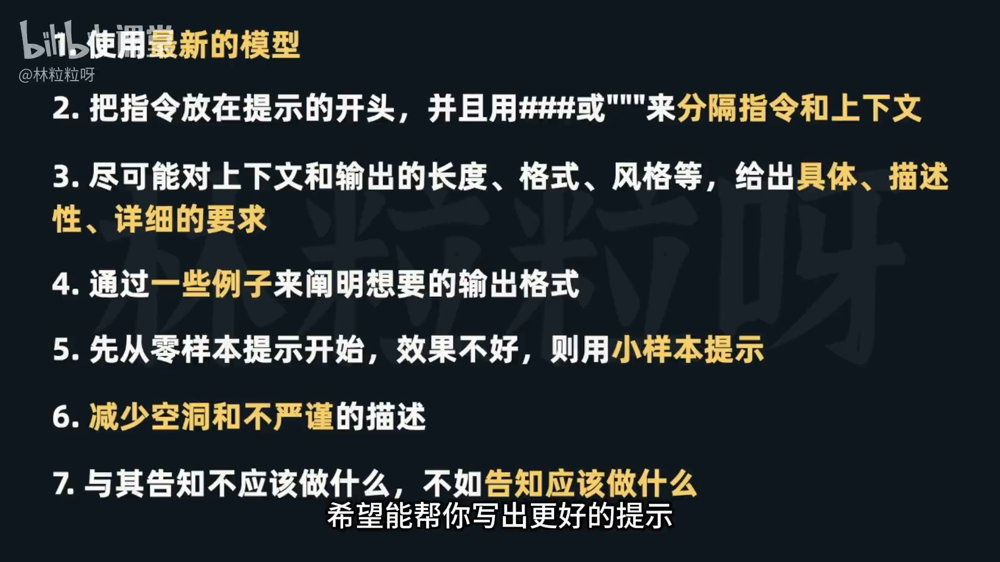

# 50-AI提示工程 什么构成了一个好的提示？

## 引言
- 提示（Prompt）是与大语言模型交流时输入的问题或指令，直接决定模型的理解与执行效果。
- 好的提示能显著提升模型的效率与回答质量。
- 提示工程的核心：开发与优化提示，以提升沟通质量与效率。
- OpenAI 官方给出了一系列“使用 API 进行提示工程”的最佳实践，以下为关键原则与示例。

---

## 原则 1：使用最新的模型
- 模型会持续迭代更新，越新的版本通常在理解与生成上更强。
- 选择最新模型通常带来更好效果，但需综合考虑 API 成本。



---

## 原则 2：把指令放在提示的开头，并用分隔符区分指令与上下文
- 将“要做什么”的指令放在首位，随后再给出上下文素材。
- 使用三个井号“###”或三个引号“"""”包裹上下文，帮助模型正确分辨。



示例：
```
你的任务：将下文要点以列表总结。

""" 
（这里粘贴要总结的文本）
"""
```

---

## 原则 3：尽可能具体地描述上下文与输出要求
- 明确长度、格式、风格、题材、主题等要素，减少歧义。
- 不佳示例：“写一首关于 OpenAI 的诗。”
- 较好示例：明确篇幅、体裁、风格、主题与主题阐释。 

示例：



---

## 原则 4：用示例阐明想要的输出格式（模板化）
- 仅给指令，输出可能“随心所欲”；给出“目标格式模板”更稳。
- 可规定字段、顺序、分隔符，便于后续解析。

示例（信息抽取模板）：



```
从下文中抽取实体：
- 公司：用逗号分隔
- 人名、特定主题、泛主题：各用“||”分隔

输出格式：
公司: A, B, C
人名: 张三||李四
特定主题: 强化学习||提示工程
泛主题: 技术||商业

文本：
"""
（这里粘贴原文）
"""
```

---

## 原则 5：先零样本（Zero-shot），效果不佳再用小样本（Few-shot）
- 默认不提供示例（零样本）即可尝试。
- 若结果与预期不符，追加少量高质量示例，示范目标风格与格式。

示例（小样本思路）：
```
示例1（输入→理想输出）
示例2（输入→理想输出）
现在请按同样规则处理以下输入：
...
```



---

## 原则 6：减少空洞与不严谨的描述
- 避免“要简短”“不要太多”这种模糊措辞。
- 直接给出明确、可执行的数量或结构要求。

不佳：
- “给这个产品做个很短的描述，就几句话，不要太多。”

更好：
```
请用3~5句话，组成一个段落，描述该产品的目标用户、核心价值与两个关键功能。
```



---

## 原则 7：与其告知“不该做什么”，不如明确“该做什么”
- 仅罗列禁令，模型可能无所适从；明确主要任务与正向行为更稳。
- 可指向帮助文档/流程，而非索取隐私。

不佳：
- “不要问客户用户名或密码；不要重复。”

更好：
```
你的主要任务：为用户提供产品入门指导与常见问题解答。
请先确认用户的使用场景与目标，然后根据帮助文档给出操作步骤链接与关键提示。
不要索取任何敏感信息（如用户名、密码）。
```



---

## 总结：七条原则清单
1. 使用最新模型，平衡效果与成本。
2. 指令置于开头，并用“###”或“"""”清晰分隔指令与上下文。
3. 具体描述长度、格式、风格、主题等输出要求。
4. 用示例/模板明确输出格式与分隔符，便于解析。
5. 先零样本；若偏差较大，再给少量高质量示例（小样本）。
6. 避免空泛表述，改用精确、可执行的要求。
7. 少说“不准做什么”，多说“应该做什么”，并明确主要任务与资源指引。


