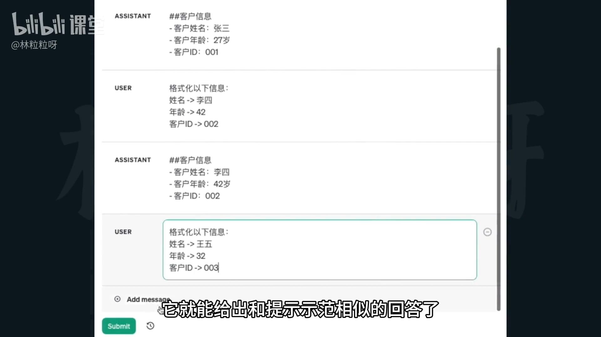
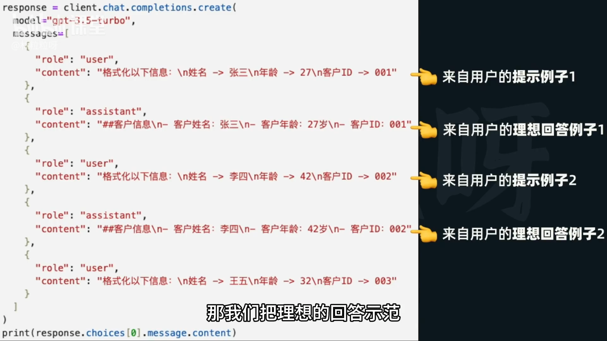

# 52-AI提示工程 零样本VS小样本

## 1. 背景与目标
- 目标：调教 AI 给出更符合预期的回答。
- 推荐办法：在提示工程中优先考虑“小样本提示”（Few-shot Prompting）。

## 2. 概念对比
- 零样本提示（Zero-shot）：直接给问题或指令，不提供任何示范。效果不稳定，常达不到期望。
- 小样本提示（Few-shot）：在正式提问前，提供少量示范对话或答案，引导模型沿着示范的知识与风格作答。



## 3. 小样本提示的工作机制
- 利用“上下文学习”能力：
  - 一方面：把示范内容当作临时“知识”记忆在上下文里。
  - 另一方面：模仿示范的表达、格式和风格进行回应。
- 结果：对相似问题，模型会给出与示范一致的答复风格与结构。

## 4. 实现方法（基于对话式 API 的 messages）
- 在调用 chat.completions.create 时，将若干轮示范对话放入 messages 参数中。
- 字段约定：
  - 用户消息使用 role: "user"
  - AI 回答使用 role: "assistant"
- 实操要点（示例设定）：
  - 示范回答输出为 Markdown 格式。
  - 内容包含固定字段项，如“客户姓名、客户年龄、客户ID”，并以 Markdown 列表呈现。
  - 这样后续 AI 的回答会自动沿用该格式与风格，减少额外说明。



示例结构范式（仅示意）：
```json
[
  { "role": "user", "content": "请根据如下信息输出客户摘要……" },
  { "role": "assistant", "content": "- 客户姓名：张三\n- 客户年龄：28\n- 客户ID：A123" },

  { "role": "user", "content": "再来一位客户的信息……" },
  { "role": "assistant", "content": "- 客户姓名：李四\n- 客户年龄：35\n- 客户ID：B456" },

  { "role": "user", "content": "新的客户信息……（让模型按以上风格继续）" }
]
```

## 5. 优势
- 快速适应新任务，无需对模型做任何训练或微调。
- 成本低、灵活度高。
- 能自然对齐输出格式与风格，减少繁琐指令。

## 6. 局限与注意
- 对于模型固有弱项（尤其是数学相关）帮助有限。
- 即使示范了正确结果，模型在实际计算时仍可能出错。
- 例：文中指出“所有举例的奇数相加”的正确结果应为 41，而不是 53，说明小样本并不能可靠修正算术能力。