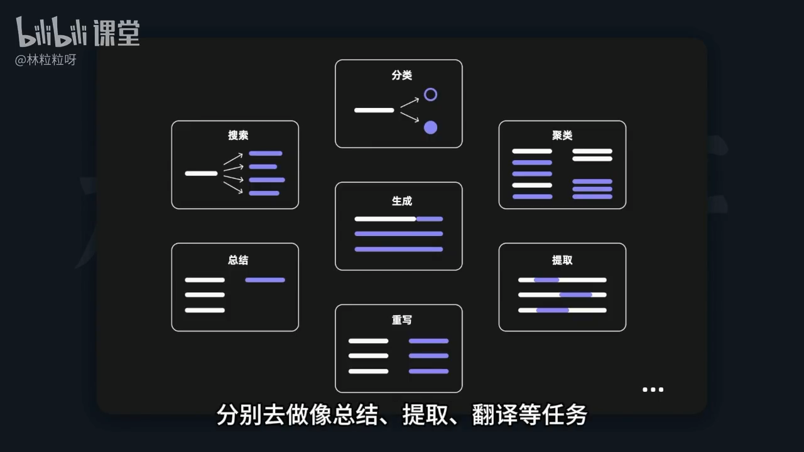

# 54-AI大模型API用法示例 文本总结：一建总结用户评价

## 1. 背景与目标
- 大模型可一体化完成总结、提取、翻译等多种任务，取代以往为每个任务单独训练模型的做法。
    - 搜索、总结、分类、生成、重写、聚类、提取
- 文本总结是典型用法：如视频总结生成器、会议纪要生成器等，通常流程是音频转文字后再用大模型做总结。
- 本节目标：用大模型 API 基于用户评价，总结产品的优缺点，服务电商产品洞察与营销决策。



## 2. 基础准备（代码组织思路）
- 从 OpenAI 库导入并创建客户端实例。
- 建议将 API Key 存在本机环境变量中，代码中无需手动传入。
- 为避免重复样板代码，封装一个通用函数，负责：
  - 接收：OpenAI 客户端实例、提示词 prompt、模型名（可不传，默认 gpt-3.5-turbo）。
  - 发送请求并提取 AI 响应的主要内容。
- 运行封装函数后，后续只需传 prompt 和可选模型名即可复用。

示意（伪代码，仅反映结构与参数约定）：
```python
def get_openai_response(client, prompt, model="gpt-3.5-turbo"):
    # 发送请求 -> 提取响应文本 -> 返回
    return response.choices[0].message.content
```

## 3. 业务场景设定
- 角色：电商部门负责人。
- 需求：基于用户评价洞察产品优劣势，用于：
  - 制定营销传播重点；
  - 指导产品改进方向。

## 4. 提示词（Prompt）设计要点
- 任务清晰：让模型对单条用户评价生成简要总结。
- 结构明确：输出分为两个方面——“优点”和“缺点”。
- 格式统一：以 Markdown 列表形式展示，便于后续复制与阅读。
- 上下文隔离：依据提示工程最佳实践，用三个井号包围上下文，区分“指令/要求”与“评价原文”。
- 插值方式：将用户评价文本通过 f-string 等方式格式化注入到 Prompt 中。

示例模板（可直接复用）：
```text
你是产品评价分析助手。请基于下面的单条用户评价，生成简要总结并严格按以下要求输出：
- 分为两个部分：优点、缺点
- 使用 Markdown 无序列表（- item）输出
- 仅依据用户评价本身，不要编造或外推

### 上下文开始
{用户评价文本}
### 上下文结束
```

将用户评价插入（示意）：
```python
product_review = "（这里放一条包含正反面信息的用户评价）"
product_review_prompt = f"""你是产品评价分析助手。请基于下面的单条用户评价，生成简要总结并严格按以下要求输出：
- 分为两个部分：优点、缺点
- 使用 Markdown 无序列表（- item）输出
- 仅依据用户评价本身，不要编造或外推

### 上下文开始
{product_review}
### 上下文结束
"""
```

## 5. 调用与输出展示
- 使用前面封装的函数发送请求，获取模型响应。
- 在 Jupyter 等环境中，直接“输出对象”常会显示原始换行符等控制字符；**为获得更美观的排版，建议使用 print 打印字符串**。

示意：
```python
response = get_openai_response(client, prompt)
print(response)  # 更美观
```

## 6. 批量处理思路
- 当有一系列用户评价时，用 for 循环逐条构造上述 Prompt，依次调用模型 API。
- 将每条的“优点/缺点”收集起来，便于后续统计与分析。

示意：
```python
summaries = []
for review in reviews:
    prompt = build_prompt(review)  # 复用上面的模板
    summaries.append(ask_ai(client, prompt))
```

## 7. 价值与延展应用
- 大规模总结后可进行统计分析：
  - 找出被用户频繁称赞的卖点（营销放大）。
  - 集中识别被反复吐槽的问题（产品改进）。
- 可抓取竞品的用户评价进行同样的总结，增强对市场与竞品的洞察。
- 文本总结适用场景广泛，鼓励探索更多能帮助自己或他人的用法。


# 函数参数的输入与输出要求

## 🧩 一、函数不一定必须有输入和输出

在 Python（或大多数语言）中，**函数可以有输入、输出，也可以没有**。
这取决于你希望它做什么。

| 情况        | 说明              | 示例                                   |
| --------- | --------------- | ------------------------------------ |
| ✅ 有输入、有输出 | 最常见，用于“计算”或“处理” | `def add(a, b): return a + b`        |
| ✅ 有输入、无输出 | 只执行动作，比如打印或保存   | `def greet(name): print("Hi", name)` |
| ✅ 无输入、有输出 | 例如返回当前时间        | `def now(): return datetime.now()`   |
| ✅ 无输入、无输出 | 比如仅打印一句话        | `def hello(): print("Hello!")`       |

---

## 🧩 二、你的函数的输入和输出

来看你这段代码：

```python
def get_openai_response(client, prompt, model="gpt-3.5-turbo"):
    response = client.chat.completions.create(
        model=model,
        messages=[{"role": "user", "content": prompt}],
    )
    return response.choices[0].message.content
```

### ✅ 输入参数（Input）

这个函数有 **3 个输入参数**：

| 参数名      | 作用                                | 示例                               |
| -------- | --------------------------------- | -------------------------------- |
| `client` | OpenAI 的客户端对象（必须）                 | `client = OpenAI(api_key="...")` |
| `prompt` | 你要发给模型的内容                         | `"写一首关于秋天的诗"`                    |
| `model`  | 要使用的模型名（可选，默认是 `"gpt-3.5-turbo"`） | `"gpt-4-turbo"`                  |

---

### ✅ 输出结果（Output）

```python
return response.choices[0].message.content
```

这行 `return` 就是**函数的输出**，即函数运行后的“结果”。
返回的内容是：

> 模型生成的回复文本（字符串类型）。

例如：

```python
>>> reply = get_openai_response(client, "你好，介绍一下你自己")
>>> print(reply)
我是一个由OpenAI训练的语言模型...
```

这里：

* 函数“输入”是一个问题 `"你好，介绍一下你自己"`；
* 函数“输出”是模型的回答文本。

---

## 🧩 三、小结

| 项目       | 内容                                      |
| -------- | --------------------------------------- |
| 是否必须有输入？ | ❌ 否，可以没有（如 `def hello(): print("hi")`）  |
| 是否必须有输出？ | ❌ 否，可以没有（如 `def save_to_db(data): ...`） |
| 本函数的输入   | `client`, `prompt`, `model`             |
| 本函数的输出   | 模型回复文本（`str` 类型）                        |

---

### 🔹 定义函数

```python
def hello():
    print("Hello!")
```

这段代码只是 **定义** 了一个函数，叫 `hello`。
此时 Python 只是“记住”它的名字和内容，但**不会执行里面的代码**。

---

### 🔹 调用函数（执行它）

要让它“真的说出 Hello!”，必须调用它：

```python
hello()
```

执行后输出：

```
Hello!
```

---

### 🔹 解释一下过程

| 步骤 | 动作   | 说明                           |
| -- | ---- | ---------------------------- |
| ①  | 定义函数 | Python 记住函数叫什么、里面要做什么        |
| ②  | 调用函数 | Python 执行函数体里的代码             |
| ③  | 打印结果 | `print("Hello!")` 会把文字输出到控制台 |

---

### 🔹 如果写成这样：

```python
def hello():
    print("Hello!")

result = hello()
print(result)
```

输出是：

```
Hello!
None
```

为什么会有 `None`？
因为这个函数里没有 `return`，所以它**没有返回值**。
在 Python 里，**没有返回值的函数默认返回 `None`**。

---

✅ **总结：**

* `def hello(): print("Hello!")` 是定义；
* `hello()` 是调用；
* 调用后会在屏幕上打印 `"Hello!"`；
* 但它不返回任何值（返回的是 `None`）。

---

# Python 中的函数参数顺序

## ✅ 一、能不能只传 3 个参数？

**要看函数定义时是否设置了“默认值”**。

比如：

```python
def greet(name, age, city, country="China"):
    print(f"{name} is {age} years old and lives in {city}, {country}.")
```

这个函数有 4 个参数，其中 `country` 有默认值 `"China"`。

👉 那么你可以：

```python
greet("Alice", 25, "Beijing")
```

✅ 输出：

```
Alice is 25 years old and lives in Beijing, China.
```

如果没有默认值，就**必须传入所有参数**，否则会报错：

```python
def greet(name, age, city, country):
    ...
```

再调用：

```python
greet("Alice", 25, "Beijing")
```

❌ 会报错：

```
TypeError: greet() missing 1 required positional argument: 'country'
```

---

## ✅ 二、参数顺序是否必须固定？

默认情况下——**位置参数是必须按顺序传的**。

比如：

```python
def add(a, b, c, d):
    print(a + b + c + d)

add(1, 2, 3, 4)  # 顺序必须是 a,b,c,d
```

但如果你用“**关键字参数（keyword arguments）**”，就可以**不按顺序传**：

```python
add(b=2, a=1, d=4, c=3)
```

✅ 结果仍然一样。

---

## ✅ 三、混合使用的规则

你可以混合用位置参数 + 关键字参数，但要遵守顺序：

* 位置参数必须在前面
* 关键字参数在后面

✅ 合法：

```python
add(1, 2, d=4, c=3)
```

❌ 不合法（位置参数在关键字参数后）：

```python
add(a=1, b=2, 3, 4)
```

会报错：

```
SyntaxError: positional argument follows keyword argument
```

---

## ✅ 四、小结记忆：

| 类型      | 是否必须传 | 顺序要求         |
| ------- | ----- | ------------ |
| 无默认值的参数 | 必须传   | 按定义顺序        |
| 有默认值的参数 | 可不传   | 可乱序，但推荐写明参数名 |
| 关键字参数   | 可乱序   | 使用参数名明确指代    |

---

# 🧩 Python 函数参数结构图
```
def func( a, b, c=10, *args, d, e=20, **kwargs ):
          │   │   │      │     │     │         │
          │   │   │      │     │     │         └── “关键字可变参数” → 接收任意数量的关键字参数，类型是 dict
          │   │   │      │     │     └── “关键字参数” → 必须写成 d=...、e=...
          │   │   │      │     └── 默认参数（有默认值）
          │   │   │      └── “可变参数” → 接收任意数量的位置参数，类型是 tuple
          │   │   └── 默认参数（有默认值）
          │   └── 位置参数（必须按顺序传）
          └── 位置参数（必须按顺序传）
```


