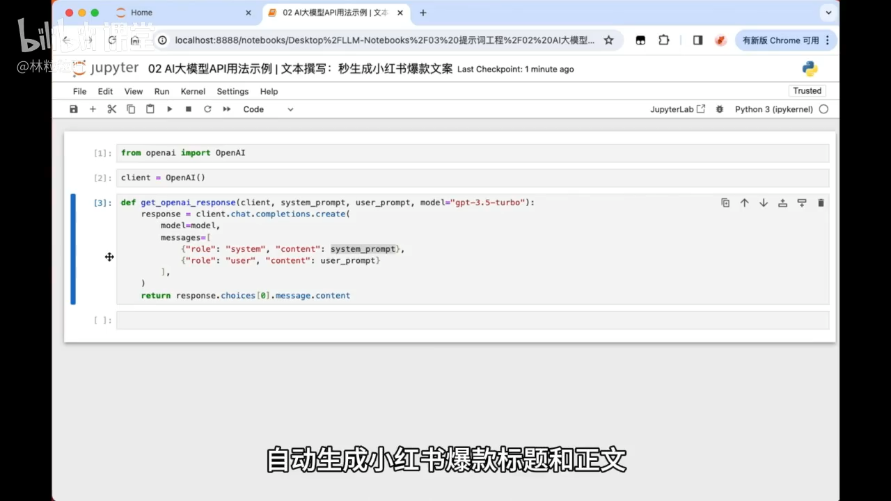

# 55-AI大模型API用法示例 文本撰写：秒生成小红书爆款文案

## 目标
- 学习用 AI 大模型的 API 进行文本撰写。
- 示例：根据主题自动生成“小红书风格”的爆款标题与正文。

## 使用场景
- 自动回复客户邮件
- 自动回复用户评论
- 自动生成产品文案

## 准备工作
- 导入所需库
- 实例化 OpenAI 客户端
- 基于上一节的“发送请求函数”做小改动：新增 `system prompt` 参数

## 关于 System Prompt（系统提示）
- 位置：消息的 role 为 `system`
- 用途：
  - 传递背景信息
  - 安排 AI 的人格/角色
  - 定义输出内容的规则
- 选用：可选（没有也能运行）



## 任务设定：生成小红书爆款文案
- 账号定位：某小红书账号运营
- 目标：根据给定主题，自动生成爆款标题和正文
- System prompt 设计要点：
  - 很长，包含一系列“爆款标题套路”
    - 例：短期内即可开挂、不做什么你绝对后悔等
  - 提供“爆款关键词”候选，让 AI 自行挑选
    - 例：好用到哭、宝藏、决绝子、等
- 提示工程最佳实践：明确“输出格式”
  - 避免每次输出结构不一致的问题

## 输出格式要求
- 每次根据主题：
  - 生成 5 个标题
  - 输出 1 段正文

## 调用流程与参数
- 参数1：实例化好的 OpenAI 客户端
- 参数2：系统提示（system prompt）
  - 本例不包含变量，因此无需字符串格式化
- 参数3：用户提示（user prompt）
  - 直接传入主题（示例主题：学英语）

## 运行与效果
- 运行后得到的标题“小红书味儿很冲”
- 文案质量较好，不容易看出是 AI 生成

## 经验总结
- AI 的能力很大程度取决于提示的质量
- 在提示中把要求定义清楚，AI 达成预期的概率更高

---

```python
model = ChatOpenAI(model="gemini-2.5-flash-preview-05-20",
                  openai_api_key = "<你的API密钥>",
                    openai_api_base = "http://xxx.xxx.xxx.xxx:8000/v1/")
response = model.invoke([
    system_prompt,
    human_prompt
])
```

---

# python中创建的对象，后面要加括号么？括号里要加东西么？

这取决于您创建的是**什么对象**。

在 Python 中，通常我们通过**调用**一个类（Class）来创建该类的一个**实例**（Instance），也就是一个对象。

### 1\. 创建对象的**基本形式**

创建对象时，类名后面**通常需要加括号**：

```python
class MyClass:
    pass

# 创建对象时，需要加括号
my_object = MyClass()
```

### 2\. 关于括号里是否需要加东西（参数）

括号里是否需要加东西，取决于这个类是如何**定义**的，特别是它的**初始化方法**（即 `__init__` 方法）：

#### a. **不需要加东西**（如果 `__init__` 方法不接受额外的参数）

如果类没有定义 `__init__` 方法，或者 `__init__` 方法只接受 `self` 一个参数（这是必须的），那么创建对象时括号里就不用放东西。

```python
class Dog:
    # 只有一个必需的 self 参数
    def __init__(self):
        print("A new dog is born!")
        self.name = "Unnamed"

# 创建对象：不需要参数
dog1 = Dog()  # 括号里为空
# Output: A new dog is born!
```

#### b. **需要加东西**（如果 `__init__` 方法接受额外的参数）

如果类的 `__init__` 方法被定义为接受除了 `self` 以外的其他参数，那么您在创建对象时就**必须**在括号内提供这些参数的值。这些参数用于初始化新创建对象的状态（属性）。

```python
class Cat:
    # 接受 name 和 age 两个参数
    def __init__(self, name, age):
        self.name = name
        self.age = age
        print(f"Cat {self.name} is {self.age} years old.")

# 创建对象：需要提供 name 和 age
cat1 = Cat("Mittens", 3)  # 括号里有参数
# Output: Cat Mittens is 3 years old.
```

### 总结

| 情况 | 代码示例 | 括号是否必须？ | 括号里是否需要参数？ |
| :--- | :--- | :--- | :--- |
| **创建类实例** | `obj = MyClass()` | **通常需要** | 取决于 `__init__` 方法的定义 |
| **引用函数/方法** | `my_func` | **不需要** | - |
| **调用函数/方法** | `my_func()` | **需要** | 取决于函数的定义 |
| **访问变量/属性** | `my_var` | **不需要** | - |

所以，对于您的问题：创建对象时，类名**后面通常要加括号**；括号里**是否需要加东西**（参数），**取决于该类的 `__init__` 方法的定义**。


# python中，实例的方法一定要加括号，实例的属性不需要加括号对么

是的，你的理解完全正确！

在 Python 中：

1.  **实例的方法 (Instance Methods) 一定要加括号 `()` 来调用。**
    *   当你在一个实例后面使用点 `.` 来访问一个方法时，你得到的是一个 "bound method" 对象，它是一个特殊的对象，记住了是哪个实例的方法。
    *   要执行这个方法中定义的代码，你需要在方法名后面加上 `()`。这些括号用于传递参数（如果方法需要的话），并告诉 Python "现在执行这个方法"。

2.  **实例的属性 (Instance Attributes) 不需要加括号 `()` 来访问。**
    *   当你在一个实例后面使用点 `.` 来访问一个属性时，你直接获取它存储的值。
    *   属性是数据，而不是可执行的代码，所以不需要 `()` 来"调用"它。


---

你好！很高兴为你这位“小白”朋友从头到尾详细解释这份LangChain代码。

这个代码笔记本的主题是“Prompt Template”（提示词模板），它的目的是让咱们和AI模型（比如ChatGPT这样的语言模型）交流时，**输入的文本（也就是你给AI的指令）变得更灵活、更方便管理和复用**。

想象一下你给AI模型发指令，每次都要手动写上“你是一个翻译，要把英语翻译成中文，风格是古文……”如果有很多不同的翻译任务，每次都手写会很麻烦，也容易出错。Prompt Template就是来解决这个问题的。

我们会一步步来看代码，并用大白话解释清楚。

---

### **大纲**

1.  **准备工作：导入工具 (Cell 1)**
2.  **构建基础提示词模板：System 和 Human 角色 (Cell 2-8)**
    *   System Prompt Template：设置AI的“人设”或“规则”。
    *   Human Prompt Template：设置用户输入的“内容”和“要求”。
    *   如何用数据填充模板。
3.  **调用大模型进行翻译 (Cell 9-11)**
4.  **批量处理：使用填充好的模板进行多次调用 (Cell 12-13)**
5.  **更简洁的方式：使用 `ChatPromptTemplate` 统一管理 (Cell 14-23)**
    *   将 System 和 Human 模板合并。
    *   更方便地填充和调用。

---

# **代码解释**

#### **第一部分：准备工作和构建基础提示词模板**

**Cell 1: 导入LangChain库中的Prmopt Template工具**

```python
from langchain.prompts import (
    SystemMessagePromptTemplate,
    AIMessagePromptTemplate,
    HumanMessagePromptTemplate,
)
```

*   `from langchain.prompts import ...`: 这行代码的意思是，我们要从一个叫做 `langchain.prompts` 的工具包里，导入几个专门用来创建“提示词模板”的工具。
*   `langchain` 是一个非常流行的框架，它帮助我们更容易地使用大型语言模型（LLM，比如GPT系列）。
*   `prompts` 模块就是用来处理我们给LLM的指令的。
*   `SystemMessagePromptTemplate`, `AIMessagePromptTemplate`, `HumanMessagePromptTemplate`:
    *   在与聊天型AI（比如ChatGPT）交流时，通常有不同的“角色”。
    *   `SystemMessagePromptTemplate`: 设定AI的“系统指令”，比如告诉AI它是什么角色（“你是一个翻译专家”），或者它应该遵循什么规则（“只输出中文翻译”）。这些指令通常在对话开始前就设定好，影响AI的整体行为。
    *   `HumanMessagePromptTemplate`: 代表用户的输入信息。比如用户问的问题、要翻译的文本。
    *   `AIMessagePromptTemplate`: 代表AI模型的回复。在这个例子中暂时没用到，但它用于构建包含AI历史回复的模板。
*   **总结**: 这一步是把我们后续要用到的“提示词模板”的类型先拉过来，方便使用。

<br/>

**Cell 2: 定义System角色的提示词模板**

```python
system_template_text="你是一位专业的翻译，能够将{input_language}翻译成{output_language}，并且输出文本会根据用户要求的任何语言风格进行调整。请只输出翻译后的文本，不要有任何其它内容。"
system_prompt_template = SystemMessagePromptTemplate.from_template(system_template_text)
```

*   `system_template_text`: 这是一个普通的Python字符串，但它有一个特殊之处：里面包含了 `{input_language}` 和 `{output_language}` 这样的花括号变量。
    *   **花括号变量**就是“占位符”。你可以把它们想象成一份表格中的空位，我们未来会用实际的语言名称（比如“英语”和“汉语”）来填充这些空位。
    *   这个文本就是给AI设定的“人设”和“规则”：它是一个专业的翻译，能把指定语言翻译到指定语言，还能调整风格，并且只输出翻译内容。
*   `system_prompt_template = SystemMessagePromptTemplate.from_template(system_template_text)`:
    *   这行代码用刚才定义的 `system_template_text` 字符串，创建了一个 `SystemMessagePromptTemplate` 对象。
    *   `from_template()` 是一个非常方便的方法，它接收一个带有占位符的字符串，然后自动把它转换成一个可用的模板对象。
*   **总结**: 我们创建了一个“系统模板”，这个模板定义了AI的职责和行为，并且预留了两种语言的占位符，以后方便我们替换。

<br/>

**Cell 3: 查看我们创建的系统提示词模板**

```python
system_prompt_template
```

*   当你直接输出一个LangChain的模板对象时，它会打印出它自己的详细信息。
*   输出结果 `SystemMessagePromptTemplate(prompt=PromptTemplate(input_variables=['input_language', 'output_language'], template='...'))` 告诉我们：
    *   这是一个 `SystemMessagePromptTemplate` 类型。
    *   它的内部有一个 `PromptTemplate` 对象。
    *   `input_variables` 清楚地列出了这个模板需要哪些变量来填充（`input_language` 和 `output_language`）。
    *   `template` 部分就是我们输入的原始模板字符串。
*   **总结**: 这步是验证我们创建的模板是否正确，并看到它自动识别了哪些变量需要填充。

<br/>

**Cell 4: 查看系统提示词模板需要哪些输入变量**

```python
system_prompt_template.input_variables
```

*   这行代码直接访问 `system_prompt_template` 对象的 `input_variables` 属性，直接列出需要填充的变量名。
*   输出 `['input_language', 'output_language']` 再次确认了这一点。
*   **总结**: 明确告诉我们，未来在使用这个模板时，需要提供 `input_language` 和 `output_language` 这两个值。

<br/>

**Cell 5: 定义Human角色的提示词模板**

```python
human_template_text="文本：{text}\n语言风格：{style}"
human_prompt_template = HumanMessagePromptTemplate.from_template(human_template_text)
```

*   `human_template_text`: 同样是一个带有占位符的字符串，这次是 `{text}`（要翻译的文本内容）和 `{style}`（用户要求的语言风格）。
    *   `\n` 表示换行，让格式更清晰。
*   `human_prompt_template = HumanMessagePromptTemplate.from_template(human_template_text)`: 用这个字符串创建了一个 `HumanMessagePromptTemplate` 对象。
*   **总结**: 我们创建了一个“用户模板”，这个模板定义了用户会提供哪些信息给AI，也预留了文本和风格的占位符。

<br/>

**Cell 6: 查看Human提示词模板需要哪些输入变量**

```python
human_prompt_template.input_variables
```

*   这行代码访问 `human_prompt_template` 的 `input_variables` 属性。
*   输出 `['style', 'text']`。
*   **总结**: 明确告诉我们，未来在使用这个模板时，需要提供 `style` 和 `text` 这两个值。

<br/>

**Cell 7: 填充System提示词模板，生成具体的System消息**

```python
system_prompt = system_prompt_template.format(input_language="英语", output_language="汉语")
system_prompt
```

*   `system_prompt_template.format(input_language="英语", output_language="汉语")`:
    *   这就是“给表格填空”的步骤。我们调用 `system_prompt_template` 的 `.format()` 方法，并传入具体的值来替换占位符。
    *   `input_language="英语"` 会替换掉模板中的 `{input_language}`。
    *   `output_language="汉语"` 会替换掉模板中的 `{output_language}`。
*   `system_prompt`: 这时候 `system_prompt` 不再是一个模板，而是一个**具体的 `SystemMessage` 对象**。
*   输出 `SystemMessage(content='你是一位专业的翻译，能够将英语翻译成汉语，并且输出文本会根据用户要求的任何语言风格进行调整。请只输出翻译后的文本，不要有任何其它内容。')`：可以看到，所有占位符都被填上了具体内容，变成了一条完整的、发送给AI的系统指令。
*   **总结**: 我们将之前定义的系统模板，填充了具体的语言信息，得到了一条AI可以理解的“系统指令”。

<br/>

**Cell 8: 填充Human提示词模板，生成具体的Human消息**

```python
human_prompt = human_prompt_template.format(text="I'm so hungry I could eat a horse", style="文言文")
human_prompt
```

*   `human_prompt_template.format(...)`: 类似地，我们填充 `human_prompt_template`。
    *   `text="I'm so hungry I could eat a horse"` 替换 `{text}`。
    *   `style="文言文"` 替换 `{style}`。
*   `human_prompt`: 这是一个**具体的 `HumanMessage` 对象**。
*   输出 `HumanMessage(content="文本：I'm so hungry I could eat a horse\n语言风格：文言文")`：占位符被填充，生成了一条完整的用户指令（要翻译的文本和要求的风格）。
*   **总结**: 我们将之前定义的用户模板，填充了具体的文本和风格信息，得到了一条AI可以理解的“用户指令”。

#### **第二部分：调用大模型进行翻译**

<br/>

**Cell 9: 导入OpenAI的聊天模型工具**

```python
from langchain_openai import ChatOpenAI
```

*   `from langchain_openai import ChatOpenAI`: 这行代码的意思是，从 `langchain_openai` 这个专门用于连接OpenAI服务的库中，导入 `ChatOpenAI` 这个类。
*   `ChatOpenAI`: 这个类封装了与OpenAI公司提供的聊天模型（比如GPT-3.5、GPT-4）进行交互的所有逻辑。通过它，我们就能把之前准备好的提示词发送给大模型，并接收它的回复。
*   **总结**: 这一步是获取和OpenAI聊天模型连接的工具。

<br/>

**Cell 10: 初始化模型并发送消息进行翻译**

```python
model = ChatOpenAI(model="gpt-3.5-turbo")
response = model.invoke([
    system_prompt,
    human_prompt
])
```

*   `model = ChatOpenAI(model="gpt-3.5-turbo")`:
    *   我们创建了一个 `ChatOpenAI` 的实例，并指定我们想使用的具体模型是 `"gpt-3.5-turbo"`。这是目前OpenAI推荐的用于聊天任务的模型之一，速度快且成本相对较低。
    *   **注意**: 在实际运行这段代码前，你需要确保已经设置了OpenAI的API Key。通常会设置成一个环境变量 `OPENAI_API_KEY`。
*   `response = model.invoke([system_prompt, human_prompt])`:
    *   `model.invoke()` 是向AI模型发送请求的核心方法。
    *   它接收一个**列表 (list)** 作为参数，这个列表里包含了我们所有要发送给模型的消息对象。
    *   消息的顺序很重要：通常 `SystemMessage` 在最前面设定规则，然后是 `HumanMessage` 提供用户输入。
    *   `response`: `invoke` 方法会返回一个包含AI模型回复的对象。
*   **总结**: 我们把之前准备好的系统指令和用户指令组装成一个列表，然后通过 `model.invoke()` 发送给GPT-3.5-turbo模型，等待它的翻译结果。

<br/>

**Cell 11: 打印模型的翻译结果**

```python
print(response.content)
```

*   `response.content`: `response` 对象里包含了AI模型返回的所有信息，其中 `content` 属性就是AI生成的实际文本内容（在这里就是翻译结果）。
*   输出 `吾飢甚，能食千里馬。`：这是GPT-3.5-turbo模型将“I'm so hungry I could eat a horse”根据“文言文”风格翻译成的结果。非常地道！
*   **总结**: 这一步是把AI模型翻译出来的内容提取并打印出来。

#### **第三部分：批量处理不同输入**

<br/>

**Cell 12: 准备一组不同的输入变量**

```python
input_variables = [
    {
        "input_language": "英语",
        "output_language": "汉语",
        "text": "I'm so hungry I could eat a horse",
        "style": "文言文"
    },
    {
        "input_language": "法语",
        "output_language": "英语",
        "text": "Je suis désolé pour ce que tu as fait",
        "style": "古英语"
    },
    {
        "input_language": "俄语",
        "output_language": "意大利语",
        "text": "Сегодня отличная погода",
        "style": "网络用语"
    },
    {
        "input_language": "韩语",
        "output_language": "日语",
        "text": "너 정말 짜증나",
        "style": "口语"
    }
]
```

*   `input_variables`: 这是一个Python的列表（`[...]`），列表的每个元素又是一个字典（`{...}`）。
*   每个字典都包含了一次翻译任务所需的所有信息：输入语言、输出语言、要翻译的文本、所需的语言风格。
*   **总结**: 我们准备了一些不同的翻译场景，这些数据将被用来批量生成并发送不同的提示词给AI模型。这正是“Prompt Template让模型的输入更灵活”的体现之一。

<br/>

**Cell 13: 循环处理，进行多次翻译**

```python
for input in input_variables:
    response = model.invoke([
        system_prompt_template.format(input_language=input["input_language"], output_language=input["output_language"]), 
        human_prompt_template.format(text=input["text"], style=input["style"])])
    print(response.content)
```

*   `for input in input_variables:`: 这是一个循环，它会遍历 `input_variables` 列表中的每一个字典。在每次循环中，当前的字典会被赋值给变量 `input`。
*   `system_prompt_template.format(...)`: 在每次循环中，我们都用当前 `input` 字典中的 `input_language` 和 `output_language` 来填充 `system_prompt_template`，生成一个针对本次翻译的系统指令。
*   `human_prompt_template.format(...)`: 同样，用当前 `input` 字典中的 `text` 和 `style` 来填充 `human_prompt_template`，生成一个针对本次翻译的用户指令。
*   `model.invoke([...])`: 将这两个动态生成的指令组成列表，发送给模型。
*   `print(response.content)`: 打印出本次翻译结果。
*   **总结**: 这段代码展示了Prompt Template的强大之处：我们可以通过一个循环，用不同的数据轻松地生成无数个不同的、格式统一的提示词，并调用AI模型，而不需要手动修改每次的提示词内容，大大提高了效率和灵活性。

#### **第四部分：更简洁的方式 `ChatPromptTemplate`**

前面我们分别创建了针对 `System` 和 `Human` 的两个模板。LangChain还提供了一种更方便的方式，可以把所有角色的模板信息整合到一个 `ChatPromptTemplate` 中。

<br/>

**Cell 14: 导入 `ChatPromptTemplate` 工具**

```python
from langchain.prompts import ChatPromptTemplate
```

*   `from langchain.prompts import ChatPromptTemplate`: 导入 `ChatPromptTemplate` 这个类。
*   `ChatPromptTemplate`: 这个类允许你一次性定义一个完整的对话流程（包括System、Human、甚至AI角色的消息），从而进一步简化提示词的管理。
*   **总结**: 引入一个“多合一”的提示词模板工具。

<br/>

**Cell 15: 使用 `ChatPromptTemplate` 整合所有模板**

```python
prompt_template = ChatPromptTemplate.from_messages(
    [
        ("system", "你是一位专业的翻译，能够将{input_language}翻译成{output_language}，并且输出文本会根据用户要求的任何语言风格进行调整。请只输出翻译后的文本，不要有任何其它内容。"),
        ("human", "文本：{text}\\n语言风格：{style}"),
    ]
)
```

*   `ChatPromptTemplate.from_messages(...)`: 这是创建 `ChatPromptTemplate` 对象的方法。
*   它接收一个**列表**，列表里的每个元素是一个**元组** `(角色名称, 模板字符串)`。
    *   `("system", "...")`: 定义了系统角色的模板字符串。
    *   `("human", "...")`: 定义了用户角色的模板字符串。
    *   这里的 `system` 和 `human` 就是预定义好的角色类型。
*   **总结**: 我们把之前两个独立的模板内容（系统指令和用户请求）集合到一起，用一个更紧凑的方式定义了一个完整的聊天提示词模板。

<br/>

**Cell 16: 查看整合后的提示词模板需要哪些输入变量**

```python
prompt_template.input_variables
```

*   `prompt_template.input_variables`: 访问新创建的 `prompt_template` 的 `input_variables` 属性。
*   输出 `['input_language', 'output_language', 'style', 'text']`。
*   **总结**: `ChatPromptTemplate` 自动识别并收集了它内部所有子模板中的占位符变量。现在，我们只需要在一个地方提供这些变量的值，就可以生成完整的提示词。

<br/>

**Cell 17: 填充整合后的提示词模板，生成具体的聊天消息列表**

```python
prompt_value = prompt_template.invoke({"input_language": "英语", "output_language": "汉语", 
                                       "text":"I'm so hungry I could eat a horse", "style": "文言文"})
prompt_value
```

*   `prompt_template.invoke({...})`: 注意这里用的是 `invoke` 方法，而不是 `format`。对于 `ChatPromptTemplate`，`invoke` 方法直接接收一个字典，这个字典包含了所有需要的变量值。
*   它会一次性处理所有内部的子模板，并生成一个包含所有角色的具体消息对象的列表。
*   `prompt_value`: `invoke` 方法返回一个 `ChatPromptValue` 对象。
*   输出 `ChatPromptValue(messages=[SystemMessage(...), HumanMessage(...)])`。
*   **总结**: 通过 `ChatPromptTemplate` 的 `invoke` 方法，我们用一个字典就把所有占位符填满，得到了一个包含系统消息和用户消息的完整消息列表。

<br/>

**Cell 18: 查看 `ChatPromptValue` 中的具体消息**

```python
prompt_value.messages
```

*   `prompt_value.messages`: 访问 `ChatPromptValue` 对象的 `messages` 属性，会得到一个标准的Python列表，里面包含了 `SystemMessage` 和 `HumanMessage` 对象。这正是 `model.invoke` 需要的格式。
*   **总结**: 确认 `ChatPromptTemplate` 确实帮我们生成了可以发送给模型的具体消息列表。

<br/>

**Cell 19 & 20 & 21: 使用整合后的模板调用模型并查看结果**

```python
model = ChatOpenAI(model="gpt-3.5-turbo")
response = model.invoke(prompt_value)
response
response.content
```

*   `model = ChatOpenAI(model="gpt-3.5-turbo")`: 再次初始化模型（或者可以直接用之前创建的 `model` 对象）。
*   `response = model.invoke(prompt_value)`: 关键在这里！ `model.invoke()` 可以直接接收 `ChatPromptValue` 对象，而不仅仅是消息列表。LangChain内部会自动处理 `ChatPromptValue` 到消息列表的转换。这让调用过程更加平滑。
*   `response` 和 `response.content`: 查看模型的回复和翻译内容。
*   输出 `AIMessage(content='吾飢甚，可食馬焉。')` 和 `'吾飢甚，可食馬焉。'`
*   **总结**: 证明了 `ChatPromptTemplate` 生成的 `ChatPromptValue` 可以直接用于调用大模型，简化了代码。

<br/>

**Cell 22: 再次准备一组不同的输入变量 (与Cell 12相同)**

```python
input_variables = [
    # ... (与上面Cell 12内容相同)
]
```

*   同Cell 12，用来进行批量测试。

<br/>

**Cell 23: 使用 `ChatPromptTemplate` 循环批量处理**

```python
for input in input_variables:
    response = model.invoke(prompt_template.invoke({"input_language": input["input_language"], "output_language": input["output_language"], 
                                                    "text":input["text"], "style": input["style"]}))
    print(response.content)
```

*   `for input in input_variables:`: 遍历每个翻译任务。
*   `prompt_template.invoke({...})`: 在每次循环中，用当前 `input` 字典中的所有变量一次性填充 `prompt_template`，生成一个 `ChatPromptValue` 对象。
*   `model.invoke(...)`: 将这个 `ChatPromptValue` 对象直接发送给模型。
*   `print(response.content)`: 打印翻译结果。
*   **总结**: 这是使用Prompt Template进行批量任务的最终、最简洁的形式。只需要一个 `ChatPromptTemplate` 对象和每次循环的数据字典，就能轻松实现多次模型调用，使得模型的输入管理和使用变得非常高效和灵活。

---

### **总结**

通过这个例子，你学会了：

1.  **Prompt Template 的作用**: 让AI模型的输入（提示词）变得更灵活、可复用，避免每次手动编写。
2.  **角色区分**: 大模型交互中，有 `System`（设定AI身份和规则），`Human`（用户的输入），`AI`（AI的回复）等不同角色。
3.  **占位符**: 使用 `{变量名}` 在模板字符串中定义空位，待后续填充具体内容。
4.  **`SystemMessagePromptTemplate` 和 `HumanMessagePromptTemplate`**: 分别创建系统和用户角色的提示词模板。
5.  **`.format()` 方法**: 用具体值填充单个提示词模板，生成一条完整的 `Message` 对象。
6.  **`ChatOpenAI`**: LangChain中用于连接OpenAI聊天模型的核心类。
7.  **`model.invoke()`**: 向LLM发送请求并获取回复的方法，可以接收消息对象列表。
8.  **`ChatPromptTemplate`**: 更高级的模板，可以一次性整合所有角色的模板信息，简化管理。
9.  **`ChatPromptTemplate.invoke()`**: 用于填充整合后的模板，返回 `ChatPromptValue` 对象，可以直接传给 `model.invoke()`。
10. **灵活性体现**: 通过列表和循环，展示了如何用Promopt Template轻松处理各种不同的输入场景。