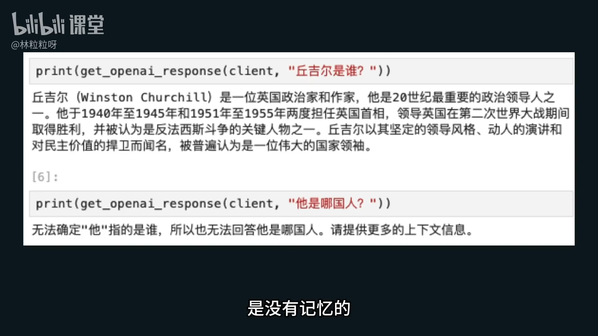
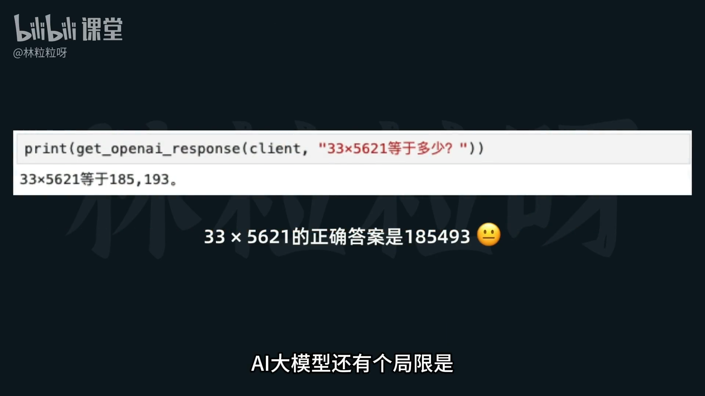
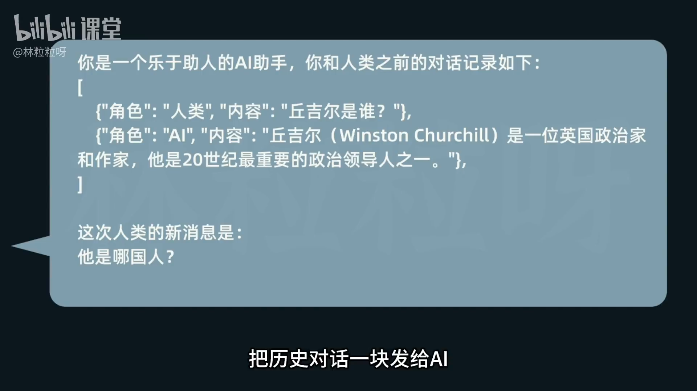
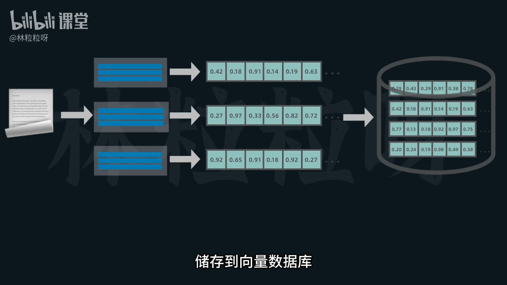
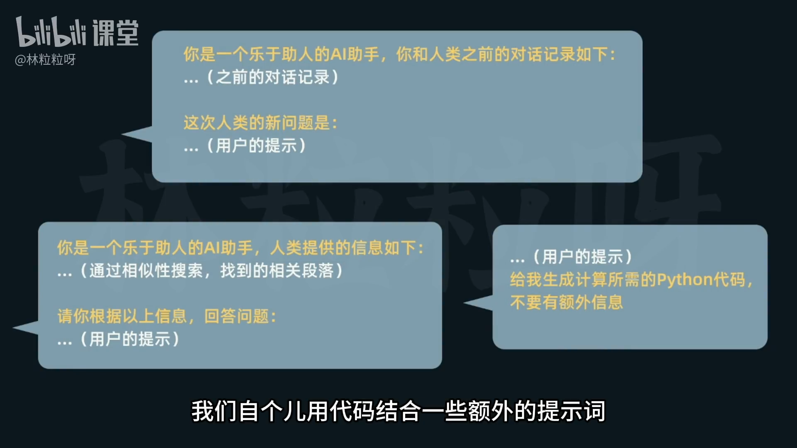
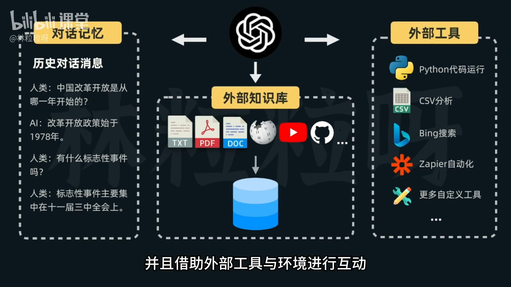
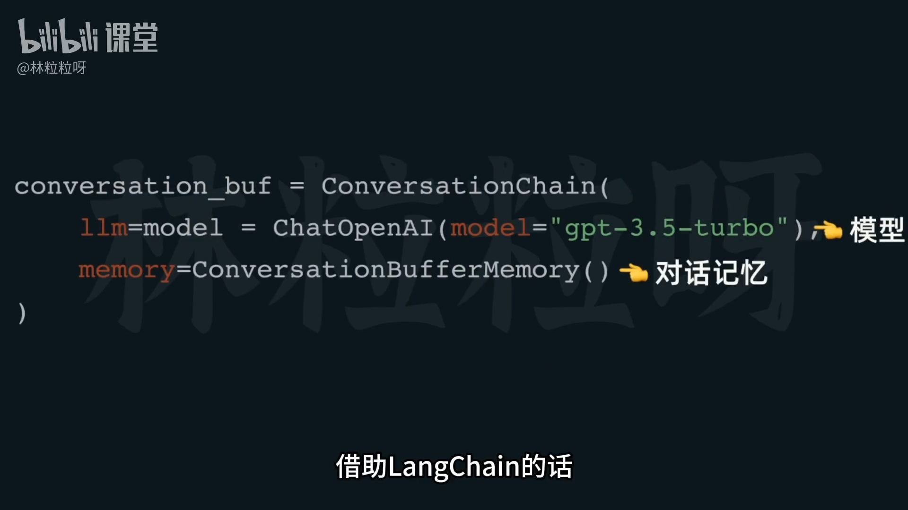
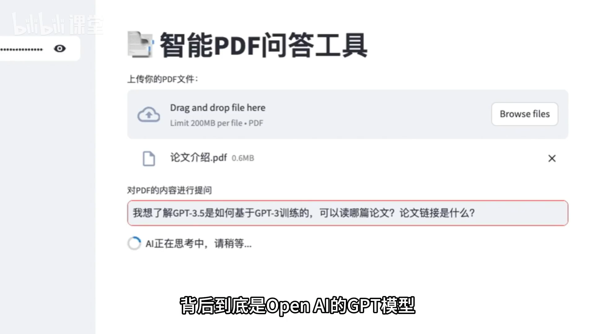
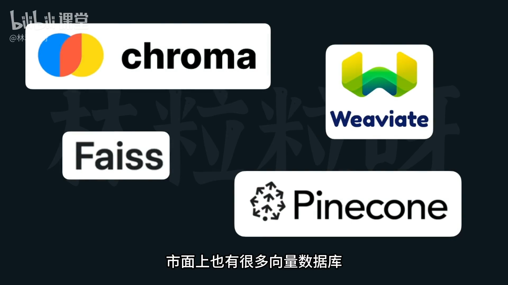
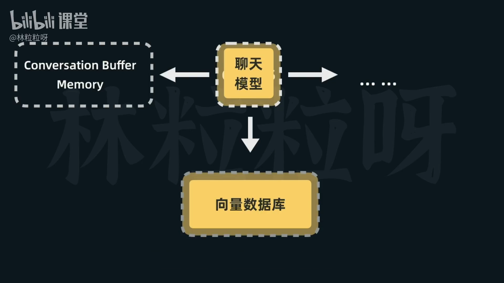

# 58-LangChain介绍 为什么我们需要LangChain？

## 背景与问题
- 仅调用大模型 API 并不足以构建“实用且完整”的 AI 应用，存在多种通用痛点：
  1) 无记忆：多轮对话中，后续问题缺少前文上下文，模型无法理解“他/它是谁”这类指代。
  2) 上下文窗口有限：外部知识量大（如 500 页文档）时，无法直接全部放入提示词中。大模型上下文窗口是有限的，超出上下文窗口内容就会被截断。
  3) 不擅长计算：模型是通过预测下一个 token 生成答案，可能给出错误的数值结果（如电商客服算错订单总额）。

 
## 朴素工程化应对（不用框架时的做法）
- 为“无记忆”问题：手动维护历史消息列表，每次请求把历史对话拼接到提示词中。
- 为“上下文窗口有限”：
  - 先将文档向量化、存入向量数据库；
  - 用户提问后做相似性检索，仅把相关段落随问题一并发给模型（RAG 思路）。
- 为“不擅长计算”：
  - 遇到数学/计算类问题，引导模型输出求解所需的代码；
  - 在外部真实执行这段代码，再把结果返回给用户。
- 痛点：实现繁琐、样板代码和提示词重复度高，跨项目难复用。

## 为什么需要 LangChain

  
- 目标：系统性减轻上述通用问题的实现负担，降低开发复杂度。
- 定位：用于支持大语言模型应用开发的框架。
- 能力主张：不仅仅调用模型 API，还要
  - 感知对话上下文（记忆）；
  - 连接外部数据源（长文档/知识库）；
  - 借助外部工具与环境进行互动（检索、执行代码、调用工具等），以生成更可靠的回答。

  
## LangChain 提供的组件与链（简化开发）
- Memory（记忆）
  - 例如：ConversationBufferMemory
  - 与模型实例一起作为对话链参数使用，每次对话自动追加历史消息并传给模型，实现“外接记忆”。
- Prompt 相关
  - 模型、提示模板（PromptTemplate 等），便于结构化管理提示词。
- 数据接入与检索
  - 文件加载器（Loaders）：从多种数据源读取文本。
  - 检索器与检索链（Retrievers/Chains）：封装相似性检索，将“只取相关段落”的 RAG 流程标准化。
- 其他链式组合
  - 将模型、记忆、检索、工具调用等以链的方式编排，降低样板代码与重复提示。
- Agent 等等

## 统一接口/抽象层的价值
- 为模型提供统一的聊天模型接口
  - 无论是 OpenAI GPT、百度文心、Anthropic Claude、阿里通义等，都可作为 ChatModel 使用；
  - 通过适配器式抽象，模型切换时仅需少量改动（多在导入与实例化处）。
- 统一的向量数据库接口
  - 市面向量库（如 Pinecone 等）可按需切换；
  - 除了导入/实例化的差异，其余业务代码变更较小。
- 带来的好处
  - 大幅提升开发灵活性；
  - 降低维护与升级成本；
  - 让应用对底层供应商差异更为“绝缘”。

 

 
## 小结
- 直接用模型 API 构建应用会遇到记忆、上下文、计算等通用难题；
- 可以用工程手段解决，但重复劳动多、维护成本高；
- LangChain 通过记忆、检索、提示模板、链式编排与统一抽象，系统性降低复杂度，让开发者更专注于产品逻辑与体验。
