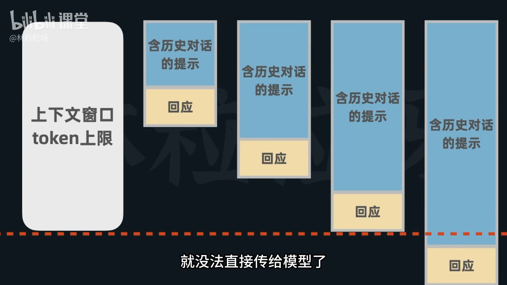
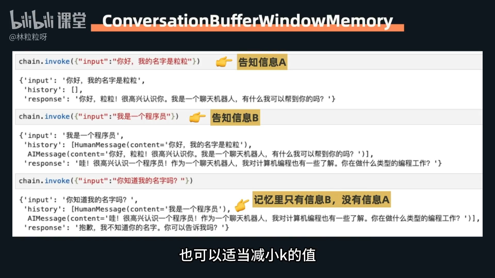
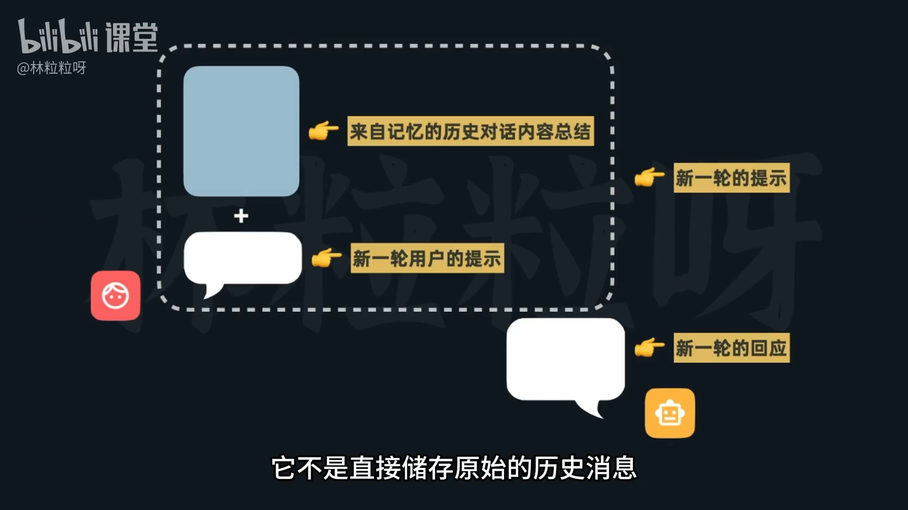
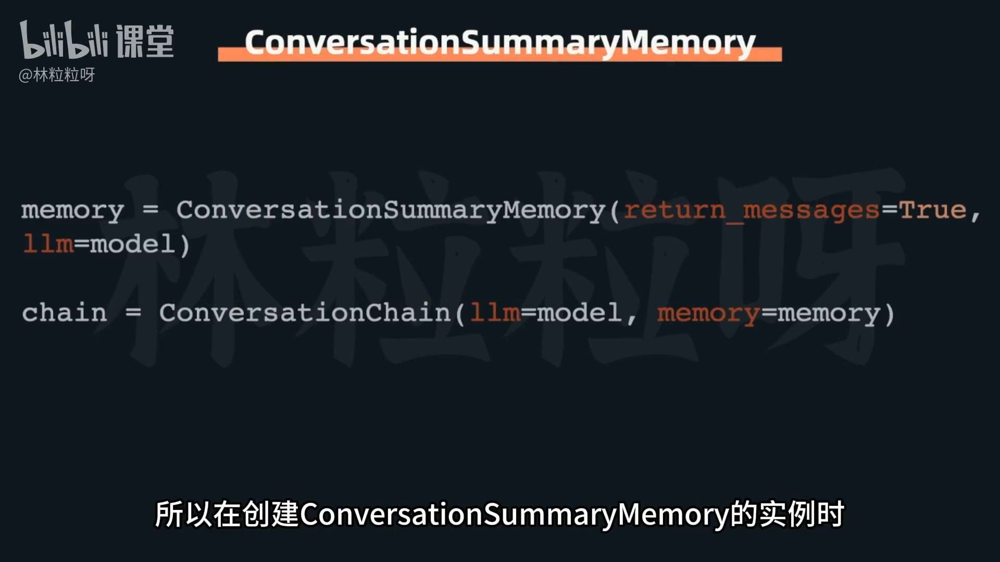
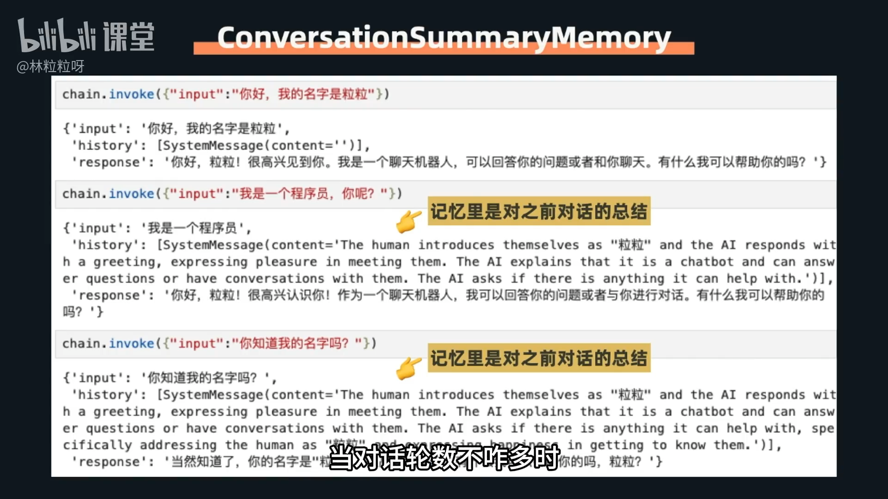
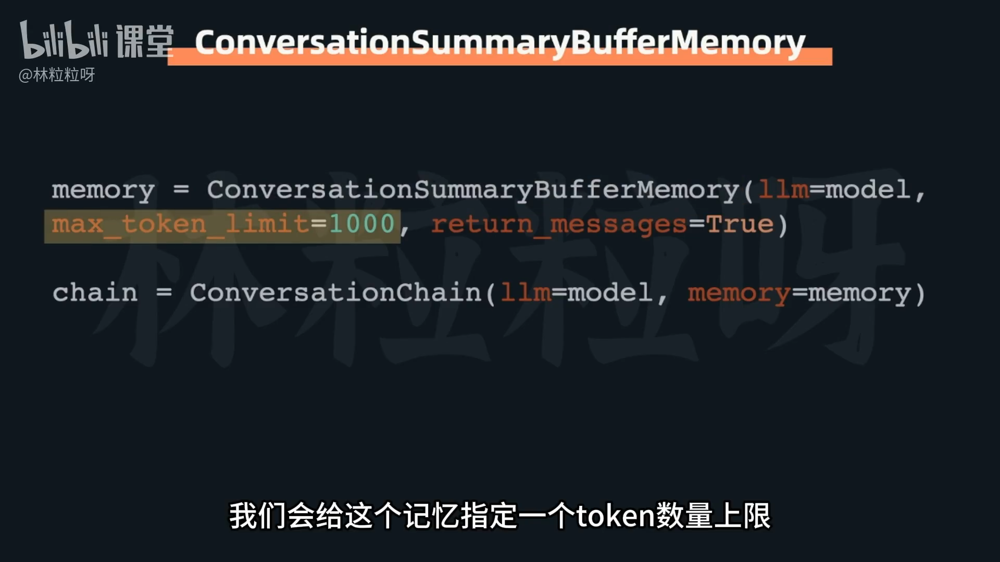
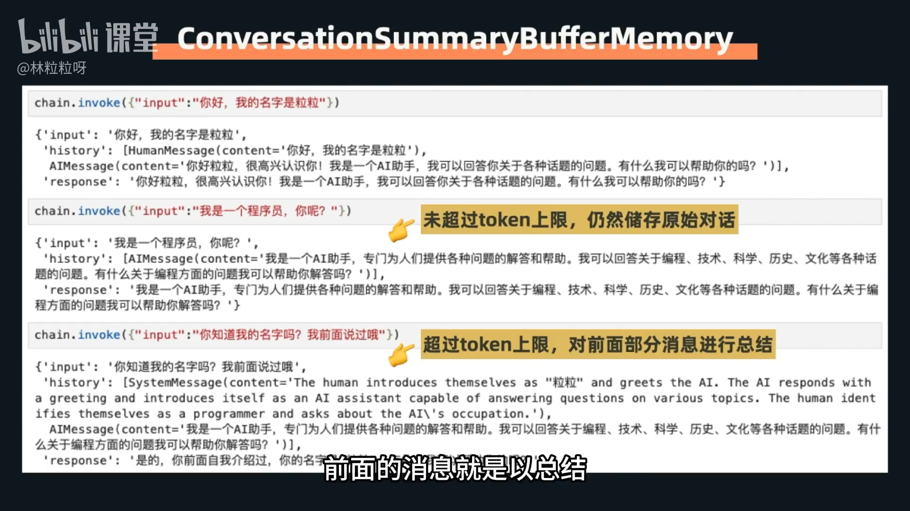
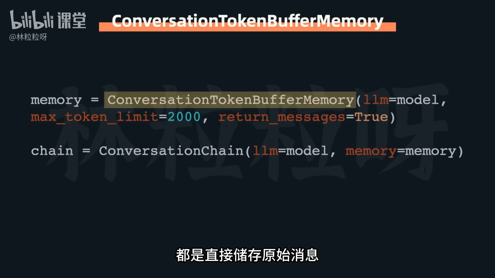

# 76-Memory 记忆咋还有不同类型？

在为大模型（LLM）添加记忆功能时，存在多种不同类型的记忆机制，每种都有其独特的优缺点和适用场景。

### 1. **Conversation Buffer Memory**
*   **核心机制：** 逐字不漏地存储对话中的所有消息。
*   **优点：**
    *   不存在任何信息遗漏。
    *   储存过程简单直接。
*   **缺点：**
    *   随着对话轮数增加，历史消息列表越来越长，消耗的 token 越来越多。
    *   消息长度一旦达到模型上下文窗口的 token 上限，需要手动截断。

### 2. **Conversation Buffer Window Memory**
*   **核心机制：** 储存记忆中最多 `k` 轮历史对话的数量。超出 `k` 轮的对话信息会被直接丢弃。
*   **关键参数：** `k` (窗口尺寸) - 表示最多储存的历史**对话数量**（人类和AI的一轮来回沟通）。
    *   例如，`k=1` 表示模型只记住上一轮对话。
*   **优点：**
    *   如果 `k` 值把握得当，可以控制记忆长度，避免挤爆上下文窗口，实现持续对话。
*   **缺点：**
    *   当对话轮数超过 `k` 时，早期的信息会**直接丢失**。
    *   如果每条消息非常长，即使 `k` 值较大，仍可能达到窗口上限，需要适当减小 `k`。

### 3. **Conversation Summary Memory**
*   **核心机制：** 不直接存储原始历史消息，而是对前面的对话内容进行**总结**，然后储存这个总结。
*   **关键参数：** `llm` - 用于执行总结任务的大语言模型。
*   **优点：**
    *   储存总结的长度可能比原始消息短，可以更晚达到上下文窗口上限。
    *   不会直接丢弃更早的信息，而是通过总结进行压缩储存。
*   **缺点：**
    *   总结过程中**有可能丢失一些细节**。
    *   总结任务本身需要消耗模型（`llm`）的计算资源和 **token**（特别是对话轮数不多时，总结可能比原始消息长）。

### 4. **Conversation Summary Buffer Memory**
*   **核心机制：** 结合了 `Conversation Summary Memory` 和 `Conversation Buffer Memory`。在消息较少时原封不动存储原始内容；当消息变多达到指定 token 上限后，开始总结**更久远**的消息，而**最近的消息仍保持原始内容**。
*   **关键参数：**
    *   `llm` - 用于执行总结任务的大语言模型。
    *   `max token limit` - 允许储存消息所占的 token 上限。
*   **优点：**
    *   不会直接丢弃更早的信息（通过总结压缩）。
    *   最近的消息以原始内容储存，模型能记住更多细节。
*   **缺点：**
    *   总结任务仍然需要消耗额外的 **token**。

### 5. **Conversation Token Buffer Memory**
*   **核心机制：** 直接储存原始消息，并根据**已储存消息的 token 数**进行管理。如果 token 数超过上限，会丢弃前面的消息，直到不超过上限。与 `Conversation Buffer Window Memory` 相似，但它关注的是 token 数而非对话轮数。
*   **优点：**
    *   非常实用，因为当前模型都有明确的上下文窗口，且窗口长度以 token 为单位计算。能有效根据 LLM 的实际限制来管理记忆。
*   **缺点：**
    *   达到 token 上限后，会**直接丢弃前面的原始消息**。

---

**总结：**
*   这五种记忆类型各有优劣势，应根据具体需求和场景选择最合适的记忆策略。
*   **Buffer Memory** 适合短期、对完整性要求高的对话。
*   **Window Memory** 和 **Token Buffer Memory** 适合需要控制记忆长度，但能接受部分信息直接丢失的场景。
*   **Summary Memory** 和 **Summary Buffer Memory** 适合希望在控制长度的同时，尽量不丢失早期信息（通过概括）的场景，但需要权衡总结带来的消耗和可能的细节损失。