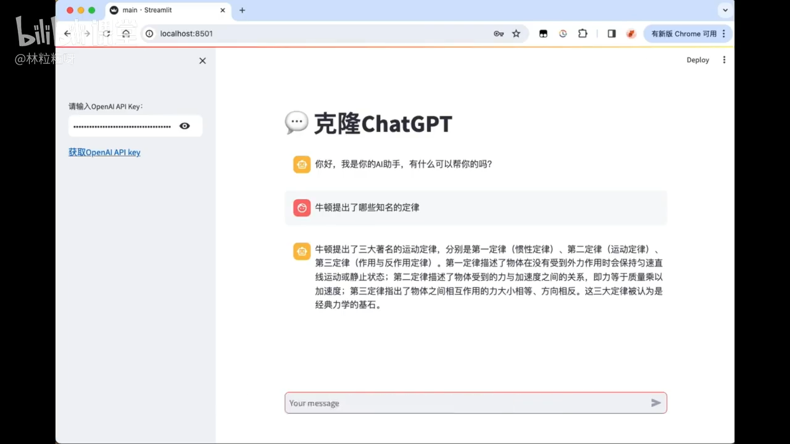

# 78-克隆AI聊天助手 项目介绍

### 1. 项目概述

*   **项目名称：** AI聊天助手 (Project 3)
*   **实现目标：** 制作一个仿照ChatGPT、文心一言等主流AI聊天工具的网站。
*   **核心功能：** 实现一个具备连续对话能力的AI聊天助手。

### 2. 用户界面 (UI) 特点

*   **侧边栏：** 网站最左侧保留一个侧边栏。
*   **API密钥输入：** 允许用户在侧边栏中提供自己的OpenAI API密钥以进行内容生成。
*   **密钥获取指导：** 附带可跳转的官方链接，方便用户了解如何获取OpenAI API密钥。
*   **交互逻辑：**
    *   若用户未提供API密钥，聊天功能将不开启，并提醒用户输入密钥。
    *   用户提供密钥后，即可开始与AI助手进行连续对话。

### 3. AI聊天功能与核心亮点

*   **连续对话：** 用户提出问题后，AI的回答会出现在提问下方；用户继续追问或AI的第二轮回答，也会依次显示在前面消息的下方。
*   **具备记忆能力（核心亮点）：**
    *   AI助手能够记住上下文，并在后续对话中利用这些记忆进行更准确的回答。
    *   **示例：** 在对话中，AI能识别出“第二定律”指的是“牛顿提出的第二定律”，表明其具备上下文理解能力。
*   **与前两个项目的对比：**
    *   前两个项目用户与大模型是“一次性互动”，每次互动之间独立，不存在关联。
    *   项目三的AI助手通过记忆功能，实现了各轮对话之间的关联性。

### 4. 技术实现（预告）

*   **实现难度：** 视频中指出，“要实现带记忆的对话并不难”。
*   **后续内容：** 具体代码实现细节将在下个视频中进行详细讲解。

---