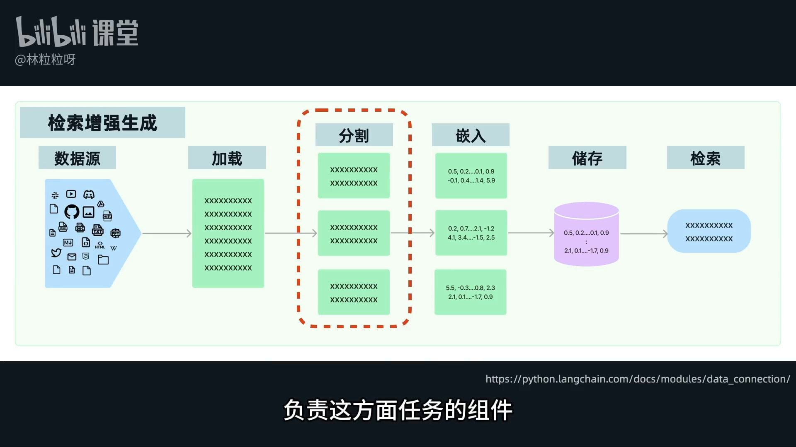
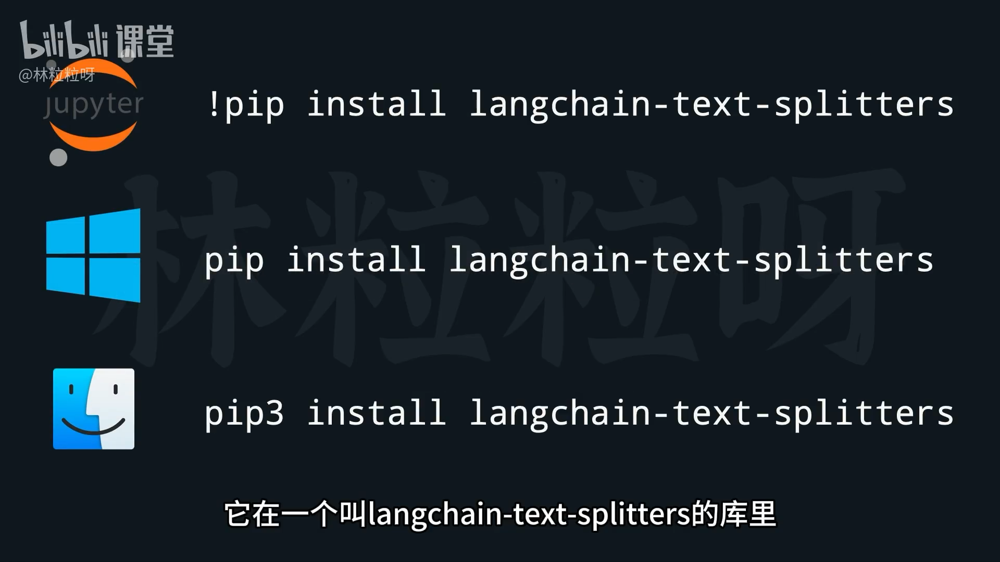
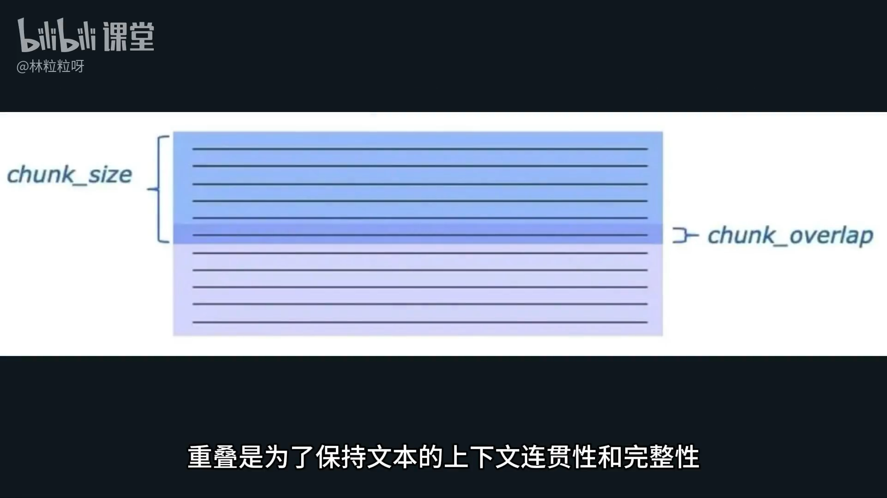
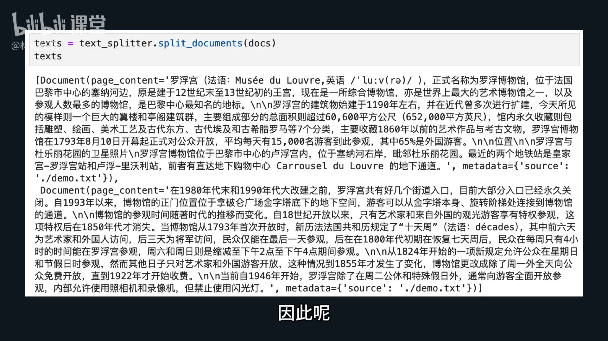

# 83-Text Splitter 上下文窗口有限？文本切成块

#### 1. 为什么需要文本分割器？

*   **问题核心：** AI 大语言模型 (LLM) 的**上下文窗口 (Context Window)** 是有限的。
*   **具体表现：** 无法将整篇超长文档（如一本书）一次性塞入AI的提示中，要求其根据内容作答。
*   **解决方案：** 先将长文档分割成可管理的**文本块 (Text Chunks)**，然后只选择相关的文本块送给AI。



#### 2. 什么是文本分割器 (Text Splitter)？

*   **作用：** LangChain 中的一个组件，负责将加载进来的长文档内容进行分割。
*   **关键考虑：**
    *   **分割长度：** 每块文本应该多长？
    *   **长度计算：** 如何准确计算文本块的长度？
    *   **可理解性：** 分割出的每个文本块都必须是AI能够独立理解的。避免将半句话或不完整的概念切分开。

#### 3. LangChain 中常用的分割器：RecursiveCharacterTextSplitter

*   **库位置：** 位于 `langchain-text-splitters` 库中，需要先安装 (`pip install langchain-text-splitters`)。
*   **特性：** 采用**递归字符分割**策略，根据指定的一系列字符 (`separators`) 尝试分割文本。
*   **举例：** 可以让它表示一句话结尾的符号进行分割，比如换行符、句号、感叹号等。

```python
# 安装
from langchain_community.document_loaders import TextLoader
from langchain_text_splitters import RecursiveCharacterTextSplitter
```


##### 3.1. 实例化参数

*   `chunk_size`：
    *   **含义：** 每块文本的**最大长度**。
    *   **目的：** 有效控制每个文本块的大小，使其符合上下文窗口的限制。
*   `chunk_overlap`：
    *   **含义：** 相邻文本块之间**重叠的长度**。
    *   **目的：** 保持文本的上下文连贯性和完整性。如果无重叠，相邻文本块可能丢失衔接信息，尤其当关键信息正好位于分界线时。
*   `separators`：
    *   **含义：** 一个**字符列表**，指定根据哪些字符进行分割。
    *   **优先级：** 列表中排在前面的字符会优先被选择来分割文本。
    *   **回退逻辑：** 如果使用当前分割符分割后，文本块仍然超过设定的 `chunk_size`，则会尝试列表中的下一个分割符，依此类推。
    *   **默认值 (未指定时)：** `["\n\n", "\n", " ", ""]` (即双换行符 -> 单换行符 -> 空格 -> 空字符串)。
        *   `""` (空字符串) 相当于在任何地方都可以分割，作为最后的手段。

```python
# 举例
text_splitter = RecursiveCharacterTextSplitter(
    chunk_size=500,
    chunk_overlap=40,
    separators=["\n\n", "\n", "。", "！", "？", "，", "、", ""]
)
```



##### 3.2. 中文 `separators` 建议

*   **原因：** 默认 `separators` 中包含空格，不一定适合中文文本的语义分割。
*   **建议列表示例：**
    ```python
    # 优先根据表示句子结束的符号分割，再是句中符号
    separators=["\n\n", "\n", "。", "！", "？", "，", "、", ""]
    ```
    *   **逻辑：**
        1.  先尝试双换行符 (\n\n)
        2.  再尝试单换行符 (\n)
        3.  然后是句号 (。)、感叹号 (！)、问号 (?) 等句子结束符
        4.  接着是逗号 (，)、顿号 (、) 等句中标点符号
        5.  最后是空字符串 ("")，作为无计可施时的通用分割方式

##### 3.3. 使用方法 (`split_documents` 方法)

*   **功能：** 将已加载的 `Document` 对象列表进行分割。
*   **调用：** 实例化 `RecursiveCharacterTextSplitter` 后，调用其 `split_documents(documents)` 方法。
*   **输入：** 由 `Document` 对象组成的列表 (通常是 `Document Loader` 的输出)。
*   **输出：** 仍然是一个 `Document` 对象列表。但此时，每个 `Document` 的 `page_content` 长度已被控制在 `chunk_size` 范围内。

    ```python
    from langchain_text_splitters import RecursiveCharacterTextSplitter

    # 假设 documents 是 Document Loader 加载出的 Document 对象列表
  
    text_splitter = RecursiveCharacterTextSplitter(
        chunk_size=500, # 每个文本块最大长度
        chunk_overlap=50, # 文本块之间重叠长度
        separators=["\n\n", "\n", "。", "！", "？", "，", "、", ""] # 适用于中文的分割符列表
    )

    split_documents = text_splitter.split_documents(documents)

    # 此时，split_documents 中的每个 Document 的 page_content 都不超过 500 个字符
    ```



#### 4. 下一步骤

*   **嵌入 (Embedding)：** 将分割后的每个文本块 (Text Chunk) 转换成向量表示，以便进行存储和检索。

---