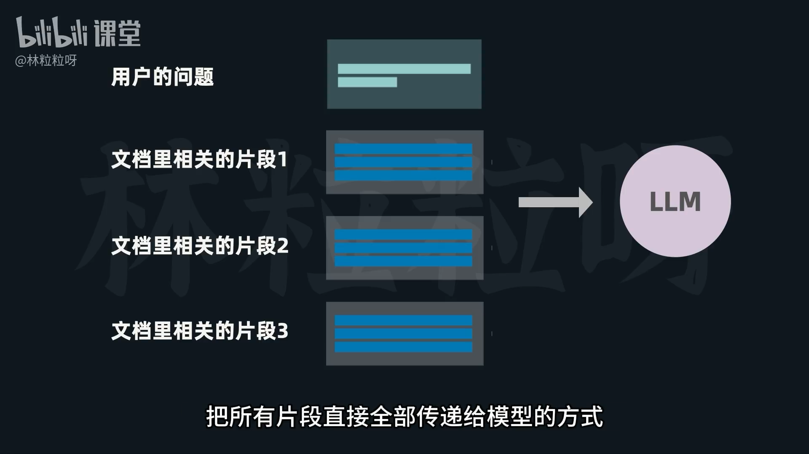
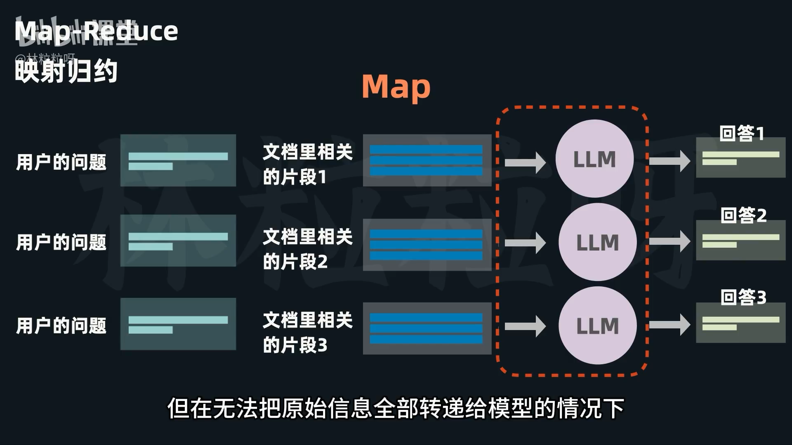
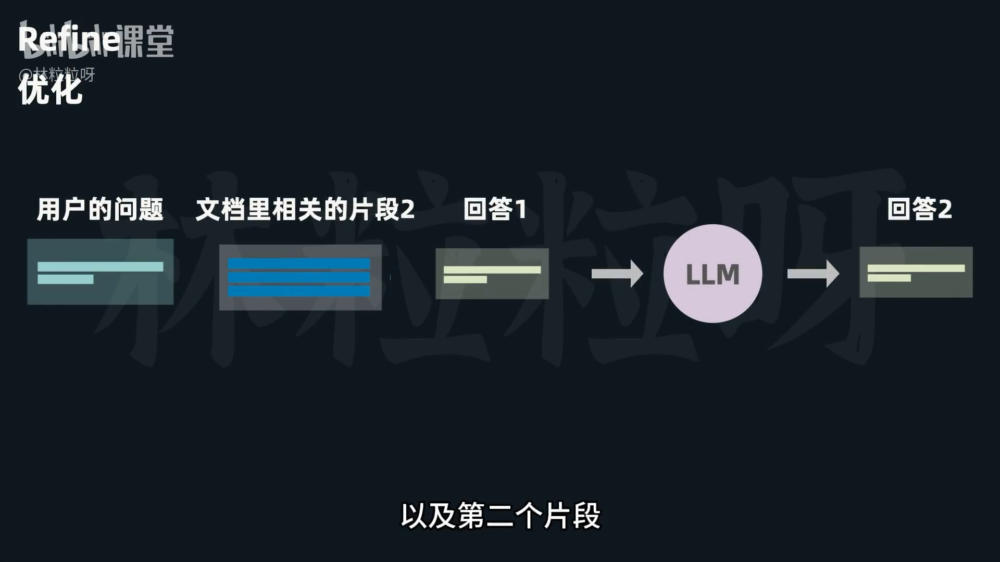
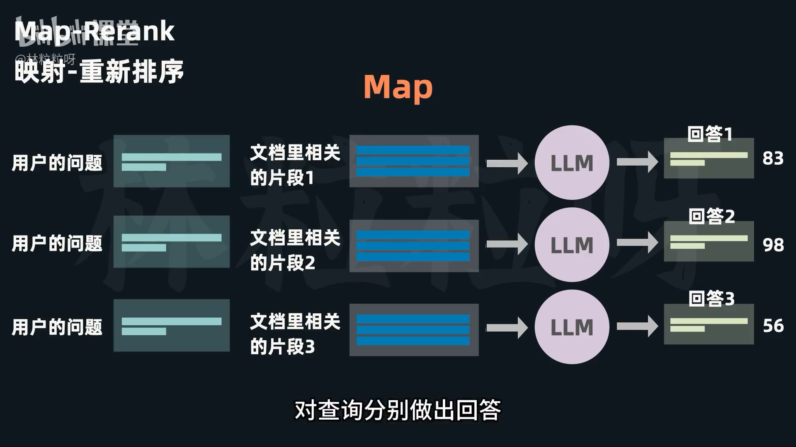
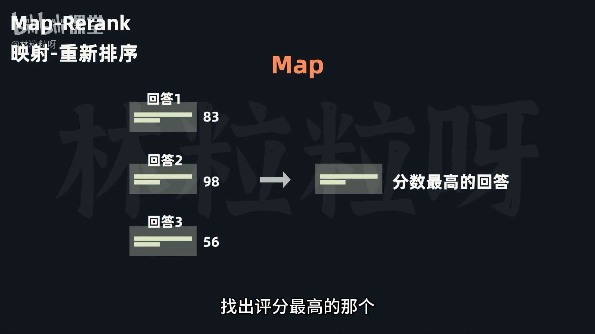
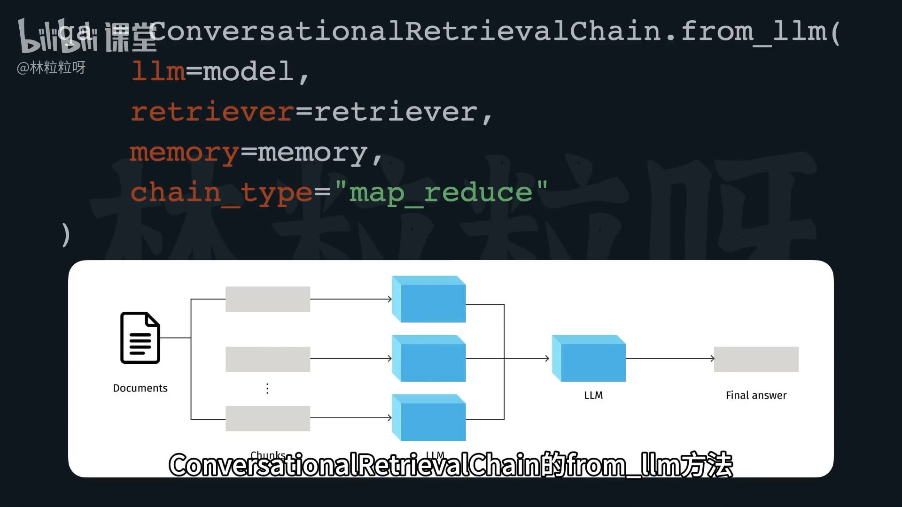
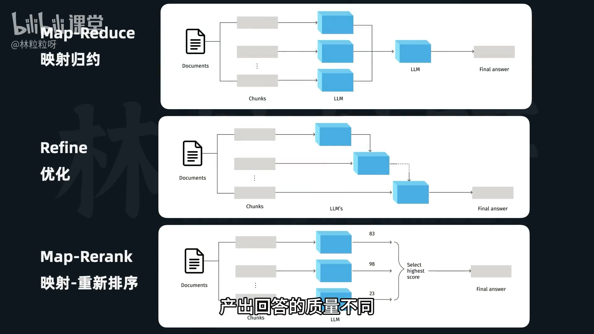

# 87-Documents Chain 把外部文档塞给模型的不同方式

对应《Retrieval Chain   开箱即用的检索增强对话链》

详细介绍了在检索增强生成（RAG）中，将检索到的文档片段（documents）传递给大语言模型（LLM）的几种不同策略。这些策略主要用于解决检索片段过多或过长导致超出LLM上下文窗口限制的问题。



#### **一、 共同背景：文档传递策略（Chain Types）**

*   **问题：** 检索器找到的相关文本片段（documents）可能过长或数量过多，直接全部塞给模型会超出上下文窗口限制。
*   **解决方案：** 采取不同的文档传递策略，处理这些片段。

#### **二、 核心文档传递策略（Chain Types）**

目前主要有四种策略：

1.  **Stuff (填充/直接传递) - 默认方式**
    *   **原理：** 将所有相关文本片段一次性全部拼接起来，直接传递给模型。
    *   **优点：**
        *   最简单直接，易于理解。
        *   模型可以一次性看到所有相关信息。
    *   **缺点：**
        *   当片段很长或相关片段很多时，容易超出模型的上下文窗口限制。
    *   **适用场景：** 相关片段数量少且总长度在模型上下文窗口内。

2.  **Map Reduce (映射规约)**
    *   **原理：** 分为 `map` 和 `reduce` 两个阶段。
        *   **Map 阶段：** 每个相关片段单独传递给模型，让模型根据各自片段分别对查询做出回答（生成多个版本回答）。
        *   **Reduce 阶段：** 将前面得到的多个回答整合起来，形成一个统一的信息合集，作为输入传递给模型，模型再基于此给出最终的、连贯的、结合多方面信息的回答。
    *   **优点：**
        *   有效融合来自多个来源的信息，即使原始信息无法一次性全部传递。
        *   适合处理复杂的、需要广泛背景知识的查询。
    *   **缺点：**
        *   调用模型的次数较多（主要在 `map` 阶段），成本和时间开销增加。
    *   **适用场景：** 信息量大，需要整合多方面信息，且无法一次性塞给模型的情况。


 
3.  **Refine (优化)**
    *   **原理：** 迭代优化回答。
        *   首先，模型基于第一个片段对查询做出回答。
        *   然后，将**已有的回答 + 查询 + 第二个片段**一起传递给模型，让模型对回答进行优化。
        *   重复以上步骤，每次结合下一个片段对已有回答进行优化，直到处理完所有片段。
    *   **优点：**
        *   模型会根据新信息不断提高最终回答的质量和准确性。
    *   **缺点：**
        *   调用模型的次数较多，成本和时间开销增加。
    *   **适用场景：** 逐步积累信息，对回答质量和细节要求较高，且信息具有顺序或递进关系的情况。



4.  **Map Rank (映射排序)**
    *   **原理：** 分为 `map` 和 `rank` 两个阶段。
        *   **Map 阶段：** 与 `Map Reduce` 的 `map` 阶段类似，每个片段单独传递给模型，让模型根据各自片段对查询做出回答，**同时要求模型评估该片段对生成准确回答的贡献度并打分**。
        *   **Rank 阶段：** 系统根据相关性得分找出评分最高的那个（通常是包含最相关信息的片段），以此作为最终的回答。
    *   **优点：**
        *   能解决文档片段过多/过长的问题。
        *   能够快速找出最相关的单一答案片段。
    *   **缺点：**
        *   **不会整合不同片段之间的信息。**
        *   不适合需要融合广泛背景知识的查询（因为只选择一个最佳答案）。
    *   **适用场景：** 只需要一个最相关的答案，或者文档中存在明确的“黄金答案”的情况。



 
#### **三、 如何在代码中选择策略**

*   **位置：** 在使用 `ConversationalRetrievalChain.from_llm()` 方法创建链时。
*   **参数：** 额外给 `chain_type` 参数赋值。
    *   `chain_type='stuff'` (默认值)
    *   `chain_type='map_reduce'`
    *   `chain_type='refine'`
    *   `chain_type='map_rank'`
*   **选择依据：**
    *   文档和查询的特点。
    *   期望的回答质量。
    *   时间和价格成本。
    *   需要根据具体情况进行测试和选择。



---

# 解释代码

它演示了**如何让大模型（比如ChatGPT）学习并回答你提供的特定文档内容，并且展示了几种不同的处理文档的方法**。

想象一下，你有一本非常厚的书，你想让一个聪明的朋友（大模型）根据这本书里的内容来回答你的问题。但你的朋友记性有限（大模型有输入长度限制），不能一次性读完整本书，而且他处理信息的方式也有几种选择。这个代码就是模拟了这个过程。

---

### 整体流程概览

在详细解释代码之前，先了解一下大模型如何从外部文档中获取信息：

1.  **加载文档**：把你的书拿出来。
2.  **分割文档**：书太厚了，分成很多小章节或段落。
3.  **创建嵌入（Embeddings）**：给每个小章节打上一个“数字指纹”，内容相似的章节有相似的指纹。
4.  **建立向量数据库**：把所有带“指纹”的章节存到一个智能图书馆里，方便快速查找。
5.  **检索（Retrieval）**：当你提问时，智能图书馆管理员（检索器）会根据你的问题，找出指纹最相似的几个小章节。
6.  **整合与回答（Generation）**：把找到的小章节和你的问题一起交给聪明的朋友（大模型），让他结合这些信息给你答案。**这里的“整合”环节就是本代码重点介绍的不同方式。**

---

# 0. 背景（一句话）

你在用一个 Chain（`ConversationalRetrievalChain`），它需要：用户问题（`question`）、历史对话（Memory 保存）和检索到的文档，最终输出答案（存到某个 key）。`memory_key` / `output_key` 是“名字约定”，保证各组件能互相找到数据。

---

# 1. 最小完整示例（直接可跑的伪代码）

```python
# 假设这些已经准备好
from langchain.memory import ConversationBufferMemory
from langchain.chains import ConversationalRetrievalChain
from langchain_openai import ChatOpenAI

retriever = ...   # 你的向量检索器（FAISS 等）
model = ChatOpenAI(model="gpt-3.5-turbo")

# 1) 创建 Memory（定义字段名）
memory = ConversationBufferMemory(
    return_messages=True,
    memory_key="chat_history",  # 历史放在哪个字段
    output_key="answer"         # 模型输出写到哪个字段
)

# 2) 创建 Chain，并把 memory 传进去
qa = ConversationalRetrievalChain.from_llm(
    llm=model,
    retriever=retriever,
    memory=memory,
    chain_type="map_reduce"
)

# 3) 调用（只传 question）
result = qa.invoke({"question": "卢浮宫这个名字怎么来的？"})
print("字段 keys:", result.keys())
print("回答:", result["answer"])

# 4) 验证 memory 被更新
print("Memory 内容:", memory.load_memory_variables({}))  # 各版本 API 名称可能不同
```

---

# 2. 每一步到底发生了什么（简洁清单）

1. `ConversationBufferMemory(...)`：**创建并声明约定**

   * `memory_key="chat_history"`：指明“历史对话会放到输入字典的 `chat_history` 字段”。
   * `output_key="answer"`：指明“模型的回答会放到输出字典的 `answer` 字段”，Memory 会用这个字段把回答读/写入历史。

2. `ConversationalRetrievalChain.from_llm(..., memory=memory)`：Chain 被创建并**拿到 memory 对象**。Chain 会读取 memory 的 `memory_key`/`output_key` 并据此组织输入与输出。

3. `qa.invoke({"question": "..."})`：你把一个字典传给 Chain。Chain 会：

   * 自动从 `memory` 取出历史（放到 `inputs["chat_history"]`），
   * 用 `retriever` 找到相关文档，
   * 把 `question` + `chat_history` + 文档 一起给 LLM，
   * LLM 生成结果，Chain 把结果放到 `outputs["answer"]`（因为 `output_key="answer"`），
   * Chain 还会把这次问答追加回 `memory`（把 question/answer 存入 `chat_history`）。

---

# 3. 三个关键名字的角色（一行记忆口诀）

* `question`：Chain 预设的**输入口名**（你把问题放在这里）。
* `memory_key`（比如 `chat_history`）：Memory 告诉 Chain **历史放哪**。
* `output_key`（比如 `answer`）：Memory/Chain/你约定 **答案放哪**（结果字典的键）。

---

# 4. 常见疑惑与错误（直接明说）

* 错误 A：你把 `output_key` 留空或不匹配 Chain 的输出 → **Memory 无法把答案正确写回** 或你取不到答案。

  * 例如：Memory 默认用 `output`，但 Chain 返回 `answer`，这会错位。解决：显式设置 `output_key="answer"`。
* 错误 B：在 `invoke()` 里把 `memory` 对象当成 `chat_history` 传入（示例里这样写会混淆）。

  * 正确做法：`memory` 在创建 Chain 时传入，调用时只传 `{"question": ...}`。
* 错误 C：改了 `input_key`/`output_key`，但调用时仍用默认名字 → KeyError 或取不到结果。

  * 解决：保持默认或全程一致地换名字。

---

# 5. 验证步骤（三步测试）

1. 打印 memory 的设置：

```python
print(memory.memory_key)   # 应该是 "chat_history"
print(memory.output_key)   # 应该是 "answer"
```

2. 调用后看返回 keys：

```python
res = qa.invoke({"question": "..."})
print(res.keys())  # 应包含 "answer"
```

3. 查看 memory 里是否有最新对话：

```python
print(memory.load_memory_variables({}))  # 看 chat_history 是否包含你刚问的问题和模型回答
```

---

# 6. 小示例 — 多轮对话（看 memory 如何“记住”）

```python
# 第一次问
r1 = qa.invoke({"question": "卢浮宫这个名字怎么来的？"})
print(r1["answer"])

# 第二次问（不提供上下文）
r2 = qa.invoke({"question": "那卢浮宫什么时候开放的？"})
print(r2["answer"])  # 这次模型可以利用 memory 中第一轮的上下文
```

→ 如果 memory 工作正常，第二轮模型能参考第一轮内容（因为 `chat_history` 被自动注入）。

---

# 7. 最推荐的写法（简洁、稳妥）

```python
memory = ConversationBufferMemory(return_messages=True, memory_key="chat_history", output_key="answer")
qa = ConversationalRetrievalChain.from_llm(llm=model, retriever=retriever, memory=memory)
result = qa.invoke({"question": "你的问题"})
print(result["answer"])
```

**说明**：显式指定 `memory_key` 和 `output_key`，避免组件间命名错位。

---

# 8. 最后一句话（记忆点）

* 在 LangChain 里，**“谁定义字段名”不重要，重要的是“各组件必须一致”**。把 `memory` 传给 `chain` 后，chain 会读取 memory 的字段约定并按这个约定读/写数据；你调用时只要按 chain 的 `input_key`（通常是 `question`）传参并按 `output_key` 取结果就行。

---

如果你想，我可以把上面的最小示例改成**真实可执行的代码**（把 retriever 用一个小假向量库或用简单 list 模拟），你可以直接复制到 notebook 里跑看结果。要我马上给出可执行版本吗？
