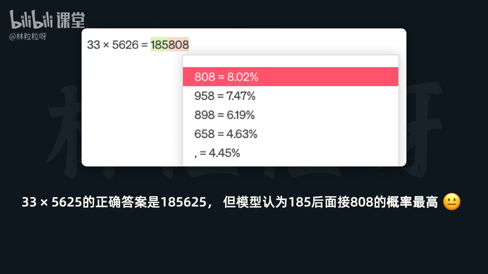
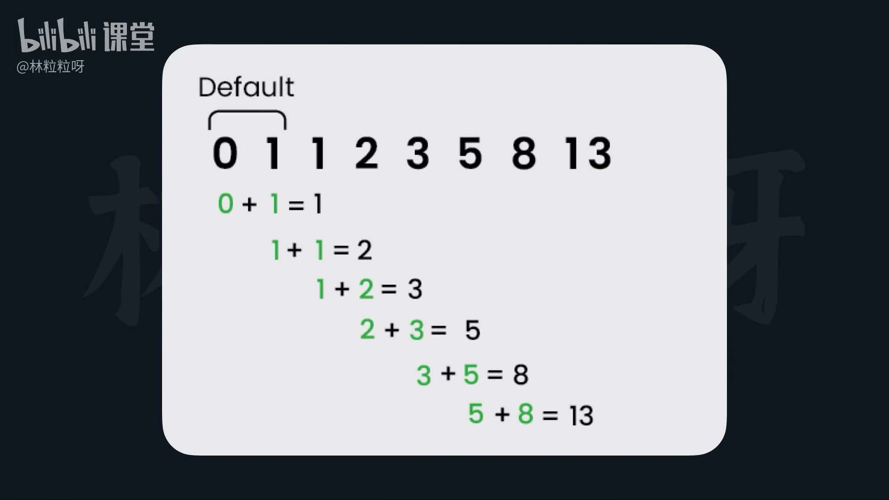

# 98-Tool 用现成的AI工具运行代码

### **主题：利用 LangChain 现有工具运行代码 (以 Python 解释器为例)**

#### **1. 大型语言模型 (LLM) 的局限性**

*   **本质缺陷：** LLM 的工作原理是“猜测下一个最可能出现的 token”，而非真正的“计算”或“逻辑推理”。
*   **具体表现：**
    *   无法准确进行数学计算，会胡编乱造结果。
    *   在需要精确数字的场景（如网店客服计算订单总额）可能给出错误信息，造成风险。
*   **总结：** LLM 不擅长作为计算器或执行精确的程序逻辑。

#### **2. 解决方案：程序辅助语言模型 (Program-Aided Language Models, PAL)**

*   **核心思想：** 不让 AI 直接计算，而是让 AI **生成执行计算的代码**，然后运行这些代码获取准确结果。
*   **起源：** 最早于 2022 年的一篇论文中提出。https://arxiv.org/pdf/2211.10435 
*   **优势：** 极大程度上保障了准确性，尤其适用于数学计算和复杂逻辑推理。
*   **在 LangChain 中的体现：** 通过集成外部工具（如 Python 解释器）来实现。

#### **3. LangChain 实现 PAL 的关键组件与步骤**

*   **所需库：** `langchain_experimental` (包含实验性 LangChain 相关代码，需安装)。

*   **实现步骤：**

    1.  **安装所需库：**
        *   `pip install langchain_experimental`

    2.  **定义 LLM 模型：**
        *   设置 `temperature` (温度) 为最小值 (如 `0`)，使模型更“听话”，尽可能遵循指令（`ReAct` 框架）。

    3.  **定义工具 (Tool)：**
        *   导入 `PythonREPLTool` (Python Read-Eval-Print Loop Tool)。
        *   路径：`from langchain_experimental.tools import PythonREPLTool`
        *   **功能：** 允许 AI 编写和执行 Python 代码。

    4.  **创建 Agent 执行器：**
        *   导入 `create_python_agent` 函数。
        *   路径：`from langchain_experimental.agents.agent_toolkits import create_python_agent`
        *   **功能：** 专门用于创建一个能执行 Python 代码的 Agent 执行器。
        *   **关键参数：**
            *   `llm`：LLM 模型的实例。
            *   `tools`：`PythonREPLTool` 的实例。
            *   `verbose=True` (可选)：展示 AI 的思考过程（`Thought`、`Action`、`Observation` 等）。
            *   `agent_executor_kwargs={"handle_parsing_errors": True}` (可选)：让 Agent 在代码执行报错时，尝试进行调试和修正。

    5.  **Agent 执行器的执行过程 (invoke 方法)：**
        *   通过调用 `agent.invoke("你的问题")` 来运行 Agent。

#### **4. LangChain 提供的便捷性与内部机制**

*   **预定义提示模板：**
    *   `create_python_agent` 函数内部已定义好复杂的提示模板。
    *   **模板内容：**
        *   告诉 AI “你是一个 agent，只通过编写和执行 Python 代码来回答问题。”
        *   指导 AI 如何使用 `PythonREPLTool`：输入有效 Python 代码，使用 `print()` 打印输出。
        *   定义了 AI 应该采用的 `ReAct` (Reasoning and Acting) 思考框架。
    *   **用户受益：** 无需自行定义复杂的提示词，简化了 Agent 的创建过程。

#### **5. 实际案例与效果展示**

*   **案例 1：复杂数学计算**
    *   例如：计算 `1739818318 * 123891828918 `。
    *   **效果：** Agent 思考后生成并运行 Python 代码，得到精确到小数位数的结果。

*   **案例 2：斐波那契数列计算 (带调试)**
    *   例如：计算第 12 个斐波那契数列的数字。
    *   **效果：**
        *   Agent 自行编写计算斐波那契数列的 Python 函数。
        *   初次运行时若代码出现缩进错误 (得益于 `handle_parsing_errors=True` 设置)，Agent 会观察报错信息。
        *   Agent 再次修改代码（纠正缩进），然后成功运行并给出正确答案。

#### **6. 总结与应用场景**

*   **核心价值：** 通过 AI **生成代码**配合 **Python 解释器**，极大地增强了语言模型的**准确性**和**问题解决能力**。
*   **实际应用：**
    *   当你在使用 AI 聊天助手时，如果看到 AI 展开说明并运行 Python 代码，就说明它正在借助类似 `PythonREPLTool` 的工具来获取更准确的答案。
    *   任何需要精确计算、数据处理或复杂逻辑推理的场景，都可以考虑使用 PAL 模式。

---