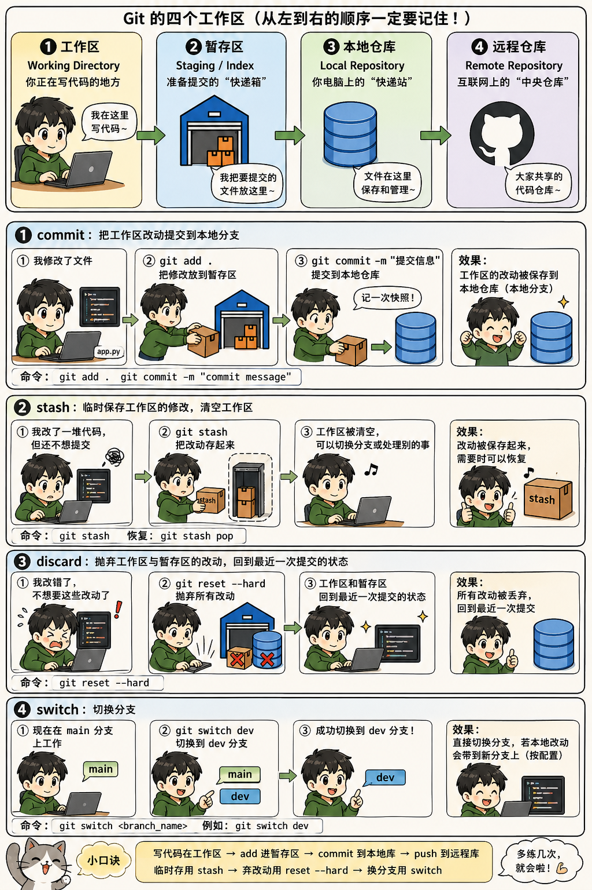

# **我现在手里有一堆“还没提交”的修改，接下来该怎么办？**


---

## 1. commit：我确定这些修改要保留

适合场景：
你改完代码，确认这部分功能是对的，想正式保存一次。

```bash
git add .
git commit -m "提交说明"
```

含义是：

```bash
git add .
```

把工作区的修改放进暂存区。

```bash
git commit -m "提交说明"
```

把暂存区的内容保存到本地仓库，形成一次正式记录。

可以理解成：

**写完作业 → 放进文件袋 → 拍照存档。**

---

## 2. stash：我现在不想提交，但想先藏起来

适合场景：
你正在改一半，突然要切换分支、拉代码、修 bug，但当前修改还不完整，不适合 commit。

```bash
git stash
```

它会把你当前未提交的修改临时存起来，让工作区变干净。

之后想恢复：

```bash
git stash pop
```

常见流程：

```bash
git stash
git switch dev
# 做别的事
git stash pop
```

可以理解成：

**桌上东西太乱，但还不能扔，就先装进临时箱子。等忙完再拿出来。**

补充：

```bash
git stash list
```

查看存了哪些临时修改。

```bash
git stash apply
```

恢复修改，但不删除 stash 记录。

```bash
git stash pop
```

恢复修改，并删除 stash 记录。

---

## 3. discard：我不要这些修改了，直接丢掉

适合场景：
你改错了、试验失败了，想回到上一次提交后的干净状态。

危险命令：

```bash
git reset --hard
```

它会丢弃工作区和暂存区的修改，回到最近一次 commit。

可以理解成：

**这版草稿不要了，直接撕掉，回到上一次正式保存的版本。**

更安全的写法：

只丢掉某个文件的修改：

```bash
git restore 文件名
```

比如：

```bash
git restore app.py
```

丢掉所有未暂存修改：

```bash
git restore .
```

如果文件已经 `git add` 进暂存区，先取消暂存：

```bash
git restore --staged 文件名
```

再丢掉修改：

```bash
git restore 文件名
```

口诀：

**不确定时，少用 `git reset --hard`，优先用 `git restore`。**

---

## 4. switch：切换到另一个分支

适合场景：
你现在在 `main` 分支，但要去 `dev` 分支开发，或者去别的分支修 bug。

```bash
git switch 分支名
```

比如：

```bash
git switch dev
```

创建并切换新分支：

```bash
git switch -c 新分支名
```

比如：

```bash
git switch -c feature-login
```

注意：
如果你当前有未提交修改，Git 可能不让你切换，因为怕你的修改被覆盖。

这时有三种选择：

确定要保留：

```bash
git add .
git commit -m "保存当前修改"
git switch dev
```

暂时保留：

```bash
git stash
git switch dev
```

不要了：

```bash
git restore .
git switch dev
```

---

## 最简单判断口诀

**要正式保存：commit**
**要临时收起来：stash**
**不要了：discard / restore**
**要换分支：switch**

你可以这样记：

```text
commit = 存档
stash  = 暂存到小仓库，晚点拿回来
discard = 扔掉
switch = 换房间/换分支
```
