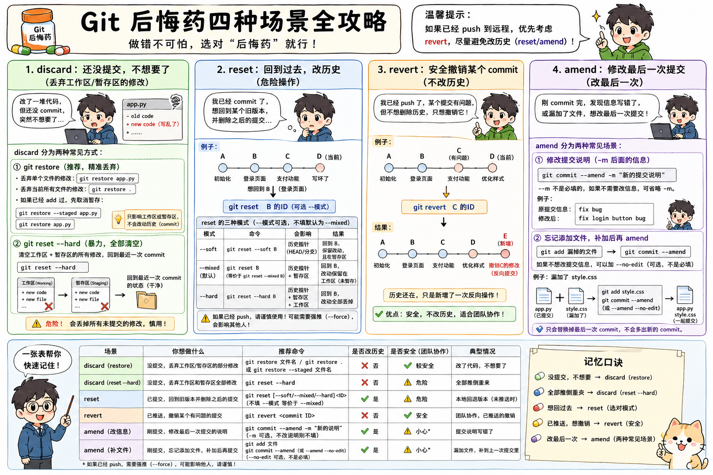

# Git 的“后悔药”——当你做错操作时，有哪几种不同的补救方式，以及它们的区别


# 一句话总览（先记这个）

```text
discard：没提交 → 直接扔
reset：改历史 → 回到过去（危险）
revert：不改历史 → 新建一次“反向提交”（安全）
amend：改最后一次提交 → 微调
```

---

# 1️⃣ discard（丢弃修改）

### 👉 干嘛用

你改了一堆代码，但**还没 commit，突然觉得不想要了**

### 👉 命令

```bash
git restore 文件名     # 单个文件
git reset --hard      # 所有文件（危险）
```

### 👉 本质

**把工作区改动直接删掉，回到上一次 commit**

### ⚠️ 注意

* 删除后**无法恢复**
* `reset --hard` 非常危险

### 🧠 记忆

👉 **“还没提交，直接扔”**

---

# 2️⃣ reset（回到过去，改历史）

### 👉 干嘛用

你已经 commit 了，但想：

👉 **回到某个旧版本，并且把后面的提交全部抹掉**

### 👉 命令

```bash
git reset <commit_id>
```

（常见是 `--hard`）

### 👉 本质

```text
A → B → C → D（当前）

reset 到 B

结果：
A → B（C、D 直接消失）
```

### ⚠️ 注意（重点！）

* 会**修改历史**
* 如果已经 push：

  * 需要强推（force push）
  * 团队会炸（冲突）

### 🧠 记忆

👉 **“时间倒流，历史重写（危险操作）”**

---

# 3️⃣ revert（安全撤销）

### 👉 干嘛用

你已经 commit 并且**可能已经 push**，但发现有问题

👉 不想改历史，只想“撤销某次修改”

### 👉 命令

```bash
git revert <commit_id>
```

### 👉 本质

```text
A → B → C（有问题）→ D

revert C

变成：
A → B → C → D → E（E = 撤销 C）
```

👉 历史还在，只是多了一次“反向操作”

### ⚠️ 优点

* 不改历史
* 不需要强推
* 团队协作最安全

### 🧠 记忆

👉 **“我不删历史，我用一个新操作抵消你”**

---

# 4️⃣ amend（修改最后一次提交）

### 👉 干嘛用

你刚 commit，但发现：

* 提交说明写错了
* 少加文件
* 想微调一下

### 👉 命令

```bash
git commit --amend
```

### 👉 本质

👉 **替换掉“最后一次 commit”**

不是新增，而是“覆盖”

### ⚠️ 注意

* 只能改**最后一次**
* 如果已经 push：

  * 也需要强推
  * 会影响别人

### 🧠 记忆

👉 **“最后一条记录，改一下就好”**

---

# 🔥 最关键对比（一定要懂）

| 操作      | 是否改历史   | 是否安全       | 场景          |
| ------- | ------- | ---------- | ----------- |
| discard | ❌ 不涉及   | ⚠️ 危险（直接删） | 未提交改动       |
| reset   | ✅ 改历史   | ❌ 危险       | 回退版本        |
| revert  | ❌ 不改    | ✅ 安全       | 已 push 的撤销  |
| amend   | ✅ 改最后一次 | ⚠️ 小心      | 修改最后 commit |

---

# 🧠 最终记忆口诀（非常重要）

```text
没提交 → 用 discard（直接扔）

想回过去 → 用 reset（会改历史）

要安全撤销 → 用 revert（加一条反操作）

改最后一次 → 用 amend
```

---
# 真实场景

你把 Git 想成写文章：

* **discard**：草稿写错了，还没保存，直接撕掉。
* **reset**：已经存了几个版本，但想回到旧版本，并抹掉后面的记录。
* **revert**：已经发给大家了，不能删历史，只能再发一版“撤销说明”。
* **amend**：刚刚保存完，发现漏了一个字，赶紧把最后一次保存补一下。

---

## 1. discard：还没 commit，改错了，不要了

### 场景

你在 `main` 分支上改了 `app.py`：

```python
print("hello")
```

你改成了：

```python
print("hello world")
print("这里写坏了")
```

然后你发现：
这次尝试完全没用，想回到修改前。

先看状态：

```bash
git status
```

可能会看到：

```bash
modified: app.py
```

说明文件被改了，但还没提交。

这时用：

```bash
git restore app.py
```

效果：

```text
app.py 回到上一次 commit 的状态
你刚刚写坏的内容被丢掉
```

如果你想丢掉所有文件的未提交修改：

```bash
git restore .
```

如果文件已经被你 `git add` 过了：

```bash
git restore --staged app.py
git restore app.py
```

简单记：

```text
还没 commit，改错了，不要了 → git restore
```

---

## 2. reset：已经 commit 了，但想回到旧版本

### 场景

你的提交历史是这样：

```text
A：初始化项目
B：添加登录页面
C：添加支付功能
D：支付功能写坏了
```

现在你发现：

```text
C 和 D 都不想要了
我想回到 B 的状态
```

先查看提交记录：

```bash
git log --oneline
```

可能看到：

```bash
d444444 支付功能写坏了
c333333 添加支付功能
b222222 添加登录页面
a111111 初始化项目
```

你想回到 `b222222`：

```bash
git reset --hard b222222
```

效果：

```text
当前代码回到 B
C 和 D 从当前分支历史里消失
```

变成：

```text
A → B
```

原来的：

```text
A → B → C → D
```

后面的 `C`、`D` 被抹掉。

注意：
**如果 C 和 D 已经 push 到远程仓库，不建议这样做。**
因为别人可能已经拉取了这些提交，你再 reset 会改历史，容易导致冲突。

简单记：

```text
想把历史倒回去，并抹掉后面的 commit → git reset
```

---

## 3. revert：已经 push 了，安全撤销某个 commit

### 场景

你的提交历史是：

```text
A：初始化项目
B：添加登录页面
C：添加支付功能
D：优化样式
```

你已经 push 到远程仓库了。

后来发现：

```text
C：添加支付功能
```

这个提交有 bug。

但是你不想删除历史，因为团队其他人已经拉过代码了。

这时用：

```bash
git revert c333333
```

效果：

Git 会新增一个提交：

```text
E：撤销 C 的修改
```

历史变成：

```text
A → B → C → D → E
```

注意，不是删除 C。

而是新增 E，把 C 的修改反向抵消掉。

这就是 revert 最重要的特点：

```text
历史还在，只是新增一次“反向提交”
```

所以它适合团队协作，尤其是已经 push 的情况。

简单记：

```text
已经 push 了，想安全撤销某次提交 → git revert
```

---

## 4. amend：刚 commit 完，发现最后一次提交有小问题

### 场景一：提交说明写错了

你刚刚提交：

```bash
git commit -m "fix bug"
```

但你觉得这个说明太模糊，想改成：

```text
fix login button click bug
```

这时用：

```bash
git commit --amend -m "fix login button click bug"
```

效果：

```text
不会新增一条 commit
而是修改最后一次 commit
```

---

### 场景二：刚 commit 完，发现漏加了一个文件

你提交了：

```bash
git add app.py
git commit -m "add login page"
```

结果发现 `style.css` 忘记提交了。

这时：

```bash
git add style.css
git commit --amend
```

如果不想改提交说明：

```bash
git commit --amend --no-edit
```

效果：

```text
style.css 被补进上一次 commit 里
不会多出一个新的 commit
```

原来：

```text
A → B
```

amend 后还是：

```text
A → B'
```

注意，`B` 被替换成了新的 `B'`。

如果这个 commit 已经 push，amend 也要小心，因为它也会改历史。

简单记：

```text
刚提交完，想改最后一次 commit → git commit --amend
```

---

## 四个场景放在一起

| 场景                          | 你想干嘛        | 用哪个                     |
| --------------------------- | ----------- | ----------------------- |
| 改了一堆代码，但还没 commit，发现不要了     | 丢掉本地修改      | `git restore` / discard |
| 已经 commit 了，想回到旧版本，并删除后面的提交 | 历史倒退        | `git reset`             |
| 已经 push 了，发现某个 commit 有问题   | 新增一次反向提交来撤销 | `git revert`            |
| 刚 commit 完，发现漏文件或提交说明写错     | 修改最后一次提交    | `git commit --amend`    |

最实用的判断：

```text
没提交，想不要 → restore
已提交，想回退历史 → reset
已推送，想安全撤销 → revert
刚提交，想补一下 → amend
```
