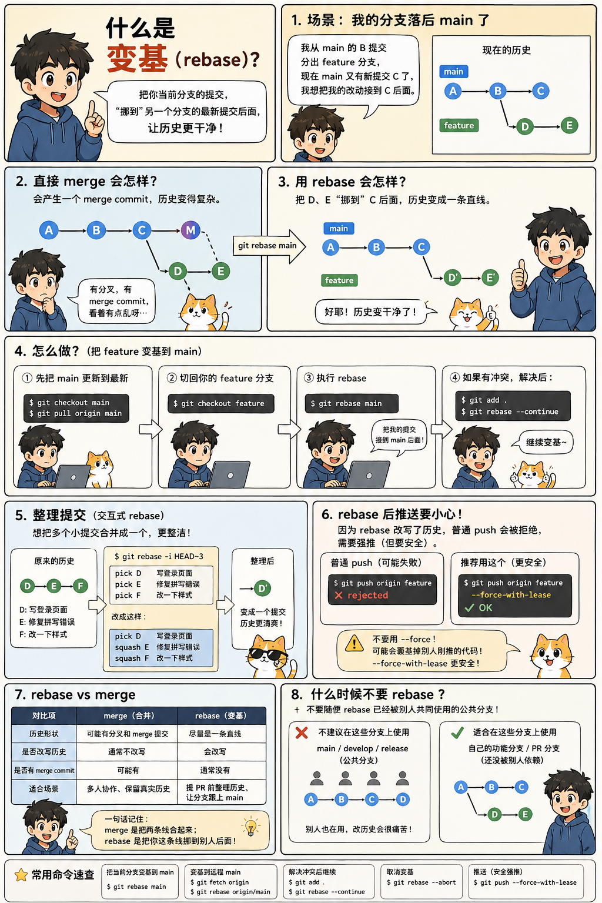

# 什么叫变基，解释一下，给出场景和命令

**变基 = rebase。**


在 Git 里，**变基就是把你当前分支的提交，挪到另一个分支的最新提交后面，重新排一遍提交历史。**

可以理解成：

> 我之前是从旧的 main 分出来开发的。
> 现在 main 已经更新了。
> 我想把自己的改动“接到最新 main 后面”，让历史看起来像我是基于最新 main 开发的。

---

## 一、先用图理解

假设一开始是这样：

```bash
A---B---C  main
     \
      D---E  feature
```

意思是：

`feature` 是从 `main` 的 `B` 提交分出来的。

后来 `main` 又多了一个提交 `C`。

你的 `feature` 上有两个提交：`D`、`E`。

这时候执行：

```bash
git checkout feature
git rebase main
```

会变成：

```bash
A---B---C  main
         \
          D'---E'  feature
```

注意：`D`、`E` 变成了 `D'`、`E'`。

因为 Git 不是简单搬过去，而是**重新应用你的提交**，所以提交 ID 会变。

---

## 二、变基解决什么问题？

主要解决两个问题：

### 1. 让提交历史更干净

不用 rebase，直接 merge，可能是这样：

```bash
A---B---C-------M  feature
     \         /
      D---E----
```

会多一个 merge commit。

用了 rebase，是这样：

```bash
A---B---C---D'---E'  feature
```

历史是一条直线，看起来更清楚。

---

## 三、典型场景 1：你的分支落后 main 了

你正在开发一个功能分支：

```bash
feature-login
```

别人已经往 `main` 合了很多代码。

你想让自己的分支基于最新 `main`。

### 命令流程：

```bash
git checkout main
git pull origin main
```

先把本地 `main` 更新到最新。

然后：

```bash
git checkout feature-login
git rebase main
```

意思是：

> 把 `feature-login` 上自己的提交，重新放到最新的 `main` 后面。

如果没有冲突，结束。

如果有冲突，需要解决冲突，然后：

```bash
git add .
git rebase --continue
```

如果想放弃这次变基：

```bash
git rebase --abort
```

---

## 四、典型场景 2：提交 PR 前整理历史

比如你的分支历史是这样：

```bash
main:    A---B---C
feature:        D---E---F
```

其中：

```bash
D = 写登录页面
E = 修复一个拼写错误
F = 又改了一点样式
```

你觉得 `E` 和 `F` 都是小修小补，不想让 PR 里显得很乱。

可以用交互式 rebase：

```bash
git rebase -i HEAD~3
```

意思是：

> 整理最近 3 个提交。

会打开一个编辑界面，大概是：

```bash
pick D 写登录页面
pick E 修复拼写错误
pick F 修改样式
```

你可以改成：

```bash
pick D 写登录页面
squash E 修复拼写错误
squash F 修改样式
```

意思是：

> 保留第一个提交，把后两个提交合并进去。

最后历史会变成一个更干净的提交：

```bash
D' = 写登录页面
```

常用写法：

```bash
git rebase -i HEAD~3
```

整理最近 3 个提交。

---

## 五、典型场景 3：更新自己的 PR 分支

你 fork 了别人的项目，开发了一个分支：

```bash
my-feature
```

但是原项目的 `main` 更新了，你想同步。

一般流程是：

```bash
git fetch upstream
git checkout my-feature
git rebase upstream/main
```

这里的 `upstream/main` 指的是**原项目的 main 分支**。

如果有冲突：

```bash
git add .
git rebase --continue
```

然后因为 rebase 改写了提交历史，推送时通常要用：

```bash
git push origin my-feature --force-with-lease
```

注意最好用：

```bash
--force-with-lease
```

不要直接用：

```bash
--force
```

因为 `--force-with-lease` 更安全，能避免覆盖别人刚推上去的代码。

---

## 六、rebase 和 merge 的区别

| 对比                | merge       | rebase                |
| ----------------- | ----------- | --------------------- |
| 中文理解              | 合并          | 变基                    |
| 历史形状              | 可能产生分叉和合并点  | 尽量变成一条直线              |
| 是否改写提交历史          | 通常不改写       | 会改写                   |
| 是否产生 merge commit | 可能会         | 通常不会                  |
| 适合场景              | 多人协作、保留真实历史 | 提 PR 前整理历史、让分支跟上 main |

简单记：

> **merge 是把两条线合起来。**
> **rebase 是把你这条线挪到别人后面。**

---

## 七、最常用命令总结

### 1. 把当前分支变基到 main

```bash
git checkout feature
git rebase main
```

### 2. 先更新 main，再变基

```bash
git checkout main
git pull origin main

git checkout feature
git rebase main
```

### 3. 变基到远程 main

```bash
git fetch origin
git rebase origin/main
```

### 4. 解决冲突后继续

```bash
git add .
git rebase --continue
```

### 5. 取消变基

```bash
git rebase --abort
```

### 6. 跳过当前冲突提交

```bash
git rebase --skip
```

这个不常用，除非你确定这个提交不要了。

### 7. 交互式整理最近 3 个提交

```bash
git rebase -i HEAD~3
```

### 8. rebase 后推送远程分支

```bash
git push --force-with-lease
```

或者指定分支：

```bash
git push origin feature --force-with-lease
```

---

## 八、什么时候不要 rebase？

有一个重要原则：

> **不要随便 rebase 已经被别人共同使用的公共分支。**

比如：

```bash
main
develop
release
```

这些分支通常不要 rebase。

因为 rebase 会改写提交历史，别人如果已经基于这些提交开发，你一改历史，别人就会很痛苦。

适合 rebase 的是：

```bash
自己的功能分支
自己的 PR 分支
还没有被别人依赖的分支
```

---

## 九、一句话记忆

**变基 rebase，就是把你当前分支的提交“拔起来”，重新接到另一个分支的最新位置后面，让提交历史更干净。**

最常见命令就是：

```bash
git checkout feature
git rebase main
```
