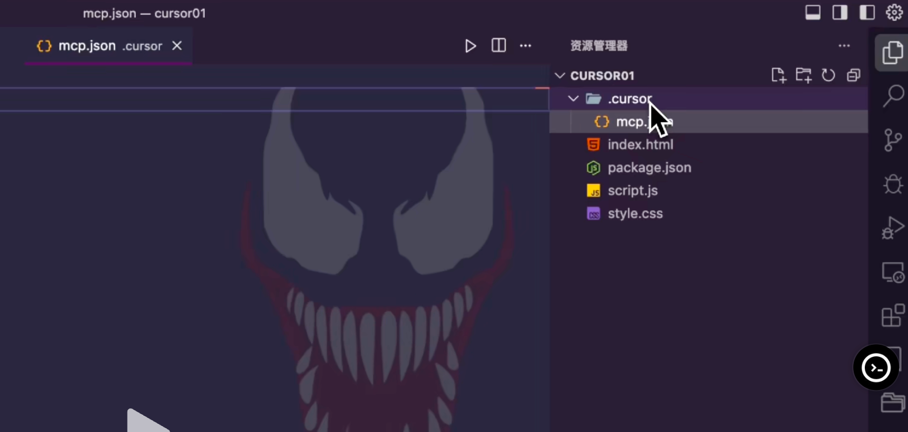

# 🧠 Cursor 新功能与高级玩法总结（下集）

* **视频链接**：https://www.douyin.com/video/7506206039159754025

* **视频文档**：https://zdvbcsw5ar.feishu.cn/wiki/Bwi4wWaRYikMbwkzcDvcF7qdnme

## 一、MCP 功能详解

### 1. 概念与原理

* **MCP（Model Context Protocol）**：开放的模型上下文协议，标准化了应用程序向大模型提供上下文和调用外部工具的方式。
* 作用：让大模型能统一调用第三方工具，实现数据交互。

### 2. MCP 发展背景

| 阶段                  | 特点           | 问题       |
| ------------------- | ------------ | -------- |
| 初期（纯对话）             | 用户手动提供外部数据   | 操作繁琐     |
| Function Calling 阶段 | 模型可调用外部函数接口  | 各厂商接口不统一 |
| MCP 阶段              | 统一标准，兼容多厂商模型 | 只需一次开发   |

### 3. MCP 架构与通信方式

* **MCP Server**：工具服务端，开发者根据 MCP 标准开发。
* **MCP Client**：支持 MCP 的大模型或产品（如 Cursor）。
* **通信模式**

  * `stdio（本地进程）`：需本地环境（Node、Python、Go等）
  * `SSE（HTTP 远程）`：直接通过网络访问，用户友好

### 4. Cursor 中的 MCP 使用

* Cursor 从 **v0.45** 起支持 MCP Client。
* **添加方式**：

  1. 进入设置 → MCP → Add new global MCP server
  2. 在 JSON 中配置本地或 SSE 模式
  3. 保存后即可启用

示例：

```json
{
  "firecrawl": {
    "command": "npx firecrawl",
    "mode": "stdio"
  },
  "howtocook": {
    "url": "https://xxx/api",
    "mode": "sse"
  }
}
```

* 小绿点，下面还有一系列`tool`标签：连接成功
* 黄点：尝试连接
* 红点：失败
* 如果点开了项目里的 `Auto Run`，mcp 会自动执行

### 5. 项目级 MCP Server

* 在项目根目录创建 `.cursor/mcp.json`
* 与全局配置写法一致，但仅作用于该项目
* 可独立启用/禁用

  
---

## 二、Cursor Rules（系统提示词）

### 1. 定义

* Rules = 系统提示词（System Prompt）
* 作用：为大模型设定长期规则，例如“`  Always repond in 中文`”

### 2. 规则类型

| 类型                | 含义          | 使用方式                  | 优先级    |
| ----------------- | ----------- | --------------------- | ------ |
| **always**        | 项目级全局规则      | 自动生效                  | < 全局规则 |
| **auto-attached** | 根据文件匹配启用    | 配置正则                  | < 全局规则 |
| **agent-request** | AI 根据描述自动启用 | 需填写描述                 | < 全局规则 |
| **manual**        | 手动启用        | 使用 `@cursor rules` 调用 | > 全局规则 |

### 3. 项目级规则结构

* 在项目根目录创建 `.cursor/rules/*.mdc`
* 文件头包含元信息（类型、匹配规则、描述）
* 主体可使用 Markdown 格式编写规则

示例：

```markdown
---
type: auto-attached
match: "*.js"
description: "仅在处理 JS 文件时使用此规则"
---

始终使用英文回复代码注释。
```

### 4. 规则优先级结论

* 仅 **manual** 类型 > 全局规则
* 其他类型（always、auto、agent）均 < 全局规则

> ✅ 建议：全局规则仅保留「始终中文回复」，其他放在项目规则中。

### 5. 自动生成 Rules

* 使用 `/generator cursor rules` 指令自动创建规则（仍有 bug）
* 若生成不全，可手动补全头部元信息

---

## 三、Workspace（工作区）

### 1. 定义

* VSCode 自带功能，Cursor v0.50 起支持**多根工作区**
* 可同时管理多个项目并共享索引

### 2. 特点

* `Goto base`、`Indexing` 可跨项目索引
* 每个项目仍可保持独立配置
* 可通过「将工作区另存为」保存 `.code-workspace` 文件

---

## 四、Cursor 新功能汇总

| 功能               | 描述                        |
| ---------------- | ------------------------- |
| 图片上传             | 支持多模态识别，无文字图片也可解析         |
| MCP 输出图片         | MCP 可直接生成图片               |
| 全局忽略文件           | 默认存在 `.cursorignore` 全局配置，`CMD + SHIFT + P`进入 `settings`，在列表中打开 `工作区设置(workingspace settings  )`|
| 导出 Chat          | 可导出对话为 `.md` 文件           |
| Background Agent | 预览功能，可后台并发执行任务，需要下载 `Background  Agent` 版本的Cursor，可以在远程实例/虚拟机中运行        |
| Early Access     | 提前体验新版本功能                 |

---

## 五、常见问题与技巧

### 1. 避免“越用越傻”的降智问题

**原因：**

* 上下文过长、任务混杂
* 无效信息积累

**解决方案：**

1. 完整的需求应该落在统一的需求文档当中，每个 Chat 只做一件事（单一职责）
2. 重复提示应改为 Rules
3. 上下文延续用 `@past chat` 指令

**好处：**

* 模型不混乱，任务可追溯
* Review Changes 功能可清晰查看每次修改

---

## 六、Agent 模式问题与处理技巧

| 场景      | 解决方式                     |
| ------- | ------------------------ |
| 单步骤输出错误 | 等任务完成后单独补充修改             |
| 多步骤错误   | 使用 **Restore Checkpoint 回滚，重新编辑需求再生成**           |
| 中途发现问题  | 点击 **Stop** 后补充描述继续执行    |
| 局部修改    | 鼠标悬停小任务 → 点击 「＋」插入输入框重新输入补充描述，然后继续生成 |

> 建议：写好完整的任务背景 MD 文档，再引用执行。

---

## 七、MCP 使用建议

* **普通用户**：使用 SSE 模式（如魔 搭社区 MCP 广场）
* **开发者**：可尝试自建 MCP Server
* **最佳实践**：

  * 避免配置过多 MCP Server，防止性能下降，不如多关注rules，不用的时候应该禁用掉 
    * 作者只用到了 Firecrawl，因为很多动态网页链接，Cursor爬取不了
    * 作者需要用 Firecrawl 爬取网页 输出结构化内容
    * Cursor的 `Web search`功能并不是很全面，尤其是对特殊的中文内容
    * 是其他地方要使用到 Firecrawl 的 API 而付费的，而不是单纯使用 MCP Server 而付费的
  * 按工作流挑选所需的少量工具（如 Firecrawl）
    * 连接 Blender API 通过自然语言建模（不是因为好用/常用，仅仅是新奇）
  * 应该聚焦在“AI 编程”上，而不是用 MCP 开发提效，那样没有意义，因为Cursor 已经内置了很多工具
  * 大量 MCP Server 会给 Cursor 降智，Cursor 官方也不建议配置太多
  * 可以想一想如何基于 MCP Server 开发更多有趣的 AI 产品

---

## 八、Rules 的进阶用法与工作流思路

### 1. 规则写法结构建议

`cursorrules.mdc`文件来写`rules`

```markdown
# 使用场景
说明此规则适用的文件或任务

## 关键规则
- 要做什么
- 不要做什么

## 示例
✅ 正确示例  
❌ 错误示例
```

### 2. 示例：Markdown 文档规则

```markdown
---
type: auto-attached
match: "*.md"
---

# 使用场景
适用于所有文档生成任务。

## 关键规则
- 必须使用规范 Markdown 标题层级。
- 不得包含非英文符号。

## 示例
✅ 使用 # 一级标题  
❌ 使用中文标点
```

---

## 九、基于 Rules 构建工作流（Workflow）

### 1. 项目开发流程建议

| 步骤        | 说明       | 可配置规则        |
| --------- | -------- | ------------ |
| 需求文档（PRD） | 流程明确/架构完整/逻辑严谨  | PRD 模板规则     |
| 原型设计      | 生成界面草图   | Prototype 规则 |
| 技术方案      | 定义架构与技术栈 | TechSpec 规则  |
| 数据库设计     | 设计数据结构   | DB Schema 规则 |
| 接口文档      | API 说明   | API 规则       |

* **`agent`模式下，在对话框中输入**：我想开发一个APP， @prd.md 这是我的核心需求，请你分析、完善、优化这份需求，让整个 APP 逻辑完整，输出 prd。
Cursor会自主创建

### 2. 工作流规则思路

* 将各阶段的 Rules 串联形成完整工作流
* 记录任务进度、修改记录、代办清单
* 每次任务前引用 To-do 文档与需求边界

### 3. 实践意义

* 可自定义适配自身团队流程
* 理解并构建 AI **Agent Workflow**

> ⚠️ 不建议直接照搬“通用型工作流”，应根据自身能力和项目规模逐步构建。

```markdown

# Cursor Rule 规则格式规范

## 规则文件模板结构

\`\`\`mdc
---
description: `根据规则内容，生成包含关键场景、动作、触发条件、结果、格式的内容，限制在 150 字以内`
globs: 空白或模式 (例如: *.js, *.ts, *.py, .vscode/*.json, .cursor/**/*.mdc)
alwaysApply: {true 或 false}
---

# 规则标题

## 使用场景
- 何时应用此规则
- 前提条件或要求

## 关键规则
- 简洁的、列表形式的行动规则，模型必须遵循
- 始终执行 X
- 绝不执行 Y

## 示例
<example>
好的简洁示例及其说明
</example>

<example type="invalid">
错误的简洁示例及其说明
</example>
\`\`\`

## 文件组织

### 规则文件位置
- 路径：`.cursor/rules/*.mdc`
- 扩展名：`.mdc`

### 规则命名规范
- 文件名使用 kebab-case 格式
- 始终使用 .mdc 扩展
- 让命名可以直观描述规则的目的
- 私有规则：以下划线 _ 开头，该规则将位于 gitignore 中，例：`_rule-name.mdc`
- 规则文件命名需要根据规则类型添加后缀，例：`rule-name-{auto|agent|manual|always}.mdc`
  - auto: 自动规则
  - agent: 代理规则
  - manual: 手动规则
  - always: 全局规则

### Glob 示例
不同规则类型的常见 glob 模式：
- 核心规则：.cursor/rules/*.mdc
- 语言规则：*.js, *.ts, *.py, *.cpp, *.hpp
- 测试规则：*.test.js, *.test.ts, *.test.py, *.test.cpp, *.test.hpp
- 文档规则：docs/**/*.md, *.md
- 配置规则：*.config.{js,json}, *.json, *.yaml, *.yml
- 构建产物规则：dist/**/*
- 多扩展名规则：src/**/*.{js,jsx,ts,tsx}
- React 组件规则：*.tsx, *.jsx
- Vue 组件规则：*.vue

## 必需字段
### 前置信息
- description: `根据规则内容，生成包含关键场景、动作、触发条件、结果、格式的内容，限制在 150 字以内`
- globs: 空白或模式 (例如: *.js, *.ts, *.py, .vscode/*.json, .cursor/**/*.mdc)
- alwaysApply: {true 或 false}

### 正文
- 使用场景
- 关键规则：最关键规则的简短总结
- 示例：有效和无效示例

## 格式指南
- mdc 规则文件中使用简洁的 Markdown 语法
- 仅限使用以下 XML 标签：
  - <example>
- XML 标签内容或嵌套标签必须缩进 2 个空格
- 如果能更好地帮助 AI 理解规则，可以使用表情符号和 Mermaid 图表（但不要冗余）

## 关键规则
- 规则文件将始终位于和命名为：`.cursor/rules/rule-name-{auto|agent|manual|always}.mdc`
- 规则将永远不会在 .cursor/rules/** 之外创建
- 你应该总是会检查是否在所有 .cursor/rules 子文件夹下存在要更新的现有规则
- 规则正文中，除了使用场景、关键规则、示例，你也可以根据需求扩展更详细的规则内容，但请注意内容简洁有效
- 规则类型前言部分必须始终在文件开头，并包含所有 3 个字段，即使字段值为空 - 类型如下：：
  - 手动规则：如果请求手动规则 - description 和 glob 必须为空，alwaysApply: false 且文件名以 -manual.mdc 结尾
  - 自动规则：如果请求的规则应始终应用于某些 glob 模式（例如所有 typescript 文件或所有 markdown 文件） - 描述必须为空，alwaysApply: false 且文件名以 -auto.mdc 结尾
  - 全局规则：全局规则 description 和 glob 为空，alwaysApply: true 且文件名以 -always.mdc 结尾
  - Agent 选择规则: 此规则不需要加载到每个聊天线程中，它服务于特定目的。description 必须提供全面的上下文，包括代码更改、架构决策、错误修复或新文件创建的场景。glob 为空，alwaysApply:false 且文件名以 -agent.mdc 结尾
- 对于规则内容 - 专注于明确的行动指令，无需不必要的解释
- 当规则只会在某些情况下使用时（alwaysApply: false），描述必须提供足够的上下文，以便 AI 可以自信地确定何时加载和应用规则
- 使用适合 Agent 上下文窗口的简洁 Markdown
- 在 XML 示例部分中始终使用2个空格缩进内容
- 虽然没有严格的行限制，但要注意内容长度，因为它会影响性能，需要专注于帮助 Agent 做出决策的关键信息
- 规则示例中总是包括一个有效的和无效的示例
- 永远不要在 glob 模式周围使用引号，永远不要将 glob 扩展与 `{}` 一起分组
- 如果请求规则或未来行为更改包括错误上下文，这将是在规则示例中使用的绝佳信息
- 在规则创建或更新后，响应以下内容：
  - 自动规则生成成功: {规则文件相对路径及文件名}
  - 规则类型: {auto|agent|manual|always}
  - 规则描述: {描述字段的确切内容}

```
---

## 十、总结

* MCP 让模型具备统一外部调用能力，但对编程提效作用有限。
* Rules 是高阶用户与普通用户的分水岭，能系统化地控制模型行为。
* Workspace、多模态输入、导出功能等提升了开发体验。
* 短上下文 + 明确规则 = 稳定高效的智能开发。
* 建议用户逐步建立自己的 **Rules 体系** 与 **工作流模板**。

---