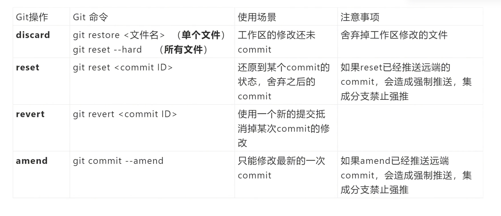

# 【第一张图】Git 分区概念Markdown All in One


- **工作区 Working Directory（工作区）**
  - 本地文件的当前状态所在目录。
- **暂存区 Staging/Index（暂存区）**
  - 待提交的快照。通过 `git add` 将修改放入暂存区。
- **本地仓库 Local Repository（本地仓库）**
  - 使用 `git commit` 将暂存区的内容写入本地仓库的历史记录。
- **远程仓库 Remote Repository（远程仓库）**
  - 位于服务器上的中央仓库。通过 `git push` 将本地提交推送到远程；通过 `git fetch`/`git pull` 获取远程变更。
- **核心工作流（常用操作）**
  - `git add`：将工作区修改添加到暂存区
  - `git commit`：将暂存区的改动提交到本地仓库
  - `git push`：把本地仓库的提交推送到远程
  - `git pull` / `git fetch`：从远程获取更新到本地
  - `git merge`：将同分支上的改动合并
- **注释**：不同颜色线条示意不同阶段的流动（工作区 <- 暂存区 <- 本地仓库 <- 远程仓库）

---

# 【第二张图】变更分支与冲突处理


If 你有尚未提交的修改需要临时工作，下面给出一个切换处理的思路：

- **操作方法 vs Git 命令 vs 效果**

| 操作方法 | Git 命令 | 效果 |
|---|---|---|
| commit | `git add .`  `git commit -m "commit message"` | 将工作区改动提交到本地分支 |
| stash | `git stash` | 将修改存储起来，清理工作区以便切换分支；后续再恢复 |
| discard | `git reset --hard` | 拋弃工作区与暂存区的改动，回到最近一次提交的状态 |
| switch | `git switch <branch_name>` | 直接切换分支，若本地改动会带到新分支上（按配置） |

---

## 具体操作要点

- 当你有未提交的修改，需要临时切换分支时：
  - 使用 `git stash` 将当前修改“存起来”，再切换分支处理紧急任务，完成后用 `git stash pop` 恢复。
  - 若你决定放弃当前修改，使用 `git reset --hard` 清理工作区与暂存区的改动。
  - 直接 `git switch <branch_name>` 切换分支时，若有未提交改动会被保留到新分支（视仓库设置而定），因此先确认是否需要 stash。
- 提交前务必检查：
  - 使用 `git status` 查看当前状态
  - 使用 `git diff` 查看未暂存改动，`git diff --staged` 查看已暂存改动
  - 提交信息要明确、描述清晰

---

# 【第三张图】Git 后悔药命

## Git后悔药命令 - 完整版（含示例）


### 场景1：写错代码想重来
```bash
# 查看状态
git status

# 撤销所有修改
git restore .

# 重新开始
# 编辑文件...
git add .
git commit -m "重新提交"
```

### 场景2：add了文件但不想提交
```bash
# 撤销暂存
git restore --staged .

# 重新选择文件
git add file1.txt
git commit -m "只提交file1.txt"
```

### 场景3：提交信息写错了
```bash
# 撤销提交但保留修改
git reset --soft HEAD~1

# 重新提交
git commit -m "正确的提交信息"
```

### 场景4：临时切换分支
```bash
# 保存当前修改
git stash

# 切换分支
git checkout other-branch

# 切换回来
git checkout main

# 恢复修改
git stash pop
```

### 场景5：修改最近提交
```bash
# 修改文件
# 编辑文件...

# 添加到暂存区
git add .

# 修改最近提交
git commit --amend -m "修正后的提交信息"
```

# 【第四张图】Git 合并相关知识点对照表


1) 知识点总结（Markdown 表格）

| 操作 | 特点 | 优点 | 缺点 | 应用场景与注意点 |
|---|---|---|---|---|
| **rebase（变基）** | 只保留线性提交，当前分支在目标分支之上重新应用 | - 历史线性、易读性高 | - 需要强推，修改公开历史时可能影响他人 | 私有分支整理提交历史，和主分支对齐后再合并；在发布前保持历史整洁 |
| **merge（合并）** | 会出现所有提交记录，包括 merge 提交 | - 可溯源，保留并行开发历史 | - 可能产生多条 merge 提交，历史不完全线性 | 公共分支合并，保留完整历史，方便追溯冲突来源 |
| **squash merge（压缩合并）** | 只出现一条 merge 记录，合并提交被压缩 | - 历史清爽，便于理解 | - 中间提交细节会丢失 | 需要合并成单条提交、历史尽量简洁时使用；不适合需要逐条追踪的场景 |


2) 表格信息提取（原表内容）

- 操作：rebase
  - 特点：只有线性提交记录
  - 优点：减少一次 merge 记录
  - 缺点：必须使用强推
  - 应用场景：在私有分支上可以用 rebase

- 操作：merge
  - 特点：会出现所有提交记录，包括 merge 记录
  - 优点：保证分支可溯源
  - 缺点：多次 merge 记录
  - 应用场景：多人协作分支，主干合并时需要保留并行开发历史

- 操作：squash merge
  - 特点：只出现一条 merge 记录
  - 优点：历史记录更加清爽干净
  - 缺点：历史记录被合并并省略中间提交
  - 应用场景：将某个特征分支合并到主分支时，保持主干历史简洁


---

# 1. Git的整体工作流程

通常是：工作区 → 暂存区 → 本地仓库 → 远程仓库。让我为你详细说明：

```
工作区 (Working Directory) 
    ↓ git add
暂存区 (Staging Area)
    ↓ git commit  
本地仓库 (Local Repository)
    ↓ git push
远程仓库 (Remote Repository)
```

### 1. 保存到暂存区
```bash
# 添加所有修改的文件到暂存区
git add .

# 或者添加特定文件
git add README.md

# 查看暂存区状态
git status
```

### 2. 提交到本地仓库
```bash
# 提交暂存区的文件到本地仓库
git commit -m "添加MinerU用户手册README"

# 查看提交历史
git log --oneline
```

### 3. 推送到远程仓库
```bash
# 推送到远程仓库（首次推送）
git push -u origin main

# 后续推送
git push
```

## 完整示例

```bash
# 1. 查看当前状态
git status

# 2. 添加文件到暂存区
git add README.md

# 3. 提交到本地仓库
git commit -m "添加MinerU用户手册README文件"

# 4. 推送到远程仓库
git push origin main
```

## 其他有用指令

```bash
# 查看工作区和暂存区的差异
git diff

# 查看暂存区和本地仓库的差异
git diff --cached

# 撤销暂存区的文件（不删除工作区文件）
git reset HEAD README.md

# 查看远程仓库信息
git remote -v
```

这个顺序确保了代码的版本控制是安全和有序的，每一步都可以检查和确认。

# 2. 面对冲突怎么办

## 一、先理解几个核心概念（很重要）

* 本地仓库（local）：你电脑上的代码和提交历史。
* 远程仓库（remote）：GitHub 上的仓库，通常别名叫 `origin`。
* 分支（branch）：代码线（常见主分支是 `main` 或 `master`）。
* 提交（commit）：把本地修改保存为一次“快照”。
* `git fetch`：把远程最新的提交记录和分支信息下载到本地（但是**不改动你当前工作区**）。
* `git merge`：把某条分支的更改合并到你当前分支（可能产生冲突）。
* `git pull` = `git fetch` + `git merge`（默认行为）。
* `git push`：把你本地提交上传到远程（比如 `origin main`）。

## 二、先做一些“准备工作”（只需做一次）

1. 配置你的用户名和邮箱（若没做过）：

```bash
git config --global user.name "你的名字"
git config --global user.email "you@example.com"
```

2. 查看当前仓库远程地址（在仓库目录里）：

```bash
git remote -v
# 常见输出会显示 origin 的 URL（GitHub 地址）
```

3. 查看分支情况：

```bash
git branch -a
# - 本地分支会列出
# - 远程分支会以 remotes/origin/xxx 列出
```

## 三、你描述的典型场景：**云端（GitHub）有改动，本地也有改动**

目标：把云端最新拉下来，遇到冲突能够判断并手动合并，然后把合并结果推回云端。

下面给出完整、稳妥的步骤（假设目标分支是 `main`）。

1. **检查当前状态**（先别慌）

```bash
git status
```

确认你是否有未暂存或未提交的修改。

2. **如果有未提交的本地改动**，有两种常见处理方式：

* 建议 A（推荐）：先提交本地改动（明确、可回溯）

  ```bash
  git add .
  git commit -m "描述你的本地改动"
  ```
* 可选 B（不想提交，临时保存）：使用 `stash`

  ```bash
  git stash push -m "临时保存：我要拉远端"
  # 拉完并处理完后用 git stash pop 恢复
  ```

3. **把远端更新下载到本地（但不自动合并）**

```bash
git fetch origin
```

这步只是把远端最新提交拿下来，放到 `origin/main`（远程引用），不会修改你当前工作目录的文件。

4. **把远端分支合并到当前分支**
   （在做合并前确认你当前在 `main`：`git checkout main` 或 `git switch main`）

```bash
git merge origin/main
```

* 如果没有冲突 → 合并完成，一个新的合并提交（或快进）产生。
* 如果有冲突 → Git 会提示冲突文件，且在冲突文件中插入冲突标记（下面有详细说明如何解决）。

> 简便写法：`git pull origin main`（等同于 `git fetch` + `git merge`）。但我推荐先 `fetch` 再 `merge`，因为 `fetch` 更安全、可观察。

5. **若合并没有冲突或已解决冲突，则把结果推到远端**

```bash
git push origin main
```

如果推送被拒绝（因为远端在你本地最后一次 fetch 后被更新了），那说明在你合并前远端又变动了，按提示再做 `git fetch`/`git merge`。通常重复上面流程即可。

## 四、如果出现冲突，怎么解决（逐步示例）

当 `git merge origin/main` 报有冲突时，Git 会在冲突的文件里插入如下标记：

```text
<<<<<<< HEAD
这是你本地的修改（HEAD 指向当前分支）
=======
这是远端 origin/main 的修改
>>>>>>> origin/main
```

解决步骤：

1. 打开冲突文件，**人工编辑**为你想要的最终内容（选择本地、远端，或合并两者内容）。
2. 保存文件，然后告诉 Git 冲突已解决：

```bash
git add <冲突文件1> <冲突文件2>
```

3. 完成合并提交（若 `merge` 需要提交）：

```bash
git commit -m "解决合并冲突：具体说明做了什么"
```

4. 再次推送到远端：

```bash
git push origin main
```

## 五、如果你不想保留本地改动，直接用远端覆盖本地（谨慎，会丢失本地改动）

```bash
git fetch origin
git reset --hard origin/main
```

⚠️ `reset --hard` 会永久丢弃本地未提交改动，请谨慎使用。

## 六、如果你想强制把本地覆盖远端（谨慎，尤其多人协作时不要随便用）

```bash
git push --force-with-lease origin main
```

* `--force-with-lease` 比 `--force` 更安全，能在远端发生你不知道的变动时阻止强推，避免覆盖他人的工作。

## 七、`merge` 和 `rebase` 的简单解释（知道即可，不强制使用）

* `merge`：把两个分支合并，保留历史分叉，会产生合并提交（history 会显示分叉）。
* `rebase`：把你的提交“移动”到远端最新提交之后，历史更直线化（更整洁），但需要小心在公共分支上 `rebase` 已经推送的提交（会改写历史，可能影响他人）。

如果你想把远端变动线性地放在你本地改动之前，常用：

```bash
git pull --rebase origin main
```

这会把远端变动先拿来，然后把你的本地提交放在后面，减少合并提交。但若有冲突，解决方式与 merge 类似（解决后 `git rebase --continue`）。

## 八、给小白的“反复遭遇冲突”实用小贴士

* 每次开始工作先 `git pull origin main`（或者先 `git fetch` 再看看再合并），保持本地与远端尽量同步。
* 在本地做一个功能改进，**建议新建分支**：

  ```bash
  git checkout -b feat/xxx
  # 做改动 → commit → push origin feat/xxx
  # 在 GitHub 上发 Pull Request 合并到 main（减少与他人直接在 main 冲突）
  ```
* 常用命令：

  * `git status`：随时查看当前工作状态（最常用）
  * `git log --oneline --graph --all`：看历史和分支图（可视化）
  * `git diff`：看哪些内容改了
  * `git stash`：临时保存未提交改动

## 九、你提到的三个命令具体说明（复述并纠正）

* `git branch -a`：查看所有分支（本地 + 远端）。
* `git fetch origin`：把远端更新下载到本地（不合并）。
* 你写成 `ggit push origin main` 是笔误，正确是 `git push origin main`：把本地 `main` 的提交推到远端 `origin`。

## 十、快速常用命令速查表（小白友好）

```bash
# 查看状态
git status

# 保存本地改动（提交）
git add .
git commit -m "说明"

# 查看远端地址和分支
git remote -v
git branch -a

# 拉远端更新（只下载，不合并）
git fetch origin

# 拉并合并（快捷）
git pull origin main

# 用 fetch + merge（更可控）
git fetch origin
git merge origin/main

# 推送本地到远端
git push origin main

# 创建并切换分支
git checkout -b feat/xxx
# 或者新语法
git switch -c feat/xxx

# 临时保存未提交改动
git stash
git stash pop  # 恢复

# 如果要把远端覆盖本地（危险）
git fetch origin
git reset --hard origin/main

# 如果要强制把本地覆盖远端（更危险，团队谨慎）
git push --force-with-lease origin main
```

## 十一、VSCode / 图形界面小提示（如果你用 GUI）

* VSCode 左侧“Source Control”（源代码管理）可以一键查看改动、提交、Pull、Push。
* VSCode 有合并冲突的可视化编辑器：会给你“当前变更 / 远端变更 / 接受两者”等按钮，操作比命令行直观。
* 即便用 GUI，也要懂 `git status`、`pull`、`push` 的基本含义。

## 十二、常见坑与安全建议（必须注意）

* 别把 `main` 当成随意可破坏的分支；多人协作时尽量用 feature 分支 + PR。
* 遇到 `push` 被拒绝，别直接 `--force`，先 `git pull`（或者 `fetch` + `merge`），解决冲突后再 push。
* `reset --hard` 会丢失改动，慎用。
* 不要在公共分支上随意 `rebase` 已经推送的提交（会改写历史，导致其他同事仓库出问题）。

---
# 3. 什么时候要在vscode里对项目初始化，如 `git init`：
（用户在终端执行Git命令时遇到 `fatal: not a git repository` 错误）

### 💻 一、创建新项目并想同步到 GitHub

**典型场景：**
你在 VS Code 里新建了一个项目文件夹（例如前端项目、Python 项目、文档项目等），准备把它托管到 GitHub。

**使用时机：**
在这个新建的文件夹中，还没有 `.git` 目录（即不是 Git 仓库）时，执行：

```bash
git init
```

然后按步骤添加远程仓库并推送到 GitHub。

🔹 VS Code 内操作路径：

1. 打开项目文件夹
2. 打开终端（Terminal）
3. 按教程中的步骤执行 `git init → git add . → git commit → git push`
4. VS Code 左侧的“源代码管理”图标会变成可用状态（显示更改文件）


#### 在GitHub上创建远程仓库

**方法一：通过GitHub网站创建（推荐）**

1. 打开浏览器，访问 [GitHub.com](GitHub · Build and ship software on a single, collaborative platform)
2. 登录你的GitHub账户
3. 点击右上角的 "+" 号，选择 "New repository"
4. 填写仓库信息：
   - **Repository name**: `本地部署知识库与教程` 或 `local-deployment-knowledge-base`
   - **Description**: `各类本地部署的知识库与教程集合`
   - **Visibility**: 选择 Public（公开）或 Private（私有）
   - **不要**勾选 "Add a README file"、"Add .gitignore"、"Choose a license"（因为我们已经有了）
5. 点击 "Create repository"

**方法二这里没写**

#### 从命令行推送现有的存储库

```bash
# 添加远程仓库
git remote add origin https://github.com/nanhongchuan/-.git

# 将当前分支的名称重命名为 main
git branch -M main 

# 推送代码到GitHub
git push -u origin main
```

> `-M` 选项是 `--move --force` 的简写。这意味着：
- 如果 `<new-branch-name>` 已经存在，它会强制覆盖那个同名的分支。
- 如果 `<new-branch-name>` 不存在，它就直接重命名。

> **注意**：Git 默认的主分支名称从以前的 master 改为了 main，所以这里可能是为了符合新的命名规范。


---

### 📂 二、下载了项目代码但未初始化 Git

**典型场景：**
你复制了别人的项目代码（例如从压缩包、共享文件夹中拿来的），但不是通过 `git clone` 下载的。

**问题表现：**
VS Code 里点击“源代码管理”没反应，执行 Git 命令提示：

```
fatal: not a git repository
```

**解决：**
说明当前目录没有 `.git` 文件夹，需要你先执行：

```bash
git init
```

重新初始化为一个 Git 仓库，再关联远程。
- 您已经成功将 `项目文件夹` 初始化为一个 Git 仓库
- 现在可以开始使用 Git 来管理您的 `项目文件夹` 了


**接下来您可以做什么?**

1. **添加文件到 Git**：
   ```bash
   git add .
   git commit -m "信息"
   ```

2. **添加远程仓库**（如果您有 GitHub 仓库）：
   ```bash
   git remote add origin https://github.com/您的用户名/您的仓库名.git
   ```

3. **推送到远程仓库**：
   ```bash
   git push -u origin master
   ```

## 关于分支名称的提示

终端提示您可以使用 `main` 而不是 `master` 作为默认分支名，这是现在更推荐的做法：
```bash
git branch -m main
```

---

### 🔄 三、修改了项目结构或切换文件夹路径后 Git 丢失关联

**典型场景：**
你移动或重命名了项目文件夹，或从 VS Code 中重新打开了项目。

**问题表现：**
Git 状态丢失，提交历史消失，VS Code 不再显示源代码管理内容。

**解决：**
检查 `.git` 是否还在项目根目录；若不在，则重新执行：

```bash
git init
git remote add origin ...
```

恢复仓库状态。

---

✅ **总结一句话：**

> 在 VS Code 里，你通常会在**创建新项目、导入旧项目、或首次推送到 GitHub 时**使用这套 `git init → add → commit → push` 的流程。

---

# 4. 什么是"上游跟踪分支"？

## 简单理解：
**上游跟踪分支**就是告诉Git："我这个本地分支对应远程的哪个分支"

## 用生活例子比喻：
- 就像给手机设置"默认联系人"
- 设置后，你直接说"打电话给妈妈"，不用每次都输入完整号码
- Git设置后，你直接说`git push`，不用每次都写`git push origin main`

## 具体例子：

## 设置前：
```bash
# 每次推送都要写完整命令
git push origin main
git pull origin main
```

## 设置后：
```bash
# 设置跟踪关系
git push -u origin main

# 以后就可以简化
git push    # 自动推送到 origin/main
git pull    # 自动从 origin/main 拉取
```

## 为什么要设置？

### 好处：
1. **简化命令**：不用每次都写`origin main`
2. **避免错误**：不会推送到错误的分支
3. **自动同步**：Git知道你的本地分支对应哪个远程分支

### 查看跟踪关系：
```bash
git branch -vv
# 输出会显示：* main 7e01864 [origin/main] Initial commit
# 这里的 [origin/main] 就是跟踪关系
```

## 总结：
**上游跟踪分支 = 给本地分支找个"默认的远程伙伴"**

设置后，你的本地`main`分支就知道它对应远程的`origin/main`分支，以后操作就简单多了！

---

# 5. Git中删除、移动、重命名文件的操作：

## 01. 删除文件

### 方法一：使用 `git rm`（推荐）
```bash
# 删除单个文件
git rm filename.txt

# 删除多个文件
git rm file1.txt file2.txt

# 删除整个目录
git rm -r directory/

# 删除文件但保留在工作区（不删除实际文件）
git rm --cached filename.txt
```

### 方法二：先删除文件，再添加
```bash
# 1. 手动删除文件
rm filename.txt

# 2. 告诉Git文件已删除
git add filename.txt
# 或者
git rm filename.txt
```

## 02. 移动文件

### 使用 `git mv`（推荐）
```bash
# 移动文件到新位置
git mv oldfile.txt newfolder/oldfile.txt

# 移动并重命名
git mv oldfile.txt newfolder/newfile.txt
```

### 手动移动（两步操作）
```bash
# 1. 移动文件
mv oldfile.txt newfolder/oldfile.txt

# 2. 告诉Git文件已移动
git add newfolder/oldfile.txt
git rm oldfile.txt
```

## 03. 重命名文件

### 使用 `git mv`（推荐）
```bash
# 重命名文件
git mv oldname.txt newname.txt

# 重命名并移动
git mv oldname.txt newfolder/newname.txt
```

### 手动重命名（两步操作）
```bash
# 1. 重命名文件
mv oldname.txt newname.txt

# 2. 告诉Git文件已重命名
git add newname.txt
git rm oldname.txt
```

## 04. 查看文件状态

```bash
# 查看所有变更
git status

# 查看具体变更内容
git diff

# 查看已暂存的变更
git diff --cached
```

## 05. 完整示例

```bash
# 删除文件
git rm unwanted.txt
git commit -m "删除不需要的文件"

# 重命名文件
git mv oldname.txt newname.txt
git commit -m "重命名文件"

# 移动文件
git mv file.txt docs/file.txt
git commit -m "移动文件到docs目录"
```

## 06. 撤销操作

```bash
# 撤销删除（恢复文件）
git checkout HEAD -- filename.txt

# 撤销重命名
git mv newname.txt oldname.txt

# 撤销移动
git mv newfolder/file.txt file.txt
```

## 07.重要提示

1. **使用 `git mv` 和 `git rm`**：Git会自动处理删除和移动操作
2. **提交变更**：所有操作都需要 `git commit` 才能保存
3. **查看状态**：操作前后用 `git status` 检查状态
4. **撤销操作**：可以用 `git checkout` 恢复文件

**记忆口诀**：删除用`rm`，移动用`mv`，操作后要`commit`！