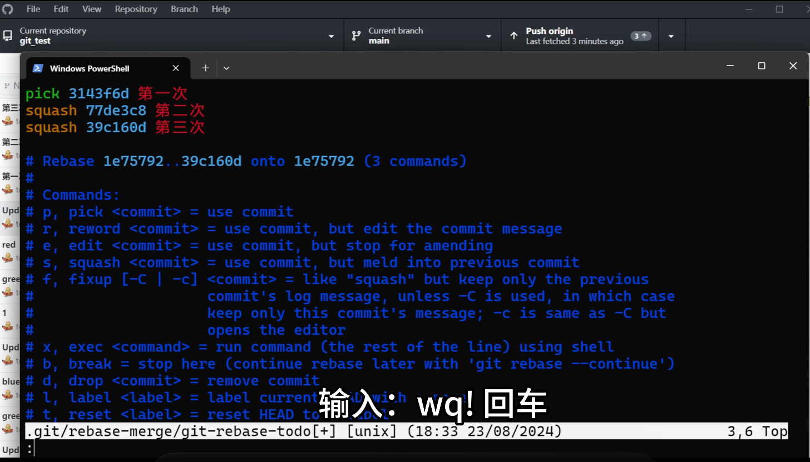

# A. Git 命令行（3）知识点总结
| 字母    | 全称        | 含义说明                          |
| ----- | --------- | ----------------------------- |
| **A** | Added     | 文件被新增，并已加入暂存区（`git add` 后）    |
| **M** | Modified  | 文件已修改（可能在工作区或暂存区）             |
| **D** | Deleted   | 文件被删除                         |
| **R** | Renamed   | 文件被重命名                        |
| **C** | Copied    | 文件是从其他文件复制出来的                 |
| **U** | Unmerged  | 文件存在冲突（需要手动解决）                |
| **?** | Untracked | 文件未被 Git 跟踪（新文件，尚未 `git add`） |
| **!** | Ignored   | 文件被 `.gitignore` 忽略           |


## 一、`git diff` 的使用

* **基本功能**：查看差异（比较不同区域或分支的改动）。
* **常见用法**：

  * `git diff`
    比较 **工作目录** 和 **暂存区** 的差异。
  * `git diff --staged`
    比较 **暂存区** 和 **本地分支（HEAD）** 的差异。
  * `git diff HEAD`（ **HEAD 就是本地仓库的最新提交**）
    比较 **工作目录** 和 **本地分支（HEAD）** 的差异。
* **分支比较**：

  * `git diff main..feature`（两点比较）
    比较两个分支的最新提交（c2 vs c3）。
  * `git diff main...feature`（三点比较）
    找到两个分支的**共同祖先**，比较该祖先与“靠后的分支”的差异。

    * GitHub 默认使用 **三点比较**。
    * 两点比较能看到双方差异，三点比较只能看到某一侧的改动。
    * 直接改GitHub 网址里`...` 到 `..`，就可以直接变动了
* **commit/tag 对比**：

  * `git diff commit1 commit2`
  * `git diff tag1 tag2`
  * `git diff tag branch`
  * `git diff commit branch`
    三者可以任意互相比较。

---

## 二、解决分支冲突与 PR

1. 本地合并：`git merge main`（在 feature 分支上执行）。
2. 解决冲突 → 修改文件 → `git add .` → `git commit -m "resolve conflict"`.
3. 推送更新：`git push`。
4. 再去 GitHub 提交 PR，此时不会再有冲突。

---

## 三、`git stash`（暂存修改）

* **作用**：临时保存当前修改（避免影响分支切换/其他操作）。
* **`stash`是`藏匿`的意思**
* **常用命令**：

  * `git stash`：保存暂存区改动。
  * `git stash -a`：保存 **工作区+暂存区** 的所有改动。
  * `git stash list`：查看保存的列表。
  * `git stash apply stash@{0}`：取出指定 stash（不删除，windows系统里要加单引号，因为在powershell里花括号是一个特殊的语法）。
  * `git stash drop stash@{0}`：删除指定 stash。
  * `git stash pop stash@{0}`：取出并删除。

---

## 四、Git Tag（标签）

* **创建标签**：

  * `git tag v1.0.0` → 在最新提交打标签。
  * `git tag v1.0.1 <commit-id>` → 在历史提交打标签。
* **查看标签**：`git tag`
* **推送全部标签**：`git push --tags`
* **只推送特定标签**：`git push origin v1.0.1`
* **删除标签**：

  * 本地：`git tag -d v1.0.1`
  * 远端：`git push origin --delete v1.0.1`

---

## 五、合并提交（Squash Commits）

### 方法一：reset + 重做

1. `git log`找到要保留的那个提交 ID。
2. `git reset --mixed <commit-id>`
   → 撤销后续提交，之前提交的改动保留在工作区。
   - 这种可以把3次提交压缩成1次
3. `git add . && git commit -m "合并提交说明"`
   → 将多个提交重新压缩成一次提交。
4. 如果远端已有历史，需 `git push -f`。


### 方法二：交互式 rebase

1. 启动交互式 rebase：

```bash
git rebase -i <commit-id>
```

（选择一个更早的 commit）。

2. 编辑 rebase 界面：

* `pick`：保留提交。
* `reword`：修改提交信息。
* `squash`：合并进上一个提交。
* 其他选项：`edit`、`drop`、`reset`、`merge`。
* 点击 `i` 键进入编辑模式
  

3. 至少保留一个 `pick`，其他可以 `squash`。

4. 保存退出：按 `Esc` 键，输入 `:wq!` 回车。

5. 处理过程中可能出现的操作：

* **继续 rebase**：当 Git 停下来等待你解决冲突或编辑提交时，使用：

```bash
git rebase --continue
```

Git 会继续执行剩下的 rebase 操作。

* **中止 rebase**：如果操作过程中出错或者想放弃当前 rebase，可以使用：

```bash
git rebase --abort
```

Git 会撤销所有已经进行的 rebase 操作，回到最初状态。

6. 完成 rebase 后推送：

* 本地未推送 → `git push`
* 已推送过远端 → `git push -f`

7. **注意**：多人协作分支禁止强推。


> **后文还有**Git 修改 Commit Message 知识点总结
---

## 六、注意事项

* **GitHub 默认使用三点比较**，如需改为两点比较可手动修改 URL 中的 `...` 为 `..`。
* `git rebase -i` 可以修改任意历史提交，但需谨慎，**不要在集成分支使用**。
* Stash 在 Windows PowerShell 下需要给 `stash@{0}` 加引号：
  `git stash apply "stash@{0}"`.

---

# B. Git 删除远程分支后的同步与清理机制

## 一、现象说明

当你在 **GitHub 上删除分支** 后，执行：

```bash
git branch -a
```

仍可能看到类似：

```
remotes/origin/feature
```

这并不是 GitHub 的实时状态，而是：

> 本地保存的 “远程分支缓存（remote-tracking branch）”。

---

## 二、Git 的远程分支缓存机制

* **`remotes/origin/<branch>`** 是本地保存的远程分支快照。
* 它记录了你上次 `git fetch` 或 `git pull` 时远程仓库的状态。
* Git 不会自动更新或删除这些记录，除非你主动刷新。

📘 换句话说：

> GitHub 上删除分支 ≠ 本地自动删除缓存。
> 本地仍保留上次同步时的“远程分支影子”。

---

## 三、同步与清理命令

### ✅ 1. 刷新远程分支状态并清理已删除分支

```bash
git fetch -p
```

或：

```bash
git fetch --prune
```

**作用：**

* 从远程重新获取分支列表；
* 自动删除本地不存在的远程分支引用。

执行后再查看：

```bash
git branch -a
```

→ 已删除的远程分支将消失。

---

### ✅ 2. 手动清理所有无效远程引用

```bash
git remote prune origin
```

**作用：**

* 对 `origin` 远程执行清理；
* 删除所有远程已不存在的分支缓存。

---

### ✅ 3. 手动删除单个远程追踪分支

```bash
git branch -dr origin/<branch-name>
```

**作用：**

* 仅删除指定的远程分支缓存记录。
* 不影响远程仓库，只影响本地缓存。

---

## 四、命令对比表

| 命令                               | 作用             | 场景       |
| -------------------------------- | -------------- | -------- |
| `git fetch`                      | 仅更新现有远程分支内容    | 不会删除本地缓存 |
| `git fetch -p` / `--prune`       | 更新 + 清理远程已删除分支 | **推荐使用** |
| `git remote prune origin`        | 清理本地保存的远程分支缓存，删除那些在远程仓库中已经不存在，但本地还保留着引用的分支 | 定期维护用    |
| `git branch -dr origin/<branch>` | 删除单个无效远程分支缓存   | 定向清理     |

---

## 五、验证命令

查看远程分支状态：

```bash
git branch -a
```

输出示例（清理前）：

```
  main
* dev
  remotes/origin/main
  remotes/origin/dev
  remotes/origin/feature   ← 实际远程已删除
```

执行：

```bash
git fetch -p
```

再次查看：

```
  main
* dev
  remotes/origin/main
  remotes/origin/dev
```

✅ `remotes/origin/feature` 已消失。

---

# C. Git Rebase 交互式完整流程（示例）

## 1️⃣ 检查仓库状态

```bash
git status
```

确保没有未提交的修改。如果有：

```bash
git add .
git commit -m "保存当前修改"
```

---

## 2️⃣ 查看 commit 历史

```bash
git log --oneline
```

示例输出：

```
C3 修复 bug
B2 新增功能 B
A1 新增功能 A
```

这里我们假设想修改 `A1` 之后的 commit 顺序或内容。

---

## 3️⃣ 启动交互式 rebase

```bash
git rebase -i A1
```

打开的编辑器会显示：

```
pick B2 新增功能 B
pick C3 修复 bug
```

---

## 4️⃣ 编辑 commit 行动

每行开头是命令，常用命令：

| 命令     | 作用                |
| ------ | ----------------- |
| pick   | 保留该 commit 不变     |
| reword | 修改 commit message |
| edit   | 修改 commit 内容      |
| squash | 合并到上一个 commit     |
| drop   | 删除该 commit        |

示例：修改 B2 的 commit message，合并 C3 到 B2：

```
reword B2 新增功能 B
squash C3 修复 bug
```

保存并退出编辑器。

---

## 5️⃣ 执行修改

* 如果是 `reword`，Git 会让你输入新的 commit message。
* 如果是 `edit`，Git 会停在该 commit，让你修改文件：

```bash
# 修改文件
git add .
git commit --amend   # 修改当前 commit
git rebase --continue  # 继续 rebase
```

---

## 6️⃣ 处理冲突（如果出现）

```bash
git status  # 查看冲突文件
# 编辑冲突文件，解决冲突
git add <file>
git rebase --continue 
```

重复直到 rebase 完成。

---

## 7️⃣ 查看修改结果

```bash
git log --oneline
```

确认 commit 顺序和内容是否符合预期。

---

## 8️⃣ 推送到远程

如果原 commit 已经推送过远程仓库，需要强制推送：

```bash
git push origin main --force
```

⚠️ 注意：`--force` 会覆盖远程历史，确保团队成员知情。

---

💡 **小技巧**：

* rebase 操作前最好备份分支：

```bash
git branch backup-branch
```

# 📝 知识笔记：Git 修改 Commit Message 知识点总结

### 一、修改最近一次提交信息（未推送）

如果提交还未推送到远程仓库，可以直接修改：

```bash
git commit --amend -m "新的 commit message"
```

修改后强制推送覆盖远程：

```bash
git push origin main -f
```

> ⚠️ 注意：`-f`（force push） 会覆盖远程分支历史，需确保无人协作开发。


### 二、修改已推送的提交信息（重写历史）

若提交已推送到 GitHub，可通过 **交互式 rebase** 修改。

**操作步骤：**

1. 查看提交记录：

   ```bash
   git log
   ```

2. 打开交互式 rebase（假设要修改最近三次提交之一）：

   ```bash
   git rebase -i HEAD~3
   ```

3. 在编辑器中，将想修改的那一行前的 `pick` 改为 `reword`：

   ```
   pick 1aa81b2 abc
   reword d5de7ef 建文档
   pick 2e7f5fb xing
   ```

4. **保存并退出**：
   - 按 `Ctrl + X`
   - 按 `Y` 确认保存
   - 按 `Enter` 确认文件名保存退出后，Git 会进入编辑模式，让你输入新的 commit message。

5. 修改完成后，强制推送覆盖远程：

   ```bash
   git push origin main -f
   ```

> ✅ 建议：若团队协作，先在群里说明，避免他人基于旧提交开发。

---

### 三、无权限修改远程历史时的做法

如果没有修改权限（例如不是仓库管理员）：

* 可以在 GitHub 上提一个 **Issue 或 PR** 说明修改请求；
* 或在本地新增一次提交补充说明：

  ```bash
  git commit -m "fix commit message of abc"
  git push origin main
  ```

---

### 四、修改最早的**commit message**(以及合并到最早的commit)

1. **启动交互式 rebase**

```bash
git rebase -i --root
```

* `--root` 表示从最早的 commit（根 commit）开始操作。

2. **编辑命令**

编辑器会显示：

```
pick A1 新增功能 A
pick B2 新增功能 B
pick C3 修复 bug
```

把 `A1` 的 `pick` 改成 `reword`：

```
reword A1 新增功能 A
pick B2 新增功能 B
pick C3 修复 bug
```

按 `Esc` 键和 `:wq!` 回车，保存并退出编辑器。

3. **修改 commit message**

Git 会提示你输入新的 commit message，例如：

```
新增功能 A（更新后的描述）
```

按 `Esc` 键和 `:wq!` 回车，保存退出即可。

4. **完成 rebase**

* 如果没有冲突，Git 会自动完成 rebase。
* 如果出现冲突，先解决冲突，再用：

```bash
git rebase --continue
```

* 如果放弃操作，使用：

```bash
git rebase --abort
```

---