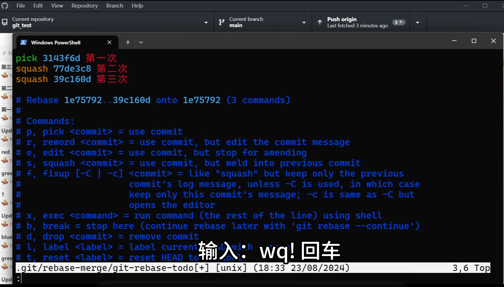

# Git 命令行（3）知识点总结
| 字母    | 全称        | 含义说明                          |
| ----- | --------- | ----------------------------- |
| **A** | Added     | 文件被新增，并已加入暂存区（`git add` 后）    |
| **M** | Modified  | 文件已修改（可能在工作区或暂存区）             |
| **D** | Deleted   | 文件被删除                         |
| **R** | Renamed   | 文件被重命名                        |
| **C** | Copied    | 文件是从其他文件复制出来的                 |
| **U** | Unmerged  | 文件存在冲突（需要手动解决）                |
| **?** | Untracked | 文件未被 Git 跟踪（新文件，尚未 `git add`） |
| **!** | Ignored   | 文件被 `.gitignore` 忽略           |


## 一、`git diff` 的使用

* **基本功能**：查看差异（比较不同区域或分支的改动）。
* **常见用法**：

  * `git diff`
    比较 **工作目录** 和 **暂存区** 的差异。
  * `git diff --staged`
    比较 **暂存区** 和 **本地分支（HEAD）** 的差异。
  * `git diff HEAD`（ **HEAD 就是本地仓库的最新提交**）
    比较 **工作目录** 和 **本地分支（HEAD）** 的差异。
* **分支比较**：

  * `git diff main..feature`（两点比较）
    比较两个分支的最新提交（c2 vs c3）。
  * `git diff main...feature`（三点比较）
    找到两个分支的**共同祖先**，比较该祖先与“靠后的分支”的差异。

    * GitHub 默认使用 **三点比较**。
    * 两点比较能看到双方差异，三点比较只能看到某一侧的改动。
    * 直接改GitHub 网址里`...` 到 `..`，就可以直接变动了
* **commit/tag 对比**：

  * `git diff commit1 commit2`
  * `git diff tag1 tag2`
  * `git diff tag branch`
  * `git diff commit branch`
    三者可以任意互相比较。

---

## 二、解决分支冲突与 PR

1. 本地合并：`git merge main`（在 feature 分支上执行）。
2. 解决冲突 → 修改文件 → `git add .` → `git commit -m "resolve conflict"`.
3. 推送更新：`git push`。
4. 再去 GitHub 提交 PR，此时不会再有冲突。

---

## 三、`git stash`（暂存修改）

* **作用**：临时保存当前修改（避免影响分支切换/其他操作）。
* **`stash`是`藏匿`的意思**
* **常用命令**：

  * `git stash`：保存暂存区改动。
  * `git stash -a`：保存 **工作区+暂存区** 的所有改动。
  * `git stash list`：查看保存的列表。
  * `git stash apply stash@{0}`：取出指定 stash（不删除，windows系统里要加单引号，因为在powershell里花括号是一个特殊的语法）。
  * `git stash drop stash@{0}`：删除指定 stash。
  * `git stash pop stash@{0}`：取出并删除。

---

## 四、Git Tag（标签）

* **创建标签**：

  * `git tag v1.0.0` → 在最新提交打标签。
  * `git tag v1.0.1 <commit-id>` → 在历史提交打标签。
* **查看标签**：`git tag`
* **推送标签**：`git push --tags`
* **删除标签**：

  * 本地：`git tag -d v1.0.1`
  * 远端：`git push origin --delete v1.0.1`

---

## 五、合并提交（Squash Commits）

### 方法一：reset + 重做

1. `git log`找到要保留的那个提交 ID。
2. `git reset --mixed <commit-id>`
   → 撤销后续提交，之前提交的改动保留在工作区。
3. `git add . && git commit -m "合并提交说明"`
   → 将多个提交重新压缩成一次提交。
4. 如果远端已有历史，需 `git push -f`。

### 方法二：交互式 rebase

1. `git rebase -i <commit-id>`
   （选择一个更早的 commit）。
2. 编辑 rebase 界面：

   * `pick`：保留提交。
   * `reword`：修改提交信息。
   * `squash`：合并进上一个提交。
   * 其他选项：`edit`、`drop`、`reset`、`merge`。
   * 点击`i`键进入到编辑模式
   
3. 至少保留一个 `pick`，其他可以 `squash`。
4. 保存退出后，完成 rebase。
5. 推送：

   * 本地未推送 → `git push`
   * 已推送过远端 → `git push -f`
6. **注意**：多人协作分支禁止强推。

---

## 六、注意事项

* **GitHub 默认使用三点比较**，如需改为两点比较可手动修改 URL 中的 `...` 为 `..`。
* `git rebase -i` 可以修改任意历史提交，但需谨慎，**不要在集成分支使用**。
* Stash 在 Windows PowerShell 下需要给 `stash@{0}` 加引号：
  `git stash apply "stash@{0}"`.

---

# Git 删除远程分支后的同步与清理机制

## 一、现象说明

当你在 **GitHub 上删除分支** 后，执行：

```bash
git branch -a
```

仍可能看到类似：

```
remotes/origin/feature
```

这并不是 GitHub 的实时状态，而是：

> 本地保存的 “远程分支缓存（remote-tracking branch）”。

---

## 二、Git 的远程分支缓存机制

* **`remotes/origin/<branch>`** 是本地保存的远程分支快照。
* 它记录了你上次 `git fetch` 或 `git pull` 时远程仓库的状态。
* Git 不会自动更新或删除这些记录，除非你主动刷新。

📘 换句话说：

> GitHub 上删除分支 ≠ 本地自动删除缓存。
> 本地仍保留上次同步时的“远程分支影子”。

---

## 三、同步与清理命令

### ✅ 1. 刷新远程分支状态并清理已删除分支

```bash
git fetch -p
```

或：

```bash
git fetch --prune
```

**作用：**

* 从远程重新获取分支列表；
* 自动删除本地不存在的远程分支引用。

执行后再查看：

```bash
git branch -a
```

→ 已删除的远程分支将消失。

---

### ✅ 2. 手动清理所有无效远程引用

```bash
git remote prune origin
```

**作用：**

* 对 `origin` 远程执行清理；
* 删除所有远程已不存在的分支缓存。

---

### ✅ 3. 手动删除单个远程追踪分支

```bash
git branch -dr origin/<branch-name>
```

**作用：**

* 仅删除指定的远程分支缓存记录。
* 不影响远程仓库，只影响本地缓存。

---

## 四、命令对比表

| 命令                               | 作用             | 场景       |
| -------------------------------- | -------------- | -------- |
| `git fetch`                      | 仅更新现有远程分支内容    | 不会删除本地缓存 |
| `git fetch -p` / `--prune`       | 更新 + 清理远程已删除分支 | **推荐使用** |
| `git remote prune origin`        | 清理所有无效的远程引用    | 定期维护用    |
| `git branch -dr origin/<branch>` | 删除单个无效远程分支缓存   | 定向清理     |

---

## 五、验证命令

查看远程分支状态：

```bash
git branch -a
```

输出示例（清理前）：

```
  main
* dev
  remotes/origin/main
  remotes/origin/dev
  remotes/origin/feature   ← 实际远程已删除
```

执行：

```bash
git fetch -p
```

再次查看：

```
  main
* dev
  remotes/origin/main
  remotes/origin/dev
```

✅ `remotes/origin/feature` 已消失。

---

## 六、核心知识点总结

| 概念                                 | 说明                                               |
| ---------------------------------- | ------------------------------------------------ |
| **远程追踪分支（remote-tracking branch）** | 本地缓存的远程分支状态，如 `remotes/origin/feature`           |
| **不会自动更新**                         | Git 不会自动检测远程分支是否被删除                              |
| **需手动同步**                          | 通过 `git fetch -p` 或 `git remote prune origin` 更新 |
| **安全操作**                           | 这些命令仅修改本地缓存，不会影响远程仓库                             |

---

## 七、一句话记忆

> 💡 GitHub 上删分支只是“云端动作”；
> 本地显示的远程分支是“缓存快照”；
> 想同步就执行：
>
> ```bash
> git fetch -p
> ```
>
> （fetch = 更新，prune = 清理）

---