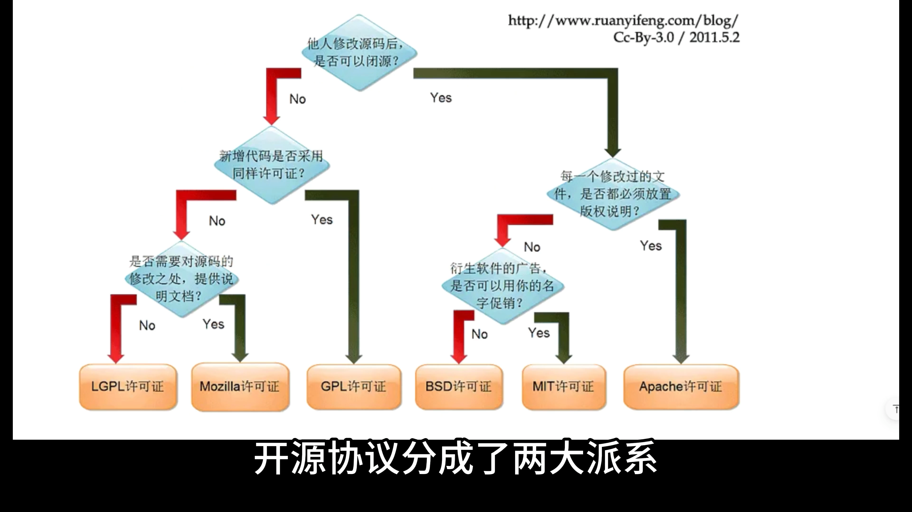

# 📘 第6课：创建自己的第一个仓库

## 一、仓库的概念与创建

### 1. 什么是仓库（Repository）

* 仓库是用来存放项目文件的“文件夹”。
* 可包含：源代码、配置文件、资源文件等。
* GitHub 中的仓库用于管理和协作开发项目。

### 2. 创建仓库的步骤

1. 打开 GitHub 网页，右上角点击 ➕ → **Create new repository**。
2. 填写以下内容：

   * **Repository name**：仓库名称（例：`hello-world`）。
   * **Description**：项目描述（例：“爬爬虾学习 GitHub”）。
3. 选择仓库类型：

   * **Public（公开）**：所有人可查看。
   * **Private（私有）**：仅自己可见（现已免费提供）。
4. 初始化设置：

   * 勾选 **Add a README file**（项目自述文件）。
   * **.gitignore** 暂时略过（后续课程讲解）。
   * **Choose a license** 选择开源协议（详见下文）。

---

## 二、开源协议（License）详解

### 1. 开源协议的作用

* 规定他人使用、修改、分发你代码的权利和限制。
* 不同协议影响代码是否能被闭源、商用。

### 2. 两大派系

#### 🟥 GPL 系列（强制开源）

* **GPL**：修改后必须继续开源（具有“传染性”）。

  * 示例项目：Linux、WordPress、Git。
  * 优点：保持开源纯粹性，防止商业闭源滥用。
  * 缺点：限制商业使用场景。
* **LGPL**：宽松版 GPL。

  * 新增部分的代码可不受 GPL 约束。
  * 解决部分“传染性”问题。

#### 🟩 宽松协议系列（允许闭源）

* **Apache 2.0**：

  * 修改文件需保留版权说明。
* **MIT**（最常用、最宽松）：

  * 仅需保留协议副本，可自由使用、修改、分发。
* **BSD**：

  * 类似 MIT，但禁止用原作者姓名做项目推广。

🟢 建议：初学者可选 **MIT 协议**。

---

## 三、README 文件的作用与编辑

### 1. README 是什么

* 项目的自述文件，用于说明：

  * 项目用途与功能；
  * 环境搭建与运行方式；
  * 使用示例与注意事项。

### 2. 编辑 README 步骤

1. 在仓库主页点击 **README.md** → ✏️ 编辑图标。
2. 使用 **Markdown** 语法编写内容。
3. 点击 **Preview** 预览效果。
4. 填写 **Commit message**（提交说明）。
5. 点击 **Commit changes** 提交。

---

## 四、Commit 提交机制

### 1. Commit 是什么

* Git 的核心概念之一。
* 每次提交都会保存项目当前状态的“快照”。
* 多次提交形成一条 **commit 历史链（commit history）**。

### 2. Commit 的意义

* 可查看每次改动的内容和时间。
* 每次提交都有独一无二的 **Commit ID（哈希值 / SHA 值）**。

  * 分为长 ID 与短 ID（常用短 ID）。
* 提交信息格式：

  * `Commit directly to the main branch`：直接提交到主分支。

### 3. 查看 Commit 历史

* 仓库主页 → “commits” 按钮。
* 可查看：

  * 每次提交的时间、改动文件；
  * 提交说明；
  * 文件新增/删除（绿色/红色标识）。

### 4. 回溯历史版本

* 点击任意 commit 可查看当时仓库状态。
* 每个 commit 都是可回溯的历史快照。

---

## 五、上传文件到仓库

### 1. 页面上传方式

1. 点击 **Add file → Upload files**。
2. 选择本地文件上传。
3. 填写 **Commit message**。
4. 点击 **Commit changes** 保存。

### 2. 示例

* 上传“第一节文字稿”。
* 提交信息：`上传第一节文字稿`。

---

## 六、GitHub Gist（轻量级小仓库）

### 1. 作用

* 用于分享单个代码文件或代码片段。
* 类似于小型仓库（支持 Git 操作，如 clone）。

### 2. 创建步骤

1. 点击右上角 ➕ → **New gist**。
2. 输入：

   * 文件名（例：`redis.java`）。
   * 代码内容。
   * 可选：Public（公开）或 Secret（私密）。
3. 点击 **Create public gist** 创建。

### 3. 分享方式

* **Embed（嵌入）**：可将代码片段嵌入网页（HTML 标签方式）。
* **Share（分享链接）**：生成 URL，其他人可查看与评论。
* **Clone（克隆）**：

  * 支持 HTTPS 或 SSH 克隆到本地。

---

## 七、本节总结

| 模块      | 知识点                                      |
| ------- | ---------------------------------------- |
| 仓库创建    | 创建第一个仓库、填写名称描述、选择公开/私有                   |
| README  | 项目说明文件，支持 Markdown                       |
| License | GPL（强制开源）、LGPL（宽松GPL）、MIT/Apache/BSD（宽松） |
| Commit  | 提交即快照，形成历史链，可回溯                          |
| 上传文件    | 页面直接上传并提交                                |
| Gist    | 轻量小仓库，用于代码片段分享，支持嵌入与克隆                   |

---

✅ **核心记忆点**

* 仓库是项目的根目录。
* README 是自述文件。
* License 决定代码能否被闭源使用。
* 每次 commit 是项目的一个快照。
* Gist 适合分享单文件代码。

---
# GitHub 修改 License 详细步骤指南

## 方法一：通过 GitHub 网页界面修改（推荐）

### 步骤1：进入仓库设置
1. 打开你的 GitHub 仓库页面
2. 点击仓库页面顶部的 **"Settings"** 标签
3. 在左侧菜单中找到 **"General"** 选项

### 步骤2：找到 License 部分
1. 在 General 页面中向下滚动
2. 找到 **"Features"** 部分
3. 在 Features 部分中找到 **"License"** 选项
4. 点击 **"Choose a license template"** 或 **"Add license"**

### 步骤3：选择新的 License
1. 在弹出的页面中选择你想要的 License 类型
2. 常见选择：
   - **MIT License** - 最宽松的开源许可证
   - **Apache License 2.0** - 企业友好的许可证
   - **GNU GPL v3** - 强copyleft许可证
   - **BSD 3-Clause** - 宽松许可证
   - **No License** - 无许可证

### 步骤4：配置 License 信息
1. 如果选择有许可证，填写必要信息：
   - **Full name** - 你的全名或组织名
   - **Year** - 版权年份
   - **Email** - 联系邮箱（可选）

### 步骤5：提交更改
1. 点击 **"Review and submit"**
2. 确认信息无误后，点击 **"Commit changes"**
3. 选择提交方式：
   - **Commit directly to the main branch** - 直接提交到主分支
   - **Create a new branch for this commit and start a pull request** - 创建新分支

## 方法二：通过命令行修改

## 方法三：使用 GitHub API（高级）