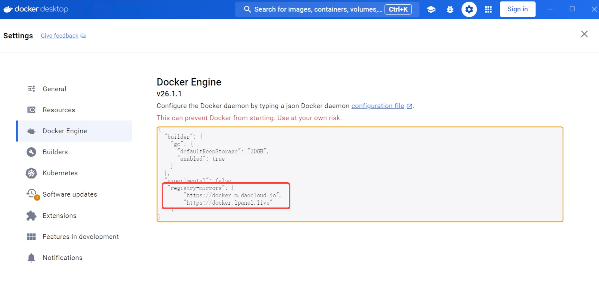

## 知识点总结：Action 辅助使用 Docker

本节课主要围绕在当前国内环境下，如何**安装 Docker**、**拉取（Pull）镜像**以及**查找镜像名称**这三个核心问题展开，其中大量使用了 **GitHub Actions** 来辅助解决网络和下载问题。

### 一、Docker 安装方法

| 操作系统 | 核心步骤 | 细节说明 |
| :--- | :--- | :--- |
| **Linux** | **一键安装脚本** | 1. 使用 **GitHub Actions** 每日定时从官网 `get.docker.com` 下载并保存的脚本（等同于官网脚本）。 2. **备用命令**：如果网络有问题，可将脚本地址替换为国内的 **`gitee` (getee)** 地址。 3. 安装完成后需执行启动命令。 |
| **Windows** | **WSL + Docker Desktop** | 1. 在“启用或关闭 Windows 功能”中勾选 **“适用于 Linux 的 Windows 子系统”** 和 **“虚拟机平台”**，然后重启。 2. 以管理员身份运行 CMD，执行 `wsl --set-default-version 2` 和 `wsl --update`（国内网络建议加 `--web-download`）。 3. 从项目 **Release** 页面下载 Windows 版 **Docker Desktop** 安装包安装。 4. 可使用命令行加参数指定安装目录。`start /w "" "Docker Desktop Installer.exe" install --installation-dir=D:\Docker ` |
| **Mac** | **下载安装包** | 从项目 **Release** 页面下载对应芯片的安装包：**ARM64**（苹果芯片）或 **x86**（Intel 芯片）双击安装。 |

---
### 二、Docker 镜像拉取/加速方案 (Pull/Fetch)

提供了五种解决国内拉取镜像困难的方案：

#### 方案一：使用 GitHub Actions 转存到阿里云私有仓库 (推荐)

* **原理**: 利用 **GitHub Actions** 的高速网络，将 Docker Hub 上的公共镜像下载后，自动上传转存到用户自己的**阿里云私有仓库**中，供个人或公司服务器使用。
* **项目地址**: `https://github.com/tech-shrimp/docker_image_pusher`
* **视频地址**: `https://www.bilibili.com/video/BV11e411i7Xx/`
* **优势**: 完全免费，配置简单，支持 **40 GB** 大型镜像，使用阿里云官方线路，速度快且稳定。
* **配置流程**:
    1.  登录阿里云镜像服务，创建个人版，设置登录密码，创建**命名空间**。
    2.  获取以下四个**环境变量**: `命名空间`、`用户名`、`密码`、`仓库地址`。
    3.  Fork 提供的 GitHub 项目到自己名下。
    4.  在自己项目的 **Settings -> Secrets and Variables -> Actions** 中添加上述四个环境变量。
    5.  修改项目中的 `images.txt` 文件，添加要转存的镜像名称及可选的 **tag 号**（例如：`alpine:3.19`）。
    6.  提交更改，Action 自动执行构建和转存。
    7.  使用阿里云仓库提供的 `docker pull` 命令拉取镜像。

#### 方案二：配置国内镜像站（配置 Registry Mirror）

* 选择背靠较大开源项目（如清华、中科大等）的镜像源。
* **Linux 配置**: 修改配置文件 `/etc/docker/daemon.json`，添加镜像源配置，然后执行 `systemctl restart docker` 重启服务。
* **项目地址**:`https://github.com/tech-shrimp/docker_installer`
* **Windows/Mac 配置**: 在 Docker Desktop 的 **Settings -> Docker Engine** 中，修改 JSON 配置文件，添加镜像源配置，然后点击 **Apply and Restart**。

#### 方案三：使用 GitHub Action 下载离线镜像

* 提及一个国内博主“悟空的日常”提供的项目，可用于下载 Docker 的**离线镜像**文件。
* **项目地址**：`https://github.com/wukongdaily/DockerTarBuilder`

#### 方案四：使用一键脚本

* 使用一个一键脚本命令，该脚本可**自动测试**各个 Docker 镜像源的可用性，并选择**最优**的进行下载。
* 使用Github Action下载docker离线镜像: `https://github.com/wukongdaily/DockerTarBuilder`
* 执行时需要在命令最后加上**完整的镜像名**（例如：`小雅的alist`）。

#### 方案五：使用 Cloudflare Worker 自建加速

* 提及可以使用 **Cloudflare Worker** 来自建镜像加速服务（视频中未详细演示，但提供了相关 GitHub 地址）。
* **项目地址**:`https://github.com/cmliu/CF-Workers-docker.io`

---
### 三、如何查找镜像名称

* **专用搜索网站**: 视频项目最下方提供了一个**搜索网站**，用户可以在其中搜索各种 Docker 镜像，网站会显示所有**可用版本**和**架构**。
* **项目地址**:`https://docker.fxxk.dedyn.io/`