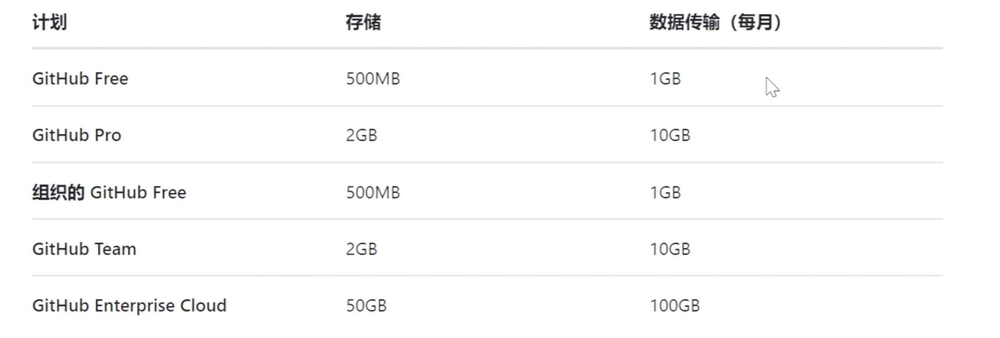

## 27. GitHub Packages 知识点笔记

### 核心概念

* **GitHub Packages**：是 GitHub 提供的包管理服务，允许用户将软件包（如 npm, Maven, Docker 等）推送到 GitHub 自己的仓库中，并在项目中使用。
* **收费政策**：
    * **公开仓库**：免费提供功能。
    * **私人仓库**：免费提供 500MB 存储空间，每月 1GB 传输带宽。

### 一、发布 npm 包到 GitHub Packages（发布侧）

| 步骤 | 操作命令/文件 | 关键配置/说明 |
| :--- | :--- | :--- |
| **1. 环境准备** | `node -v` / `npm -v` | 确保 Node.js 和 npm 已安装。 |
| **2. 初始化项目** | `npm init` | 初始化 npm 包，注意在 `@` 后接上 **`@<用户名>/<仓库名>`**。 |
| | | **示例：** `@taxshamp/package-example`。 |
| **3. 安装依赖** | `npm install` | 生成 `package-lock.json` 文件。 |
| **4. 自动发布配置** | `.github/workflows/release-package.yml` | 创建 GitHub Actions Workflow 文件，用于自动发布。 |
| | **触发器** | 配置为 `on: release: types: [created]`（每次创建 Release 时触发）。 |
| | **Registry URL (重点)** | 在 `actions/setup-node` 步骤中，设置 `registry-url:` 为 **`https://npm.pkg.github.com`**。 |
| | **发布命令** | `npm publish`。 |
| | **Token** | 使用内置的 **`${{ secrets.GITHUB_TOKEN }}`**，无需手动创建和配置。 |
| **5. 配置 `package.json`** | `package.json` | 在文件末尾添加一行配置，告诉 npm 发布的目标地址。 |
| | **配置项** | 添加 `"publishConfig": { "registry": "https://npm.pkg.github.com/" }` |
| **6. 触发发布** | GitHub 界面 | **创建 Release**（Create a new release），Action 会自动运行并推送包。 |
| **结果** | **项目主页右侧** | 出现 **Packages** 选项卡，点击即可看到发布的包。 |

---

### 二、使用 GitHub Packages 中的包（消费侧）

| 步骤 | 操作命令/文件 | 关键配置/说明 |
| :--- | :--- | :--- |
| **1. 声明依赖** | `package.json` | 在 `dependencies` 中添加需要使用的包及其版本。 |
| | **示例：** `"@taxshamp/package-example": "^1.0.0"` |
| **2. 配置 npm 注册表 (Registry)** | `.npmrc` | **必须**创建此文件，告诉 npm 不仅要去官方仓库，也要去 GitHub Packages 查找。 |
| | **第一行配置** | **声明注册表地址**：`@<用户名>:registry=https://npm.pkg.github.com/` |
| | | **示例：** `@taxshamp:registry=https://npm.pkg.github.com/` |
| **3. 获取访问权限** | **GitHub Token** | 需要创建一个 **Personal Access Token (PAT)** 来获取私有包的访问权限。 |
| | **Token 权限** | 必须勾选 **`write:packages`** 和 **`read:packages`** 等与 package 相关的权限。 |
| | **Token 配置** | 在 `.npmrc` 中添加：`//npm.pkg.github.com/:_authToken=<你的PAT>` |
| **4. 安装包** | `npm install` | 在项目目录下执行，即可从 GitHub Packages 下载安装。 |
| **最终效果** | **`node_modules`** | 即可看到下载好的包。 |

---

### 🔑 总结使用步骤

1.  在 `package.json` 的 `dependencies` 中添加包引用。
2.  创建 `.npmrc` 文件，将 **GitHub Packages 声明为 npm 仓库之一**。
3.  在 `.npmrc` 中配置 **GitHub Personal Access Token (PAT)** 用于认证。