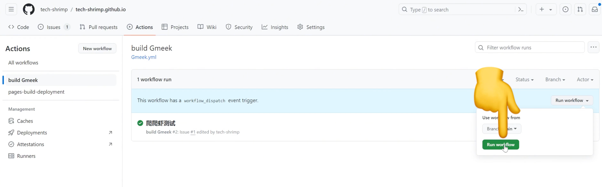
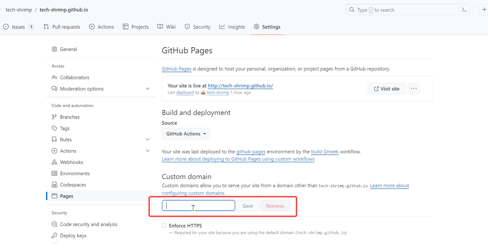
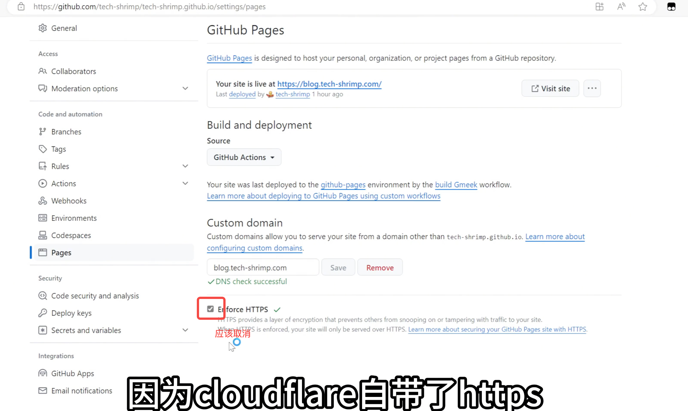

# Github个人博客框架

## 🧭 一、总体思路

* **目标**：利用 **GitHub Pages + GitHub Actions + GitHub Issues** 快速搭建无需服务器的个人博客。
* **特点**：

  1. **零门槛**：不需写代码、不需服务器、不需域名。
  2. **极速部署**：只需一个 GitHub 账号，十几秒即可生成博客。
  3. **完全免费**：全流程依托 GitHub 提供的免费服务。
  4. **跨端支持**：手机端与电脑端均可访问，效果一致。
  5. **数据长寿**：GitHub 作为全球最大代码托管平台，长期可用性强。

---

## ⚙️ 二、博客系统构成


| 模块                 | 功能                 |
| ------------------ | ------------------ |
| **GitHub Pages**   | 用于托管静态页面，生成博客前端界面。 |
| **GitHub Actions** | 自动构建与部署博客内容。       |
| **GitHub Issues**  | 用作写作平台（副文本编辑器）。    |

---

## 🚀 三、快速搭建流程

1. **通过模板创建仓库**
   * **项目地址**：`https://github.com/Meekdai/Gmeek`
   * 进入模板项目 → 点击「Use this template」。
   * 仓库命名格式：`yourname.github.io`（自动获得免费域名）。
   * 点击 **Create Repository** 创建仓库。

2. **配置 GitHub Actions**

   * 打开仓库 **Settings → Actions**。
   * 启用 Actions 权限（默认配置即可）。

3. **写第一篇文章**

   * 进入 **Issues → New issue**。
   * 填写标题与正文。
   * **关键步骤**：右侧必须添加一个标签（Label），如：`document`。
   * 保存 Issue。

4. **构建博客**

   * 提交 Issue 后，进入 **Actions** 查看构建状态。
   * 出现绿色对勾 ✅ 表示构建完成。
   * 返回首页，点击自动生成的博客链接（GitHub Pages 域名）。
   * 刚刚发布的文章已上线。

---

## 🧠 四、GitHub Pages 长期性优势

* 相比知乎、微博等平台（未来存续性不确定），
  GitHub 依托微软，具备长期运行的保障。
* 博客托管在 GitHub 上不仅是技术选择，更是**让作品长寿的方式**。

---

## 🛠 五、修改配置与个性化

1. **修改博客标题与描述**

   * 打开仓库 → 进入 `config.json` 文件。
   * 修改字段：

     ```json
     {
       "title": "技术爬爬虾的博客",
       "description": "分享好玩软件DIY的科技类内容",
       "avatar": "头像图片URL"
     }
     ```
   * 点击 **Commit changes** 保存。

2. **手动触发构建**

   * 打开 **Actions → Build Gmeek→ Run workflow**。
   * 执行后页面自动更新。

---

## 🌐 六、自定义域名配置


1. 打开仓库 → **Settings → Pages**。
2. 在「Custom domain」填写自定义域名，例如：

   ```
   blog.t.com
   ```
3. 若使用 **Cloudflare** 管理域名：

   * 添加一条 **CNAME 记录**：

     ```
     类型：CNAME
     名称：blog
     目标：yourname.github.io
     ```
   * 关闭 GitHub Pages 的 HTTPS（Cloudflare 已自带）。
   
   * 保存并等待解析生效。
4. 配置域名可以参考：`https://www.bilibili.com/video/BV1Mz421e76M/`
---

## ✍️ 七、写作与 Markdown 编辑

* **使用 Issues 编辑器编写博文**，支持 Markdown 语法。

### 1. 标题语法

| 类型   | 写法         | 示例       |
| ---- | ---------- | -------- |
| 一级标题 | `# 一级标题`   | # 一级标题   |
| 二级标题 | `## 二级标题`  | ## 二级标题  |
| 三级标题 | `### 三级标题` | ### 三级标题 |

### 2. 文字样式

* **加粗**：`**文本**`
* *斜体*：`*文本*`
* 引用：`> 引用内容`

### 3. 代码块

```python
print("Hello GitHub Blog")
````
- 用三个反引号包裹代码，可指定语言类型。

### 4. 列表语法
| 类型 | 示例 |
|------|------|
| 有序列表 | `1. 第一项` |
| 无序列表 | `- 项目` 或 `* 项目` |
| 任务列表 | `- [ ] 未完成`，`- [x] 已完成` |

### 5. 图片上传
- 点击「paste drop」或图片按钮上传本地图片。  
- 上传后自动生成 Markdown 图片链接。

---

## 🧩 八、总结回顾
- **核心逻辑**：GitHub Pages 负责展示，Actions 自动构建，Issues 负责内容。  
- **关键文件**：`config.json` 控制网站信息与样式。  
- **自定义域名**：通过 Cloudflare 配置 CNAME 即可。  
- **优点**：
  - 免费、稳定、安全；
  - 无需维护服务器；
  - 永久托管、全球访问；
  - 可随时增改内容、自动上线。  

---
