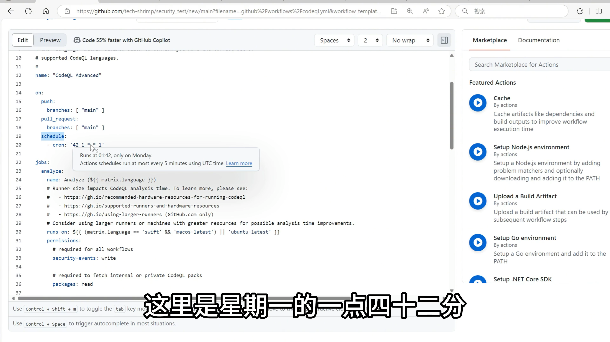
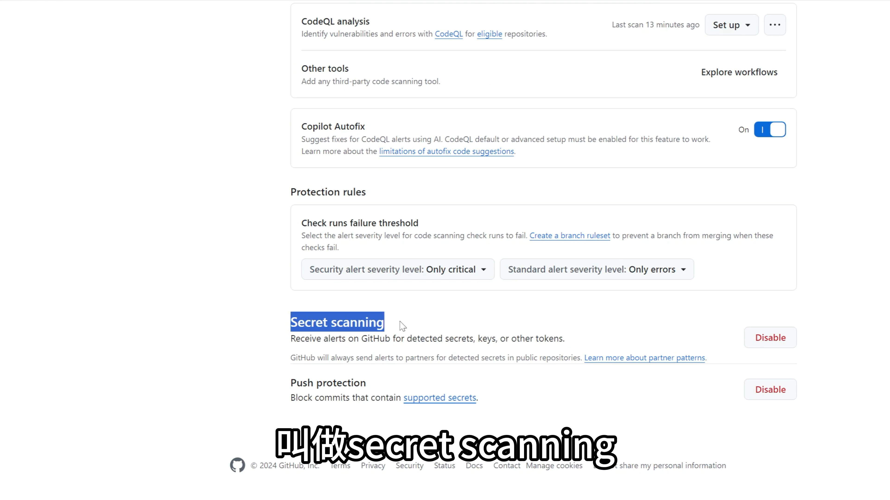

# GitHub 高级安全功能笔记

## 一、功能入口
- 主要入口位置：**Settings → Security → Code Security**
- 主要功能包括：
  1. Private Vulnerability Reporting
  2. Dependency Graph
  3. Dependabot
  4. Code Scanning（CodeQL）
  5. Secret Scanning
  6. Deploy Keys（部署密钥）

---

## 二、Private Vulnerability Reporting（私密漏洞报告）
- **功能说明**：允许其他用户私密地报告项目存在的安全风险。
- **作用**：避免将安全漏洞公开在 Issue 中被恶意利用。
- **操作步骤**：
  1. 开启该功能；
  2. 其他用户可通过 `Security → Report a vulnerability` 提交风险报告；
  3. 管理员可在 `Security → Advisories` 查看报告；
  4. 该页面仅报告者和管理员可见，不公开。

---

## 三、Dependency Graph（依赖关系图）
- **作用**：显示项目所使用的第三方依赖及其安全风险。
- **位置**：`Insights → Dependency graph`
- **相关选项**：
  - **Automated dependency submission**：通过 GitHub Actions 自动扫描依赖。
  - 目前仅支持 **Maven** 项目。

---

## 四、Dependabot（依赖自动化安全管理）
### 1. 功能概述
- 自动分析依赖中的安全问题；
- 自动创建 PR 修复依赖漏洞；
- 可定期扫描依赖。

### 2. 启用步骤
1. 进入 `Insights → Dependency graph`；
2. 找到 **Dependabot**；
3. 点击 **Enable Dependabot → Create config**；
4. 在生成的配置文件中：
   - 修改 `package-ecosystem` 为项目使用的包管理器（如 `pip`）；
   - 提交文件。

### 3. 实例演示
- 在 `requirements.txt` 添加旧版本依赖（如 `fastapi==1.0.0`）； 
- 在 `.github` 文件夹里，进入 `dependabot.yml` 文件，把里面的`weekly`字段改成`daily` ，改动完Github会对依赖立即进行一次扫描
- Dependabot 扫描后会自动创建 PR，建议升级至安全版本（如 `1.1.5`）。

### 4. 高级选项
| 选项 | 功能说明 | 建议 |
|------|-----------|------|
| Security updates | 自动发送安全通知 | ✅ 开启 |
| Auto-create PR | 自动创建修复 PR | ✅ 开启 |
| Grouped updates | 将多个漏洞修复合并成一个 PR | ✅ 开启 |
| Version updates | 不仅修复漏洞，还更新所有依赖版本 | ⚠️ 可选（更新频繁） |
| Runner environment | 指定运行环境（一般保持默认 Action Runner） | 默认即可 |

### 5. 扫描频率配置
- 默认：每周扫描一次；
- 可修改为：每日扫描。

---

## 五、Code Scanning（代码安全扫描）
### 1. 功能介绍
- **CodeQL 分析**：GitHub 提供的代码安全扫描工具；
- 扫描源代码本身的安全问题（不同于依赖扫描）。

### 2. 启用步骤
1. 提交存在安全问题的代码；
2. 进入 `Security → Code scanning`；
3. 启用 **CodeQL analysis**；
4. GitHub Actions 自动运行扫描。

### 3. 扫描结果查看
- 路径：`Security → Code scanning alerts`
- 示例：
  - 检测到使用不安全的哈希算法（如 `md5`）；
  - GitHub 提供修复建议；
  - 可一键创建 PR 自动修复。

### 4. 高级配置
- 点击 **Switch to Advanced**；
- 自动生成 `.github/workflows/codeql.yml`；
- 可配置：
  - 执行分支；
  - 定时任务（如每周一 01:42 自动扫描）；
  - 自定义扫描规则。

---

## 六、合并前安全检查（安全扫描阈值）
- 可在规则集中设置安全门槛：
  - 位置：`Settings → Rulesets → Branch protection`
- 配置项：
  - 指定哪些分支合并需通过安全扫描；
  - 设置不允许通过的漏洞等级：
    - `critical`：高危不通过；
    - `medium`：中危不通过；
    - `Errors`：扫描错误即不通过。

---

## 七、Secret Scanning（密钥扫描）
### 1. 功能说明
- GitHub 自动检测提交中是否包含密钥、密码等敏感信息；
- 若检测到敏感内容，**拒绝 push** 操作；
- 默认自动启用。


### 2. 正确的密钥管理方式
- 一定 不要将密码写入代码或配置文件；
- 应存储于：
  - `Settings → Secrets and variables → Actions → Secrets`；
  - GitHub 会对其中数据加密保存。

---

## 八、Deploy Keys（部署密钥）
### 1. 功能场景
- 用于服务器从 GitHub 克隆**私有仓库**时的身份认证；
- 无需使用账号密码。

### 2. 创建步骤

1. 在服务器生成 SSH 密钥：

    ```bash
    ssh-keygen -t rsa
    # 接下来一路回车 
    ```
    * 密钥路径：`~/.ssh/id_rsa`（私钥）与 `~/.ssh/id_rsa.pub`（公钥
 

2. 查看公钥内容：

    ```bash
    cat ~/.ssh/id_rsa.pub
    ```

3. 在 GitHub 仓库添加：
   * 进入 `Settings → Deploy keys → Add key`；
   * 粘贴公钥；
   * 勾选，是否开启写权限（默认只读）。

4. 克隆仓库时使用 **SSH** （ssh key）地址：

   ```bash
   git clone git@github.com:user/repo.git
   # 接下来回车后，输入yes，就可以clone了
   ```

### 3. 多服务器场景

* 每台服务器需单独添加一个 deploy key，每个仓库都要配置，可能有点麻烦；
* 或者将 SSH key 直接添加到 **用户级别** ：

  * 从右上角头像，选择 `Settings → SSH and GPG keys → New SSH key`
  * 使该用户下所有仓库通用该 key。

### 4. 自动化部署技巧

* 创建专用“机器人账号”用于部署；
* 将其加入项目协作者；
* 为其配置 SSH key 实现安全自动部署。

---

## 九、小结

| 功能模块                            | 主要作用     | 建议状态   |
| ------------------------------- | -------- | ------ |
| Private Vulnerability Reporting | 私密漏洞报告   | ✅ 开启   |
| Dependency Graph                | 查看依赖关系   | ✅ 开启   |
| Dependabot                      | 自动修复依赖漏洞 | ✅ 开启   |
| Code Scanning (CodeQL)          | 扫描代码安全漏洞 | ✅ 开启   |
| Secret Scanning                 | 防止密钥泄露   | ✅ 自动开启 |
| Deploy Keys                     | 安全部署私有仓库 | ✅ 按需配置 |

---

**建议实践：**

1. 保持依赖与代码扫描功能开启；
2. 定期查看 Security 报告；
3. 永远不要在代码中写入密钥；
4. 对私有仓库配置安全的 SSH 部署方式。
