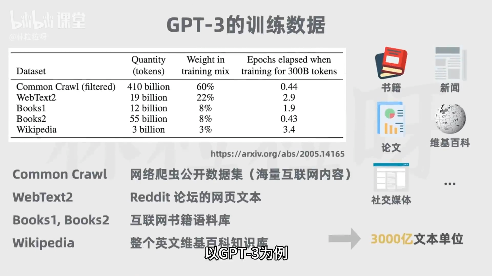
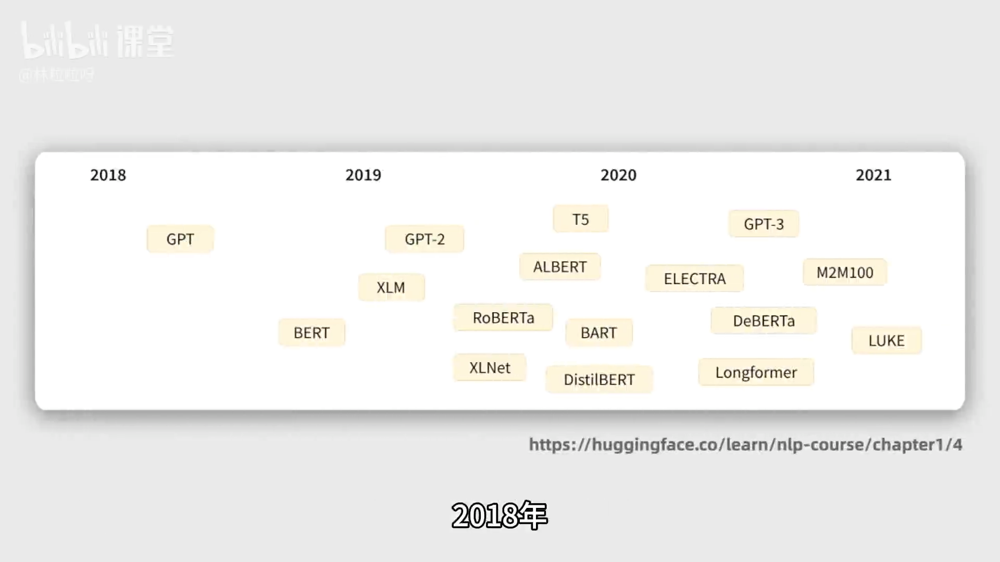

# 大语言模型（LLM）科普笔记（基于上传文档）

> 文档源：《3-AI科普 啥是大语言模型（LLM）-1080P 高清-AVC》  
> 目标：结构化 Markdown 知识点，便于阅读与渲染；尽量保留关键细节与示例。

---

## 1. 什么是大语言模型（LLM）
- 定义：LLM（Large Language Model）是用于自然语言相关任务的深度学习模型。
- 能力范围（输入文本 → 输出）：
  - 生成（generation）、分类（classification）、总结（summarization）、改写（paraphrase/rewriting）等。
- 代表性事件：2022-11-30 ChatGPT 上线，迅速达到百万级用户，推动 LLM 进入大众视野。
- 应用形态：各类 AI 聊天助手（如 ChatGPT、Claude、文心一言、通义千问等）皆基于 LLM。

---

## 2. 训练方式与数据来源（无监督预训练）
- 训练范式：首先进行大规模无监督学习（pre-training）。
- 数据来源（覆盖面广，细节如下）：
  - 互联网文本语料库、线上书籍、新闻文章、科学论文、维基百科、社交媒体帖子等。
- 训练目标（核心直觉）：
  - 通过海量文本，学习词与上下文之间的关系，更好理解语义，从而生成更准确的预测。

---

## 3. “大”的含义：不仅是数据量，更是参数量
- 参数（Parameters）的角色：
  - 模型内部变量，可理解为训练中“学到的知识”；决定模型如何对输入做出反应，进而决定模型行为。
- 经验规律（文中直观比喻）：
  - 可调“变量”越多（参数越多），配合更多数据与算力，模型越可能表现更好。
  - “做蛋糕”类比：只调面粉/糖/鸡蛋 vs. 还能调奶油、牛奶、苏打粉、可可粉、烤箱时长与温度 → 可探索更优配方，甚至做出新“品种”。
- 典型参数规模（里程碑模型）：
  - GPT-1：約 1.17 亿
  - GPT-2：約 15 亿
  - GPT-3：約 1750 亿
- 影响：参数规模增大，让模型从“专用器”转向“通用器”，不再局限于少数任务。

---

## 4. 从“单任务模型”到“一模多能”
- 过去：往往为不同任务分别训练独立模型（如：总结/分类/信息抽取各训练一套）。
- 现在：一个大模型可兼顾多种任务（在同一模型中“指令化”完成总结、分类、抽取等）。

---

## 5. 关键技术里程碑：Transformer 之前与之后
- 2017 年谷歌论文 《 Attention Is All You Need 》 提出 Transformer 架构，改变 NLP 发展方向。
- 随后涌现基于 Transformer 的模型：
  - 2018：OpenAI GPT-1；Google BERT
  - 2019：OpenAI GPT-2；（文中亦提及百度系模型等）
- 公众认知拐点：ChatGPT 面向公众开放、对话式交互流畅，带动 LLM 破圈。

---

## 6. 了解 GPT 的名字：Generative Pre-trained Transformer
- 含义拆解：
  - Generative：生成式
  - Pre-trained：预训练（在海量语料上先学通用语言能力）
  - Transformer：所用的核心神经网络架构
- 结论：理解 LLM，绕不过 Transformer。

---

## 7. 为什么 Transformer 重要（对比 RNN/LSTM）
- RNN（循环神经网络）的局限：
  - 序列逐步处理：每一步依赖上一步隐藏状态 → 训练难以并行，效率低。
  - 长依赖问题：距离越远，影响越弱，难以捕获长距离语义关系。
- LSTM 的改良与不足：
  - 一定程度缓解“短期记忆”问题，但仍然无法并行处理超长序列，性能与效率受限。
- Transformer 的两大关键创新：
  1) 自注意力机制（Self-Attention）
     - 处理每个词时，不仅看本词及附近词，还关注序列中的所有词，学习“相关性权重”（训练中习得）。
     - 能聚焦真正重要的信息，捕获远距离依赖。
     - 例：句中 “it” 语法上可指代近处的 “street” 或更远的 “animal”；自注意力可发现 “it” 与 “animal” 相关性更强，从而更准确理解指代。
  2) 位置编码（Positional Encoding）
     - 顺序信息至关重要。Transformer 在嵌入（embedding）词向量的基础上，叠加“位置向量”，让模型知晓词在句中的相对/绝对位置信息。
     - 好处：输入不必按顺序串行处理，模型能对所有位置并行计算，大幅提升训练速度与可扩展性。
- 影响：正因可并行、高效捕获长程依赖，Transformer 成为训练超大规模 LLM 的现实基础。

---

## 8. LLM 生成文本的基本直觉（文中提示）
- 生成方式的直觉：基于上下文，逐步预测下一个词/Token，累积成完整文本。
- 注：文档指出“下一节将更详细介绍 Transformer 与 GPT 的生成过程”，此处先记要点。

---

## 9. 常用术语与要点清单
- LLM：大语言模型，自然语言任务的深度学习模型。
- 预训练（Pre-training）：在海量无监督语料上学习通用语言模式。
- 参数（Parameters）：训练得到的“内部知识”载体，数量级越大，潜在能力越强（需配合数据与算力）。
- 自注意力（Self-Attention）：为每对词学习“相关性权重”，能捕获长距离依赖。
- 位置编码（Positional Encoding）：为每个位置引入位置信息，配合并行训练。
- GPT：生成式预训练 Transformer，当前对话式应用的核心基座之一。

---

## 10. 速记卡（Quick Review）
- LLM 能做什么？生成/分类/总结/改写等自然语言任务。
- 为什么叫“大”？不仅因为数据大，更因参数量巨大（从 1.17 亿到 1750 亿的量级跨越）。
- 为什么 Transformer 重要？
  - 自注意力：解决长依赖；
  - 位置编码：不牺牲顺序信息的同时实现并行训练。
- 为什么 ChatGPT 让 LLM 破圈？面向公众开放、对话式交互流畅、体验感强。

---

## 11. 自测问题（可在复习时使用）
1) LLM 的“预训练”主要解决什么问题？训练数据一般来自哪些渠道？  
2) 何为“参数”，为何“参数规模增加 + 更多数据算力”通常能带来更好表现？  
3) RNN/LSTM 的两类核心瓶颈是什么？Transformer 如何分别用“自注意力/位置编码”解决？  
4) 请描述一个“it”指代消解的例子，说明自注意力如何识别更合理的指代关系。  
5) 为什么说 Transformer 的并行能力是“大模型时代”的关键？

