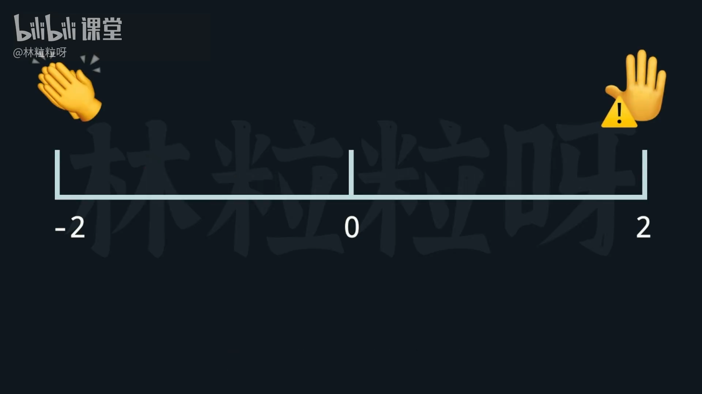
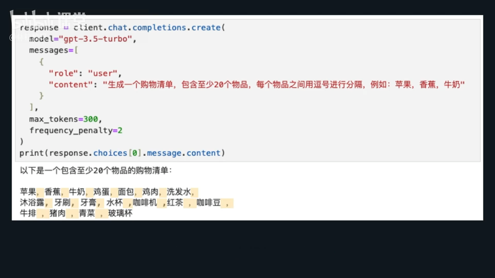
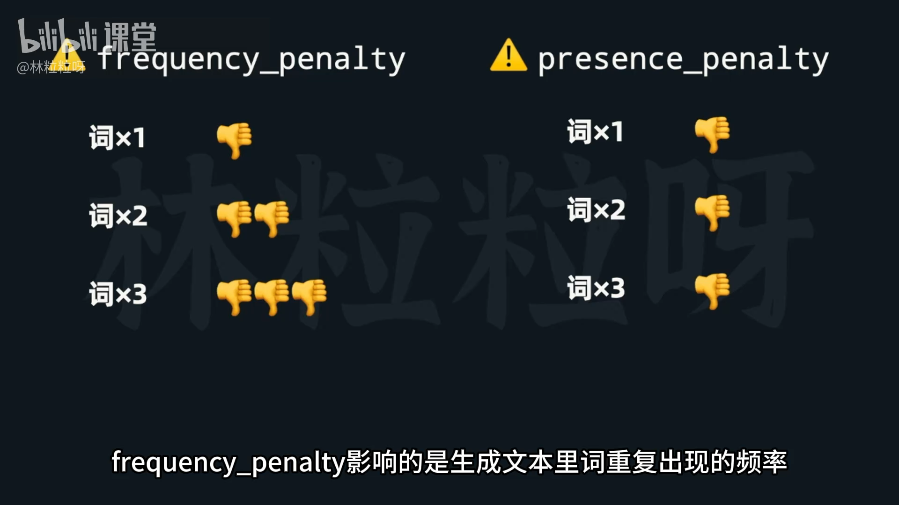
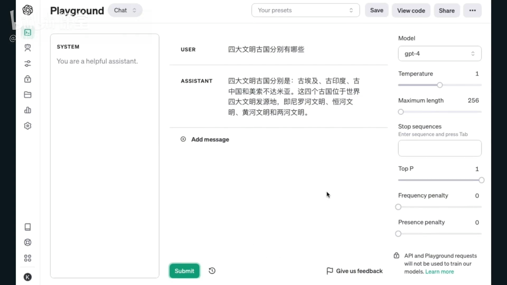
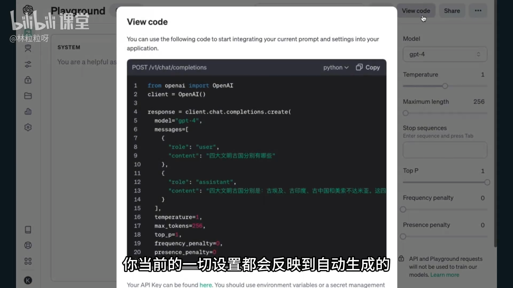

# 49-大模型API 定制AI的回复？更多常用参数详解

继上一讲的基础参数（`max_tokens`、`temperature`、`top_p`）之后，本节介绍更多**定制 AI 回复行为**的常用参数。这些参数可以更精细地控制模型输出格式、风格及思维方式。

---

## 🧩 一、`frequency_penalty` —— 惩罚重复话题
### 🧠 参数说明
- **作用**：鼓励模型**谈论新话题**，减少重复内容。
- **取值范围**：`-2.0 ~ 2.0`
- **默认值**：`0`
- **机制原理**：
  - 模型生成下一个 token 时，会计算“是否已经提到过”此类内容。
  - 若值大于 0，则重复出现相似主题的概率降低。
  - 值越高 → 对重复性惩罚越强。



可以看到AI生成的回复里，前几个还在用中文逗号。后面开始切换成英文逗号，再后面开始用空格加英文逗号，最后开始用空格加中文逗号。

之所以AI开始折腾逗号，就是因为当某种逗号在前文出现过多时，它的生成概率就被惩罚机制降低了 。

因此AI在遵循风格要求的同时，开始生成其他没咋出现过的逗号。但由于这种现象的出现呢，一般 `frequency penalty` 会被设置为0到1之间，不会搞得特别大.

### 🧪 示例
```python
frequency_penalty = 2
```
让模型尽量不要重复用词，可用于：
- 写诗、写文案时避免来回重复；
- 生成多样化回答；
- 或让模型“开新脑洞”。

如果设为负值：
```python
frequency_penalty = -1
```
→ 模型更倾向**围绕同一话题反复展开**讨论。

---

## 🧮 二、` presence_penalty` —— 控制重复词汇
### 🧠 参数说明
- **作用**：避免模型输出中**重复相同的词或短语**。
- **取值范围**：`-2.0 ~ 2.0`
- **默认值**：`0`
- **区别于 presence_penalty**：
  - `frequency _penalty` = 看前面“具体词语”重复的频率，出现的越频繁，后续选中的概率越低。直接影响词出现频率的频率。
  - `presence_penalty` = 看前面是否出现了，出现了就降低词频率。影响生成内容里是否包含更多的新词。
  



### ⚙️ 示例
```python
frequency_penalty = 1.5
```
→ 模型将避免一个词反复出现（例如不会多次说“非常非常好”）。  
若你希望诗句呈现“叠词感”或重复强化语气，可反向设置为负值。

## 🧩 三、OpenAI API 游乐场（Playground）

API 游乐场（**Playground**）是 **OpenAI 官方提供的可视化实验工具**，可以无需编写代码就快速测试不同参数对模型输出的影响。非常适合初学者和开发者调试 Prompt 与参数组合。

OpenAI 游乐场：https://platform.openai.com/playground



### 🎛️ 可视化调试界面
- 你可以直接在网页上填写要发送的消息（相当于 prompt）。  
- 支持实时调整模型及其所有关键参数：
  - `model`（选择模型版本，如 `gpt-4o-mini`、`gpt-3.5-turbo` 等）
  - `temperature`
  - `max_tokens`
  - `top_p`
  - `frequency_penalty`
  - `presence_penalty`

### ▶️ 提交与查看结果
- 点击 **“Submit”** 按钮后，AI 的回复将立即显示在同一页面。
- 可以多次调整参数后重复实验，从而直观观察参数差异带来的变化。

---

### 💡 无需写代码的参数试验台**
- 和直接调用 API 效果相同，只是提供了图形化界面。  
- 帮助你：
  - 快速验证模型行为；
  - 测试不同参数组合；
  - 调整输出风格与内容控制策略。

> ⚠️ 注意：Playground 本质是 API 前端界面，**所有操作都会计入 token 消耗**。  
> 也就是说——它**不是**永久免费工具。

---

### 💻 一键生成代码 (“View code”)
- 页面右上方的 **“View code”** 按钮，可以自动生成当前设置对应的 Python 调用示例：
  ```python
  response = client.chat.completions.create(
      model="gpt-3.5-turbo",
      messages=[{"role": "user", "content": "你好"}],
      temperature=0.7,
      max_tokens=200
  )
  ```



- 可直接复制到本地项目使用，极大提高开发效率。  
- 是新手学习 API 结构的绝佳练手工具，也被称为 **“懒人福音”**。

