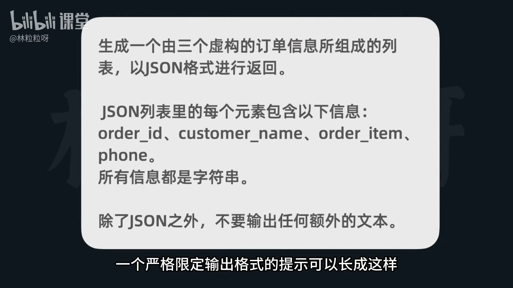
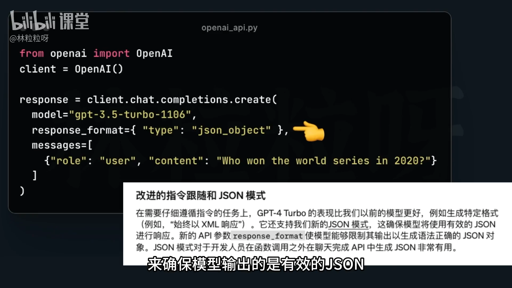
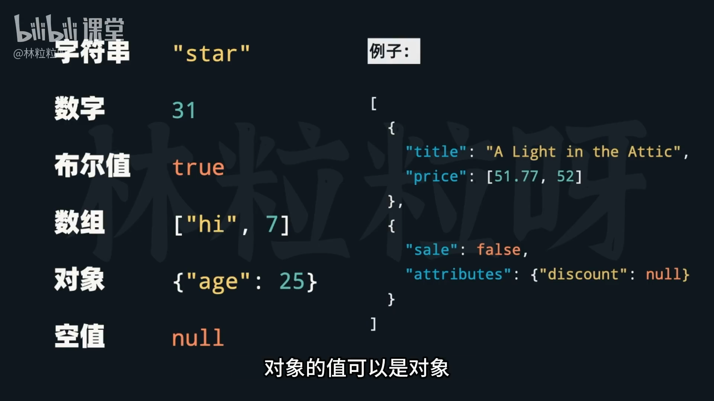

# 51-AI提示工程 限定输出格式

## 1. 为什么要限定输出格式
- 输出格式影响两件事：
  - 信息消费效率：结构化输出更易读、易用。
  - 程序化处理：API 场景常需用代码抽取信息；若不限定格式，模型每次可能输出不同结构，增加解析难度与不确定性。
- 优于“用不明确的代码解析模糊文本”的做法：在提示中明确要求结构化输出。
- 常见且便于后续处理的格式：
  - JSON、XML、YAML 等。
- 关键要求：让模型只输出所需结构，不要包含任何多余说明文字，以免影响解析。

## 2. 严格限定输出格式的实践
- 给出明确格式要求与字段约束，必要时提供示例或模板。
- 说明“不得输出额外文本”（如前后缀、解释性句子等），确保可直接被解析器读取。
- 由于格式的重要性：
  - 新版模型已支持 JSON 模式，可保证输出为有效 JSON。
  - 对于不支持 JSON 模式的模型，仍需通过提示严格约束格式。




## 3. JSON 基础与规范要点
- 定义：JSON（JavaScript Object Notation）与 JavaScript 语法相关的通用数据表示格式。
- 两类数据结构：
  - 对象（object）：大括号包裹 `{ }`，内部为键值对 key: value，条目之间用逗号分隔。
  - 数组（array）：中括号包裹`[ ]`，内部为一组值，值之间用逗号分隔。里面的值可以同时包含字符串、数字，以及其他任意 JSON 类型（对象、数组、布尔、null），而且可以混合出现。
- 与 Python 内置类型的对应与差异：
  - **JSON 对象 ≈ Python 的字典 dict；JSON 数组 ≈ Python 的列表 list**。
  - JSON 对象的“键”必须是 **字符串**，且必须使用 **双引号**；Python 字典的键可为多种不可变类型。
  - 字符串必须使用双引号（"..."），单引号不合法。
  - JSON 的布尔值为小写 true/false；Python 为首字母大写 True/False。
  - JSON 的空值为 null；Python 对应 None。   
  - 支持嵌套：对象的值可为对象/数组，数组的元素也可为对象/数组，从而表达复杂结构。
- 值的合法类型（用于 value，而非 key）：
  - 字符串（必须双引号）
  - 数字（整数或浮点数）
  - 布尔（true / false，小写）
  - 数组（[...]）
  - 对象（{...}）
  - 空值（null）



## 4. 在代码中解析 JSON（Python）
- 可用标准库 json 将模型返回的 JSON 字符串转为 Python 数据结构：
```python
import json

result = json.loads(...) # 括号内传入Json字符串
```
- 明确输出格式后，就能直接得到对应的字典或列表了，更容易“直接可解析”，也便于后续信息提取与复杂处理。


## 5. 提示模板示例（便于复制）
下面是图片内容提取成代码块。

```python
# prompt
prompt = f"""
生成一个由三个虚构的订单信息所组成的列表，以JSON格式进行返回。
JSON列表里的每个元素包含以下信息：
order_id, customer_name, order_item, phone。
所有信息都是字符串。
除了JSON之外，不要输出任何额外的文本。
"""
```

```python
# 调用
response = client.chat.completions.create(
    model="gpt-3.5-turbo",
    messages=[
        {
            "role": "user",
            "content": prompt
        }
    ]
)
content = response.choices[0].message.content
```

```python
# 解析与取值
import json
json.loads(content)

# 示例解析结果（展示）
[{'order_id': '123', 'customer_name': 'John Smith', 'order_item': 'Shoes', 'phone': '1234567890'},
 {'order_id': '456', 'customer_name': 'Jane Doe', 'order_item': 'T-shirt', 'phone': '9876543210'},
 {'order_id': '789', 'customer_name': 'Tom Thompson', 'order_item': 'Jeans', 'phone': '4567890123'}]
```

```python
json.loads(content)[0]["phone"]

# 示例解析结果（展示）
'1234567890'
```


# python中`f`的用法

在这句里：

```python
prompt = f"""你好啊"""
```

前面的 **`f` 并不是必须的** ——它只是告诉 Python 这是一个 **f-string（格式化字符串）**。

---

### ✅ 一、什么时候要加 `f`

当你希望在字符串中**插入变量或表达式**时，就需要加 `f`。
例如👇

```python
name = "小明"
prompt = f"你好，{name}！"
print(prompt)
```

输出：

```
你好，小明！
```

这时 `f` 让花括号 `{}` 里的内容被替换成变量的值。

---

### ❌ 二、什么时候可以不加 `f`

如果字符串是**纯文本、没有变量**，那 `f` 根本没用，可以直接写：

```python
prompt = """你好啊"""
```

或：

```python
prompt = "你好啊"
```

效果完全一样。

---

### 🧠 小总结

| 情况            | 是否要加 `f` | 示例                    |
| ------------- | -------- | --------------------- |
| 字符串里要插入变量或表达式 | ✅ 要加     | `f"你好，{name}"`        |
| 只是普通文本        | ❌ 不需要    | `"你好啊"` 或 `"""你好啊"""` |

---


非常敏锐的问题 👏

建议让多行字符串的缩进与 `prompt` 的 `p` 对齐，其实不是语法要求，而是**代码可读性和可维护性**的“最佳实践”。我们来拆开说 👇

---

### 🧩 一、Python 语法层面：缩进会被保留

在 Python 的三引号字符串里：

```python
prompt = f"""
    你好！
    这是多行字符串。
"""
```

这 4 个空格（每行前的缩进）会被 **原样保留在字符串内容里**，
比如打印结果是：

```
    你好！
    这是多行字符串。
```

Python 不会自动帮你“左对齐”。
也就是说，缩进的作用只是让你的 **代码更美观**，
不会改变 Python 对多行字符串的解析方式。

---

# 🧠 二、为什么建议“与 `prompt` 对齐”

主要原因是**代码可读性与结构层级**。来看对比：

#### ✅ 好的写法（推荐）

```python
def build_prompt(name):
    prompt = f"""
你好，{name}！
请帮我总结以下内容：
1. ...
2. ...
"""
```

* 所有字符串内容与 `prompt` 变量 **左边对齐**；
* 一眼就能看出字符串属于这个赋值语句；
* 不会多出视觉上的缩进空白。
* 这里的 `prompt = f"""` 开始的位置在 `def` 里面缩进了 4 个空格（函数体的缩进）。
* **三引号内部的内容**实际从新的一行开始写 `"你好，{name}！"`，这一行是紧跟三引号开始的字符，所以它的左边 **没有空格**。
* Python 会把三引号内的内容 **从第一行开始算入字符串**，包括换行符和前导空格。
* 所以在这个例子里，`"你好，{name}！"` 其实是在字符串里 **顶格** 的，没有前导空格。


### 结论：

#### 1️⃣ 语法角度

* **不必和变量名对齐**
  Python 三引号字符串里，内容可以自由写在新行开头，不影响语法。
* 语法只要求三引号闭合，内部文字可以缩进也可以不缩进。

#### 2️⃣ 输出效果角度

* 如果三引号里的每行 **左边有空格** → 输出的字符串也会带这些空格
* 如果每行 **顶格写** → 输出的字符串也会顶格
* 所以决定“对齐”要看你希望输出里是否保留前导空格。

