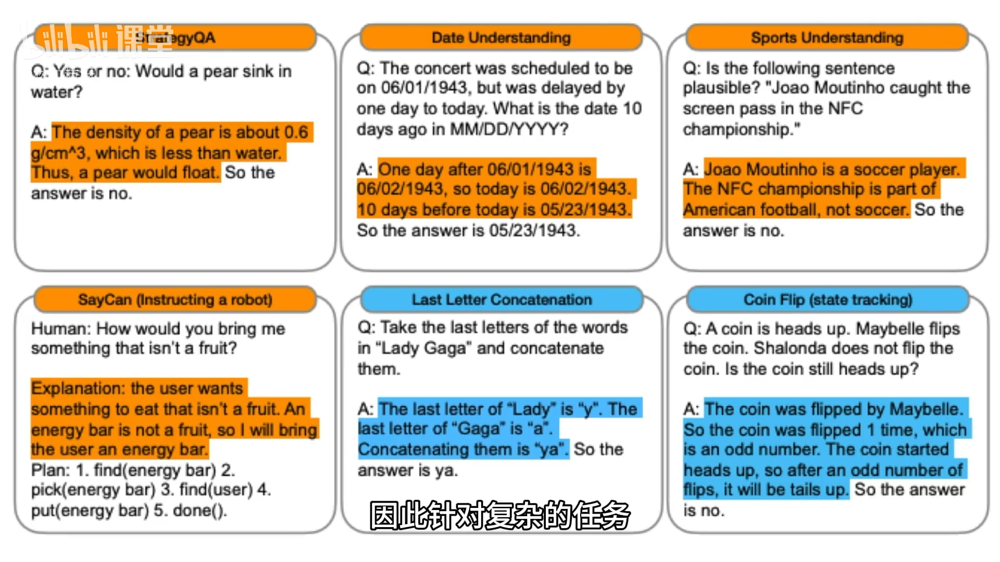

# 53-AI提示工程 思维链与分步骤思考

## 1. 上一节回顾：小样本提示
- 小样本（few-shot）能让AI快速适应新任务，无需训练，成本低、灵活。

## 2. 问题：小样本并非总有效
- 在数学类问题上，AI常表现不佳。
- 即使给出正确示范，实际作答仍可能出错。
- 例：所有举例大奇数相加的例子，正确答案应为41，但AI给出53。

## 3. 原因：生成机制限制
- 模型生成每个 token 的时间大致相同。
- 不会因为某个词需要更多思考而延迟生成，导致计算被“匆忙带过”。
- 因此，单纯提供正确示范不一定能纠偏。

## 4. 解决思路：思维链（Chain-of-Thought, CoT）
- 概念来源：谷歌在 2022 年论文中提出。
- 作用：显著提升大语言模型在复杂推理上的能力，尤其是算术、常识与符号推理任务。

## 5. 方法：在小样本中展示中间推理步骤
- **不仅给出答案，还展示推理的中间步骤与过程。**
- 效果：AI在生成回答时会模仿，先分解、后求解，降低直接命中最终答案的难度。

## 6. 好处与直观理解
- “步子小一些”更不容易出错。
- 类比：被老师点名时，直接说出最终答案很难；如果边想边说，把思考步骤讲出来：
  - 一方面“拖时间”，获得更多思考机会；
  - 另一方面更可能在分步骤中找对路径，得到正确答案。

## 7. 适用范围不止数学
- 思维链还能用于更多复杂任务。
- 机制优势：每一步只聚焦当前子问题，减少上下文干扰。
- 结果：复杂任务中更有可能得到准确答案。

## 8. 低成本替代：显式诱导分步骤
- 即使不使用小 样本示范，只在问题后加上一句：
  - **“let’s think step by step”**
  - 或中文提示“让我们分步骤思考”
- 也能促使模型自动生成中间步骤推理，提升正确率。
- 成本极低，操作简单，实用性强。

## 9. 关键要点小结
- 小样本≠万灵药，尤其在数学问题上可能失效。
- 思维链通过“显式中间步骤”显著提升复杂推理表现。
- 最简单可行的做法：在提问中加入“let’s think step by step”诱导分步骤思考。
