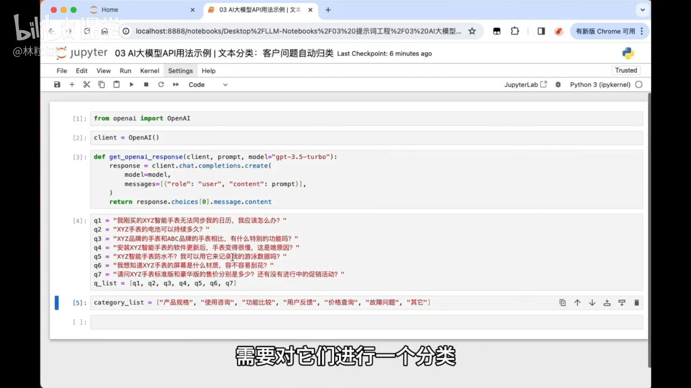
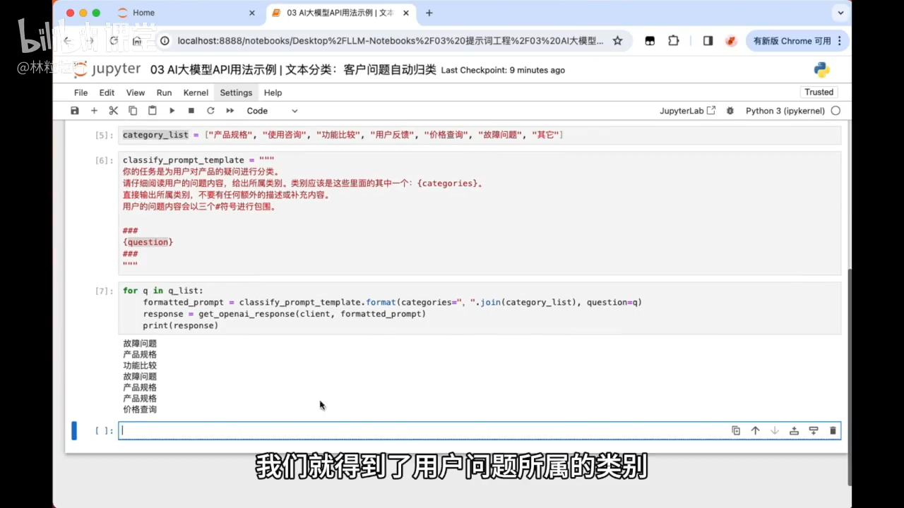

# 56-AI大模型API用法示例 文本分类：客户问题自动归类

## 1. 任务概述
- 文本分类是 NLP 的经典任务：
  - 例如：垃圾邮件 vs 正常邮件、情感分类（积极/中性/消极）
- 本节目标：用大模型 API 将用户提出的产品相关问题进行自动归类

## 2. 场景设定
- 有多条（示例中为 7 条）来自用户的问题，需要批量分类
- 预设的类别：
  - 产品规格
  - 使用咨询
  - 功能比较
  - 用户反馈
  - 价格查询
  - 故障问题
  - 其他（若不属于以上任何类别，则归入此类）



## 3. 提示词（Prompt）设计要点
- 明确任务：对“用户对产品的疑问”进行分类
- 分类范围：限定为上述类别之一
- 输出要求：只输出类别名称，不要任何额外描述或补充内容

示例提示模板（可按需调整）：
```
你的任务是将用户关于产品的疑问归类到以下类别之一：{categories}。
只输出类别名称，不要任何其他描述。
用户问题：{question}
```

## 4. 批量分类流程（代码思路）
- 由于是多条问题，使用 for 循环逐条处理
- 用字符串格式化将“类别列表”和“当前问题”插入到提示模板中
- 注意将类别列表由列表类型转换为字符串，用逗号分隔便于阅读
- 调用封装好的“获取 AI 响应”的函数，得到分类结果
- 打印或存储结果

示例（Python 伪代码）：
 


要点回顾：
- 使用 `", ".join(categories)` 将列表拼接为字符串
- 使用 `format` 将 `categories` 和 `question` 插入模板
- 循环处理每个问题，逐条获取分类结果

## 5. 分类结果的后续动作
- 根据分类自动发送相应的说明文档，便于用户自助查询
- 将相关文档提供给 AI，让其“基于文档内容”直接回答用户问题（为后续课程内容）
- 为后续自动化流程（工单路由、客服分派、FAQ 更新）提供结构化标签


# 代码解释

## 🧠 整体目标

你这段代码的目标是：

> **让大模型（GPT）自动判断每个用户提问属于哪一类问题。**

---

## 🧩 一、导入与初始化

```python
from openai import OpenAI
client = OpenAI()
```

这两行的意思是：

* `from openai import OpenAI`
  → 从 OpenAI 的官方库里导入一个叫 `OpenAI` 的类。
* `client = OpenAI()`
  → 创建一个「客户端对象」，用它来调用模型（相当于“连接大脑”）。

---

## 🧩 二、定义一个函数（用于调用模型）

```python
def get_openai_response(client, prompt, model="gpt-3.5-turbo"):
    response = client.chat.completions.create(
        model=model,
        messages=[{"role": "user", "content": prompt}],
    )
    return response.choices[0].message.content
```

这个函数做的事：

1. 接收三个参数：

   * `client`：就是你上面创建的 OpenAI 客户端。
   * `prompt`：要发给模型的文字（任务描述 + 问题）。
   * `model`：默认使用 `"gpt-3.5-turbo"`。
2. 调用模型，让它输出结果。
3. 返回模型回答的内容。

🧩 **简单理解：**

> 这是一个“问模型问题并拿到答案”的函数。

---

## 🧩 三、准备问题列表

```python
q1 = "我刚买的XYZ智能手表无法同步我的日历，我应该怎么办？"
q2 = "XYZ手表的电池可以持续多久？"
...
q7 = "请问XYZ手表标准版和豪华版的售价分别是多少？还有没有进行中的促销活动？"

q_list = [q1, q2, q3, q4, q5, q6, q7]
```

这一部分：

* 定义了七个用户问题（字符串）
* 把它们放进一个列表 `q_list` 里，方便后面循环使用。

📦 **理解为：**

> 这是一个“待分类的问题池”。

---

## 🧩 四、准备分类选项

```python
category_list = ["产品规格", "使用咨询", "功能比较", "用户反馈", "价格查询", "故障问题", "其它"]
```

这就是模型可以选择的类别。
比如模型要从这些里挑一个最合适的标签。

---

## 🧩 五、写分类任务模板（Prompt）

```python
classify_prompt_template = """
你的任务是为用户对产品的疑问进行分类。
请仔细阅读用户的问题内容，给出所属类别。类别应该是这些里面的其中一个：{categories}。
直接输出所属类别，不要有任何额外的描述或补充内容。
用户的问题内容会以三个#符号进行包围。

###
{question}
###
"""
```

这个是**模板字符串**。
模板里用 `{categories}` 和 `{question}` 作为占位符。
到时候我们会用 `.format()` 来把它们换成实际的值。

🧩 举个例子：

> 模板就像一张空白表格，`{categories}` 和 `{question}` 是空格。
> `.format()` 就是在这些空格里“填写内容”。

---

📘 **一句总结记下来：**
| 写法                        | 场景                  | 说明       |
| ------------------------- | ------------------- | -------- |
| `f""" ... """`            | 变量**已经存在**，直接插入时    | 立即替换变量   |
| `""" ... """.format(...)` | 变量**稍后才提供**时（比如循环里） | 延迟替换，更灵活 |


> 如果你要“先写模板、后插值”，就用 `.format()`；
> 如果你“变量都准备好了”，就用 `f""" ... """`。

---

## 🧩 六、循环处理每个问题

```python
for q in q_list:
```

意思是：

> 从 `q_list` 中，依次取出每一个问题（q1 → q2 → q3...）。

---

## 🧩 七、用 `.format()` 替换模板内容

```python
formatted_prompt = classify_prompt_template.format(
    categories="，".join(category_list),
    question=q
)
```

我们来拆解👇

### (1) `"，".join(category_list)`

作用：把列表里的每一项，用中文逗号“，”连接起来。

原本：

```python
["产品规格", "使用咨询", "功能比较", "用户反馈", "价格查询", "故障问题", "其它"]
```

变成：

```
"产品规格，使用咨询，功能比较，用户反馈，价格查询，故障问题，其它"
```

📌 `.join()` 的意思就是「把一个列表合并成一行字符串」。

---

### (2) `.format(...)`

用来替换模板中的占位符 `{categories}` 和 `{question}`。

比如第一个问题执行后，模板会被替换成：

```
你的任务是为用户对产品的疑问进行分类。
请仔细阅读用户的问题内容，给出所属类别。类别应该是这些里面的其中一个：产品规格，使用咨询，功能比较，用户反馈，价格查询，故障问题，其它。
直接输出所属类别，不要有任何额外的描述或补充内容。
用户的问题内容会以三个#符号进行包围。

###
我刚买的XYZ智能手表无法同步我的日历，我应该怎么办？
###
```

这样，大模型就能清楚地知道要做什么任务、有哪些类别、问题是什么。

---

## 🧩 八、调用模型，拿结果

```python
response = get_openai_response(client, formatted_prompt)
```

这句把完整 prompt 发给 GPT，并得到回答，比如：

```
故障问题
```

---

## 🧩 九、打印输出

```python
print(response)
```

打印出模型判断的类别结果。

最终输出可能是：

```
故障问题
产品规格
功能比较
故障问题
使用咨询
产品规格
价格查询
```

---

## 📊 十、总结为数据流（结构图）

```
问题列表(q_list)
      ↓
   for循环逐条取出问题(q)
      ↓
用模板(classify_prompt_template)
      ↓
.format(
   categories="，".join(category_list),
   question=q
)
      ↓
生成完整提示词(formatted_prompt)
      ↓
get_openai_response() 调用 GPT
      ↓
模型返回分类结果(response)
      ↓
print输出
```

---

✅ **一句话总结整个代码：**

> 这段代码的核心逻辑是：
> “把每个问题填进模板 → 发给模型 → 让模型选一个类别 → 打印结果。”

---

要不要我帮你在下一步画一个真正的**函数执行流程图（带箭头、框框的结构图）**？
我可以用文本图或者小图示来展示，让你一眼看出「从输入到输出」的全链条。
