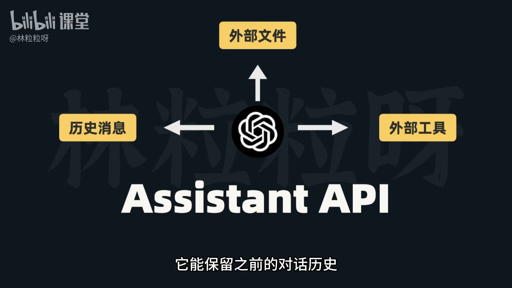
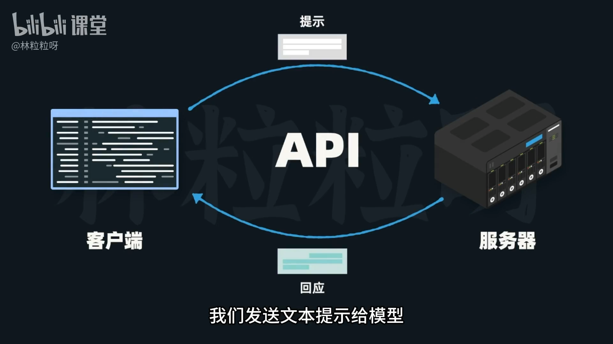
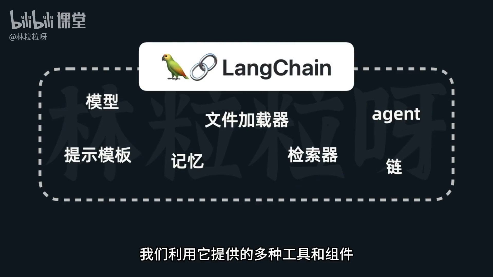
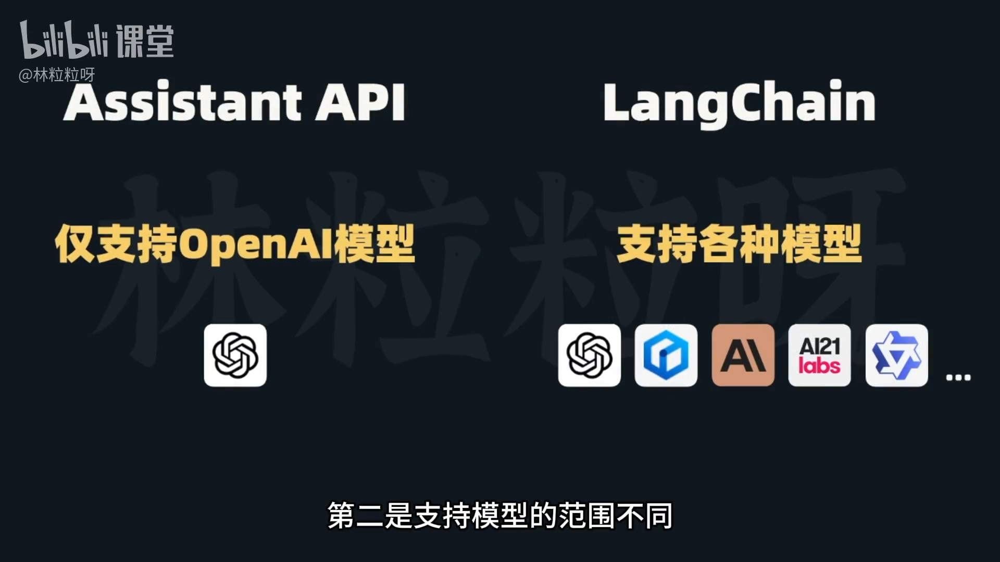

# 59-LangChain介绍 与Assistant API的对比

## 1. 引入与背景
- 除了原始的 OpenAI API，OpenAI 还推出了 Assistant API（助理 API）。
- Assistant API 不仅是模型本身，更是基于 OpenAI 模型、可维护对话历史、访问文件并调用工具的能力集合。

## 2. Assistant API 相对原始 API 的优势
- 自动保留对话历史，开发者无需手动管理上下文。
- 可使用外部工具来弥补大模型局限：
  - 文件
  - 检索器
  - 代码解释器
  - 自定义函数等

## 3. 与 LangChain 的相似点
- 这些能力听起来与 LangChain 的定位相似：

> **👉🏻 打造不只是“调模型”的应用，而是能感知上下文、连接外部数据、通过工具与环境互动，从而生成更好的回应。**

## 4. 核心差异：Assistant API vs. LangChain
- 本质定位不同
  - Assistant API：一种 API。通过它发送提示词给模型，接收模型回应。
  - LangChain：一个应用框架。提供丰富工具与组件，用于创建基于模型的应用。
- 模型支持范围
  - Assistant API：由 OpenAI 提供，只支持 OpenAI 模型（如 GPT-4）。
  - LangChain：通用框架，不隶属于单一服务商，可集成多家、多源模型。
- 简易性 vs. 灵活性
  - Assistant API：更简单直接，许多细节由 OpenAI 代管；但定制空间较小。
  - LangChain：功能更灵活、开源可查改，适配复杂和高度定制化需求。
- 应用范围
  - Assistant API：主要面向对话型应用（聊天机器人、虚拟助理等）。
  - LangChain：整合外部资源/接口，覆盖更广泛的应用形态，从简单聊天到复杂 AI 系统。

## 5. 选型建议
- 快速上手、仅基于 OpenAI 模型的应用：优先考虑 Assistant API。
- 需要更广模型选择、更灵活定制与复杂场景：优先考虑 LangChain。

## 6. 课程安排与学习路径建议
- 课程将同时覆盖 LangChain 与 OpenAI 的 Assistant API。
- 学习节奏建议：
  - 出于教学与理解原理的考虑，先学 LangChain（Assistant API 隐藏了大量技术细节）。
  - 先掌握 LangChain 的机制与通用概念，再学 Assistant API，能更快理解其细节与共通点、迅速上手。