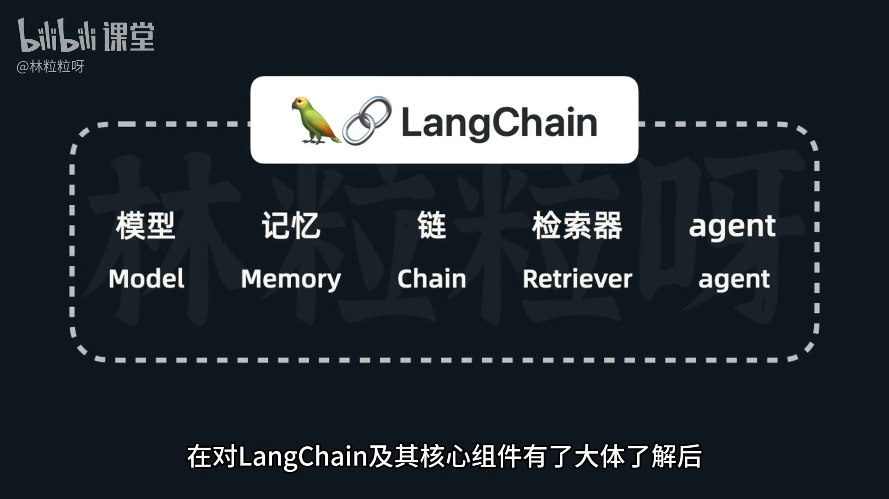
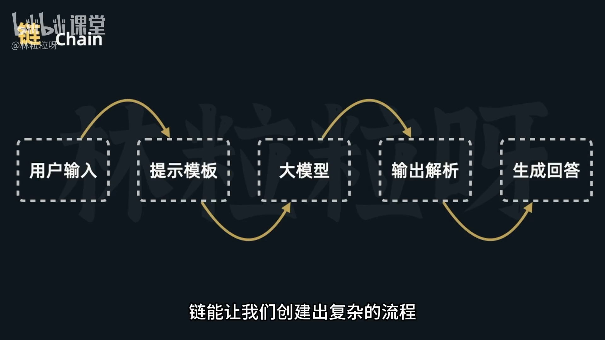
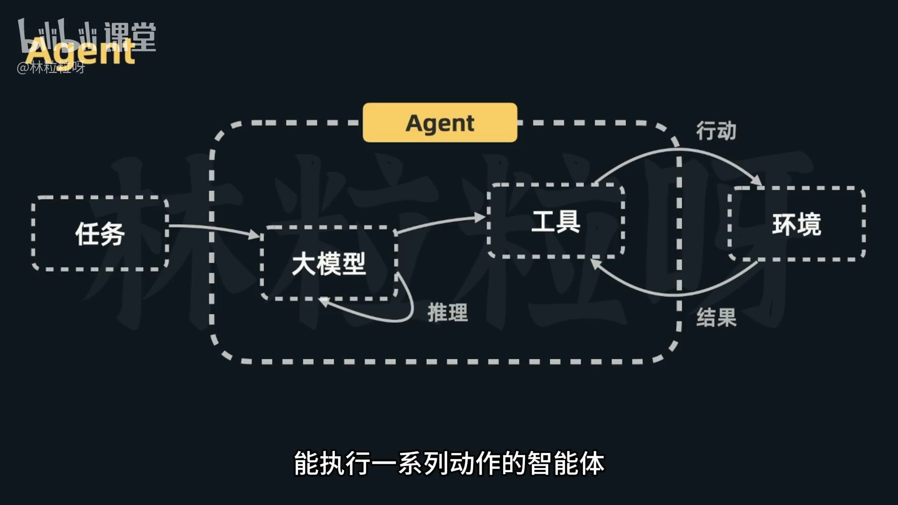

# 60-LangChain 基础：安装 LangChain 及了解核心模块

## 一、安装 LangChain
- 在 Jupyter Notebook 中：
  - 在单元格中输入并运行：
    ```
    !pip install langchain
    ```
- 在终端或 CMD 中：
  - 输入并执行：
    ```
    pip install langchain
    ```
- 在 macOS 上可能需要使用：
  ```
  pip3 install langchain
  ```

## 二、文档与 API
- 文中提到可收藏官方文档链接以便查询用法：
  https://api.python.langchain.com/en/stable/langchain_api_reference.html
- LangChain 提供了丰富的模块化组件，方便高效构建 AI 应用。因此组件是构建复杂应用的基石。

## 三、核心组件概览
- Model（模型）
  - 提供语言理解与生成能力，是 AI 应用的核心。
  - 可对接来自不同服务商的各类大语言模型。

- Memory（记忆）
  - 用于存储与管理对话历史或相关上下文信息。
  - 是对话型应用保持连贯性和上下文感知的关键。

- Chain（链）
  - 将不同组件串联起来形成处理流程。
  - 流程中每个组件负责特定任务，支持构建更复杂的应用逻辑。

- Retriever（检索器）
  - 从外部信息源检索相关信息。
  - 有助于扩展模型知识面并提升回答准确性。

- Agent（智能体）
  - 基于大模型，能够执行一系列动作。
  - 核心理念：利用模型的推理能力，根据任务动态评估并确定行动路径。





## 四、学习指引
- 在理解 LangChain 及其核心组件的基本概念后，即可开始系统学习与实践。
