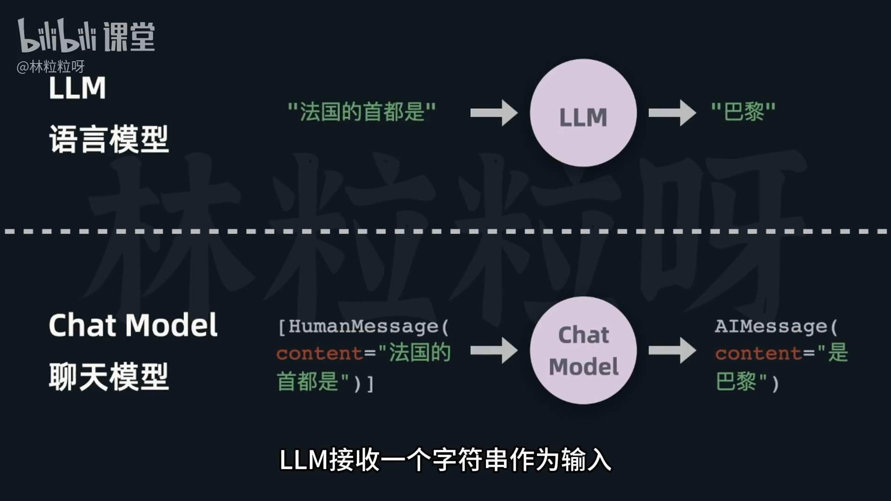
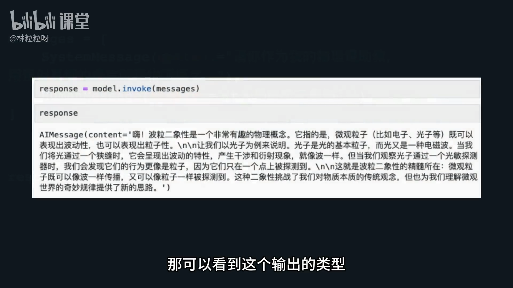

# 61-Model   玩转Open AI聊天模型

## 1. 模型大类与差异
- 两大类：
  - LLM（语言模型，text completion）：擅长“补全文本”
  - Chat Model（聊天模型，chat）：在“对话”方面经过调优
- 接口差异（输入/输出形式不同）：
  - LLM：输入是一个字符串，输出也是一个字符串
  - Chat Model：输入是“消息列表”（messages），输出是一条“消息”（message）
- 常见 Chat Models：GPT-3.5-Turbo、GPT-4 等
- 结论：在对话体验上，Chat Models 通常比纯 LLM 更合适




## 2. 在 LangChain 中使用聊天模型（以 OpenAI 为例）
- 安装集成库：`langchain-openai`
- 导入模型类：从 `langchain_openai` 导入 `ChatOpenAI`
- 创建模型实例：
  - 关键参数
    - `model`：指定具体模型（如 `gpt-3.5-turbo`、`gpt-4`）
    - API 密钥：推荐预先写入环境变量；也可通过 `openai_api_key` 传入
    - 常用可调参：`temperature`（温度）、`max_tokens`（最大生成 Token 数）
    - 其他不常用参数（如频率惩罚等）可放入 `model_kwargs` 字典传入
  - 建议：更多可调参数以“官方文档”为准（最准确、更新及时）

示例（便于复制粘贴）：
```python
# 安装
# pip install langchain-openai

from langchain_openai import ChatOpenAI

# 从环境变量读取 OPENAI_API_KEY（推荐），或在此处直接传 openai_api_key="..."
chat = ChatOpenAI(
    model="gpt-3.5-turbo",
    temperature=0.7,
    max_tokens=512,
    # 其他参数以字典方式传入
    model_kwargs={
        # "frequency_penalty": 0.1,
        # "presence_penalty": 0.0,
    },
    # openai_api_key="YOUR_KEY"  # 若未配置环境变量，可解注传入
)
```

## 3. 消息列表的结构与用法
- 消息类型（Message Types）：
  - `SystemMessage`：系统消息（用于给 AI 设定“角色/指令”）
  - `HumanMessage`：人类消息（用户输入）
  - `AIMessage`：AI 消息（模型输出）
- 导入与构造：
  - 从 LangChain 的 `schema.messages` 模块引入 `HumanMessage`、`SystemMessage`
  - 通过 `content` 字段填写文本内容，组合形成“消息列表”
- 推理与返回：
  - 使用 `model.invoke(messages)` 调用
  - 返回类型通常为 `AIMessage`
  - 具体文本内容在返回对象的 `content` 属性中

示例（便于复制粘贴）：
```python
# pip install langchain-openai

from langchain_openai import ChatOpenAI
# 旧版本：from langchain.schema import HumanMessage, SystemMessage
from langchain_core.messages import HumanMessage, SystemMessage  # 新版推荐

chat = ChatOpenAI(model="gpt-3.5-turbo", temperature=0.5)

messages = [
    SystemMessage(content="你是一个有用的助手，回答需简洁准确。"),
    HumanMessage(content="用三句话解释什么是量子计算？")
]

ai_msg = chat.invoke(messages)
print(ai_msg.type)     # 通常是 "ai"
print(ai_msg.content)  # 模型的回答文本
```
> **`invoke` 的作用是向模型发送消息并获取模型的响应。可以理解为“执行一次对话请求”**



## 4. 除 OpenAI 外的其他聊天模型（LangChain 集成）
- `langchain-community` 库集成了多家提供商的聊天模型：
  - 百度千帆（Qianfan ChatEndpoint）
  - 腾讯混元（Hunyuan）
  - 阿里通义（Tongyi，原文提及“通译”）
  - 通义系的“千问”（Qwen，原文“千万”）
- 使用方式类似：申请对应服务的 API Key，替换为相应的聊天模型类与参数

## 5. 小结
- Chat Models 更适合对话交互：输入为“消息列表”，输出为“消息对象”
- LangChain 使用步骤（OpenAI 为例）：
  1) 安装 `langchain-openai` → 2) 导入 `ChatOpenAI` → 3) 创建实例（设定 `model`、`temperature`、`max_tokens` 等） → 4) 构建 `SystemMessage`/`HumanMessage` → 5) `invoke(messages)` 获取 `AIMessage`
- 进阶参数统一通过 `model_kwargs` 传入，具体以官方文档为准
- 除 OpenAI 外，可用 `langchain-community` 切换多家模型提供商，流程基本一致
