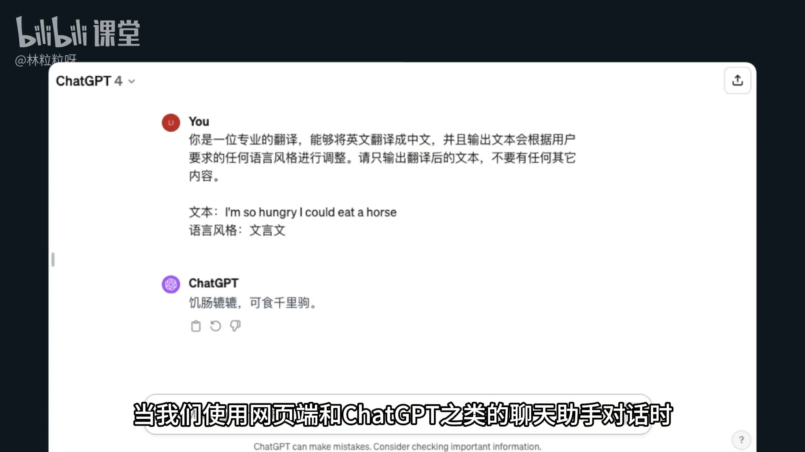
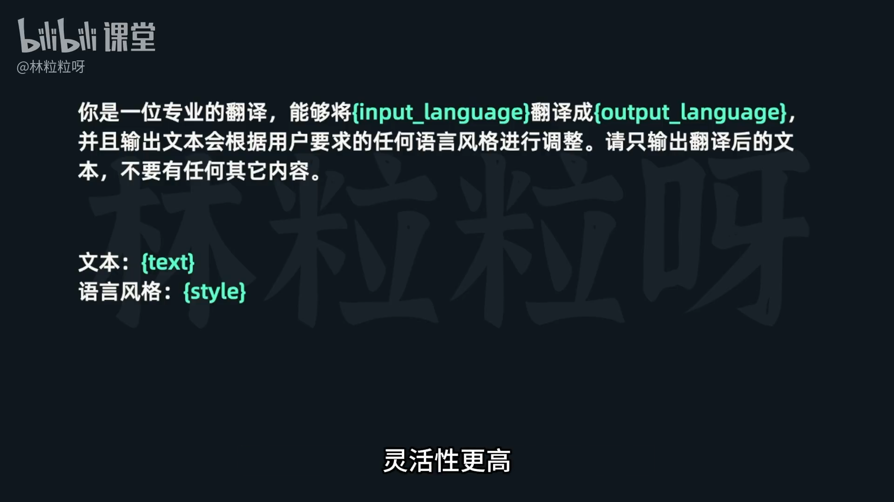
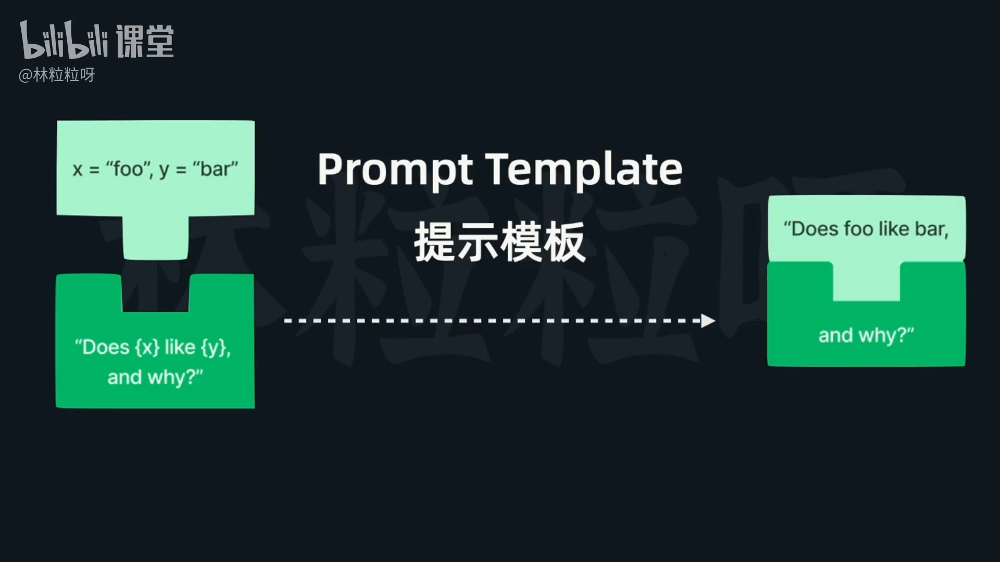
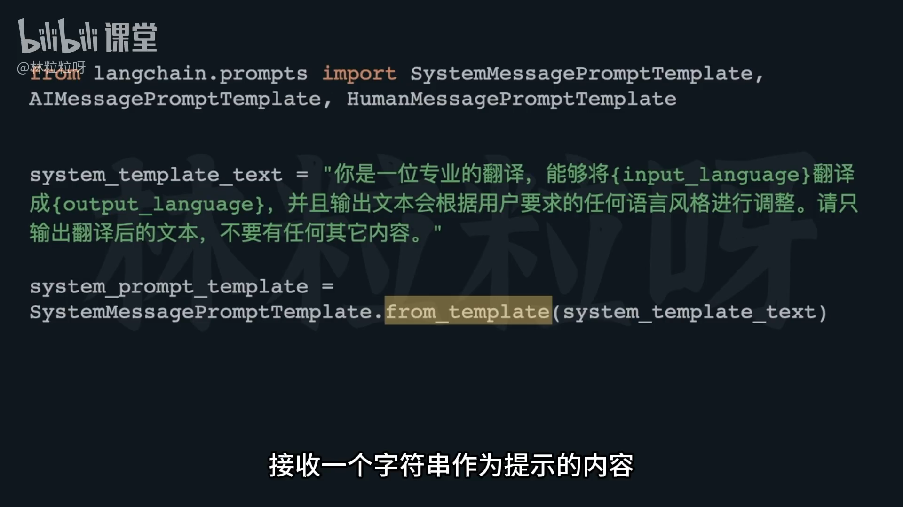
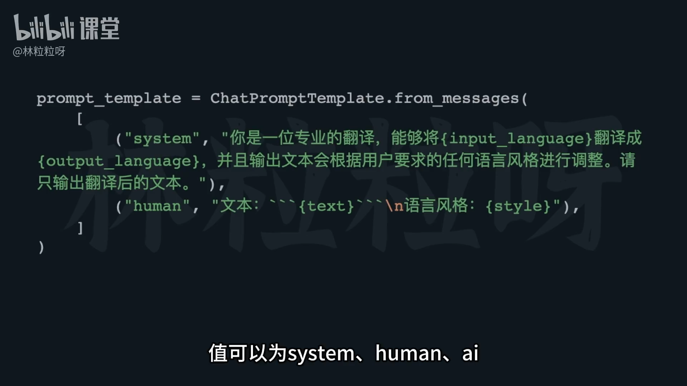

# 62-Prompt Template 让模型的输入超级灵活

## 一、Prompt 的基本概念
**Prompt（提示词）** 是用户给大语言模型的输入内容。  
在网页端或 ChatGPT 聊天助手中，我们通常**手动构建提示词**，而使用代码可以实现更高的灵活性。



通过在提示中插入**变量（variable）**，我们可以做到：
- 动态调整提示内的示例或数据；
- 使用同一个模板实现不同场景；
- 提升提示构建的灵活性与效率。

> 这一思想的核心是 **Prompt Template（提示模板）**。


---

## 二、三类 Prompt Template

在 `langchain.prompts` 模块下，存在三种提示模板：

| 模板类型 | 类名 | 描述 |
|-----------|------|------|
| 系统消息模板 | `SystemMessagePromptTemplate` | 定义系统角色提示 |
| 人类消息模板 | `HumanMessagePromptTemplate` | 定义用户角色提示 |
| AI 消息模板 | `AIMessagePromptTemplate` | 定义模型角色提示 |



---

## 三、模板创建与变量机制

模板通过 `from_template()` 方法创建：
```python
template = SystemMessagePromptTemplate.from_template(
    "Translate from {input_language} to {output_language}."
)
```

### ✳️ 变量识别
- 在模板字符串中，**由花括号 `{}` 包围的文本**会被自动识别为变量；
- 系统会自动识别这些变量名，无需手动指定。

例如：
```python
input_language = "Chinese"
output_language = "English"
```
上例中 `{input_language}` 和 `{output_language}` 会被自动识别为模板变量。


`import` 之后不能直接换行，否则 Python 会认为语法不完整。
没有用括号把多行包起来，所以会报 `IndentationError` 或 `SyntaxError`。

---

## 四、模板填充值（格式化）

模板填充值通过 `format()` 方法完成：
```python
prompt = template.format(input_language="Chinese", output_language="English")
```

- 填充后的结果取决于模板类型：
  - 系统消息模板 → 返回 `SystemMessage`
  - 用户消息模板 → 返回 `HumanMessage`
  - AI 消息模板 → 返回 `AIMessage`

### ✅ 使用流程
1. 创建消息模板；
2. 使用 `.format()` 替换变量；
3. 将生成的消息放入列表；
4. 调用模型的 `invoke()` 方法获得回应。

---

## 五、模板应用场景示例

使用模板可以极大简化重复性任务，如：
- 翻译多语言文本；
- 处理不同语言、风格、格式的输入；
- 避免为每个提示手动硬编码。

可通过循环动态填充变量：
```python
for text in text_list:
    message = template.format(
        input_language="French", output_language="English", content=text
    )
```
一次性即可生成多种版本的输出。

---

## 六、Chat Prompt Template —— 简化多角色模板

如果不想分别使用三种模板，可以使用统一的：

```python
from langchain.prompts import ChatPromptTemplate
```

它允许创建一个 **同时包含系统、用户和AI角色** 的模板。

### 用法
```python
chat_template = ChatPromptTemplate.from_messages([
    ("system", "You are a helpful assistant."),
    ("human", "Translate {text} from {src_lang} to {tgt_lang}.")
])
```

- 参数是一个 **消息模板列表**；
- 每个元素是一个 **(角色, 内容)** 的二元组；
- 角色可以是 `"system"`, `"human"`, `"ai"`。

---

## 七、填充变量与使用 Chat Prompt

通过 `invoke()` 方法传入变量：
```python
filled_prompt = chat_template.invoke({
    "text": "你好世界",
    "src_lang": "Chinese",
    "tgt_lang": "English"
})
```

返回结果是一个 `ChatPromptValue` 实例——  
即变量值填入后的完整聊天提示。

可以将该值传入模型：
```python
response = llm.invoke(filled_prompt.to_messages())
```

---

## 八、总结

| 概念 | 说明 |
|------|------|
| **Prompt Template** | 利用变量动态构造模型输入 |
| **Message Templates** | 分为 System / Human / AI 三种 |
| **from_template()** | 创建模板 |
| **format() / invoke()** | 动态填充值 |
| **ChatPromptTemplate** | 支持多角色统一管理的模板 |

---

📘 **课程备注**：  
如果需要本节内容的 Jupyter Notebook 示例，可在课程配套文件中查看。

---

# “对象”和“带参数的函数”的区别

## 1️⃣ 函数（Function）

* 函数是一段**可以重复执行的代码**。
* 它**接收参数**，做一些计算或动作，然后**返回结果**。
* **函数本身没有状态**，调用完就结束，除非你把结果存起来。

例子：

```python
def add(a, b):
    return a + b

print(add(2, 3))  # 输出 5
print(add(10, 20)) # 输出 30
```

特点：

* `add` 是函数。
* `2, 3` 或 `10, 20` 是参数。
* 每次调用，函数都重新执行计算，**不会记住上一次的值**。

---

## 2️⃣ 对象（Object）

* 对象是**类的实例**，是一个**有属性和方法的“东西”**。
* 它不仅能做事情（方法），还能**记住自己的状态**（属性）。
* 换句话说，对象既能“做”，又能“存”。

例子：

```python
class Counter:
    def __init__(self):
        self.count = 0  # 属性，存状态

    def increment(self):
        self.count += 1  # 方法，做动作

c = Counter()  # 创建对象
c.increment()
print(c.count)  # 输出 1
c.increment()
print(c.count)  # 输出 2
```

特点：

* `Counter` 是类，`c` 是对象。
* `c` 有属性 `count` 可以记住状态。
* `c` 有方法 `increment` 可以执行动作。


### 代码解释

### 1. `c = Counter()`

* 创建了一个对象 `c`，它是 `Counter` 类的实例。
* `__init__` 方法自动运行，给对象 `c` 加了一个属性：

  ```
  c.count = 0
  ```
* 此时，`c` 对象里保存的状态是：

  ```
  count = 0
  ```

---

### 2. `c.increment()`（第一次调用）

* 调用 `increment` 方法，方法里的代码是：

  ```python
  self.count += 1
  ```
* `self` 指的是对象 `c`。
* `c.count` 原来是 0，加 1 后变成：

  ```
  c.count = 1
  ```

---

### 3. `print(c.count)`

* 打印 `c.count`，输出：

  ```
  1
  ```
* 因为第一次调用 `increment()` 后，`c.count` 变成了 1。

---

### 4. `c.increment()`（第二次调用）

* 再次调用 `increment` 方法：

  ```python
  self.count += 1
  ```
* 这次 `c.count` 原来是 1，加 1 后变成：

  ```
  c.count = 2
  ```

---

### 5. `print(c.count)`

* 打印 `c.count`，输出：

  ```
  2
  ```
* 因为对象 `c` 的状态（属性 count）被上一次调用修改了。

---

### 🔑 核心点

* **对象有状态**：属性 `count` 保存了上一次操作的结果。
* **方法改变状态**：调用 `increment()` 会修改 `c.count`。
* **每次打印显示最新状态**。

---

💡 类比小例子：

* 对象 `c` 就像一个记分本，`count` 是分数。
* 每次 `increment()` 就是在记分本上加 1。
* 打印 `c.count` 就是查看当前分数。


---

## 3️⃣ 对比总结

| 特点     | 带参数的函数         | 对象（类实例）                        |
| ------ | -------------- | ------------------------------ |
| 核心本质   | 行为/操作          | 数据 + 行为（状态 + 方法）               |
| 状态     | 通常没有，调用完就结束    | 有状态，可以记住属性值                    |
| 可复用性   | 可重复调用          | 可生成多个独立对象，每个有自己的状态             |
| 举例     | `add(2,3)` → 5 | `c.increment()` → 修改 `c.count` |
| 内存中的表现 | 每次调用临时计算       | 属性值长期保存在对象中                    |

---

💡 直观比喻：

* **函数** = 厨房里的厨师，只负责做菜（动作），做完就离开，不记账。
* **对象** = 餐厅里的员工，有自己的名字、桌子（属性），既能做菜（方法），还能记账（状态）。


>💡 **小技巧**：不加括号 → 想“先拿着方法”，等需要再用；加括号 → 想“立即执行方法”，得到返回值

# Python 中创建的对象，括号里要加东西么


这取决于您创建的是**什么对象**。

在 Python 中，通常我们通过**调用**一个类（Class）来创建该类的一个**实例**（Instance），也就是一个对象。

### 1\. 创建对象的**基本形式**

创建对象时，类名后面**通常需要加括号**：

```python
class MyClass:
    pass

# 创建对象时，需要加括号
my_object = MyClass()
```

### 2\. 关于括号里是否需要加东西（参数）

括号里是否需要加东西，取决于这个类是如何**定义**的，特别是它的**初始化方法**（即 `__init__` 方法）：

#### a. **不需要加东西**（如果 `__init__` 方法不接受额外的参数）

如果类没有定义 `__init__` 方法，或者 `__init__` 方法只接受 `self` 一个参数（这是必须的），那么创建对象时括号里就不用放东西。

```python
class Dog:
    # 只有一个必需的 self 参数
    def __init__(self):
        print("A new dog is born!")
        self.name = "Unnamed"

# 创建对象：不需要参数
dog1 = Dog()  # 括号里为空
# Output: A new dog is born!
```

#### b. **需要加东西**（如果 `__init__` 方法接受额外的参数）

如果类的 `__init__` 方法被定义为接受除了 `self` 以外的其他参数，那么您在创建对象时就**必须**在括号内提供这些参数的值。这些参数用于初始化新创建对象的状态（属性）。

```python
class Cat:
    # 接受 name 和 age 两个参数
    def __init__(self, name, age):
        self.name = name
        self.age = age
        print(f"Cat {self.name} is {self.age} years old.")

# 创建对象：需要提供 name 和 age
cat1 = Cat("Mittens", 3)  # 括号里有参数
# Output: Cat Mittens is 3 years old.
```

### 总结

| 情况 | 代码示例 | 括号是否必须？ | 括号里是否需要参数？ |
| :--- | :--- | :--- | :--- |
| **创建类实例** | `obj = MyClass()` | **通常需要** | 取决于 `__init__` 方法的定义 |
| **引用函数/方法** | `my_func` | **不需要** | - |
| **调用函数/方法** | `my_func()` | **需要** | 取决于函数的定义 |
| **访问变量/属性** | `my_var` | **不需要** | - |

所以，对于您的问题：创建对象时，类名**后面通常要加括号**；括号里**是否需要加东西**（参数），**取决于该类的 `__init__` 方法的定义**。

---

没问题！作为小白，我们一步一步、从头到尾仔细解析这段代码。这段代码主要演示了如何使用 LangChain 库来构建更灵活、可复用的模型输入指令（也就是“Prompt”）。

**核心概念预热：**

在开始之前，我们需要了解几个基本概念：

1.  **大语言模型 (LLM)**：你可以把它想象成一个非常聪明的机器人，能理解你的指令并生成文本。比如你问它“用文言文翻译‘我饿了’”，它会回答“吾饥甚”。
2.  **Prompt（提示/指令）**：这是你给大语言模型的指令，告诉它要做什么。一个好的 Prompt 能让模型更好地理解你的意图并给出高质量的回答。
3.  **Prompt Template (提示模板)**：想象一下，你经常需要让机器人做类似的事情，比如“把我说的中文翻译成英文，用活泼的风格”。每次都手动写一遍很麻烦。Prompt Template 就像一个“填空模板”，你可以把“中文”、“英文”、“活泼风格”这些作为空位，每次要用的时候，只需要填入不同的内容，就能生成一个完整的 Prompt。
4.  **LangChain**：这是一个非常流行的开发框架，可以帮助我们更方便地构建基于大语言模型的应用。它提供了很多工具，其中就包括管理 Prompt 的功能。

好的，现在我们开始逐个代码块（Cell）解析。

---

# 代码解释

---

### Cell 1: 导入必要的模块

```python
from langchain.prompts import (
    SystemMessagePromptTemplate,
    AIMessagePromptTemplate,
    HumanMessagePromptTemplate,
)
```

*   **`from langchain.prompts import (...)`**: 这一行是 Python 的导入语句，意思是我们要从 `langchain.prompts` 这个模块中，导入一些我们在后面会用到的特定功能。
*   **`SystemMessagePromptTemplate`**: 这是用于创建“系统角色” Prompt 的模板。你可以把它理解为给大语言模型设定一个身份或一个总体的行为准则。比如，“你是一位专业的翻译”。
*   **`AIMessagePromptTemplate`**: 这是用于创建“AI 回复” Prompt 的模板。通常在构建多轮对话时会用到，用来模拟 AI 之前说的话。在这个例子里没有直接用到，但被导入了。
*   **`HumanMessagePromptTemplate`**: 这是用于创建“用户指令” Prompt 的模板。这是我们作为用户给大语言模型的具体任务和信息。比如，“请翻译这段文本”。

**小结：** 这一步是准备工作，导入了 LangChain 库中用于处理不同类型 Prompt 模板的工具。我们主要会用到 `SystemMessagePromptTemplate` 和 `HumanMessagePromptTemplate`。

---

### Cell 2: 定义系统 Prompt 模板

```python
system_template_text="你是一位专业的翻译，能够将{input_language}翻译成{output_language}，并且输出文本会根据用户要求的任何语言风格进行调整。请只输出翻译后的文本，不要有任何其它内容。"
system_prompt_template = SystemMessagePromptTemplate.from_template(system_template_text)
```

*   **`system_template_text = "..."`**: 这一行定义了一个普通的 Python 字符串，这个字符串就是我们的“系统角色”模板的文本内容。
    *   注意看文本里有 `{input_language}` 和 `{output_language}`。这些就是我们上面说的“空位”或者叫“占位符”。它们的名字被大括号 `{}` 包裹起来。将来我们会把真实的语言（比如“英语”和“汉语”）填入到这些空位中。
    *   这个文本告诉模型：你是个翻译专家，能翻译不同语言，还能调整风格，而且只输出翻译结果。这为模型设定了工作原则。
*   **`system_prompt_template = SystemMessagePromptTemplate.from_template(system_template_text)`**: 这一行才是真正使用 LangChain 创建一个系统 Prompt 模板的关键。
    *   我们调用 `SystemMessagePromptTemplate` 这个工具的 `from_template()` 方法，把我们刚才定义的 `system_template_text` 传给它。
    *   结果是创建了一个 `system_prompt_template` 对象，它现在知道自己的文本内容是什么，以及里面有哪些需要填充的变量（`input_language` 和 `output_language`）。

**小结：** 我们创建了一个系统级别的指令模板，它告诉大语言模型它的身份和工作职责。模板里包含了一些可以动态替换的变量。

---

### Cell 3: 查看系统 Prompt 模板

```python
system_prompt_template
```

*   当你直接在一个 Jupyter Notebook 的单元格里写一个变量名并运行它时，Notebook 会显示这个变量的 `__repr__`（表示）形式，也就是它在 Python 解释器中的字符串表示。
*   **输出：**
    ```
    SystemMessagePromptTemplate(prompt=PromptTemplate(input_variables=['input_language', 'output_language'], template='你是一位专业的翻译，能够将{input_language}翻译成{output_language}，并且输出文本会根据用户要求的任何语言风格进行调整。请只输出翻译后的文本，不要有任何其它内容。'))
    ```
    这个输出确认了 `system_prompt_template` 是一个 `SystemMessagePromptTemplate` 对象，它内部包含了一个 `PromptTemplate` 对象。这个 `PromptTemplate` 告诉我们：
    *   `input_variables`（输入变量）是 `['input_language', 'output_language']`，这和我们预期的一致。
    *   `template`（模板内容）就是我们刚才定义的那个字符串。

**小结：** 这一步是为了验证我们上一步创建的系统 Prompt 模板是否正确，以及它识别出了哪些变量。

---

### Cell 4: 查看系统 Prompt 模板的输入变量

```python
system_prompt_template.input_variables
```

*   这一行可以直接访问 `system_prompt_template` 对象的 `input_variables` 属性，直接查看它包含的变量列表。
*   **输出：**
    ```
    ['input_language', 'output_language']
    ```
    这再次确认了系统 Prompt 模板中需要填充的变量是 `input_language` 和 `output_language`。

**小结：** 再次确认模板中的变量，方便我们后续使用时知道需要提供哪些信息。

---

### Cell 5: 定义用户 Prompt 模板

```python
human_template_text="文本：{text}\n语言风格：{style}"
human_prompt_template = HumanMessagePromptTemplate.from_template(human_template_text)
```

*   **`human_template_text = "..."`**: 这定义了“用户指令”模板的文本内容。
    *   它同样包含占位符：`{text}`（要翻译的文本）和 `{style}`（翻译的语言风格）。
    *   `\n` 表示换行，让输出的文本更清晰。
*   **`human_prompt_template = HumanMessagePromptTemplate.from_template(human_template_text)`**: 类似地，我们使用 `HumanMessagePromptTemplate.from_template()` 方法，把用户指令模板字符串转化成一个 LangChain 的 `human_prompt_template` 对象。

**小结：** 我们创建了一个用户指令模板，它告诉大语言模型具体的翻译内容和想要的风格，也包含可以动态替换的变量。

---

### Cell 6: 查看用户 Prompt 模板的输入变量

```python
human_prompt_template.input_variables
```

*   查看 `human_prompt_template` 对象里的变量。
*   **输出：**
    ```
    ['style', 'text']
    ```
    这确认了用户 Prompt 模板中需要填充的变量是 `style` 和 `text`。

**小结：** 确认用户指令模板中的变量。

---

### Cell 7: 填充系统 Prompt 模板并生成具体指令

```python
system_prompt = system_prompt_template.format(input_language="英语", output_language="汉语")
system_prompt
```

*   **`system_prompt = system_prompt_template.format(input_language="英语", output_language="汉语")`**:
    *   这里我们调用之前创建的 `system_prompt_template` 对象的 `format()` 方法。
    *   `format()` 方法的作用就是把模板中的占位符 (`{input_language}`, `{output_language}`) 替换成我们提供的值。
    *   我们提供了 `input_language="英语"` 和 `output_language="汉语"`。
    *   `format()` 方法执行后，会生成一个**具体的** `SystemMessage` 对象，这个对象就包含了最终要发送给大语言模型的完整指令，不再是模板了。
*   **`system_prompt`**: 打印这个对象。
*   **输出：**
    ```
    SystemMessage(content='你是一位专业的翻译，能够将英语翻译成汉语，并且输出文本会根据用户要求的任何语言风格进行调整。请只输出翻译后的文本，不要有任何其它内容。')
    ```
    可以看到，`{input_language}` 和 `{output_language}` 已经被替换成了“英语”和“汉语”。现在它是一个具体的 `SystemMessage` 对象，可以直接发送给大语言模型。

**小结：** 这一步是将系统 Prompt 模板填充了具体内容，生成了一个用于本次对话的系统指令。

---

### Cell 8: 填充用户 Prompt 模板并生成具体指令

```python
human_prompt = human_prompt_template.format(text="I'm so hungry I could eat a horse", style="文言文")
human_prompt
```

*   **`human_prompt = human_prompt_template.format(text="I'm so hungry I could eat a horse", style="文言文")`**:
    *   这和上一步类似，我们调用 `human_prompt_template` 的 `format()` 方法。
    *   提供了 `text="I'm so hungry I could eat a horse"` 和 `style="文言文"`。
    *   生成一个具体的 `HumanMessage` 对象。
*   **`human_prompt`**: 打印这个对象。
*   **输出：**
    ```
    HumanMessage(content="文本：I'm so hungry I could eat a horse\n语言风格：文言文")
    ```
    `{text}` 和 `{style}` 也被替换成了具体内容。现在这是一个具体的 `HumanMessage` 对象。

**小结：** 这一步是将用户 Prompt 模板填充了具体内容，生成了一个用于本次对话的用户指令。

---

### Cell 9: 导入 OpenAI 聊天模型

```python
from langchain_openai import ChatOpenAI
```

*   **`from langchain_openai import ChatOpenAI`**: 这一行导入了 `ChatOpenAI` 类，它是 LangChain 用来连接 OpenAI 聊天模型（比如 `gpt-3.5-turbo`）的工具。

**小结：** 准备连接并使用 OpenAI 的大语言模型。

---

### Cell 10: 调用大语言模型进行翻译

```python
model = ChatOpenAI(model="gpt-3.5-turbo")
response = model.invoke([
    system_prompt,
    human_prompt
])
```

*   **`model = ChatOpenAI(model="gpt-3.5-turbo")`**:
    *   这行创建了一个 `ChatOpenAI` 类的实例，命名为 `model`。
    *   `model="gpt-3.5-turbo"` 指定了我们要使用的 OpenAI 模型是 `gpt-3.5-turbo`（一个常用的、性能不错的聊天模型）。
    *   **注意：** 运行这行代码需要你配置 OpenAI API Key，否则会报错。通常会将其设置为环境变量，例如 `export OPENAI_API_KEY="sk-..."`。
*   **`response = model.invoke([...])`**:
    *   这是向大语言模型发送请求的关键步骤。
    *   `model.invoke()` 方法用于调用模型，并传入一个消息列表。
    *   我们传入的消息列表是 `[system_prompt, human_prompt]`，也就是我们前面填充好的系统指令和用户指令。大语言模型会按照这个顺序和内容来理解对话背景和你的具体请求。
    *   模型生成的结果会存储在 `response` 变量中。

**小结：** 我们实例化了一个 OpenAI 模型，并将我们准备好的系统和用户指令发送给它，得到了模型的回复。

---

### Cell 11: 打印模型的回复内容

```python
print(response.content)
```

*   **`print(response.content)`**:
    *   大语言模型的回复（`response` 对象）通常包含很多信息，而我们最关心的文本内容存储在 `response.content` 属性中。
    *   `print()` 函数的作用是把这个内容显示在控制台上。
*   **输出：**
    ```
    吾飢甚，能食千里馬。
    ```
    这就是模型将“I'm so hungry I could eat a horse”翻译成文言文后的结果。非常棒！

**小结：** 成功获取并打印了模型的翻译结果。

---

### Cell 12: 准备多组输入变量

```python
input_variables = [
    {
        "input_language": "英语",
        "output_language": "汉语",
        "text": "I'm so hungry I could eat a horse",
        "style": "文言文"
    },
    {
        "input_language": "法语",
        "output_language": "英语",
        "text": "Je suis désolé pour ce que tu as fait",
        "style": "古英语"
    },
    {
        "input_language": "俄语",
        "output_language": "意大利语",
        "text": "Сегодня отличная погода",
        "style": "网络用语"
    },
    {
        "input_language": "韩语",
        "output_language": "日语",
        "text": "너 정말 짜증나",
        "style": "口语"
    }
]
```

*   **`input_variables = [...]`**: 这一行定义了一个 Python 列表，列表的每个元素都是一个字典。
    *   每个字典代表一个独立的翻译任务，包含了前面我们模板中所有需要的变量（`input_language`、`output_language`、`text`、`style`）。
    *   这展示了 Prompt Template 的灵活性：我们可以准备多组数据，然后用相同的模板来处理它们，而不需要每次都手动修改 Prompt 字符串。

**小结：** 创建了一个包含多个翻译任务的列表，每个任务都以字典的形式存储了所有必要的输入数据。

---

### Cell 13: 循环调用模型进行多组翻译

```python
for input in input_variables:
    response = model.invoke([
        system_prompt_template.format(input_language=input["input_language"], output_language=input["output_language"]),
        human_prompt_template.format(text=input["text"], style=input["style"])])
    print(response.content)
```

*   **`for input in input_variables:`**: 这是一个 `for` 循环，它会遍历 `input_variables` 列表中的每一个字典。在每次循环中，当前的字典会被赋值给变量 `input`。
*   **`system_prompt_template.format(...)`**: 在每次循环中，我们都用当前 `input` 字典中的 `input_language` 和 `output_language` 来填充 `system_prompt_template`，生成一个新的、针对当前任务的 `SystemMessage`。
*   **`human_prompt_template.format(...)`**: 同样，用当前 `input` 字典中的 `text` 和 `style` 来填充 `human_prompt_template`，生成一个新的、针对当前任务的 `HumanMessage`。
*   **`model.invoke([...])`**: 将这两个新生成的 `Message` 对象作为列表传给 `model.invoke()`，让模型执行翻译。
*   **`print(response.content)`**: 打印出每次翻译的结果。
*   **输出：**
    ```
    吾飢甚，能食千里馬。
    I am sorry for what thou hast done.
    Oggi il tempo è fantastico
    お前、本当にイライラするな。
    ```
    这里每次翻译结果可能因为模型批次更新等因素略有不同，但能看出模型按照不同的语言和风格要求完成了翻译。

**小结：** 这一步展示了 Prompt Template 的强大之处：通过循环，我们可以用一套模板处理多组输入，大大提高了效率和代码的整洁度。

---

### Cell 14: 导入 `ChatPromptTemplate`

```python
from langchain.prompts import ChatPromptTemplate
```

*   **`from langchain.prompts import ChatPromptTemplate`**: `ChatPromptTemplate` 是 LangChain 提供的另一种更高级、更方便的 Prompt 管理方式。它可以把多个 `SystemMessagePromptTemplate` 和 `HumanMessagePromptTemplate` 组合在一起，看作一个整体。

**小结：** 引入更简洁的 Prompt 模板管理方式。

---

### Cell 15: 使用 `ChatPromptTemplate` 整合所有模板

```python
prompt_template = ChatPromptTemplate.from_messages(
    [
        ("system", "你是一位专业的翻译，能够将{input_language}翻译成{output_language}，并且输出文本会根据用户要求的任何语言风格进行调整。请只输出翻译后的文本，不要有任何其它内容。"),
        ("human", "文本：{text}\n语言风格：{style}"),
    ]
)
```

*   **`prompt_template = ChatPromptTemplate.from_messages(...)`**:
    *   这里我们创建了一个 `ChatPromptTemplate` 实例，它通过 `from_messages()` 方法来构建。
    *   `from_messages()` 接收一个列表，列表里的每个元素是一个元组 `(role, template_string)`。
        *   `"system"` 对应之前 `SystemMessagePromptTemplate` 的角色和模板字符串。
        *   `"human"` 对应之前 `HumanMessagePromptTemplate` 的角色和模板字符串。
    *   这种方式将系统指令和用户指令的模板整合到了一起，形成一个统一的 `prompt_template` 对象。

**小结：** 将之前分散的系统模板和用户模板合并成一个 `ChatPromptTemplate`，使得管理更加方便。

---

### Cell 16: 查看整合后模板的输入变量

```python
prompt_template.input_variables
```

*   查看 `prompt_template` 对象里的变量。
*   **输出：**
    ```
    ['input_language', 'output_language', 'style', 'text']
    ```
    现在，这个 `prompt_template` 知道所有需要填充的变量，包括系统模板和用户模板中的所有变量。

**小结：** 确认合并后的模板识别了所有必要的变量。

---

### Cell 17: 填充整合模板并生成具体指令

```python
prompt_value = prompt_template.invoke({"input_language": "英语", "output_language": "汉语",
                                       "text":"I'm so hungry I could eat a horse", "style": "文言文"})
prompt_value
```

*   **`prompt_value = prompt_template.invoke(...)`**:
    *   `ChatPromptTemplate` 不再使用 `.format()` 方法，而是使用 `.invoke()` 方法来填充模板并生成最终的 Prompt。
    *   注意，现在 `invoke()` 方法只需要一个字典作为参数，这个字典包含了所有模板中需要的变量（`input_language`、`output_language`、`text`、`style`）。
    *   它会生成一个 `ChatPromptValue` 对象。
*   **`prompt_value`**: 打印这个对象。
*   **输出：**
    ```
    ChatPromptValue(messages=[SystemMessage(content='你是一位专业的翻译，能够将英语翻译成汉语，并且输出文本会根据用户要求的任何语言风格进行调整。请只输出翻译后的文本，不要有任何其它内容。'), HumanMessage(content="文本：I'm so hungry I could eat a horse\n语言风格：文言文")])
    ```
    可以看到，`ChatPromptValue` 内部包含了两个已经填充好内容的 Message 对象：一个 `SystemMessage` 和一个 `HumanMessage`。这和我们前面手动创建 `system_prompt` 和 `human_prompt` 的效果是一样的，只是现在操作更简化了。

**小结：** 使用 `ChatPromptTemplate` 的 `invoke()` 方法，一次性填充所有变量，生成了包含具体系统指令和用户指令的 `ChatPromptValue` 对象。

---

### Cell 18: 查看整合模板生成的具体消息列表

```python
prompt_value.messages
```

*   **`prompt_value.messages`**: 访问 `ChatPromptValue` 对象的 `messages` 属性，直接查看它内部包含的 `SystemMessage` 和 `HumanMessage` 列表。
*   **输出：**
    ```
    [SystemMessage(content='你是一位专业的翻译，能够将英语翻译成汉语，并且输出文本会根据用户要求的任何语言风格进行调整。请只输出翻译后的文本，不要有任何其它内容。'),
     HumanMessage(content="文本：I'm so hungry I could eat a horse\n语言风格：文言文")]
    ```
    这证实了 `ChatPromptTemplate.invoke()` 确实生成了可以直接传递给大语言模型的 `SystemMessage` 和 `HumanMessage` 对象列表。

**小结：** 确认 `ChatPromptTemplate` 确实生成了模型所需的具体消息列表。

---

### Cell 19: 使用 `ChatPromptTemplate` 的结果调用模型

```python
model = ChatOpenAI(model="gpt-3.5-turbo")
response = model.invoke(prompt_value)
```

*   **`model = ChatOpenAI(model="gpt-3.5-turbo")`**: 重新创建模型实例，或者如果你前面已经创建了，这行可以跳过（也可以重新运行确保模型状态）。
*   **`response = model.invoke(prompt_value)`**:
    *   现在，我们直接将 `prompt_value`（包含了 `SystemMessage` 和 `HumanMessage` 列表的对象）传给 `model.invoke()`。
    *   LangChain 会自动从 `prompt_value` 中提取出消息列表并发送给模型。

**小结：** 将 `ChatPromptTemplate` 生成的 `ChatPromptValue` 对象直接传递给模型，执行翻译任务。

---

### Cell 20: 查看模型的完整回复对象

```python
response
```

*   直接打印 `response` 对象。
*   **输出：**
    ```
    AIMessage(content='吾飢甚，可食馬焉。')
    ```
    模型返回了一个 `AIMessage` 对象，`content` 属性是翻译结果。

**小结：** 模型返回了包含翻译内容的 `AIMessage` 对象。

---

### Cell 21: 查看模型的回复内容

```python
response.content
```

*   打印 `response` 对象的 `content` 属性。
*   **输出：**
    ```
    '吾飢甚，可食馬焉。'
    ```
    这和我们之前手动构建 Prompt 得到的结果是一致的。

**小结：** 再次确认翻译结果。

---

### Cell 22: 再次准备多组输入变量（与 Cell 12 相同）

```python
input_variables = [
    {
        "input_language": "英语",
        "output_language": "汉语",
        "text": "I'm so hungry I could eat a horse",
        "style": "文言文"
    },
    {
        "input_language": "法语",
        "output_language": "英语",
        "text": "Je suis désolé pour ce que tu as fait",
        "style": "古英语"
    },
    {
        "input_language": "俄语",
        "output_language": "意大利语",
        "text": "Сегодня отличная погода",
        "style": "网络用语"
    },
    {
        "input_language": "韩语",
        "output_language": "日语",
        "text": "너 정말 짜증나",
        "style": "口语"
    }
]
```

*   与 Cell 12 完全相同，重新定义了多组翻译任务的数据。

---

### Cell 23: 使用 `ChatPromptTemplate` 循环调用模型进行多组翻译

```python
for input in input_variables:
    response = model.invoke(prompt_template.invoke({"input_language": input["input_language"], "output_language": input["output_language"],
                                                    "text":input["text"], "style": input["style"]}))
    print(response.content)
```

*   **`for input in input_variables:`**: 遍历每一组输入数据。
*   **`prompt_template.invoke(...)`**: 在每次循环中，我们直接用当前 `input` 字典中的所有变量来 `invoke` `prompt_template`。这会直接生成一个 `ChatPromptValue` 对象，包含了当前任务的系统和用户指令。
*   **`model.invoke(...)`**: 将这个 `ChatPromptValue` 对象直接传给 `model.invoke()`。
*   **`print(response.content)`**: 打印出每次翻译的结果。
*   **输出：**
    ```
    饥饿难耐，食欲如虎，且可食马也。
    I am sorry for what thou hast done.
    Oggi c'è un tempo fantastico
    お前、本当にイラつくな。
    ```
    可以看到，使用 `ChatPromptTemplate` 的方式，循环代码变得更加简洁和优雅，所有变量的一次性传入也更符合直觉。

**小结：** 这是最终的、最推荐的写法，它以简洁高效的方式实现了多组数据的翻译，充分体现了 `ChatPromptTemplate` 的优势。

---

### 总结这段代码学到了什么？

1.  **Prompt Template 的作用**：它让我们能够定义带有占位符的指令模板，从而避免重复编写类似的 Prompt，使模型的输入更加灵活和可复用。
2.  **`SystemMessagePromptTemplate` 和 `HumanMessagePromptTemplate`**：这些是创建独立系统和用户指令模板的基础，通过 `.from_template()` 方法从字符串创建，通过 `.format()` 方法填充变量。
3.  **`ChatOpenAI`**：这是 LangChain 连接 OpenAI 聊天模型（如 `gpt-3.5-turbo`）的工具。
4.  **`model.invoke()`**：这是向大语言模型发送请求并获取回复的方法，它接收一个消息列表或一个 `ChatPromptValue` 对象。
5.  **`ChatPromptTemplate`**：这是更高级、更方便的 Prompt 管理方式，它能将多个角色的模板（系统、人类等）整合在一起，通过 `.from_messages()` 构建，并通过 `.invoke()` 方法一次性填充所有变量并生成可发送给模型的消息。
6.  **代码的演进**：我们从独立创建、填充系统和用户 Prompt，到最后使用 `ChatPromptTemplate` 更简洁地完成任务，看到了 LangChain 提供的便利性。

---

#  `for` 循环在 **第一次执行时**，每一行代码具体做了什么

为了方便你理解，我们先回顾一下相关的准备工作：

*   **`system_prompt_template`** (系统指令模板)：
    ```
    SystemMessagePromptTemplate(prompt=PromptTemplate(input_variables=['input_language', 'output_language'], template='你是一位专业的翻译，能够将{input_language}翻译成{output_language}，并且输出文本会根据用户要求的任何语言风格进行调整。请只输出翻译后的文本，不要有任何其它内容。'))
    ```
    它里面有两个我们将来要填入的空位：`{input_language}` 和 `{output_language}`。
*   **`human_prompt_template`** (用户指令模板)：
    ```
    HumanMessagePromptTemplate(prompt=PromptTemplate(input_variables=['style', 'text'], template='文本：{text}\n语言风格：{style}'))
    ```
    它里面有两个我们将来要填入的空位：`{text}` 和 `{style}`。
*   **`input_variables`** (所有翻译任务的数据列表，来自 Cell 12)：

    ```python
    input_variables = [
        {
            "input_language": "英语",
            "output_language": "汉语",
            "text": "I'm so hungry I could eat a horse",
            "style": "文言文"
        },
        # ... 后面还有其他任务，但我们只看第一个 ...
    ]
    ```
*   **`model`** (连接 OpenAI 的聊天模型，来自 Cell 10)：
    `model = ChatOpenAI(model="gpt-3.5-turbo")`

---

现在，我们来看第一次循环的执行过程：

```python
for input in input_variables: # 这一行是循环的开始
    response = model.invoke([
        system_prompt_template.format(input_language=input["input_language"], output_language=input["output_language"]),
        human_prompt_template.format(text=input["text"], style=input["style"])])
    print(response.content)
```

### 第一次循环的详细步骤：

1.  **`for input in input_variables:`**
    *   **执行什么：** 循环开始，Python 会从 `input_variables` 列表中取出第一个元素，并把它赋值给变量 `input`。
    *   **生成什么：** 
        *   现在，`input` 这个变量会变成一个字典：
        ```python
        input = {
            "input_language": "英语",
            "output_language": "汉语",
            "text": "I'm so hungry I could eat a horse",
            "style": "文言文"
        }
        ```
    *   **你的理解：** 这一步就是确定了这次循环要处理的具体数据。

2.  **`system_prompt_template.format(input_language=input["input_language"], output_language=input["output_language"])`**
    *   **执行什么：** 这一行代码会调用我们之前创建的 `system_prompt_template` 对象的 `format()` 方法。`format()` 方法的作用是把模板中定义好的占位符 (`{...}`) 替换成我们提供的值。
        *   `input["input_language"]` 取到的值是 `"英语"`。
        *   `input["output_language"]` 取到的值是 `"汉语"`。
    *   **生成什么：** 它会返回一个**完整且具体的** `SystemMessage` 对象。里面的文本内容 (`content`) 是：
        ```
        '你是一位专业的翻译，能够将英语翻译成汉语，并且输出文本会根据用户要求的任何语言风格进行调整。请只输出翻译后的文本，不要有任何其它内容。'
        ```
        （注意：`{input_language}` 和 `{output_language}` 已经被替换掉了。）
    *   **你的理解：** 这一步为模型生成了针对本次翻译的“系统设定”指令，告诉它这次要从“英语”翻译到“汉语”。

3.  **`human_prompt_template.format(text=input["text"], style=input["style"])`**
    *   **执行什么：** 这一行代码会调用我们之前创建的 `human_prompt_template` 对象的 `format()` 方法，同样进行占位符的替换。
        *   `input["text"]` 取到的值是 `"I'm so hungry I could eat a horse"`。
        *   `input["style"]` 取到的值是 `"文言文"`。
    *   **生成什么：** 它会返回一个**完整且具体的** `HumanMessage` 对象。里面的文本内容 (`content`) 是：
        ```
        "文本：I'm so hungry I could eat a horse\n语言风格：文言文"
        ```
        （注意：`{text}` 和 `{style}` 已经被替换掉了，`\n` 表示换行。）
    *   **你的理解：** 这一步为模型生成了针对本次翻译的“用户具体请求”，告诉它要翻译的文本和想要的翻译风格。

4.  **`response = model.invoke([...])`**
    *   **执行什么：** 这行代码将前面 **第2步生成的 `SystemMessage` 对象** 和 **第3步生成的 `HumanMessage` 对象** 打包成一个列表 `[...]`，然后作为参数传递给 `model` (也就是 `ChatOpenAI` 实例) 的 `invoke()` 方法。
        *   `model.invoke()` 负责将这个消息列表发送给实际的 `gpt-3.5-turbo` 大语言模型。模型会先理解系统指令（设定角色），再处理用户请求（执行翻译）。
    *   **生成什么：** 大语言模型处理完指令后，会返回一个包含翻译结果的 `AIMessage` 对象。这个对象会被赋给 `response` 变量。
        *   `response` 变量现在大概是这样：`AIMessage(content='吾飢甚，能食千里馬。')`（具体翻译结果可能会有细微差别，但通常是文言文的翻译）。
    *   **你的理解：** 这一步是真正地把指令发给大语言模型，并收到了它的回答。

5.  **`print(response.content)`**
    *   **执行什么：** 这一行代码会访问 `response` 对象中的 `content` 属性。`content` 属性存储的就是大语言模型生成的核心文本内容（也就是我们想要的翻译结果）。
        *   `response.content` 取到的值是 `'吾飢甚，能食千里馬。'`。
    *   **生成什么：** `print()` 函数会将这个字符串内容显示在你的 Jupyter Notebook 的输出区域。
    *   **你的理解：** 这一步就是把大语言模型翻译好的结果打印出来给我们看。

---

**总结第一次循环的输出：**

运行完第一次循环，你会在输出区域看到：
```
吾飢甚，能食千里馬。
```

然后，`for` 循环会接着从 `input_variables` 列表中取出第二个字典，重复以上步骤，直到列表中的所有任务都执行完毕。


---

# input_language=input["input_language"]，这个数据结构是索引么，简要回答

`input["input_language"]` 是对 Python 字典 `input` 的**索引**（通过键 `input_language` 访问其对应的值）。

而 `input_language=` 则是函数调用时**关键字参数**的写法。

---



1.  **为什么用元组？**
    *   `ChatPromptTemplate.from_messages` 这个函数**设计上就是期望接收 `(角色, 内容)` 这种形式的元组**。
    *   元组简单、有序、不可变，非常适合表示这种固定、简单的消息结构（角色的位置是第一个，内容的位置是第二个）。

2.  **可以用字典吗？**
    *   **对于 `from_messages` 这个特定函数，不行**，因为它期望元组。
    *   但从数据表示的角度看，**消息本身的信息当然可以用字典 `{ "role": "...", "content": "..." }` 来表示**，这种方式更具描述性（明确指出了 "role" 和 "content"）。
    *   如果你想用字典来定义消息，你需要使用 LangChain 的其他构建方式（例如直接创建 `SystemMessage`, `HumanMessage` 对象，它们内部存储数据时更像字典），或者自己写转换函数将字典转成元组再传入 `from_messages`。

你可以把这里的元组看作是 `from_messages` 函数为了简洁和效率而选择的一种特定**接口格式**。


