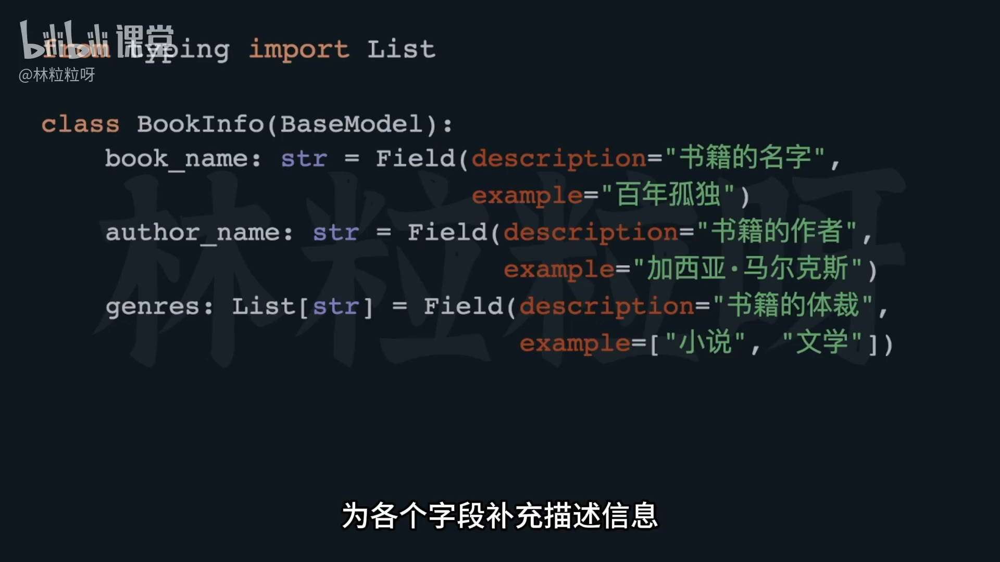

# 65-Output Parser：从模型输出里提取 JSON

## 一、Output Parser 的功能与作用

**核心作用：**
1. 给模型下达指令，让模型按照指定格式输出内容。  
2. 解析模型的输出，从中提取目标信息。  

常见格式包括：
- 逗号分隔列表  
- JSON（更易解析，可直接转为字典、列表或类实例）

---

## 二、使用场景举例

假设我们经营一个书籍点评网站，拥有大量未整理的书籍介绍。  
目标：让 AI 从描述中提取出以下信息：
- 书名（Book Name）
- 作者（Author Name）
- 题材（Genres）

输出应为符合预期结构的 **JSON** 数据。  
若字段名或数据类型不符合要求，会导致解析失败（例如，类型不是字符串或列表）。

---

## 三、LAN Chain 的解析器：`PydanticOutputParser`

`PydanticOutputParser` 能：
- 指挥 AI 按照指定格式输出。
- 根据模式验证并解析生成的数据。

它依赖的是 Python 的 **Pydantic** 库，用于**数据模型验证与解析**。  
会根据类型提示确保：
- 字段存在；
- 字段值类型正确；
- 符合格式规范。

---

## 四、环境准备

需要安装并导入模块：
```python
from langchain.output_parsers import PydanticOutputParser
from pydantic import BaseModel, Field 
from typing import List
```

说明：
- `BaseModel`：创建数据模型的基类（相当于数据说明书）。
- `Field`：为字段提供额外信息（描述、验证条件）。
- `List`：用于指定列表类型。

---

## 五、定义数据模型

以书籍信息为例，定义一个 `BookInfo` 类：



```python
class BookInfo(BaseModel):
    book_name: str = Field(description="书籍名称")
    author_name: str = Field(description="作者名称")
    genres: List[str] = Field(description="书籍题材列表")
```

说明：
- 类型定义格式：`字段名: 类型`
- 可以使用 `Field` 的 `description` 参数为 AI 提供字段意义，帮助理解输出要求。

---

## 六、创建解析器实例

用定义好的数据模型，创建 `PydanticOutputParser`：

```python
parser = PydanticOutputParser(pydantic_object=BookInfo)
```

实现两大功能：
1. 指导模型输出符合格式要求的 JSON；
2. 将模型输出解析为 `BookInfo` 实例。

---

## 七、查看解析指令

使用：

```python
parser.get_format_instructions()
```

解析器会自动生成格式说明，教模型如何按照数据模式输出。  
无需手动撰写复杂的 JSON 格式提示，解析器会替你完成这一步。

---

## 八、构造提示模板（ChatPromptTemplate）

使用 `ChatPromptTemplate` 创建消息模板：

```python
from langchain.prompts import ChatPromptTemplate

prompt = ChatPromptTemplate.from_messages([
    ("system", "你是一个图书信息提取助手。{instructions}"),
    ("user", "{book_description}")
])

formatted_prompt = prompt.invoke({
    "instructions": parser.get_format_instructions(),
    "book_description": "《活着》是余华创作的小说，讲述了中国农村家庭的悲欢离合。"
})
```

---

## 九、传入模型并获取输出

将构造好的提示传给模型：

```python
response = model.invoke(formatted_prompt)
print(response)
```

输出结果应为：
- 字段名与 `BookInfo` 模型一致；
- 值类型符合定义（字符串或字符串列表）。

---

## 十、解析模型输出

模型输出通常是 JSON 字符串，不便直接使用。  
可调用解析器的 `parse` 方法（或 `parse_response`）：

```python
book_info = parser.parse(response)
print(book_info)
```

此时，JSON 会自动转换为 `BookInfo` 的实例对象。  
可以像操作对象一样方便地访问字段：

```python
print(book_info.book_name)
print(book_info.author_name)
print(book_info.genres)
```

---

## 十一、总结

**`PydanticOutputParser` 的优势**
1. 自动指挥 LLM 输出正确结构；
2. 自动验证字段与类型；
3. 自动将结果转为类对象；
4. 极大便利结构化信息提取任务。

---

## 十二、延伸学习

课程文件中提供本节对应的 Jupyter Notebook 示例。  
可用于复现与实验练习。

---

✅ **你学会了吗？**  
通过 `PydanticOutputParser`，你可以：
- 控制 AI 输出 JSON 格式；
- 自动解析并验证结果；
- 快速提取结构化数据，用于后续系统开发或展示。

---

# 解释代码


### **理解核心概念**

在开始看代码之前，我们先来理解几个最核心的概念：

1.  **大型语言模型 (LLM)**：就是我们常说的ChatGPT、GPT-4这些能理解和生成自然语言的人工智能模型。
2.  **JSON (JavaScript Object Notation)**：一种轻量级的数据交换格式，易于人阅读和编写，也易于机器解析和生成。它通常以键值对（key-value pairs）的形式组织数据，比如 `{"name": "小白", "age": 18}`。
3.  **Output Parser (输出解析器)**：这个就是我们今天的主角。LLM通常会输出一大段自然语言文本。但很多时候，我们不想要一大段文字，而是想要模型输出**特定结构**的数据（比如一个JSON对象），这样我们才能在我们的程序里方便地使用这些数据。输出解析器就是用来做这个“整理”工作的工具。
4.  **`langchain`**：一个非常流行的Python库，它提供了很多工具和接口，帮助我们更容易地构建基于LLM的应用。

这段代码的目标就是：**给定一段书的介绍，让LLM帮我们自动提取出书名、作者、体裁，并且把这些信息整理成我们想要的JSON格式，最终转换成Python对象方便我们使用。**

---

### **代码逐行解释**

#### **Cell 1: 导入必要的库**

```python
from typing import List

from langchain.output_parsers import PydanticOutputParser
from langchain.prompts import ChatPromptTemplate
from langchain.schema import HumanMessage
from langchain_core.pydantic_v1 import BaseModel, Field
from langchain_openai import ChatOpenAI
```

*   `from typing import List`: `typing` 是Python标准库的一部分，用于类型提示。`List` 表示一个列表，比如 `List[str]` 就表示一个字符串列表。这能让代码更清晰，更容易被其他开发者理解。
*   `from langchain.output_parsers import PydanticOutputParser`: 从 `langchain` 库中导入 `PydanticOutputParser`。这就是我们说的“输出解析器”的核心类，它会结合 `Pydantic` 来工作。
*   `from langchain.prompts import ChatPromptTemplate`: 导入 `ChatPromptTemplate`。在与LLM交互时，我们通常不是直接给模型一句话，而是给它一个“模板”，这个模板包含了系统指令、用户问题等等。`ChatPromptTemplate` 就是用来创建这种模板的。
*   `from langchain.schema import HumanMessage`: 导入 `HumanMessage`。这是 `langchain` 中用来表示由“人类”用户发出的消息的对象。在`ChatPromptTemplate`里会用到。
*   `from langchain_core.pydantic_v1 import BaseModel, Field`: 从 `langchain_core` (这是 `langchain` 比较底层和核心的部分)导入 `BaseModel` 和 `Field`。它们都来自于 `pydantic` 这个库。
    *   `BaseModel`: 这是 `pydantic` 定义数据模型（也就是我们想从LLM那里得到的数据结构）的基础类。
    *   `Field`: 用于给 `BaseModel` 中的字段添加额外信息的工具，比如描述 (description)、示例 (example)。
*   `from langchain_openai import ChatOpenAI`: 导入 `ChatOpenAI`。这是 `langchain` 提供的用于连接 OpenAI 的聊天模型（如 GPT-3.5 Turbo, GPT-4）的接口。你需要配置好你的 OpenAI API Key 才能使用它。

**总结：** 这一步就是把我们需要的各种工具都带入到“工作间”里，为接下来的操作做准备。

#### **Cell 2: 定义我们期望的数据结构**

```python
class BookInfo(BaseModel):
    book_name: str = Field(description="书籍的名字", example="百年孤独")
    author_name: str = Field(description="书籍的作者", example="加西亚·马尔克斯")
    genres: List[str] = Field(description="书籍的体裁", example=["小说", "文学"])
```

*   `class BookInfo(BaseModel):`: 这里我们定义了一个名为 `BookInfo` 的类，它继承自 `BaseModel`。这意味着 `BookInfo` 会成为一个 `pydantic` 数据模型，用来描述我们希望从LLM那里得到的数据的结构。
*   `book_name: str = Field(description="书籍的名字", example="百年孤独")`:
    *   `book_name`: 这是模型中定义的一个字段，表示“书名”。
    *   `: str`: 冒号`:`后面跟着 `str` 表示 `book_name` 这个字段的数据类型必须是字符串（text）。
    *   `= Field(...)`: 使用 `Field` 函数来为这个字段提供更多元信息。
        *   `description="书籍的名字"`: 这个描述非常重要！它会告诉LLM这个字段是用来干嘛的。LLM会根据这个描述来理解它应该提取什么内容。
        *   `example="百年孤独"`: 提供一个示例值，进一步帮助LLM理解期望的格式和内容。
*   `author_name: str = Field(description="书籍的作者", example="加西亚·马尔克斯")`: 和 `book_name` 类似，定义了作者的名字，也是字符串类型。
*   `genres: List[str] = Field(description="书籍的体裁", example=["小说", "文学"])`:
    *   `genres`: 表示“体裁”。
    *   `: List[str]`: 注意这里，它是一个字符串列表。也就是说，一本书可能有多个体裁。
    *   `example=["小说", "文学"]`: 示例也展示了它是一个包含多个字符串的列表。

**总结：** 这一步就像是画了一张“表格”或者“合同”的样式，告诉LLM：“嘿，你提取完信息后，请按照这个表格的格式（书名、作者、体裁列表）来给我数据，并且每个字段都帮你标明了是干嘛的，甚至给了你例子。”这个结构是LLM理解输出格式的关键。

#### **Cell 3: 创建输出解析器**

```python
output_parser = PydanticOutputParser(pydantic_object=BookInfo)
```

*   `output_parser = PydanticOutputParser(pydantic_object=BookInfo)`: 这一行代码创建了一个 `PydanticOutputParser` 的实例。
    *   `pydantic_object=BookInfo`: 这个参数告诉解析器，它应该使用我们刚才定义的 `BookInfo` 这个 `pydantic` 模型作为目标结构。也就是说，这个解析器会尝试把LLM的文本输出转换成 `BookInfo` 对象。

**总结：** 现在我们有了一个“智能提取和转换工具”，它知道自己应该按照 `BookInfo` 的样子去理解和整理数据。

#### **Cell 4: 查看解析器生成的格式指令**

```python
print(output_parser.get_format_instructions())
```

*   `output_parser.get_format_instructions()`: 这是 `PydanticOutputParser` 的一个非常重要的方法。它会根据我们提供的 `BookInfo` 模型，自动生成一段文本，这段文本是用来**指示LLM如何进行输出格式化**的。
*   `print(...)`: 打印出这段指令。

**输出解释：**

你看到的输出是这样的（我已经把中文unicode编码转换成汉字了）：

```
The output should be formatted as a JSON instance that conforms to the JSON schema below.

As an example, for the schema {"properties": {"foo": {"title": "Foo", "description": "a list of strings", "type": "array", "items": {"type": "string"}}}, "required": ["foo"]}\n
the object {"foo": ["bar", "baz"]} is a well-formatted instance of the schema. The object {"properties": {"foo": ["bar", "baz"]}} is not well-formatted.

Here is the output schema:
```
```
{"properties": {"book_name": {"title": "Book Name", "description": "书籍的名字", "example": "百年孤独", "type": "string"}, "author_name": {"title": "Author Name", "description": "书籍的作者", "example": "加西亚·马尔克斯", "type": "string"}, "genres": {"title": "Genres", "description": "书籍的体裁", "example": ["小说", "文学"], "type": "array", "items": {"type": "string"}}}, "required": ["book_name", "author_name", "genres"]}
```
```

这段输出的第一部分是在解释：“你的输出应该是一个JSON对象，并且要符合下面的JSON Schema。上面例子是正确的输出，下面例子是错误的输出。”

而最关键的是第二部分的JSON Schema：

```json
{
  "properties": {
    "book_name": {
      "title": "Book Name",
      "description": "书籍的名字",
      "example": "百年孤独",
      "type": "string"
    },
    "author_name": {
      "title": "Author Name",
      "description": "书籍的作者",
      "example": "加西亚·马尔克斯",
      "type": "string"
    },
    "genres": {
      "title": "Genres",
      "description": "书籍的体裁",
      "example": ["小说", "文学"],
      "type": "array",
      "items": { "type": "string" }
    }
  },
  "required": ["book_name", "author_name", "genres"]
}
```

这是一个标准的 **JSON Schema**。它非常精确地描述了我们期望的JSON数据应该长什么样子：
*   它应该是一个对象（`properties`）。
*   这个对象有三个属性：`book_name`、`author_name`、`genres`。
*   每个属性都详细说明了它的标题、描述、示例和数据类型（`type: "string"` 表示字符串，`type: "array"` 表示数组/列表，`items: {"type": "string"}` 表示数组里都是字符串）。
*   `required: ["book_name", "author_name", "genres"]` 表示这三个字段都是**必需**的。

**总结：** 这一步的目的是为了向LLM明确，你输出的数据必须长成这个JSON Schema所描述的样子。LLM会根据这些详细的指令，努力输出符合要求的JSON字符串。

#### **Cell 5: 创建对话提示模板**

```python
prompt = ChatPromptTemplate.from_messages([
    ("system", "{parser_instructions} 你输出的结果请使用中文。"),
    ("human", "请你帮我从书籍概述中，提取书名、作者，以及书籍的体裁。书籍概述会被三个#符号包围。\\n###{book_introduction}###")
])
```

*   `prompt = ChatPromptTemplate.from_messages([...])`: 创建一个聊天提示模板。这个模板定义了我们和LLM对话的结构。
*   `("system", "{parser_instructions} 你输出的结果请使用中文。")`: 这是**系统消息**。系统消息通常用于设置LLM的行为，比如告诉它扮演什么角色，遵循什么规则。
    *   `{parser_instructions}`: 这是一个**占位符**。在实际发送给LLM之前，我们会把Cell 4中`output_parser.get_format_instructions()`生成的JSON Schema指令填充到这里。这是让LLM知道输出格式的关键！
    *   `你输出的结果请使用中文。`: 额外要求模型用中文输出。
*   `("human", "请你帮我从书籍概述中，提取书名、作者，以及书籍的体裁。书籍概述会被三个#符号包围。\\n###{book_introduction}###")`: 这是**用户消息**，也就是我们要告诉LLM它需要完成的任务。
    *   `请你帮我从书籍概述中，提取书名、作者，以及书籍的体裁。`: 说明任务内容。
    *   `书籍概述会被三个#符号包围。`: 这是一个很棒的技巧！告诉LLM输入文本的边界，让它更容易识别。
    *   `\\n###{book_introduction}###`: `\\n`是换行符。`{book_introduction}` 是另一个占位符，用来放置实际的书籍介绍文本。它被 `###` 符号包围，与上面的指令相呼应。

**总结：** 这一步我们构建了一个“对话剧本”，告诉LLM在整个对话中它应该如何表现（系统指令），以及我们具体要求它做什么（用户问题），并且预留了填入格式指令和实际书籍介绍的位置。

#### **Cell 6: 准备输入数据并生成最终提示**

```python
book_introduction = """《明朝那些事儿》，作者是当年明月。2006年3月在天涯社区首次发表，2009年3月21日连载完毕，边写作边集结成书出版发行，一共7本。
《明朝那些事儿》主要讲述的是从1344年到1644年这三百年间关于明朝的一些故事。以史料为基础，以年代和具体人物为主线，并加入了小说的笔法，语言幽默风趣。对明朝十六帝和其他王公权贵和小人物的命运进行全景展示，尤其对官场政治、战争、帝王心术着墨最多，并加入对当时政治经济制度、人伦道德的演义。
它以一种网络语言向读者娓娓道出三百多年关于明朝的历史故事、人物。其中原本在历史中陌生、模糊的历史人物在书中一个个变得鲜活起来。《明朝那些事儿》为读者解读历史中的另一面，让历史变成一部活生生的生活故事。
"""
final_prompt = prompt.invoke({"book_introduction": book_introduction,
                              "parser_instructions": output_parser.get_format_instructions()})
```

*   `book_introduction = """..."""`: 这里我们定义了要让LLM处理的实际书籍介绍文本，也就是《明朝那些事儿》的简介。
*   `final_prompt = prompt.invoke(...)`: 这一行将我们之前创建的 `prompt` 模板“实例化”了。
    *   `{"book_introduction": book_introduction, "parser_instructions": output_parser.get_format_instructions()}`: 这里，我们将实际的 `book_introduction` 文本和通过 `output_parser.get_format_instructions()` 获得的格式指令，填充到 `prompt` 模板中对应的占位符。
    *   `final_prompt` 现在包含了最终要发送给LLM的完整消息列表。

**总结：** 这一步就是把所有的准备工作汇集起来，生成了最终的、包含所有指令和数据的“完整版问题”，准备好发送给LLM。

#### **Cell 7: 调用LLM并获取原始响应**

```python
model = ChatOpenAI(model="gpt-3.5-turbo")
response = model.invoke(final_prompt)
print(response.content)
```

*   `model = ChatOpenAI(model="gpt-3.5-turbo")`: 创建一个 `ChatOpenAI` 实例，指定要使用的OpenAI模型，这里是 `gpt-3.5-turbo`。
    *   **注意：** 运行这行代码前，你需要确保你的环境变量中设置了 `OPENAI_API_KEY`，或者在 `ChatOpenAI` 中传入 `openai_api_key="你的API密钥"`。
*   `response = model.invoke(final_prompt)`: 将已经填充好的 `final_prompt` (完整问题)发送给LLM模型，并等待它的响应。`model.invoke()` 是 `langchain` 链式调用的统一接口，这里它会发送 `ChatCompletion` 请求。
*   `print(response.content)`: `response` 是LLM返回的一个消息对象，`response.content` 包含了LLM实际生成回应的文本内容。

**输出解释：**

你将看到LLM输出了一段文本，它应该是一个JSON字符串，类似这样：

```json
{
    "book_name": "明朝那些事儿",
    "author_name": "当年明月",
    "genres": ["小说", "历史"]
}
```

**总结：** 这一步是真正地与AI模型进行了对话，并得到了它的回答。我们可以看到，由于有了之前详细的格式指令，LLM很听话地输出了一个JSON格式的字符串！

#### **Cell 8: 使用输出解析器处理LLM的响应**

```python
result = output_parser.invoke(response)
result
```

*   `result = output_parser.invoke(response)`: **这是整个流程的核心！** 我们把LLM的原始 `response` (一个包含JSON字符串的消息对象)传给 `output_parser`。
    *   `output_parser` 会读取 `response.content` 中的JSON字符串。
    *   它会根据我们之前定义的 `BookInfo` 模型，尝试解析这个JSON字符串。
    *   如果解析成功，它会把JSON数据转换为一个Python中的 `BookInfo` 对象，并赋值给 `result`。
*   `result`: 打印 `result` 对象。

**输出解释：**

```
BookInfo(book_name='明朝那些事儿', author_name='当年明月', genres=['小说', '历史'])
```

**总结：** 看！现在 `result` 不再是一个普通的字符串了，它是一个实实在在的 `BookInfo` 对象！这意味着，LLM输出的文本现在已经变成了我们Python程序可以方便操作的结构化数据。这比手动去解析字符串要安全、高效得多。

#### **Cell 9 & 10: 访问提取到的数据**

```python
result.book_name
```
```python
result.genres
```

*   `result.book_name`: 因为 `result` 现在是一个 `BookInfo` 对象，我们可以直接用`.`操作符来访问它的属性了，比如 `book_name`。
*   `result.genres`: 同样，访问 `genres` 属性，它是一个Python列表。

**输出解释：**

```
'明朝那些事儿'
```
```
['小说', '历史']
```

**总结：** 这两步展示了，一旦我们把LLM的输出成功解析成Python对象，后续处理就变得非常简单和直观。我们可以像操作普通Python对象一样，轻松获取其中的各个字段。

---

### **整个流程复盘与总结**

整个过程可以总结为以下几个步骤：

1.  **定义期望的输出结构 (Pydantic `BaseModel`)**：告诉程序，我们想要从LLM那里得到什么样的数据，包括字段名、数据类型和描述。
2.  **创建输出解析器 (`PydanticOutputParser`)**：这个解析器知道如何将LLM的文本输出转换为我们定义的结构。
3.  **获取格式指令 (`get_format_instructions()`)**：解析器会生成一段文本，这段文本是用来**教导LLM**如何按照我们定义的结构来输出结果。
4.  **构建提示模板 (`ChatPromptTemplate`)**：创建一个通用的对话模板，其中包含LLM的行为指令（系统消息，包括格式指令）和用户的问题。
5.  **准备数据并生成最终提示 (`prompt.invoke()`)**：将实际的输入文本和格式指令填充到提示模板中，形成发送给LLM的完整请求。
6.  **调用LLM获取原始输出 (`model.invoke()`)**：将最终提示发送给LLM，获取它的回答。这时LLM会尽力按照我们给的格式指令输出JSON字符串。
7.  **解析LLM的输出 (`output_parser.invoke()`)**：将LLM返回的原始文本（JSON字符串）传递给输出解析器，解析器将其转换成Python中对应的数据对象。
8.  **使用结构化数据**：现在你可以像操作普通Python对象一样，方便、安全地访问和使用从LLM提取出的结构化数据了！

**白话总结：** 这个过程就像是，你不再只是给一个聪明的小朋友一张纸让他乱写答案，而是先给他一张“填写表格的范例”，告诉他“你必须按照这个表格的格式来写，例如：‘书名’这一格写书名，‘作者’这一格写作者，‘体裁’这一格要写多个用逗号隔开”。然后，小朋友就会努力写出符合表格格式的答案，最后你再用一个“表格识别器”把小朋友写的表格内容直接转换成电脑里能用的结构化数据。