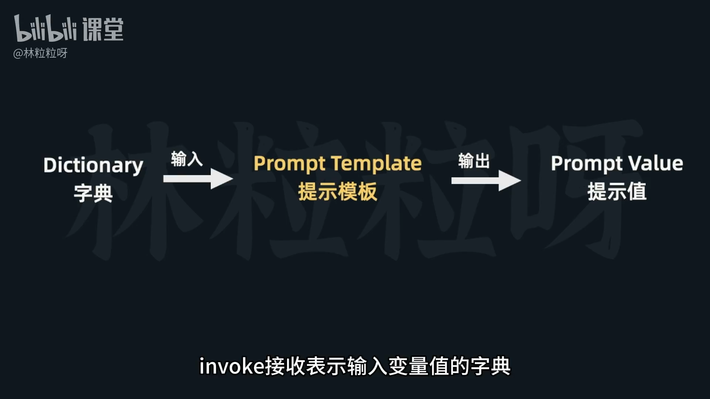
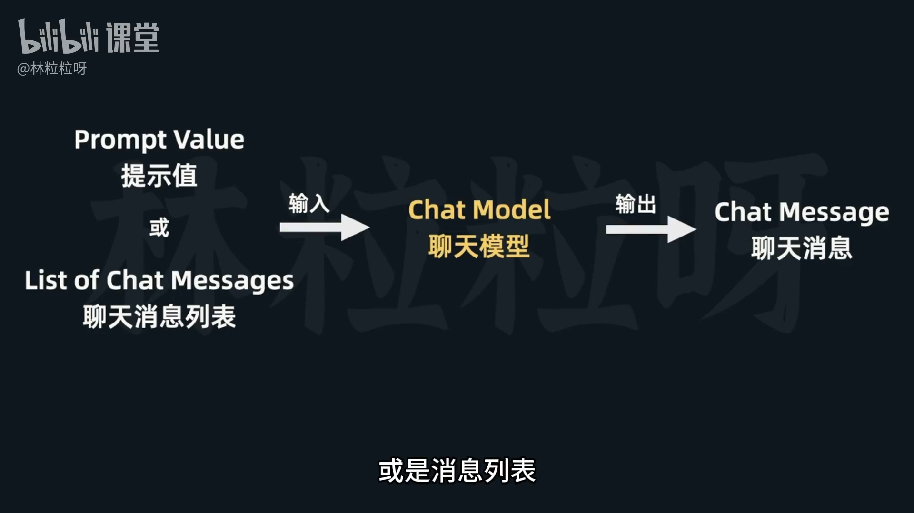
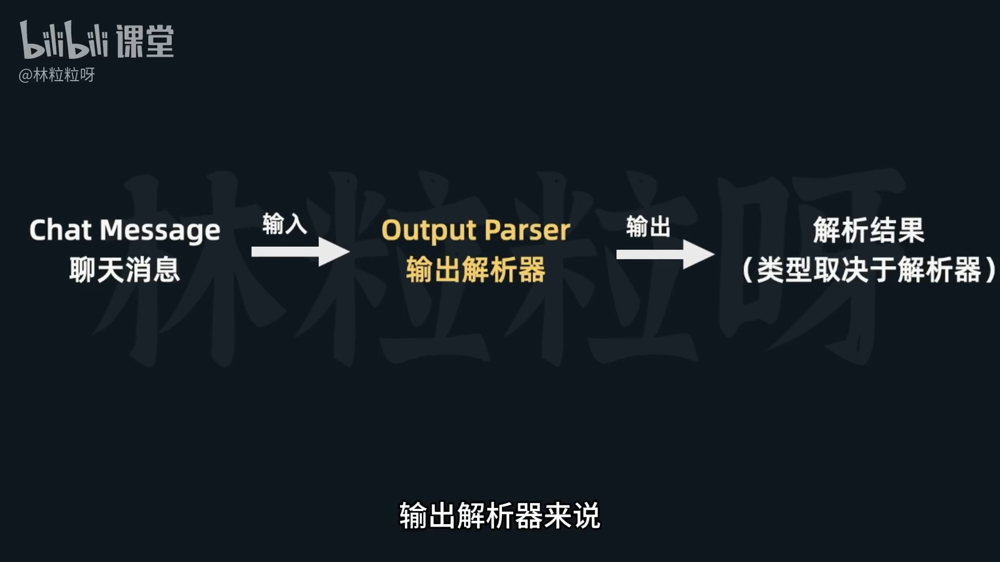
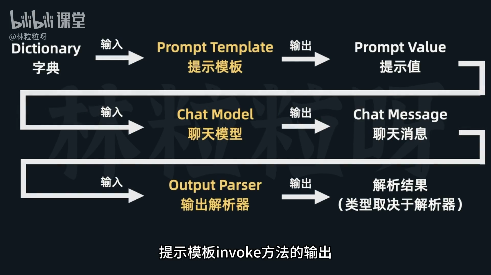

# 66-Chain：串起提示模板、模型与输出解析器

## 一、背景与核心思想  
在前几节中，我们已经接触了以下三个核心组件：  
1. **聊天模型 (Chat Model)**  
2. **聊天提示模板 (Chat Prompt Template)**  
3. **输出解析器 (Output Parser)**  

无论是：
- `ChatPromptTemplate`、`FewShotChatMessagePromptTemplate` 等提示模板；
- `ChatOpenAI` 等聊天模型；
- `CommaSeparatedListOutputParser`、`PydanticOutputParser` 等输出解析器；  
它们都 **具备一个共同点：都实现了 `invoke`  方法**。

---

## 二、`invoke` 方法的设计理念





`invoke` 方法是 **LangChain 表达式语言**（LCEL）中 `Runnable` 通用的可调用接口。  
三类组件中 `invoke` 的输入输出关系如下：

| 组件 | 输入 | 输出 |
|------|------|------|
| Prompt Template | 输入变量值的字典 | Prompt Value（提示值） |
| Chat Model | Prompt Value（提示值） / List of Chat Messages 消息列表 | Chat Message（聊天消息） |
| Output Parser | Chat Message（聊天消息）| 解析结果（类型取决于解析器） |

因此，整个调用链可以理解为：

```
输入变量 → 提示模板 → 聊天模型 → 输出解析器 → 最终结果
```

从而实现 **层层调用** 或 **一次性调用形成完整链路**。


---

## 三、链式调用 (Chain) 思想

因为每个组件的输出是下一个组件的输入，所以可以用连续 `invoke` 调用的方式：

```python
output_parser.invoke(
    model.invoke(
        prompt.invoke(
            {"subject": "莫兰迪",
             "parser_instructions": parser_instructions}
        )
    )
)
```

但这种层层嵌套写法较繁琐。LangChain 提供了更简洁的写法：**管道操作符 `|`**。

---

## 四、管道操作符 `|` 与 LCEL 表达式语言

通过 **管道语法**，可以更清晰地表达组件之间的流向关系。例如：

```python
chain = prompt | model | output_parser
```

这表示：
- 将提示模板的输出传递给模型；  
- 再将模型的输出传递给输出解析器。

这套写法被称为 **LangChain Expression Language (LCEL)**，能把多个组件串联成一条「链（Chain）」。

```python
(prompt | model | output_parser).invoke(
    {"subject": "莫兰迪",
     "parser_instructions": parser_instructions}
)
```
---

## 五、调用链的执行与参数传递

当我们定义好 chain 后，只需调用一次 `invoke` 即可执行整个流程：

```python
final_result = chain.invoke(inputs)
```

🧠 注意：
- `invoke()` 所需的参数就是传递给 **第一个组件** 的输入；
- 后续各组件自动接受前一组件的输出。

---

## 六、灵活组合与扩展

LangChain 的链式思想具有高度灵活性：
- 中间的 ChatModel 组件也可替换为其他模型类型；
- 提示模板与输出解析器都不是必须的；
- 可以自由组合出复杂的多步骤流程。

通过 **LCEL** 表达式语言，我们能够将复杂的上下游关系以清晰直观的形式展现出来。

---

## 七、小结

🔗 **Chain 的核心要义：**
- 统一的 `invoke` 接口  
- 组件的可组合性  
- 使用管道符 `|` 串联组件  
- 一次调用，完成端到端任务  

Chain 机制让模型调用流程更清晰、更模块化，是 LangChain 架构设计的核心优势。

---

你好！没问题，我来帮你这个“小白”一步步解释这个LangChain的代码。

这个代码的标题是“06 Chain _ 串起提示模板-模型-输出解析器”，其实就是在告诉我们，它要演示如何把**提示模板** (Prompt Template)、**大语言模型** (LLM Model) 和**输出解析器** (Output Parser) 这三个重要的组件**串联**起来，让它们像流水线一样工作。

我们最终的目标是：给AI一个主题（比如“莫兰迪色”），让它列出5个对应的十六进制颜色码，并且我们希望AI把结果格式化成一个Python列表，而不是一大段文字。

# 代码解释

### Cell 1: 导入必要的工具

```python
from langchain_openai import ChatOpenAI
from langchain.output_parsers import CommaSeparatedListOutputParser
from langchain.prompts import ChatPromptTemplate
```

*   `from langchain_openai import ChatOpenAI`:
    *   想象一下你想找个超级聪明的“助理”帮你完成任务。`ChatOpenAI` 就是这个助理，它代表了OpenAI公司提供的一个聊天模型（比如GPT-3.5）。我们通过它来跟AI模型对话。
*   `from langchain.output_parsers import CommaSeparatedListOutputParser`:
    *   这个是我们的“翻译官”或“格式化工具”。AI助理回答问题可能会是各种文本格式，但我们希望它给出的答案能按特定规则（比如逗号分隔）排列。这个工具的作用就是把AI的原始文本回答，转换成我们想要的，比如一个Python的列表。`CommaSeparatedListOutputParser` 顾名思义，就是专门解析逗号分隔的列表的。
*   `from langchain.prompts import ChatPromptTemplate`:
    *   这个是我们的“提问模板”。我们每次问AI问题，可能有些部分是固定的，有些部分是变化的。为了避免每次都从头写所有问题，我们可以先设计一个模板，把那些变化的部分留成空位（像填空题一样）。

### Cell 2: 定义提问模板 (Prompt Template)

```python
prompt = ChatPromptTemplate.from_messages([
    ("system", "{parser_instructions}"),
    ("human", "列出5个{subject}色系的十六进制颜色码。")
])
```

*   `prompt = ChatPromptTemplate.from_messages([...])`: 我们在这里创建了一个提问的模板。
*   `("system", "{parser_instructions}")`:
    *   `system` 消息是告诉AI它应该扮演什么角色，或者给它一些背景指令。这里的 `{parser_instructions}` 是一个**占位符**，就像一个填空题的空。我们会稍后把“如何格式化输出”的指令填到这里，提前告诉AI我们的期望。让AI知道它应该怎么输出，是保证输出能被解析的关键。
*   `("human", "列出5个{subject}色系的十六进制颜色码。")`:
    *   `human` 消息是我们要问AI的具体问题。这里的 `{subject}` 也是一个**占位符**，我们会把要查询的颜色主题（比如“莫兰迪”）填到这里。

所以，这个模板的意思就是：**“AI，我给你一个指令（`{parser_instructions}`），然后请你列出5个关于 `{subject}` 色系的十六进制颜色码。”**

### Cell 3: 设置输出解析器 (Output Parser)

```python
output_parser = CommaSeparatedListOutputParser()
parser_instructions = output_parser.get_format_instructions()
```

*   `output_parser = CommaSeparatedListOutputParser()`: 我们创建了一个用于解析逗号分隔列表的工具实例。
*   `parser_instructions = output_parser.get_format_instructions()`: **这一行非常重要！**
    *   我们问 `output_parser`：“喂，大兄弟，你希望别人怎么给你数据，你才能正确地解析？”
    *   `output_parser` 就会自动生成一段文本，例如：“请把结果格式化为逗号分隔的列表。”这段文本就是 `parser_instructions`。
    *   **为什么重要？** 因为我们要在 Cell 2 的 `prompt` 模板中，把这段 `parser_instructions` 填到 `system` 消息里，**提前告知AI**，让它知道应该按照什么格式来输出，这样解析器才能更好地工作。

### Cell 4: 初始化大语言模型 (LLM Model)

```python
model = ChatOpenAI(model="gpt-3.5-turbo")
```

*   `model = ChatOpenAI(model="gpt-3.5-turbo")`: 我们实例化了我们的“AI助理”，指定它使用 `gpt-3.5-turbo` 模型。这是我们真正与AI交互的接口。

### Cell 5: 手动串联：提示模板 -> 模型 -> 解析器 (一步步执行)

```python
result = output_parser.invoke(model.invoke(prompt.invoke({"subject": "莫兰迪", "parser_instructions": parser_instructions})))
result
```

*   这一行有点长，我们从最里面往外看，就像剥洋葱一样：
    1.  `prompt.invoke({"subject": "莫兰迪", "parser_instructions": parser_instructions})`:
        *   首先，我们用实际的值填充 `prompt` 模板。`subject` 变成了“莫兰迪”，`parser_instructions` 变成了我们从解析器那里获取的格式化指令。
        *   这一步会生成一个完整的、准备好发送给AI的消息对象。
    2.  `model.invoke(...)`:
        *   然后，我们把上一步生成的完整消息发送给 `model`（我们的AI助理）。
        *   AI助理接收到消息后，会根据我们提出的问题和格式化指令，生成一个文本回答。
    3.  `output_parser.invoke(...)`:
        *   最后，我们把AI助理生成的原始文本回答，传入 `output_parser`（我们的翻译官）。
        *   `output_parser` 会根据它自身的规则（逗号分隔），把AI的文本回答转换成一个Python的列表。
*   `result`: 这个变量会存储最终解析出来的Python列表。
*   **输出示例:** `['#B57EDC', '#B55EDC', '#B53EDC', '#B51EDC', '#B50EDC']`
    *   可以看到，AI成功地给出了莫兰迪色系的十六进制颜色码，并且被解析成了一个漂亮的Python列表。

### Cell 6: 使用LangChain的链式调用 `|` 串联 (更简洁的方式)

```python
chat_model_chain = prompt | model | output_parser
result = chat_model_chain.invoke({"subject": "莫兰迪", "parser_instructions": parser_instructions})
result
```

*   `chat_model_chain = prompt | model | output_parser`: **这就是LangChain“链”的核心所在！**
    *   `|` 这个符号在LangChain里表示“管道”或“串联”。它的意思是：
        *   把 `prompt` 的输出（完整的消息）作为 `model` 的输入。
        *   把 `model` 的输出（AI的原始文本回答）作为 `output_parser` 的输入。
    *   这样，`prompt`、`model` 和 `output_parser` 就被**串**成了一条“生产线”或“流水线”，统称为 `chat_model_chain`。
*   `result = chat_model_chain.invoke({"subject": "莫兰迪", "parser_instructions": parser_instructions})`:
    *   现在，我们不需要像 Cell 5 那样一步步调用 `invoke`。我们只需要对整个 `chat_model_chain` 调用一次 `invoke`，并传入所有必要的输入（这里是给 `prompt` 用的 `subject` 和 `parser_instructions`）。
    *   这条链会自动处理数据从一个组件流向下一个组件的过程，非常方便和简洁。
*   **输出示例:** `['#b392ac', '#bb84b8', '#c97dbf', '#d174c7', '#db6dd0']`
    *   结果跟 Cell 5 是一样的，但是代码看起来更清晰、更简洁。

## 总结一下：这个代码干了什么？

这个代码演示了如何使用LangChain把三个主要组件无缝地连接起来，从而实现一个**智能且有结构输出**的任务：

1.  **提示模板 (Prompt Template)**：用来构建灵活的、可复用的提问方式。
2.  **大语言模型 (Model)**：真正的“AI大脑”，根据提示生成回答。我们通过在 `system` 消息中包含解析指令，引导AI生成符合我们期望格式的文本。
3.  **输出解析器 (Output Parser)**：把AI模型生成的原始文本，按照我们想要的格式（比如列表）进行结构化处理。

通过 `|` 这个操作符，LangChain把这三个步骤打包成一个**链 (Chain)**，让整个过程变得非常清晰、高效和易于管理。这在开发复杂的AI应用时非常有用，因为你可以把很多小功能组件像乐高积木一样拼起来，实现更强大的功能。