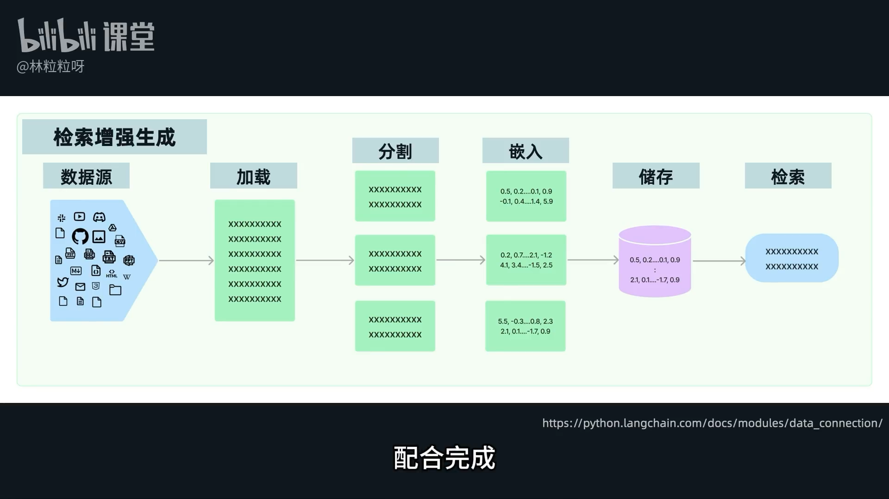
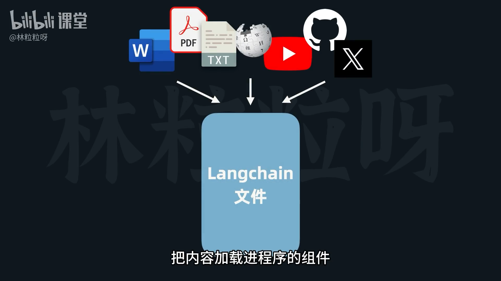
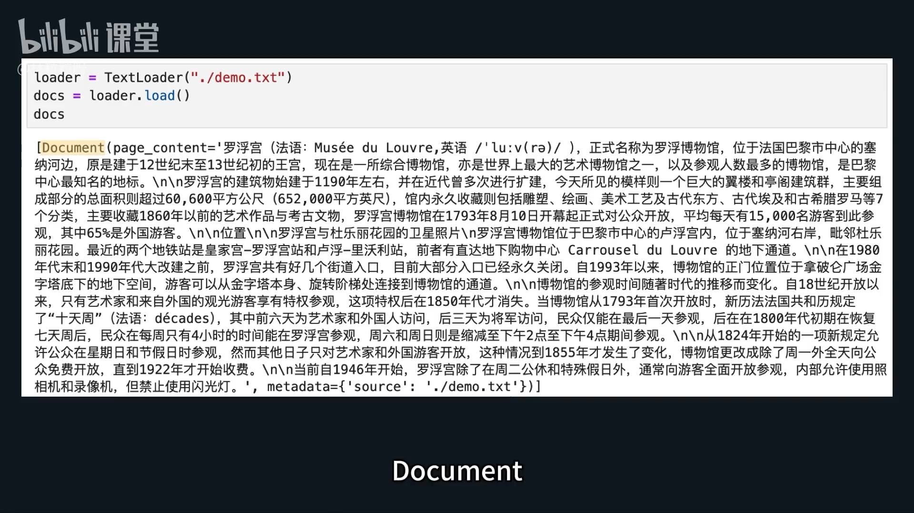
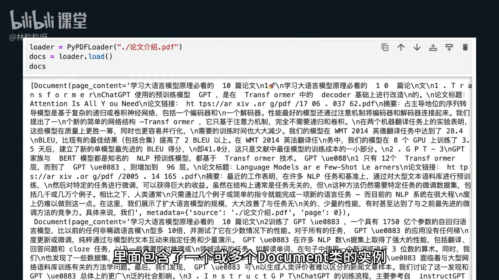
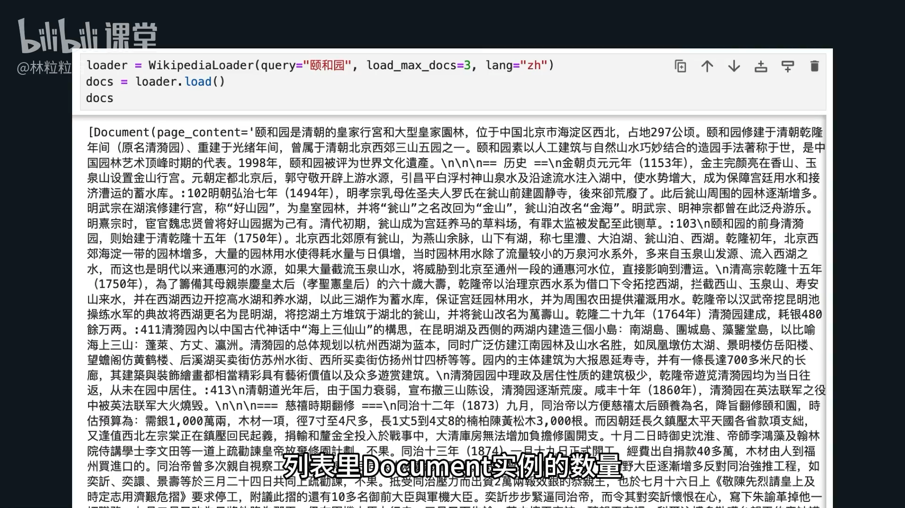

# 82-Document Loader 把外部文档加载进来

#### 1. 概述 (Introduction)

*   **RAG (Retrieval-Augmented Generation) 核心步骤之一：** 文档加载 (Loading)。
*   **作用：** 从各种外部来源加载内容到程序中。
*   **组件位置：** `LangChain Community` 的 `document_loaders` 模块下。
*   **特点：** 支持多种类型的文档加载器，以适应不同来源和格式。



#### 2. Document 类 (Document Class)

*   **用途：** 用于存储 **一段文本内容** 及其 **相关的元数据** (metadata)。
*   **核心属性：**
    *   `page_content`: 文本段落内容的字符串。
    *   `metadata`: 表示元数据的字典，例如来源文件名等信息。
*   **加载器输出：** 大多数加载器的 `load()` 方法返回的结果是一个 `Document` 实例的列表。

 

#### 3. 常见文档加载器示例 (Common Document Loader Examples)

##### 3.1. TextLoader (纯文本加载器)

*   **适用场景：** 加载纯文本文件，如 `.txt` 格式。
*   **纯文本特点：** 不含任何格式信息 (如粗体、下划线、字号)，有效减少体积和读取干扰。
*   **使用步骤：**
    1.  实例化 `TextLoader`：将文件路径作为参数传入构造函数。
        ```python
        from langchain_community.document_loaders import TextLoader
        loader = TextLoader("./demo.txt")
        ```
    2.  调用 `load()` 方法：加载文件内容。
        ```python
        documents = loader.load()
        ```
    3.  **结果：** 返回一个 `Document` 实例的列表。


  
##### 3.2. PyPDFLoader (PDF 文档加载器)

*   **适用场景：** 加载 PDF 文件内容 (比纯文本更复杂)。
*   **前置条件：** 需要先安装 `pypdf` 库 (`pip install pypdf`)。
*   **实现原理：** `LangChain PyPDFLoader` 基于 `pypdf` 库加载 PDF 文本内容。
*   **使用步骤：**
    1.  导入 `PyPDFLoader`。
    2.  实例化 `PyPDFLoader`：传入 PDF 文件路径。
        ```python
        from langchain_community.document_loaders import PyPDFLoader
        loader = PyPDFLoader("example.pdf")
        ```
    3.  调用 `load()` 方法：加载文档内容。
        ```python
        documents = loader.load()
        docs
        ```
    4.  **结果：** 返回一个 `Document` 实例的列表。




##### 3.3. WikipediaLoader (维基百科加载器)

*   **适用场景：** 加载网络上的内容，特别是维基百科词条。
*   **前置条件：** 需要先安装 `wikipedia` 库 (`pip install wikipedia`)。
*   **使用步骤：**
    1.  导入 `WikipediaLoader`。
    2.  实例化 `WikipediaLoader`：
        *   `query` 参数：指定维基百科词条名 (必需)。
        *   `lang` 参数：指定语言 (例如：`"zh"` 表示中文)。
        *   `load_max_docs` 参数：指定最大加载文档数量 (控制内容长度)。
        ```python
        from langchain_community.document_loaders import WikipediaLoader
        loader = WikipediaLoader(query="LangChain", lang="zh", load_max_docs=1)
        ```
    3.  调用 `load()` 方法：获取维基百科词条内容。
        ```python
        documents = loader.load()
        ```
    4.  **结果：** 返回一个 `Document` 实例的列表，数量符合 `load_max_docs` 要求。




#### 4. 其他支持类型与查询 (Other Supported Types & Where to Find More)

*   **广泛支持：** LangChain 文档加载器涵盖了非常多的类别，包括：
    *   **文档格式：** JSON, CSV, Word, PPT 等。
    *   **网络内容：** YouTube, GitHub, Notion 等。
*   **官方文档查询：** 您可以在 LangChain 官方文档的 `LangChain Community` -> `Document Loaders` 部分查看所有支持的类型。

https://docs.langchain.com/oss/python/langchain/overview

---