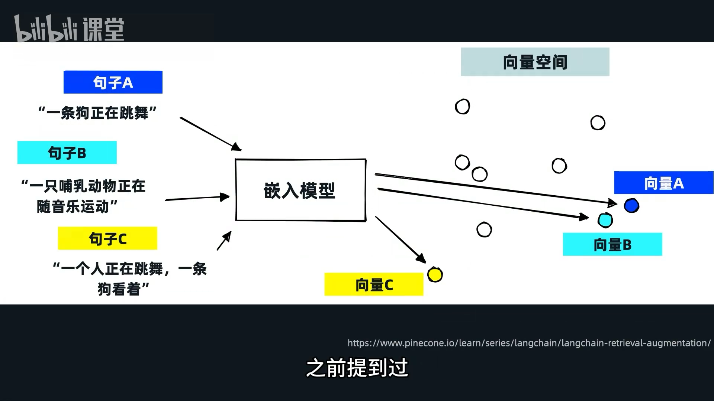
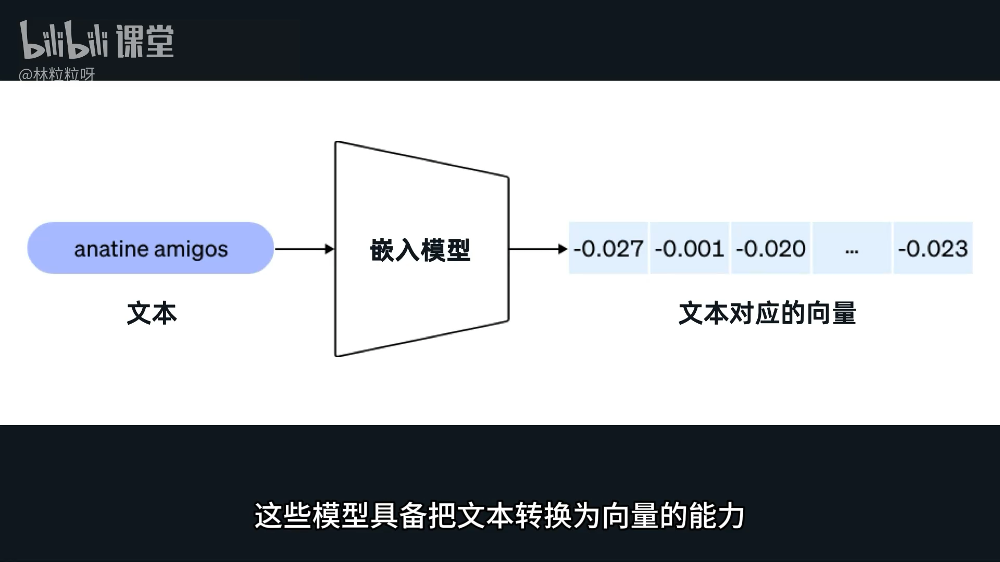
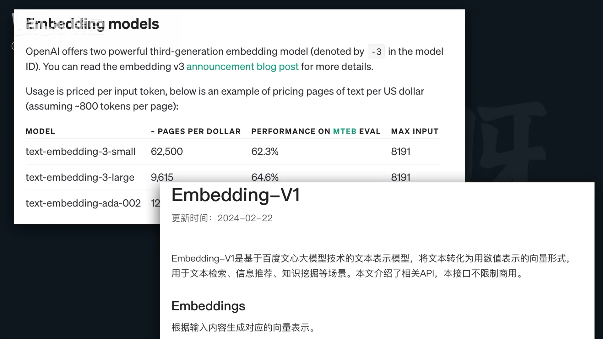

 # 84-Text Embedding 文本变数字？神奇的嵌入向量

#### **一、核心概念：什么是“嵌入 (Embedding)”？**




*   **定义：** 将文本块（或字符串）转换成**向量 (Vector)** 的过程，称为**嵌入 (Embedding)**。
*   **目的：** 嵌入向量需要包含文本之间的**语法、语义**等关系。
*   **特性：**
    *   **相似文本：** 对应的嵌入向量在**向量空间 (Vector Space)** 中距离更近。
    *   **不相关文本：** 对应的嵌入向量距离更远。
*   **工作原理：** 文本内容被量化成一系列数字，这些数字排列成向量，反映了文本的意义。

#### **二、嵌入模型的角色**

*   **实施者：** 像 LangChain (文中的“连乘”可能指此) 这样的框架本身不直接做嵌入，它们**借助嵌入模型**来完成此任务。
*   **提供方：** OpenAI、百度等AI服务提供商都提供具备将文本转换为向量能力的**嵌入模型 (Embedding Models)**。

#### **三、使用 OpenAI 嵌入模型的步骤**

1.  **环境准备**
    *   **安装库：** 确保已安装 `openai` 库 (如果使用 LangChain 则需安装 `langchain-openai`)。
    *   **API 密钥：** 创建并准备好 OpenAI 的 API 密钥。如果之前使用过 GPT 模型，通常这些步骤已完成。

2.  **导入必要的模块**
    *   从 `langchain_openai.embeddings` 模块中导入 `OpenAIEmbeddings`。
    *   **代码示例:** `from langchain_openai.embeddings import OpenAIEmbeddings`

3.  **创建 `OpenAIEmbeddings` 实例**
    *   **初始化：** 需要创建一个 `OpenAIEmbeddings` 的实例。
    *   **`model` 参数：** 用于指定具体的嵌入模型。OpenAI 官方文档会列出可选模型，例如 `text-embedding-3-large`。
    *   **API 密钥处理：**
        *   **推荐：** 如果已将 API 密钥存储为环境变量，则无需手动传入。
        *   **手动传入：** 如果没有设置环境变量，需要通过 `openai_api_key="YOUR_API_KEY"` 参数赋值。
    *   **代码示例:**
        ```python
        # 如果API密钥已是环境变量
        embeddings_model = OpenAIEmbeddings(model="text-embedding-3-large")

        # 如果需要手动传入API密钥
        # embeddings_model = OpenAIEmbeddings(model="text-embedding-3-large", openai_api_key="YOUR_API_KEY")
        ```
    *   **实例作用：** 这个实例将在后续的**向量储存步骤**中派上用场。

4.  **测试与获取嵌入向量 (可选)**
    *   **方法：** 调用 `embed_documents` 方法。
    *   **传入参数：** 一个字符串列表。
    *   **返回结果：** 
        *   一个列表，其长度与传入的字符串列表一致。
        *   列表中的每个元素都是一个**数字列表**，这个数字列表就是对应字符串的**嵌入向量**。
    *   **向量维度 (Dimensions)：**
        *   **含义：** 列表元素的长度，取决于所选的嵌入模型。
        *   **示例：** `text-embedding-3-large` 默认返回维度为 `3072` 的嵌入向量。
        *   **指定维度：** 可以在创建 `OpenAIEmbeddings` 实例时，通过 `dimensions` 参数指定更小的维度，例如 `dimensions=1536`。
    *   **代码示例:**
        ```python
        documents = ["这是一个示例文本。", "另一个相关的句子。", "完全不同的主题。"]
        embedded_vectors = embeddings_model.embed_documents(documents)

        print(f"嵌入向量的数量: {len(embedded_vectors)}")
        print(f"第一个文本的嵌入向量维度: {len(embedded_vectors[0])}")
        print(f"第一个文本的嵌入向量 (部分): {embedded_vectors[0][:5]}...") # 打印前5个数字看一眼
        ```

#### **四、后续步骤**

*   在得到嵌入向量后，下一步通常是**向量数据库 (Vector Database)**，用于储存和高效检索这些嵌入向量。

---