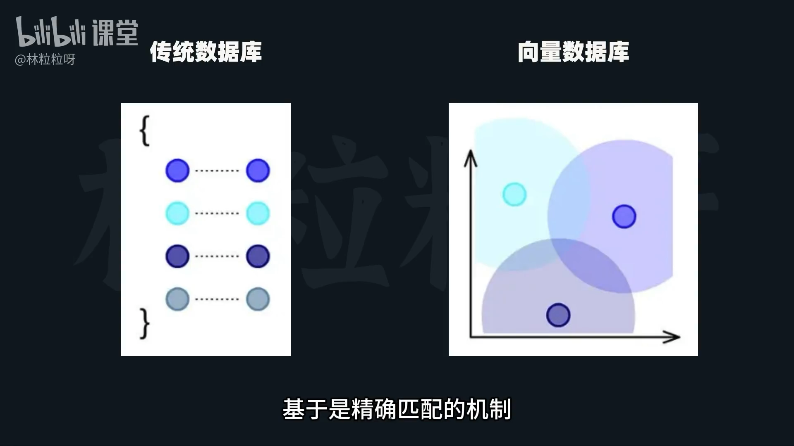
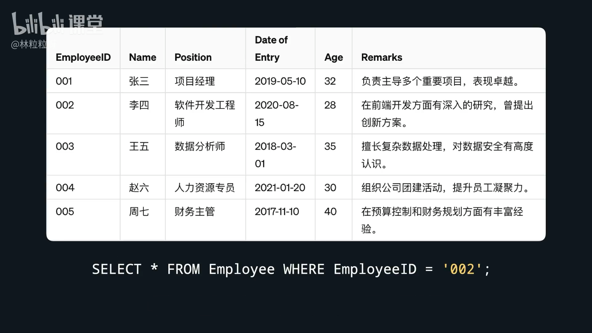
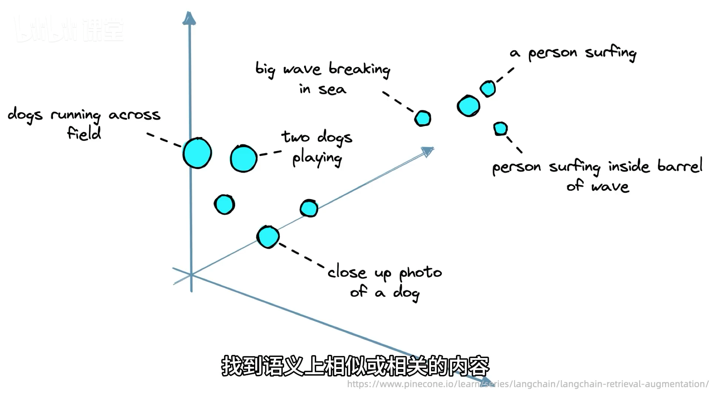
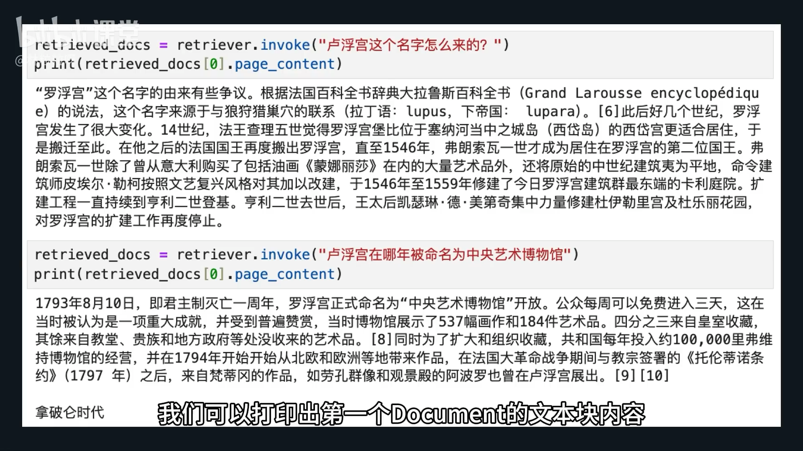
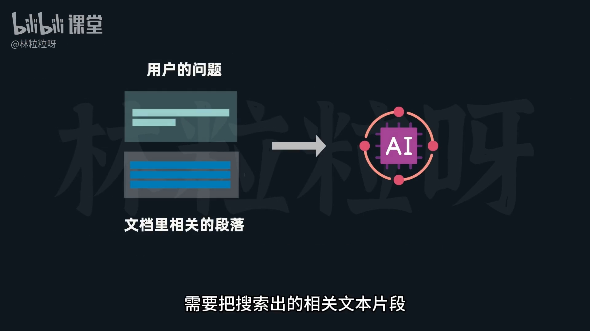

# 85-Vector Store 向量数据库，AI模型的海马体

**1. 为什么要使用向量数据库？(Vector Store: AI模型的海马体)**

*   **痛点:** 传统数据库基于“精准匹配”，擅长处理结构化信息，无法有效处理非结构化信息中的语义相似性查询。
*   **向量数据库优势:** 使用“相似性搜索”，根据向量间的距离查找语音或语义上相似/相关的内容，即使关键词不完全匹配，也能理解意图。
*   **类比:** 向量数据库被形象地比作AI模型的“海马体”，负责存储和检索记忆（信息）。


  
**2. 结构化信息 vs. 非结构化信息**

*   **结构化信息:**
    *   有预定义数据模型 (固定格式、类型、明确定义)。
    *   **示例:** 员工ID、入职日期、级别。
    *   **查询:** `ID = 002` (传统数据库高效)。
*   **非结构化信息:**
    *   无预定义数据模型 (无固定格式、内容多样)。
    *   **示例:** 个人介绍、新闻文章、微博内容。
    *   **查询难点:** `擅长制定财务预算` (传统数据库无法匹配语义相似内容，如“预算控制和财务规划方面有丰富经验”)。




**3. 常用向量数据库**

*   多种选择，文中提及并以Faiss为例进行讲解。
*   **示例:** Faiss, Chroma。


**4. 使用Faiss储存向量 (实战步骤)**

*   **前置条件:** 已有分割好的文本块和嵌入模型实例。
*   **安装依赖:** `pip install faiss-cpu` (Faiss的CPU版本库)。
*   **引入模块:** 从 `Langchain.community.vector_stores` 中引入 `Faiss`。
*   **储存方法:**
    *   调用 `Faiss.from_documents(text, embedding_model)`。
    *   `text` 是切割后的文档列表, `embedding_model` 是嵌入模型的实例
    *   功能: 将文本块转换为向量并储存到Faiss数据库中。

**5. 向量数据库的相似性搜索**

*   **目的:** 根据查询请求，从数据库中找出意思相关的文本块。
*   **核心组件:** Retriever (检索器)。
    *   **获取检索器:** 调用 `向量数据库实例.as_retriever()`。
    *   **检索器定义:** 一个专门用于从大量文本中快速检索相关信息的组件。
*   **执行查询:**
    *   检索器也是Runnable类型，可调用其 `invoke()` 方法。
    *   **参数:** 传入查询请求（一段话）。
    *   **返回结果:** 一个由 `Document` 对象组成的列表。
    *   **排序:** 列表中越相似的文本块排在越前面。
    *   **验证:** 打印出第一个 `Document` 的文本块内容，检查与查询请求的相关性，以验证相似性搜索的准确性。

```python
pip install faiss-cpu 
from langchain_community.vectorstores import FAISS

# ... (省略分割文档和实例化嵌入模型的代码)

db = FAISS.from_documents(texts, embeddings_model) # 将文本块转换为向量并储存到Faiss数据库中
retriever = db.as_retriever() # 调用数据库中的as_retriever方法得到一个检索器retriever，它是从大量文本中检索相关信息的组件
retrieved_docs = retriever.invoke("卢浮宫这个名字怎么来的？") # 返回到结果是一个由Document对象 组成的列表
```

 
**6. 后续展望 (未完成部分)**

*   将搜索出的相关文本片段与查询请求结合，一并传给AI模型以获得回答。
*   可能需要结合提示模板和记忆功能（用于连续对话），但作者暗示或许有更简单的方法。


---