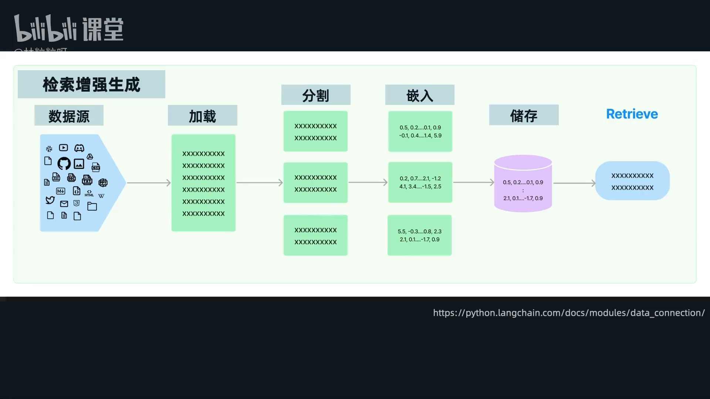
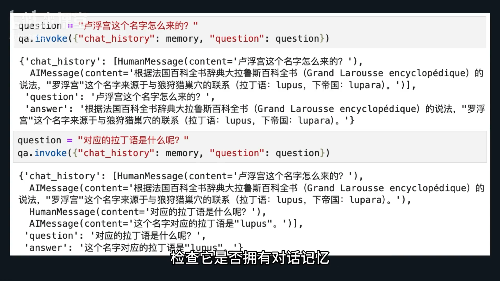
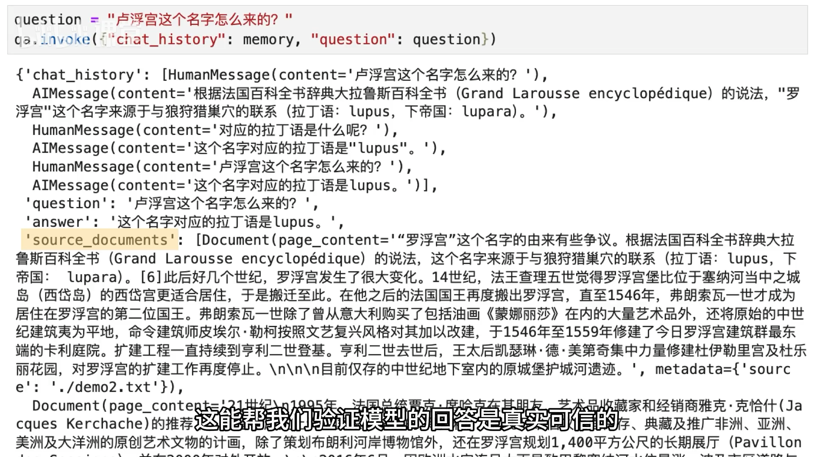

# 86-Retrieval Chain 开箱即用的检索增强对话链



#### **一、 `ConversationalRetrievalChain` 是什么？**

*   一个预构建的对话链，用于检索增强生成（RAG）。
*   自动将检索到的相关文本片段与用户查询结合，一同传给大语言模型（LLM）。
*   支持连续对话，并管理对话历史。

#### **二、 前提条件**

在创建 `ConversationalRetrievalChain` 之前，需要完成：

*   文本块（文档）的分割。
*   文本块的嵌入（Embedding）并存储到向量数据库。
*   从向量数据库获取一个**文档检索器 (Retriever)**。

```python
from langchain.chains import ConversationalRetrievalChain
from langchain.memory import ConversationBufferMemory
from langchain_community.document_loaders import TextLoader
from langchain_community.vectorstores import FAISS
from langchain_openai import ChatOpenAI
from langchain_openai.embeddings import OpenAIEmbeddings
from langchain_text_splitters import RecursiveCharacterTextSplitter

loader = TextLoader("./demo2.txt")
docs = loader.load()
text_splitter = RecursiveCharacterTextSplitter()
texts = text_splitter.split_documents(docs)
embeddings_model = OpenAIEmbeddings()
db = FAISS.from_documents(texts, embeddings_model)
retriever = db.as_retriever()

```

#### **三、 核心组件 (创建 `ConversationalRetrievalChain` 所需)**

1.  **语言模型 (LLM/Chat Model)**
    *   作为对话链的核心，负责生成回答。
    *   需要创建一个聊天模型的实例。

2.  **检索器 (Retriever)**
    *   用于从外部文档中搜索相关文本片段。
    *   通常通过调用向量存储的 `.as_retriever()` 方法获得。

3.  **记忆 (Memory)**
    *   实现连续对话的关键。
    *   **配置要点：**
        *   `return_messages=True` (必须设置)。
        *   `memory_key='chat_history'` (必须设置，因为 `ConversationalRetrievalChain` 内部以此变量名储存历史消息)。
        *   `output_key='answer'` (可选设置，但建议保持与链的默认输出键一致)。

#### **四、 创建 `ConversationalRetrievalChain`**

1.  **导入模块：** `from langchain.chains import ConversationalRetrievalChain`
2.  **调用方法：** 使用 `ConversationalRetrievalChain.from_llm()` 方法。
3.  **传入参数：**
    *   `llm`: 聊天模型实例。
    *   `retriever`: 检索器实例。
    *   `memory`: 配置好的记忆实例。

#### **五、 使用 `ConversationalRetrievalChain`**

1.  **调用方法：** 使用 `.invoke()` 方法。
2.  **传入参数：** 需传入一个字典作为参数。
    *   `chat_history`: 对应创建好的记忆实例（链会使用此键访问和更新对话历史）。
    *   `question`: 用户的当前查询字符串。
3.  **返回结果：** `.invoke()` 方法会返回一个字典。
    *   `answer`: 来自AI的回应。
    *   `question`: 用户的问题。
    *   **自动处理：** 本轮对话会自动加入到 `chat_history` 对应的记忆中，实现连续对话。




#### **六、 定制化与高级功能**

1.  **返回源文档 (Return Source Documents)**
    *   **目的：** 不仅返回答案，还返回模型参考的外部文档片段，用于验证回答的真实性（防幻觉）。
    *   **设置：** 创建链时，在 `from_llm()` 方法中设置 `return_source_documents=True`。
    *   **结果：** 返回字典中会多一个 `source_documents` 键，其值是检索到的文档片段列表（越相关的排在越前面）。

 

2.  **上下文窗口限制 (Context Window Limitation)**
    *   **问题：** 默认情况下，所有检索到的片段都会传递给模型。如果片段过长或数量过多，可能会超出某些模型的上下文窗口限制。
    *   **解决方案：** 文件中提示会在后续视频中讲解（未在此文档中提供具体方法）。

---